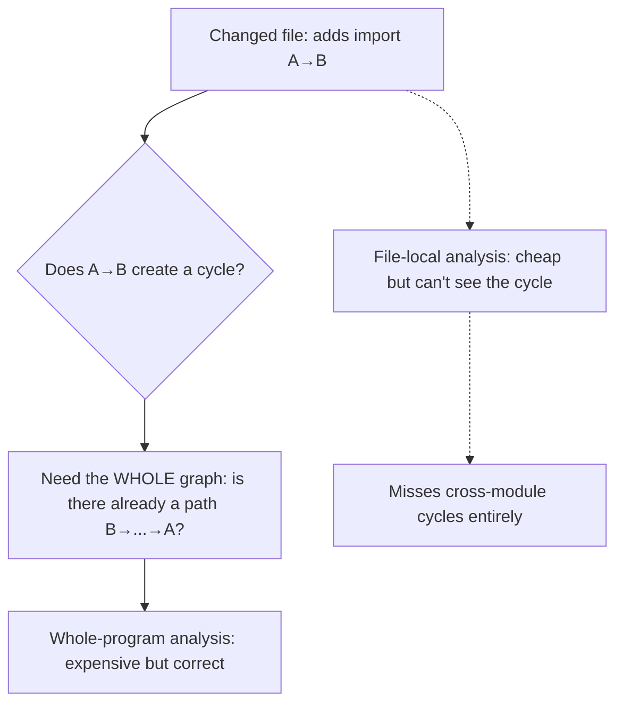
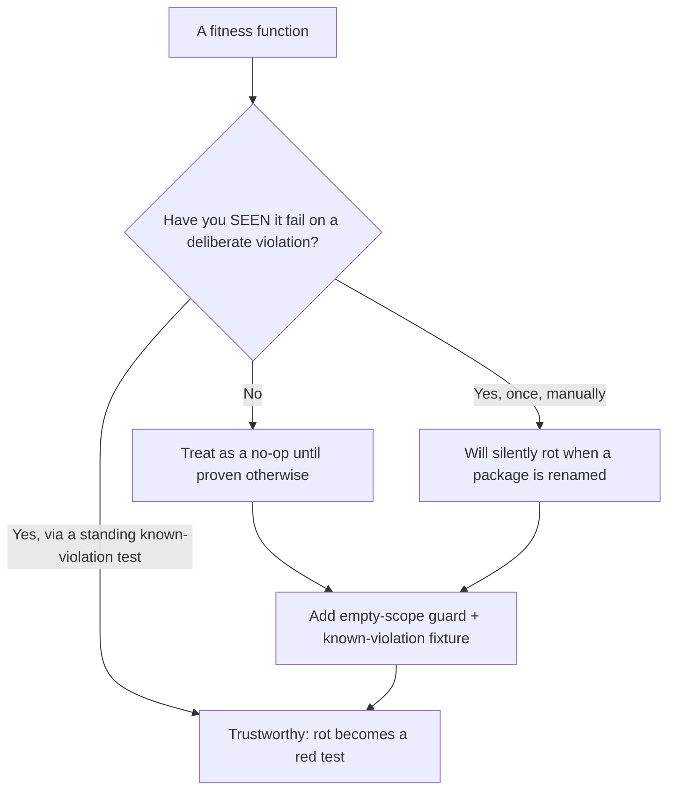

# Architecture Fitness Functions — Professional

> **Category:** [Anti-Patterns at Scale](../README.md) → **Architecture Fitness Functions** — *executable rules that fail the build when the architecture drifts toward an anti-pattern.*
> **Covers (collectively):** Layering & dependency rules · Cycle-detection gates · Allowed-dependency contracts · Metric thresholds · Evolutionary architecture & CI gating

---

## Table of Contents

1. [Introduction](#introduction)
2. [Prerequisites](#prerequisites)
3. [The Build-Time Budget](#the-build-time-budget)
4. [Whole-Program vs Incremental Analysis](#whole-program-vs-incremental-analysis)
5. [Monorepo Scale: Analyzing Only What Changed](#monorepo-scale-analyzing-only-what-changed)
6. [Caching and Parallelism](#caching-and-parallelism)
7. [Flaky and Over-Broad Rules](#flaky-and-over-broad-rules)
8. [The Central Failure: A Rule That Passes But Constrains Nothing](#the-central-failure-a-rule-that-passes-but-constrains-nothing)
9. [A Worked False-Confidence Example](#a-worked-false-confidence-example)
10. [Proving the Gate Caught a Real Regression](#proving-the-gate-caught-a-real-regression)
11. [Mutation-Testing Your Fitness Functions](#mutation-testing-your-fitness-functions)
12. [Common Mistakes](#common-mistakes)
13. [Test Yourself](#test-yourself)
14. [Cheat Sheet](#cheat-sheet)
15. [Summary](#summary)
16. [Further Reading](#further-reading)
17. [Related Topics](#related-topics)

---

## Introduction

> Focus: **Cost & correctness of the checks themselves.**

Everything up to now treated the fitness function as free and trustworthy. It is neither. By the time you have a real suite on a real monorepo, two new problems dominate, and they are the inverse of each other:

1. **The check is too expensive.** A whole-program dependency analysis that re-scans 4,000 modules on every push adds five minutes to every CI run, gets cached badly, and eventually someone makes it non-required to "unblock the pipeline." A fitness function that's too slow gets disabled — and a disabled gate enforces nothing, exactly like one that was never written.
2. **The check is too cheap — it passes but constrains nothing.** This is the central, insidious failure of this entire topic: a fitness function that is *green on every commit and would stay green no matter how badly the architecture decayed.* It looks like governance, it shows up as a passing required check, and it permits the exact drift it claims to prevent. False confidence is worse than no check, because no check at least doesn't lie.

The professional's two jobs, therefore:

- **Make the checks fast enough to stay required** — incremental analysis, change-scoped scanning, caching, parallelism — because a gate that's disabled for speed is a gate that's gone.
- **Make the checks actually bite** — prove, by deliberately breaking the architecture, that each rule fails on the regression it's supposed to catch. A rule you've only seen pass is a rule that might be a no-op.

> **The mental model:** a fitness function is two assertions, and both can lie. The *cost* assertion ("this is cheap enough to run on every commit") fails silently when the suite slows the pipeline until someone disables it. The *correctness* assertion ("this catches the regression") fails silently when the rule matches nothing and passes forever. Your job is to falsify both — measure the cost, and prove the bite.

This file closes the ladder. [`junior.md`](junior.md) (what), [`middle.md`](middle.md) (write & wire), [`senior.md`](senior.md) (design a suite), **professional.md** (cost & correctness of the suite itself).

---

## Prerequisites

- **Required:** Fluent with [`senior.md`](senior.md) — you can design a baselined, four-category, governed suite for an existing codebase.
- **Required:** You've run CI on a large repo and felt build time matter — watched a slow job become the bottleneck everyone wants removed.
- **Required:** You understand incremental builds, build caches, and dependency-graph-driven task scheduling (Bazel/Nx/Turborepo/Gradle remote cache, or equivalent).
- **Helpful:** Familiarity with mutation testing as a concept — deliberately introducing a fault to confirm a test catches it. The same idea, applied to fitness functions, is how you prove the gate isn't a no-op.
- **Helpful:** profiling-techniques and ci-cd-pipeline-design skills — measuring the cost and shaping where the check runs.

---

## The Build-Time Budget

A fitness function runs on every push, so its cost is paid thousands of times. Treat it like any other hot path: measure it, and know what dominates.

```bash
# Time the architecture checks in isolation, separately from the rest of CI.
# Java/Gradle — ArchUnit tests run inside the test task; profile them:
./gradlew test --tests '*Architecture*' --profile   # build scan shows per-test wall time

# Python — time import-linter on the full repo:
time lint-imports

# JS/TS — time the dependency analysis (often the slowest of the three):
time npx depcruise --config .dependency-cruiser.js src
```

Where the time goes, roughly:

| Cost driver | Why it's expensive | Mitigation |
|---|---|---|
| **Building the dependency graph** | Parsing/scanning every source or class file to extract imports | Cache the graph; scan only changed modules + dependents |
| **Whole-program rules** | Cycle detection and layering need the *global* graph, not a file | Incremental graph update; run only when relevant files change |
| **Per-rule evaluation** | Each rule walks the graph; N rules × M nodes | Parallelize rules; share one graph build across all rules |
| **Cold class loading (ArchUnit)** | Importing thousands of classes into the analysis JVM | Restrict `@AnalyzeClasses` scope; cache the imported classes |

The number that matters is the **marginal** cost on a typical PR, not the cold full-repo cost. A check that takes 90 seconds full-repo but 3 seconds on a normal PR (touching a few modules) is fine; one that takes 90 seconds *every* time is a future casualty.

> **The disablement spiral:** slow check → pipeline complaints → "make it non-required so we can merge" → check still runs but blocks nothing → next real violation merges → gate is dead. Build-time isn't a nicety; it's what keeps the gate *required*. Budget it like you'd budget a hot loop.

---

## Whole-Program vs Incremental Analysis

The hardest cost problem is that the most valuable rules are **whole-program**: a cycle or a layering violation is a property of the *global* dependency graph, not of any single file. You cannot decide "does adding this import create a cycle?" by looking only at the changed file — you need the rest of the graph to see whether the new edge closes a loop.



Two strategies, with a real trade-off:

- **Whole-program, every run.** Always correct, always sees cross-module cycles and layering — but pays the full graph-build cost on every push. Fine for a small repo; a bottleneck at monorepo scale.
- **Incremental.** Rebuild only the part of the dependency graph affected by the change, then run rules against the updated global graph. Much cheaper — but you must rebuild *enough* of the graph to preserve correctness for whole-program rules. The common bug is an incremental analysis that only inspects the changed file and therefore *cannot see a cycle that closes through unchanged modules* — it's fast and wrong, a false-confidence trap born of an optimization.

The correctness-preserving incremental pattern: **cache the global graph; on a change, patch the edges for the changed files; re-run the whole-program rules against the patched global graph.** You save the *parsing* cost (only changed files are re-parsed) without sacrificing the *global view* the rule needs. Skipping the global re-evaluation to go faster is how you get a cycle gate that passes while a cycle exists.

> **The rule:** you may incrementalize the *graph construction* (re-parse only what changed), but you must not incrementalize the *rule evaluation* for a whole-program rule below the granularity the rule needs. A cycle rule needs the global graph every time — give it a cached, cheaply-patched one, not a file-local fragment.

---

## Monorepo Scale: Analyzing Only What Changed

In a monorepo with hundreds of projects, running every fitness function over everything on every PR is untenable. The scaling move is to run each project's checks only when that project (or something it depends on) changed — using the build graph the monorepo tool already maintains.

```bash
# Nx: run the architecture lint target only for projects affected by this PR.
npx nx affected --target=arch-lint --base=origin/main
# Nx computes the affected set from the project graph; unaffected projects are skipped.

# Bazel: the architecture test targets are part of the build graph; query what's affected.
bazel test $(bazel query "rdeps(//..., set($(git diff --name-only origin/main)))" \
  --output=label | grep ':arch_test')
# Only the arch_test targets downstream of the changed files run.

# Turborepo: scope the lint task to the changed packages; the cache handles the rest.
npx turbo run arch-lint --filter='...[origin/main]'
```

The correctness caveat is the same as incremental analysis, one level up: **a *cross-project* rule (a layering contract spanning projects, a no-cycles rule over the whole graph) is "affected" by changes you might not expect.** If project A's rule is "A must not depend on B," a change *inside B* that A starts importing must trigger A's check — so the affected-set computation must include reverse-dependency edges, not just forward ones. Get this wrong and a cross-project violation slips through because the tool decided the rule's project "wasn't affected."

> **At monorepo scale, the affected-set computation *is* the correctness boundary of your fitness functions.** If it under-approximates what's affected, rules silently skip the changes that would have failed them. Validate the affected-set logic the same way you validate a rule: deliberately make a cross-project violating change and confirm the gate runs *and* fails.

---

## Caching and Parallelism

Two levers cut the marginal cost without weakening the check:

**Cache the dependency graph.** Graph construction (parsing imports out of every file) is the bulk of the cost and is a pure function of the source files. Cache it keyed on file content hashes; on a PR, only re-parse changed files and patch the cached graph.

```bash
# The graph is content-addressable: same sources → same graph. Cache it in CI
# keyed on a hash of the source tree (or per-file hashes for incremental patching).
# Remote build caches (Gradle/Bazel/Nx/Turbo) do this for the whole task automatically:
#   a fitness-function task with unchanged inputs is a CACHE HIT — it doesn't re-run.
```

**Parallelize rule evaluation over one shared graph.** Build the graph *once*, then run all N rules against it concurrently. The anti-pattern is N rules each rebuilding the graph — that's the dominant cost multiplied by N.

```java
// ArchUnit: @AnalyzeClasses imports the classes ONCE per test class and shares that
// JavaClasses object across every @ArchTest rule in it. Keep all rules for a scope
// in one @AnalyzeClasses class so the (expensive) import is shared, not repeated.
@AnalyzeClasses(packages = "com.shop")   // one import, many rules share it
class ArchitectureTest {
    @ArchTest static final ArchRule layers   = /* ... */;   // these all reuse
    @ArchTest static final ArchRule noCycles = /* ... */;   // the same imported
    @ArchTest static final ArchRule naming   = /* ... */;   // JavaClasses graph
}
```

The caching correctness trap mirrors the [Hidden Dependencies](../../02-design/02-coupling-and-state/professional.md) problem one level up: **a cache is only correct if its key captures every input.** If a fitness function reads a config file, an environment variable, or the rule definition itself, and the cache key doesn't include those, a cache hit serves a *stale result* — the check "passes" because it reused an old run from before the rule was tightened. Cache the task keyed on *both* the sources *and* the rule definitions; otherwise tightening a rule and getting an instant green is a cache lie, not a clean architecture.

> **Cache key = sources + rule definitions + config.** Miss any input and you get a fitness function that passes by *reusing a result computed under different rules* — green for the wrong reason.

---

## Flaky and Over-Broad Rules

A flaky fitness function — one that sometimes passes and sometimes fails on the *same* code — is corrosive in a specific way: it teaches the team that red means "retry," not "you broke something." After enough flakes, a real violation gets retried away.

Sources of flake and breadth, and their fixes:

| Problem | Cause | Fix |
|---|---|---|
| **Non-deterministic scan order** | Rule reports violations in filesystem order; output differs run to run, confusing baselines | Sort violations deterministically before comparing to baseline |
| **Scope includes generated/temp files** | A codegen step's output is present on some runs, absent on others | Exclude generated/build/vendor paths from `@AnalyzeClasses` / scan globs explicitly |
| **Over-broad matcher** | `..service..` matches an unrelated `microservice` package; rule fires on legitimate code | Anchor the matcher precisely; prefer exact package over substring glob |
| **Rule depends on full vs incremental graph** | Passes whole-program, fails (or vice versa) on the incremental path | Make incremental and whole-program produce the *same* verdict; test both |
| **Timeout under load** | The slow whole-program scan times out on busy CI runners, reported as failure | Fix the cost (cache/incremental), don't bump the timeout and hope |

An **over-broad rule** is the quieter cousin of flakiness: it doesn't flake, it just fires on more than it should, generating false positives that — per [`senior.md`](senior.md) — spend the team's trust until the gate is routed around. The fix is always to *narrow*, never to widen the exception list.

> **A flaky gate is worse than a slow one.** A slow gate annoys; a flaky gate trains "red = retry," and that reflex eventually waves a real regression through. Flake is a correctness bug in the check, not an inconvenience — fix it with the same urgency as a flaky test.

---

## The Central Failure: A Rule That Passes But Constrains Nothing

This is the most important section in the entire topic. Every other failure mode is loud — a red build, a slow pipeline, a flake. This one is silent: **a fitness function that is green on every commit, looks like governance, and would stay green no matter how badly the architecture decayed.** It is a no-op wearing the costume of a gate.

How a rule ends up constraining nothing:

| Mechanism | The rule looks like… | …but actually |
|---|---|---|
| **Matches nothing** | `noClasses().that().resideInAPackage("..web..")...` where the package is actually `..webapp..` | The `that()` clause selects zero classes; the rule vacuously passes forever |
| **Threshold above reality** | "Max class size 5,000 lines" | Nothing is over 5,000; the rule permits every God Object that will ever exist |
| **Excluded the thing it guards** | Rule scope excludes `..legacy..`, where all the violations are | The violations are in the exact place the rule can't see |
| **Severity downgraded** | `severity: warn` in dependency-cruiser | Reports but never fails; permanently "green-ish" |
| **Allow-list swallowed it** | The forbidden edge is in `ignore_imports` | The rule passes *because* the violation is exempted |
| **Scope is empty** | `@AnalyzeClasses(packages = "com.shop.nonexistent")` | Zero classes imported; every rule in the class is vacuously true |

The unifying property: **a vacuously-true rule passes for the same reason a true rule passes — green — so the CI signal is identical.** You cannot tell a working gate from a dead one by watching it pass. The only way to distinguish them is to make it *fail on purpose*.

> **The defining test of a fitness function is not "does it pass on good code?" — every no-op passes on good code. It is "does it FAIL on bad code?"** A rule you have never seen go red against a deliberate violation is, until proven otherwise, a no-op. Treat "I added the rule and CI is green" as *no evidence at all* that the rule works.

This is why the [`middle.md`](middle.md) discipline — watch it fail before you trust it — graduates here into a *standing requirement*: every rule must have a known regression it provably catches, and that proof must be re-checkable, because a refactor (a renamed package, a widened exclude, a new allow-list entry) can silently turn a working rule into a no-op long after you wrote it.

---

## A Worked False-Confidence Example

A concrete, common way a real rule rots into a no-op. The team adds a layering rule to forbid the web layer from importing the database layer.

**The rule, as written — and it passes:**

```java
@AnalyzeClasses(packages = "com.shop")
class ArchitectureTest {
    // Intent: web must not depend on db. CI: GREEN. Everyone moves on.
    @ArchTest
    static final ArchRule webMustNotTouchDb =
        noClasses().that().resideInAPackage("..web..")          // ← the bug is here
            .should().dependOnClassesThat().resideInAPackage("..db..");
}
```

The rule is green. It will *stay* green through any amount of decay. Here's why — the web package was actually refactored months ago from `com.shop.web` to `com.shop.api.controllers`, but **nobody updated the rule's matcher.** The pattern `..web..` now matches **zero classes**.

```
# What the team sees — looks like a working, enforced gate:
$ ./gradlew test --tests '*ArchitectureTest'
BUILD SUCCESSFUL    ← green, required check, "architecture enforced" ✓

# What's actually true — the rule selects nothing:
#   noClasses().that().resideInAPackage("..web..")  →  0 classes selected
#   "no classes (of which there are none) should depend on db"  →  vacuously TRUE
```

A controller in `com.shop.api.controllers` can now import `com.shop.db.OrderRows` directly — the exact violation the rule exists to forbid — and **the build stays green.** The gate is dead, the team believes it's alive, and the architecture decays under a passing required check. This is strictly worse than having no rule: with no rule, someone might notice the bad import in review; with a *green* rule, everyone trusts the machine that's lying.

**Two defenses, both mandatory at this level:**

1. **Assert the rule's scope is non-empty.** A rule whose `that()` clause selects nothing should *fail loudly*, not pass vacuously. ArchUnit has `allowEmptyShould(false)` (and the project-wide `archunit.properties` setting) exactly for this — it turns "matched nothing" from a silent pass into an error.

```java
@ArchTest
static final ArchRule webMustNotTouchDb =
    noClasses().that().resideInAPackage("..web..")
        .should().dependOnClassesThat().resideInAPackage("..db..")
        .allowEmptyShould(false);   // ← "matched zero classes" now FAILS, surfacing the rot
```

2. **Keep a known-violation test that proves the rule still bites** (next section). The empty-scope check catches the "matches nothing" mechanism; a deliberate-violation test catches *every* mechanism in the table above, including threshold-above-reality and allow-list-swallowed.

> **The lesson generalizes past this one bug:** a green fitness function carries no information about whether the architecture is healthy *or* whether the rule still works — the two are indistinguishable from the pass signal. Engineer the rule so that "I'm not actually checking anything" is a failure, not a pass.

---

## Proving the Gate Caught a Real Regression

The only credible evidence that a fitness function works is a demonstration that it **fails on the regression it targets.** Make this a standing, automated artifact — not a one-time manual check that bit-rots.

**Pattern 1 — a deliberately-violating fixture that the rule must reject.** Keep a small piece of code, isolated from production scanning, that *contains* the forbidden shape, and a test asserting the rule flags it. If the rule ever stops flagging it (because someone renamed a package, widened an exclude, or added an allow-list entry), *this* test goes red — surfacing the no-op.

```java
// A meta-test: prove the layering rule REJECTS a known-bad fixture.
// If this passes (rule does NOT flag the violation), the rule has become a no-op.
@Test
void layeringRuleActuallyRejectsAViolation() {
    JavaClasses badFixture = new ClassFileImporter()
        .importPackages("com.shop.fixtures.violating");   // contains web→db on purpose
    EvaluationResult result = webMustNotTouchDb.evaluate(badFixture);
    assertThat(result.hasViolation())
        .as("layering rule must still catch the known web→db violation; "
          + "if this fails, the rule's matcher has rotted into a no-op")
        .isTrue();
}
```

**Pattern 2 — empty-scope guards on every selecting rule** (`allowEmptyShould(false)`, import-linter's behavior of failing on an unresolvable module, depcruise's `doNotFollow`/empty-result checks). This catches the single most common no-op mechanism cheaply, across the whole suite.

**Pattern 3 — the audit drill.** Periodically (or in a scheduled CI job), introduce a real violation on a throwaway branch for each critical rule and confirm CI goes red. This is the integration-level version of Pattern 1: it proves not just the rule but the *whole pipeline* (the right job runs, it's required, it fails the merge). At monorepo scale this also validates the affected-set computation — that the gate actually *runs* for the changed project.



> **Test your tests-of-structure the way you'd want behavioral tests tested:** a behavioral test you've never seen fail might assert nothing; a fitness function you've never seen fail almost certainly asserts nothing the day a package gets renamed. The known-violation fixture is the fitness function's own fitness function.

---

## Mutation-Testing Your Fitness Functions

The rigorous, generalized form of "prove the gate bites": **mutate the architecture and confirm the suite kills the mutant.** This is mutation testing applied to structure instead of behavior.

The procedure, runnable as a periodic job:

1. **Generate a structural mutant** — programmatically inject a forbidden edge (add a web→db import), a cycle (make two packages import each other), an oversized class, or a banned idiom, on a scratch branch.
2. **Run the suite.** A *surviving* mutant (suite stays green) is a hole: that decay mode is not actually guarded, even if a rule *claims* to guard it.
3. **Score the suite** by how many seeded mutants it kills. A suite that kills 10/10 seeded violations is trustworthy; one that kills 3/10 has seven decay modes that would slip through in production.

```bash
# Sketch: seed each known decay mode on a scratch branch, run the suite, expect RED.
for mutant in web-imports-db make-cycle oversize-class banned-import skip-layer; do
  git checkout -b "mutant/$mutant" origin/main
  apply_mutation "$mutant"                 # inject the violation
  if run_fitness_suite; then               # suite should FAIL (kill the mutant)
    echo "SURVIVED: '$mutant' not caught — that decay mode is unguarded"
  else
    echo "killed:    '$mutant'"
  fi
  git checkout - && git branch -D "mutant/$mutant"
done
```

This is the only technique that gives you a *coverage number* for your fitness functions — a measure not of "do the rules pass" (every no-op passes) but of "which decay modes would actually be caught." It converts the false-confidence question from a vibe into a metric.

> **A fitness-function suite's true coverage is the set of architectural regressions it would catch — and the only way to measure that is to commit the regressions and watch what survives.** Pass-rate tells you nothing; mutant-kill-rate tells you everything.

---

## Common Mistakes

Professional-level mistakes — quiet, expensive, and usually invisible on a green dashboard:

1. **Letting the check get slow until it's disabled.** A whole-program scan on every push that adds minutes to CI gets made non-required to "unblock the pipeline" — and a non-required gate enforces nothing. Budget build time; incrementalize and cache so the check stays *required*.
2. **Incrementalizing rule evaluation below the granularity a whole-program rule needs.** A cycle gate that only inspects the changed file can't see a cycle that closes through unchanged modules — fast and wrong. Incrementalize the graph *construction*, not the global rule evaluation.
3. **An affected-set that misses reverse dependencies.** At monorepo scale, a cross-project rule must run when the project it constrains *or anything it depends on* changes. Under-approximate the affected set and cross-project violations slip through silently.
4. **A cache key that omits the rule definitions.** Tighten a rule, get an instant cache-hit green — the check reused a result computed under the *old* rule. Key the cache on sources *and* rules *and* config.
5. **Tolerating a flaky architecture check.** Flake trains "red = retry," and the reflex eventually retries a real violation away. Fix non-determinism (sort output, exclude generated files, unify incremental/whole-program verdicts) with test-flake urgency.
6. **Treating a green check as evidence the rule works.** Every no-op passes on good code. Green tells you nothing about whether the rule still bites — only a deliberate failure does.
7. **A rule whose matcher selects nothing.** A renamed package, a typo'd pattern, an empty scope → the rule is vacuously true forever. Use `allowEmptyShould(false)` (and equivalents) so "matched nothing" fails loudly.
8. **A threshold set above everything that exists.** "Max class size 5,000 lines" permits every God Object. Ratchet from the current max; a metric rule that wouldn't fail if the codebase got 10% worse is decoration.
9. **No standing proof the gate bites.** A rule verified once, manually, rots the day a package is renamed. Keep a known-violation fixture (or mutation drill) so a rotted rule becomes a red *test*, not a silent no-op.
10. **Never measuring mutant-kill-rate.** Without seeding violations and watching what survives, you have a pass-rate (meaningless) instead of a coverage number (the thing that matters).

---

## Test Yourself

1. Why is a fitness function that's *too slow* a correctness problem and not just a performance one? Trace the chain from "slow" to "enforces nothing."
2. A cycle-detection rule is incrementalized to inspect only the changed file, to make CI fast. Why is this fast-and-wrong, and what's the correctness-preserving way to incrementalize it?
3. In a monorepo, project A has the rule "A must not import B." A change is made *inside B*. Why must A's check still run, and what property of the affected-set computation guarantees it does?
4. Your CI caches the architecture-lint task. A developer tightens a rule and the check returns green in 0.2 seconds. Why is this green suspicious, and what was almost certainly missing from the cache key?
5. State the central failure of this topic in one sentence, and explain why a green required check carries *no* information about whether the rule works.
6. Walk through the worked false-confidence example: the rule `noClasses().that().resideInAPackage("..web..")...` passes forever after a refactor. Exactly why does it pass, and name the two defenses.
7. What is the single best piece of evidence that a fitness function actually works, and why is "it's been green for six months" not evidence at all?
8. Explain mutation-testing a fitness-function suite. What does a *surviving* mutant tell you, and why is mutant-kill-rate more meaningful than pass-rate?

---

## Cheat Sheet

| Concern | The failure | The fix |
|---|---|---|
| **Build-time** | Slow check → made non-required → enforces nothing (disablement spiral) | Measure marginal cost; incrementalize + cache so it stays *required* |
| **Whole-program vs incremental** | File-local cycle check misses cross-module cycles (fast & wrong) | Incrementalize graph *construction*; keep global *evaluation* |
| **Monorepo affected-set** | Forward-only affected computation skips cross-project violations | Include reverse-deps; validate by seeding a cross-project violation |
| **Caching** | Cache key omits rules → tightened rule returns stale green | Key on sources + rule defs + config |
| **Flakiness** | Red trained as "retry" → real violation retried away | Deterministic output, exclude generated files, unify incr/whole verdicts |
| **Over-broad rule** | False positives spend trust → gate routed around | Narrow the matcher; never widen the exception list |
| **No-op rule (THE big one)** | Matches nothing / threshold above reality / allow-listed → green forever | `allowEmptyShould(false)` + standing known-violation fixture |
| **Proving the bite** | "Green = works" — false; every no-op is green | Known-violation test per rule; mutation-test the suite; audit drills |

> **One rule to remember:** *a fitness function asserts two things and both can lie — that it's cheap enough to stay required, and that it actually fails on bad code. Measure the first; prove the second by making it go red on a deliberate violation. A green check you've never seen fail is a no-op until proven otherwise.*

---

## Summary

- A fitness function is two assertions that can each fail silently: the **cost** assertion (cheap enough to stay a required check) and the **correctness** assertion (actually fails on the regression it targets). The professional's job is to falsify both — measure the cost, prove the bite.
- **Build-time is a correctness concern**, not a nicety: a slow check gets made non-required to unblock CI, and a non-required gate enforces nothing — the disablement spiral. Budget it like a hot path.
- The most valuable rules (cycles, layering) are **whole-program** — properties of the global graph. You may incrementalize *graph construction* (re-parse only changed files, patch a cached global graph) but **not** the global *rule evaluation*; a file-local cycle check is fast and wrong.
- At **monorepo scale**, run each project's checks only when affected — but the **affected-set computation is the correctness boundary**: it must include reverse dependencies, or cross-project violations slip through silently. Validate it by seeding a cross-project violation.
- **Cache** the graph keyed on **sources + rule definitions + config** (omit the rules and a tightened rule returns a stale green); **parallelize** rules over one shared graph build. A **flaky** check is a correctness bug — it trains "red = retry" until a real violation is retried away.
- **The central failure of this entire topic:** a rule that **passes but constrains nothing** — matches nothing, threshold above reality, excludes the thing it guards, allow-listed, or downgraded to warning. It's a no-op in the costume of a gate, and **strictly worse than no check** because the team trusts a machine that's lying. A green required check carries *no information* about whether the rule works.
- The worked example — `..web..` matching zero classes after a package rename — shows how a real rule rots into a vacuous pass. Defenses: **`allowEmptyShould(false)`** (fail when a rule selects nothing) and a **standing known-violation fixture** the rule must reject.
- The only credible evidence a gate works is **watching it fail on a deliberate violation**. Generalize it with **mutation testing**: seed structural mutants, and your **mutant-kill-rate** — not pass-rate — is the suite's true coverage of architectural regressions.
- This closes the ladder: [`junior.md`](junior.md) (what) → [`middle.md`](middle.md) (write & wire) → [`senior.md`](senior.md) (design a suite) → **professional.md** (cost & correctness of the suite itself). Next, drill the practice files and apply the suite to a hotspot in your own codebase.

---

## Further Reading

- **Building Evolutionary Architectures** — Ford, Parsons, Kua (2nd ed., 2022) — continuous vs triggered fitness functions, and the discipline of keeping them meaningful as the architecture evolves.
- **ArchUnit User Guide** — Peick et al. (ongoing) — `allowEmptyShould`, `archunit.properties`, the `FreezingArchRule` store, and evaluating a rule against a fixture (`rule.evaluate(classes)`) for known-violation tests.
- **Software Engineering at Google** — Winters, Manshreck, Wright (2020) — monorepo build graphs, affected-target computation, remote caching, and why the test/check infrastructure must be fast to stay used.
- **Pragmatic Programmer** — Hunt & Thomas (20th anniv. ed., 2019) — "tests that don't test anything," and the broader principle that an unverified safety net is worse than none.
- **Mutation Testing literature** (e.g. *PIT/Pitest* docs; Jia & Harman survey, 2011) — the formal basis for "seed a fault, confirm the suite kills it," here applied to structural rules.
- **Accelerate** — Forsgren, Humble, Kim (2018) — why fast, reliable CI (and not-disabled gates) correlates with delivery performance; the cost of a slow or flaky pipeline.

---

## Related Topics

- [Anti-Pattern Budgets & Ratcheting](../02-anti-pattern-budgets-and-ratcheting/senior.md) — the baseline/ratchet a metric rule must use to avoid the threshold-above-reality no-op.
- [Hotspot Analysis](../03-hotspot-analysis/senior.md) — targeting the (costly) strictest checks where decay concentrates, so the build-time budget buys the most.
- [Automated Large-Scale Refactoring](../04-automated-large-scale-refactoring/senior.md) — paying down the baseline a suite freezes, at the scale these checks govern.
- [Coupling & State Anti-Patterns](../../02-design/02-coupling-and-state/professional.md) — the hidden-dependency / stale-cache-key mechanism reappears here as a fitness-function cache that omits the rule definitions.
- [Bad Structure Anti-Patterns](../../01-development/01-bad-structure/senior.md) — the God Object a *metric* rule must keep catching as the codebase grows.
- Clean Code → Classes — the single-responsibility boundary a (correctly-ratcheted) class-size rule defends.
- Clean Code → Modules & Packages — the boundaries whose rename can silently turn a layering rule into a no-op.
- Refactoring → Refactoring Techniques — the moves that fix what a *proven-to-bite* gate surfaces.
- Architecture → Anti-Patterns — the system-level decay a fast, proven, governed suite is meant to hold back.
- profiling-techniques · ci-cd-pipeline-design — measuring the check's cost and shaping where in the pipeline it runs.

---

## Check your understanding

1. Explain Architecture Fitness Functions — Professional Level in your own words and name the problem it solves.
2. How would you apply the ideas around Table of Contents, Introduction, Prerequisites in a realistic engineering change?
3. What failure mode or misuse should you look for, and what evidence would reveal it?
4. How would you introduce and govern Architecture Fitness Functions — Professional Level across teams through reversible, measurable increments?
5. What observable result would convince you that the approach improved the system?
