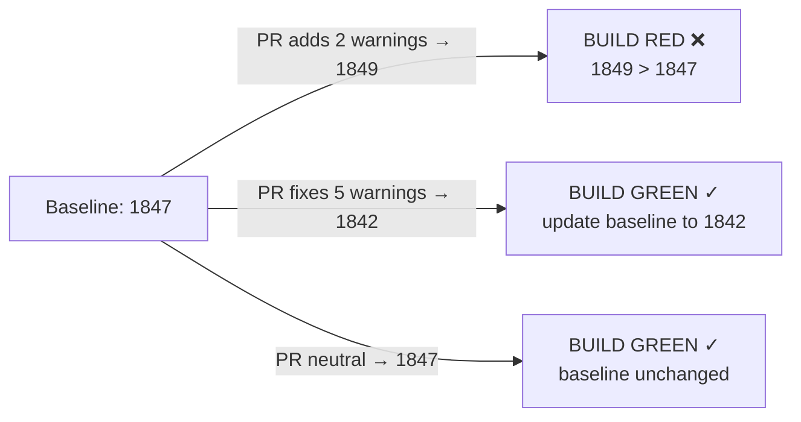

# Anti-Pattern Budgets & Ratcheting — Junior

> **Category:** [Anti-Patterns at Scale](../README.md) → **Anti-Pattern Budgets & Ratcheting** — *make the metric monotonically improve: stop the bleeding while you clean up legacy.*
> **Covers (collectively):** Baseline-and-ratchet · "No new violations" gates · Per-area debt budgets · Ratchet tooling · Failing the build on regression

---

## Table of Contents

1. [Introduction](#introduction)
2. [Prerequisites](#prerequisites)
3. [Glossary](#glossary)
4. [The Problem: Zero-on-Legacy Doesn't Work](#the-problem-zero-on-legacy-doesnt-work)
5. [The Idea: A Ratchet](#the-idea-a-ratchet)
6. [The Simplest Ratchet: A Warning-Count Gate](#the-simplest-ratchet-a-warning-count-gate)
7. [Why "Down Only" Is the Whole Trick](#why-down-only-is-the-whole-trick)
8. [The Boy-Scout Tie-In](#the-boy-scout-tie-in)
9. [Common Mistakes](#common-mistakes)
10. [Test Yourself](#test-yourself)
11. [Cheat Sheet](#cheat-sheet)
12. [Summary](#summary)
13. [Further Reading](#further-reading)
14. [Related Topics](#related-topics)

---

## Introduction

> Focus: **"Don't make it worse."** — the single rule that lets you improve a messy codebase without first cleaning all of it.

You join a team. The linter reports **1,847 warnings**. Someone suggests "let's just fix them all and turn on `--max-warnings 0`." Three weeks later, nobody has fixed 1,847 warnings — there's a deadline — and the count is now **1,910**, because every new PR quietly added a few more. The lint output is wallpaper: so noisy nobody reads it.

This is the universal fate of a quality target set to **zero on legacy code**. Zero is the right destination but the wrong *gate*, because you can't get there in one step, and a gate you can't pass gets ignored or disabled.

The fix is a **ratchet**: a gate that doesn't demand zero — it demands that the number **can only go down, never up**. You took on 1,847 warnings; fine. The build is green at 1,847. The moment a PR pushes it to 1,848, the build goes **red**. To merge, you must be back at 1,847 or below. New code can't add warnings; old warnings get chipped away whenever someone's nearby.

> **The mindset shift:** an *absolute* target ("zero violations") is unrealistic on a legacy codebase and gets switched off. A *relative* target ("no more than we have today, and trending down") is always achievable on the next PR — so it survives. You don't have to fix the past; you only have to **stop adding to it**.

At the junior level your goal is to understand *why* a ratchet beats a zero-gate, and to be able to read and trust a warning-count gate when you see one in CI.

---

## Prerequisites

- **Required:** You've used a linter or static analyzer (ESLint, `golangci-lint`, Checkstyle, `ruff`, `pylint`) and seen it print warnings.
- **Required:** You understand what "the build is red" means — a CI check failed and the PR can't merge.
- **Helpful:** Basic shell: running a command, checking its exit code (`$?`), piping to `wc -l`.
- **Helpful:** You've felt the specific pain of a warning list so long that everyone ignores it. That numbness is exactly what a ratchet cures.

---

## Glossary

| Term | Definition |
|------|-----------|
| **Violation** | A single instance of a thing you want to discourage: a lint warning, a `TODO`, a use of a banned API, a type error suppressed with `// @ts-ignore`. |
| **Baseline** | The count (or list) of violations that already exist *right now*. The line in the sand you promise not to cross. |
| **Ratchet** | A mechanism that lets a number move in only one direction — here, the violation count can decrease but never increase. Named after the toothed wheel that only turns one way. |
| **Gate** | A CI check that fails (red build) when a rule is broken, blocking the merge. |
| **Regression** | The metric getting worse — more violations than the baseline. The thing the gate exists to catch. |
| **Budget** | A *maximum* allowed amount of something (e.g. "this directory may have at most 50 warnings"). A ratchet is a budget that you tighten every time it's beaten. |
| **`--max-warnings N`** | An ESLint flag that exits non-zero if there are more than `N` warnings. The simplest ratchet built into a tool. |

---

## The Problem: Zero-on-Legacy Doesn't Work

Imagine you flip the switch to **fail the build on any warning** in a codebase that already has 1,847 of them. What actually happens:

- **Day 1:** the build is red for *everyone*, on every branch, because the 1,847 warnings are still there. Nobody can merge anything.
- **Day 1, 11 a.m.:** someone reverts the switch ("we'll do it properly later"), or worse, adds `// eslint-disable` comments everywhere to make it green. Now you have 1,847 warnings *plus* a layer of suppressions hiding them.

A zero-gate on legacy fails because it conflates two different goals:

1. **Stop the bleeding** — don't let *new* code add violations. (Achievable today.)
2. **Heal the wound** — remove the *existing* violations. (Takes months; competes with features.)

Trying to do both at once, immediately, satisfies neither. The ratchet **separates** them: it enforces (1) strictly and lets (2) happen gradually.

---

## The Idea: A Ratchet

A ratchet is a ratchet wrench's logic applied to a metric:



Three outcomes for any pull request:

- **Adds violations** (count goes up) → build **red**. You must remove what you added (or fix an equal number of old ones).
- **Neutral** (count unchanged) → build **green**. Fine — you didn't make it worse.
- **Removes violations** (count goes down) → build **green**, and the **baseline tightens** to the new, lower number. The ratchet clicked one tooth; it can never loosen back.

That last click is the magic. Because the baseline only ever *decreases*, the codebase can only get cleaner over time. There's no path back up. Slowly, PR by PR, the 1,847 erodes toward zero — without anyone ever having to stop and "fix all the warnings."

---

## The Simplest Ratchet: A Warning-Count Gate

You don't need a fancy tool to start. The crudest ratchet is **"count the violations, compare to a number stored in a file, fail if it's bigger."**

First, record today's count as the baseline:

```bash
# Count current lint warnings and freeze that number into a committed file.
golangci-lint run ./... 2>/dev/null | grep -c '^' > .lint-baseline
git add .lint-baseline && git commit -m "freeze lint baseline"
```

Then, in CI, compare the current count against the committed baseline:

```bash
#!/usr/bin/env bash
# ratchet.sh — fail the build if warnings increased above the baseline.
set -euo pipefail

baseline=$(cat .lint-baseline)
current=$(golangci-lint run ./... 2>/dev/null | grep -c '^')

echo "baseline=$baseline current=$current"

if [ "$current" -gt "$baseline" ]; then
  echo "❌ lint warnings increased: $current > $baseline (you added $((current - baseline)))"
  exit 1
fi
echo "✓ no new warnings (current $current ≤ baseline $baseline)"
```

That's the entire concept. Real tools (ESLint's `--max-warnings`, `betterer`, SonarQube's "new code" gate — covered in [`middle.md`](middle.md)) are smarter and harder to game, but they all do exactly this: **compare current to a frozen baseline and fail on an increase.**

ESLint bakes the gate right in:

```bash
# If today's count is 1847, set the ceiling there. A PR that adds one warning
# pushes it to 1848 and exits non-zero → red build.
npx eslint . --max-warnings 1847
```

> **Smell test for "is this even a ratchet?":** can the number go *up* without the build going red? If yes, it's not a ratchet — it's a dashboard nobody reads.

---

## Why "Down Only" Is the Whole Trick

The single property that makes a ratchet work is **monotonicity**: the baseline is allowed to move in exactly one direction.

- Because it only goes **down**, every improvement is *locked in*. You can never accidentally re-introduce a warning you already removed, because the baseline already accounts for its absence.

A ratchet turns an overwhelming, unbounded problem ("fix 1,847 things") into a tiny, bounded promise repeated forever: *"my PR leaves the number the same or smaller."* Anyone can keep that promise on any PR. That's why it scales when a heroic clean-up sprint doesn't.

---

## The Boy-Scout Tie-In

The ratchet is the automated, codebase-wide version of the **Boy-Scout Rule**: *"Always leave the campground cleaner than you found it."*

- The Boy-Scout Rule is a *cultural* habit — fix a little mess whenever you touch a file. It's wonderful but voluntary; under deadline pressure it's the first thing dropped.
- The ratchet is the *mechanical enforcement* of the same idea. It doesn't ask you to leave things cleaner — it **forbids** you from leaving them dirtier, and rewards (locks in) any cleaning you do.

Together they're powerful: the rule encourages opportunistic cleanup, and the ratchet guarantees that cleanup is never undone and new mess is never added. The rule is the carrot; the ratchet is the floor.

> The ratchet doesn't make you fix the campground. It just makes "leave more trash than you found" fail to merge.

---

## Common Mistakes

Mistakes juniors make when first meeting ratchets:

1. **Demanding zero on legacy.** Flipping `--max-warnings 0` on a 1,847-warning repo makes the build permanently red and gets the gate disabled within a day. Start the ceiling at *today's count*, not zero.
2. **Auto-updating the baseline on every CI run.** If the baseline silently absorbs the new count each time, it never ratchets — the gate is decorative. The baseline only tightens on a *decrease*, never on an increase.
3. **Suppressing instead of fixing.** Adding `// eslint-disable-next-line` to dodge the gate keeps the count down but hides a real violation. Suppressions should be counted too (more in `professional.md`), or the ratchet just measures your suppression skill.
4. **Thinking the goal is the gate.** The gate is a means; the goal is a cleaner codebase. A green ratchet that nobody ever drives *downward* has only stopped the bleeding, not healed it — pair it with the Boy-Scout habit.

---

## Test Yourself

1. A repo has 1,847 lint warnings. Why does turning on `--max-warnings 0` today make things worse, not better?
2. In one sentence, what is the single rule a ratchet enforces?
3. A PR removes 4 warnings (count goes 1,847 → 1,843). What should happen to the baseline, and why does it matter that it can't go back up?
4. Your teammate sets up a "ratchet" but the baseline file is rewritten with the current count at the *end* of every CI run. Is this a working ratchet? Why or why not?
5. How is a ratchet related to the Boy-Scout Rule? Which one is voluntary and which one is enforced?

---

## Cheat Sheet

| Concept | What it means | One-liner |
|---|---|---|
| **Ratchet** | Count can only go down, never up | "Don't make it worse." |
| **Baseline** | Today's violation count, frozen in a file | The line you promise not to cross |
| **Zero-on-legacy** | Failing on *any* violation | Unreachable → gets disabled. Avoid. |
| **`--max-warnings N`** | ESLint ceiling at `N` | Set `N` = today's count, lower over time |
| **Down-only (monotonic)** | Baseline tightens on a decrease only | The whole trick; never let it rise |
| **Boy-Scout Rule** | Leave files cleaner than you found them | The voluntary carrot; ratchet is the floor |

> **One rule to remember:** *You don't have to fix the past. You only have to stop adding to it — and lock in every improvement.*

---

## Summary

- A quality target set to **zero on a legacy codebase** is unreachable as a *gate*: the build goes red for everyone and the gate gets disabled or bypassed with suppressions.
- A **ratchet** replaces "zero" with "**no worse than today, trending down**." It freezes a **baseline** (today's count) and fails the build only when the count *increases* — stopping the bleeding while you clean up gradually.
- The whole trick is **monotonicity**: the baseline can only go **down**. Every fix is locked in; new code can't add violations. The classic bug is a baseline that silently rises (auto-update), which removes the gate entirely.
- The simplest ratchet is *count → compare to a committed number → fail on increase*; ESLint's `--max-warnings N` and tools like `betterer` do exactly this, just harder to game.
- A ratchet is the **enforced** version of the **Boy-Scout Rule**: it forbids leaving things dirtier and locks in any cleanup the (voluntary) habit produces.
- Next: [`middle.md`](middle.md) — *committing a real baseline file, ratcheting it per-directory, and wiring in `betterer` / `--max-warnings` on a worked example.*

---

## Further Reading

- **`betterer`** (Phil Pluckthun / Craig Spence) — the canonical "make it better over time" ratchet tool; its README is the clearest statement of the idea.
- **ESLint `--max-warnings`** — official docs; the simplest tool-native ratchet.
- **Clean Code** — Robert C. Martin (2008) — the Boy-Scout Rule, which a ratchet automates.
- **Working Effectively with Legacy Code** — Michael Feathers (2004) — the mindset of improving a large messy codebase incrementally rather than via rewrite.

---

## Related Topics

- Clean Code → The Boy-Scout Rule — the human habit a ratchet automates and locks in.
- [Architecture Fitness Functions](../01-architecture-fitness-functions/senior.md) — a ratchet is a fitness function over a *count*; this is its sibling topic.
- [Hotspot Analysis](../03-hotspot-analysis/senior.md) — which violations to ratchet *first* (spoiler: the ones in the files that change most).
- [Bad Shortcuts → Senior](../../01-development/02-bad-shortcuts/senior.md) — the kind of debt a ratchet stops from compounding.
- Architecture → Anti-Patterns — the organizational view of managing debt over time.

---

## Check your understanding

1. Explain Anti-Pattern Budgets & Ratcheting — Junior Level in your own words and name the problem it solves.
2. How would you apply the ideas around Table of Contents, Introduction, Prerequisites in a realistic engineering change?
3. What failure mode or misuse should you look for, and what evidence would reveal it?
4. What small example would prove that you can apply Anti-Pattern Budgets & Ratcheting — Junior Level correctly?
5. What observable result would convince you that the approach improved the system?
