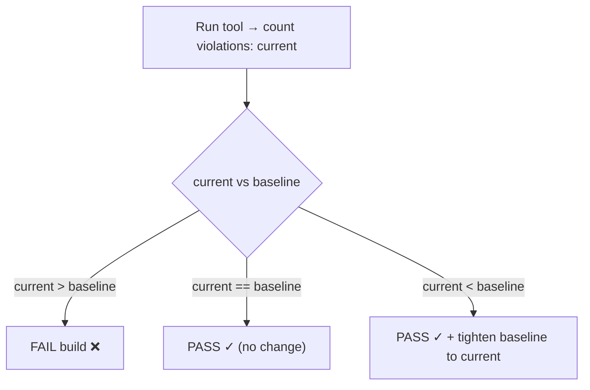

# Anti-Pattern Budgets & Ratcheting — Middle

> **Category:** [Anti-Patterns at Scale](../README.md) → **Anti-Pattern Budgets & Ratcheting** — *make the metric monotonically improve: stop the bleeding while you clean up legacy.*
> **Covers (collectively):** Baseline-and-ratchet · "No new violations" gates · Per-area debt budgets · Ratchet tooling · Failing the build on regression

---

## Table of Contents

1. [Introduction](#introduction)
2. [Prerequisites](#prerequisites)
3. [Anatomy of a Ratchet](#anatomy-of-a-ratchet)
4. [Committing a Baseline File](#committing-a-baseline-file)
5. [A Working Ratchet Script](#a-working-ratchet-script)
6. [Auto-Tightening on a Decrease](#auto-tightening-on-a-decrease)
7. [Per-Directory Budgets](#per-directory-budgets)
8. [Integrating betterer and `--max-warnings`](#integrating-betterer-and---max-warnings)
9. [Worked Example: Ratcheting `// @ts-ignore`](#worked-example-ratcheting--ts-ignore)
10. [Common Mistakes](#common-mistakes)
11. [Test Yourself](#test-yourself)
12. [Cheat Sheet](#cheat-sheet)
13. [Summary](#summary)
14. [Further Reading](#further-reading)
15. [Related Topics](#related-topics)

---

## Introduction

> Focus: **Setting a baseline and ratcheting it.** Commit the baseline, gate that the count can only decrease, slice it per-directory, and wire in a real tool — on a concrete worked example.

`junior.md` gave you the idea: freeze a baseline, fail on an increase, only ever tighten. This file makes it real. You'll commit an actual baseline file, write a ratchet that **auto-tightens** when a PR improves the count, split a single global budget into **per-directory budgets** so teams own their own debt, and replace your hand-rolled script with `betterer` or `eslint --max-warnings` once the rough edges show.

The middle-level skill is **operating** a ratchet, not just understanding it: where the baseline lives, who updates it and when, what happens on a decrease, and how to stop one team's mess from blocking another team's green build.

> **The mental model:** a ratchet is a tiny state machine with one piece of persisted state — the baseline — and two transitions: *increase → fail*, *decrease → record the new floor*. Everything else (which tool, where the file lives, per-directory vs global) is detail around that core.

---

## Prerequisites

- **Required:** [`junior.md`](junior.md) — you understand why zero-on-legacy fails and what monotonicity buys you.
- **Required:** Comfortable writing a small bash or Python script that runs a tool, captures its output, and sets an exit code.
- **Required:** You can add a step to a CI pipeline (GitHub Actions, GitLab CI, etc.) and know how it blocks a merge.
- **Helpful:** Familiarity with one linter's JSON/structured output (`eslint -f json`, `golangci-lint --out-format json`) — counting structured records beats `grep`-ing human text.
- **Helpful:** error-handling-patterns and refactoring-techniques skills for the cleanup work the ratchet drives.

---

## Anatomy of a Ratchet

Every ratchet, from a 10-line shell script to SonarQube, has the same four parts:

| Part | Question it answers | Example |
|---|---|---|
| **Metric** | *What* do we count? | lint warnings, `@ts-ignore`, banned-API calls, files over 400 lines |
| **Baseline** | *How many* are allowed right now? | a committed `.baseline` file holding `1847` |
| **Comparison** | current vs baseline → pass or fail? | `current > baseline ⇒ fail` |
| **Update policy** | when does the baseline change? | only on a *decrease*, and only on the main branch |

The two parts people get wrong are the **metric** (choosing a gameable one — covered in `senior.md`) and the **update policy** (auto-updating on increase, which silently disables the gate). Get those two right and the rest is plumbing.



---

## Committing a Baseline File

The baseline must be **persisted and version-controlled**, so every branch compares against the same agreed floor. The simplest form is a single number in a tracked file:

```bash
# Generate the initial baseline once, on a clean main branch.
golangci-lint run ./... 2>/dev/null | grep -c ':' > .golangci-baseline
git add .golangci-baseline
git commit -m "ratchet: freeze golangci baseline at $(cat .golangci-baseline)"
```

A bare count is the crudest baseline. It works but has a real weakness: **it doesn't say *which* violations are allowed**, so a PR can *fix* one warning and *add* a different one and the count stays equal — the gate passes while the codebase didn't actually improve. That's tolerable at the junior/middle stage and is exactly what richer tools fix by hashing each individual violation (`betterer`, SonarQube — see `professional.md`). Start with the count; graduate when the gaming starts to matter.

> **Where it lives:** a tracked file in the repo (`.golangci-baseline`, `.betterer.results`, `sonar-project.properties` for the gate config). Committing it means the baseline travels with the branch and code review sees every change to it — including the suspicious "baseline went *up* by 30" diff.

---

## A Working Ratchet Script

Here is a self-contained, production-shaped ratchet in Python. It runs the linter, counts violations from **structured** output (not fragile text grepping), compares to the committed baseline, and exits non-zero on a regression:

```python
#!/usr/bin/env python3
"""ratchet.py — fail CI if violations increased above the committed baseline."""
import json
import subprocess
import sys
from pathlib import Path

BASELINE_FILE = Path(".eslint-baseline")

def current_count() -> int:
    # Structured output is reliable; counting lines of human text is not.
    out = subprocess.run(
        ["npx", "eslint", ".", "-f", "json"],
        capture_output=True, text=True,
    ).stdout
    results = json.loads(out)
    return sum(f["errorCount"] + f["warningCount"] for f in results)

def main() -> int:
    baseline = int(BASELINE_FILE.read_text().strip())
    current = current_count()
    print(f"baseline={baseline} current={current}")

    if current > baseline:
        print(f"❌ violations increased: {current} > {baseline} "
              f"(+{current - baseline}). Remove what you added or fix old ones.")
        return 1

    if current < baseline:
        # Improvement: lock it in so it can never regress past here.
        BASELINE_FILE.write_text(f"{current}\n")
        print(f"✓ improved {baseline} → {current}; baseline tightened "
              f"(commit {BASELINE_FILE}).")
        return 0

    print("✓ no change; baseline holds.")
    return 0

if __name__ == "__main__":
    sys.exit(main())
```

Wire it into CI as a required check:

```yaml
# .github/workflows/ratchet.yml (excerpt)
- name: Anti-pattern ratchet
  run: python ratchet.py          # non-zero exit blocks the merge
```

The one subtlety: when the script *tightens* the baseline on a decrease, that change to `.eslint-baseline` has to be **committed**. How that happens depends on your tooling — the next section covers it.

---

## Auto-Tightening on a Decrease

When a PR removes violations, the baseline should drop to the new, lower number — otherwise the improvement isn't locked in and the next PR could re-add it for free. There are two common ways to handle the write-back:

1. **Author commits the tightened baseline.** The ratchet runs locally / in CI, rewrites the baseline file, and the developer commits it as part of their PR. Simple, fully auditable in review, no bot permissions. This is what `betterer` does with `.betterer.results`.

2. **CI bot commits it back to main.** After merge, a job recomputes and commits the new baseline. Avoids developers forgetting, but needs write access and care to avoid loops.

Either way, the **invariant** is the same and worth stating loudly:

> **The baseline file is only ever allowed to change in the *decreasing* direction (or stay equal). An increase to the baseline is a code-review red flag** — it means someone raised the ceiling to let new violations through. Reviewers should treat a baseline-increase diff like a security exception: it needs a reason.

A cheap way to enforce that invariant mechanically is a second check that diffs the baseline against `main` and fails if it went up:

```bash
# Reject any PR that *raises* the baseline (loosens the ratchet).
old=$(git show origin/main:.eslint-baseline)
new=$(cat .eslint-baseline)
if [ "$new" -gt "$old" ]; then
  echo "❌ baseline raised $old → $new — that loosens the ratchet. Justify or revert."
  exit 1
fi
```

---

## Per-Directory Budgets

A single global count has a fairness problem: if Team A is cleaning up `payments/` while Team B is dumping warnings into `reporting/`, the global number can stay flat — A's improvements silently subsidize B's regressions. Worse, when the global count goes red, *everyone's* build breaks even though only one area regressed.

The fix is **per-area budgets**: each directory (or package, or team-owned path) gets its own baseline. A regression in `reporting/` fails only the `reporting/` budget; `payments/` keeps ratcheting down independently.

```json
// .ratchet-budgets.json — one budget per owned area.
{
  "payments/":  120,
  "reporting/": 540,
  "auth/":       38,
  "legacy/":   1149
}
```

```python
#!/usr/bin/env python3
"""Per-directory ratchet: each area is gated and tightened independently."""
import json, subprocess
from collections import Counter
from pathlib import Path

BUDGETS = Path(".ratchet-budgets.json")

def counts_by_area(budgets: dict[str, int]) -> Counter:
    out = subprocess.run(["npx", "eslint", ".", "-f", "json"],
                         capture_output=True, text=True).stdout
    tally = Counter()
    for f in json.loads(out):
        n = f["errorCount"] + f["warningCount"]
        # Attribute each file to the longest matching budget prefix.
        area = max((a for a in budgets if f["filePath"].find(a) != -1),
                   key=len, default=None)
        if area:
            tally[area] += n
    return tally

def main() -> int:
    budgets = json.loads(BUDGETS.read_text())
    current = counts_by_area(budgets)
    failed, changed = False, False
    for area, allowed in budgets.items():
        now = current.get(area, 0)
        if now > allowed:
            print(f"❌ {area}: {now} > budget {allowed} (+{now - allowed})")
            failed = True
        elif now < allowed:
            budgets[area] = now            # tighten this area only
            changed = True
            print(f"✓ {area}: improved {allowed} → {now}")
        else:
            print(f"✓ {area}: holds at {allowed}")
    if changed and not failed:
        BUDGETS.write_text(json.dumps(budgets, indent=2) + "\n")
    return 1 if failed else 0

if __name__ == "__main__":
    raise SystemExit(main())
```

Per-directory budgets also make **ownership** legible: the `legacy/` budget of 1,149 is visibly the worst, so it's the obvious target. (Which area to attack first is a [hotspot question](../03-hotspot-analysis/senior.md) — ratchet hardest where churn is highest.)

> **Trade-off:** more budgets = more granular blame and isolation, but also more files to maintain and a risk of "death by a thousand budgets." Start global; split a budget out only when one area's noise is masking or blocking another's progress.

---

## Integrating betterer and `--max-warnings`

Once your hand-rolled script hits its limits (bare counts are gameable, baseline merge conflicts annoy people), reach for a purpose-built tool.

**ESLint `--max-warnings`** — the zero-config ratchet for JS/TS lint. Set the ceiling to today's count and lower it as you clean up:

```jsonc
// package.json
{
  "scripts": {
    // Today's count is 1847. The build fails at 1848. Lower this number
    // whenever you bring the real count down.
    "lint:ratchet": "eslint . --max-warnings 1847"
  }
}
```

Crude (a single global number, manually maintained) but effective and built in.

**`betterer`** — a dedicated ratchet framework. You declare *tests* (each a metric to drive down); `betterer` stores a per-violation snapshot in `.betterer.results` and fails CI if any test gets worse:

```typescript
// .betterer.ts — each test is a metric the ratchet drives toward zero.
import { regexp } from '@betterer/regexp';
import { typescript } from '@betterer/typescript';

export default {
  'no new @ts-ignore': () =>
    regexp(/@ts-ignore/).include('./src/**/*.ts'),

  'stricter typescript': () =>
    typescript('./tsconfig.json', { strict: true }).include('./src/**/*.ts'),
};
```

```bash
betterer            # local: fails if any test regressed, updates results on improvement
betterer ci         # CI mode: fails on regression, NEVER writes results (read-only gate)
```

The key advantage of `betterer` over a bare count: `.betterer.results` records *each individual violation* (by file + a hash of the surrounding code), so it can tell "you fixed warning X but added warning Y" apart from "no change." That kills the swap-one-for-another gaming the bare-count baseline allows — at the cost of a snapshot file that can produce merge conflicts (handled in `professional.md`).

**SonarQube / Code Climate "new code" gate** — instead of a count, these gate on **code you changed in this PR**: "your new/modified lines must have zero new issues," while legacy lines are exempt. It's a ratchet expressed as *"new code is clean,"* which is often the cleanest framing of all because it needs no baseline file at all — the diff *is* the baseline.

| Tool | Baseline storage | Granularity | Best when |
|---|---|---|---|
| `eslint --max-warnings N` | a number in `package.json` | one global count | quick start, JS/TS lint only |
| `betterer` | `.betterer.results` (per-violation hashes) | per-test, per-violation | multiple metrics, want anti-gaming |
| SonarQube new-code gate | none (uses the diff) | per-changed-line | server-side, polyglot, "new code clean" |
| custom script | a file you control | whatever you compute | bespoke metric no tool covers |

---

## Worked Example: Ratcheting `// @ts-ignore`

A real, end-to-end ratchet. Your TS codebase has accumulated **214 `// @ts-ignore`** comments — each one a silenced type error. You can't fix all 214 now, but you can guarantee no PR adds a 215th and that the number only falls.

**Step 1 — measure the baseline:**

```bash
grep -rn '@ts-ignore' src/ | wc -l      # → 214
```

**Step 2 — encode it as a `betterer` test:**

```typescript
// .betterer.ts
import { regexp } from '@betterer/regexp';

export default {
  'no new @ts-ignore (ratchet 214 → 0)': () =>
    regexp(/@ts-ignore/).include('./src/**/*.ts'),
};
```

**Step 3 — snapshot, then gate in CI:**

```bash
betterer            # writes .betterer.results with all 214 occurrences
git add .betterer.results .betterer.ts
git commit -m "ratchet: freeze @ts-ignore at 214"
```

```yaml
# CI step — read-only gate; fails on a 215th, passes when one is removed.
- run: npx betterer ci
```

**Step 4 — watch it ratchet.** A PR adding a new `@ts-ignore` fails `betterer ci` with a diff pointing at the exact new occurrence. A PR that properly types one away makes `betterer` (run locally) rewrite `.betterer.results` to 213, which the author commits. The ceiling drops, permanently. Six months of normal work — no clean-up sprint — and the 214 quietly bleeds toward zero.

> The team never scheduled "fix all the `@ts-ignore`s." They just made *adding* one impossible and *removing* one free to lock in. That's the entire art.

---

## Common Mistakes

1. **Storing the baseline outside version control** (a CI variable, a wiki page). It must be a committed file so every branch compares to the same floor and review sees every change to it.
2. **Letting the baseline increase silently.** A tightening ratchet only moves down. Add a check that *fails* when the committed baseline goes up — a raised baseline is a loosened gate and needs explicit justification.
3. **Counting human text with `grep`.** Linter output formatting changes; summary lines, file headers, and colors throw off `wc -l`. Count *structured* output (`-f json`) or use the tool's own count.
4. **One global budget for a multi-team monorepo.** One team's regression breaks everyone's build and hides behind another team's cleanup. Split per-directory once areas start interfering.
5. **Running `betterer` (write mode) in CI.** That would *update* the results to the current count and never fail. CI must run `betterer ci` (read-only). The same trap as auto-updating a hand-rolled baseline.
6. **Ratcheting a metric you can't actually reduce.** If a rule has 800 violations and no realistic path down (e.g. it flags a framework-mandated pattern), the ratchet just freezes 800 forever. Pick metrics with a credible downward path, and start with the easy, high-churn ones.

---

## Test Yourself

1. Name the four parts every ratchet has, and which two are the ones people get wrong.
2. A bare-count baseline passes a PR that fixes warning X but adds warning Y. Why? What kind of tool closes that gap, and how?
3. Why must the baseline file live in version control rather than a CI environment variable?
4. Your monorepo has one global warning budget. Team A cleans up 30 warnings; Team B adds 30. What does the global gate report, and what does a per-directory budget report instead?
5. Why does running `betterer` (not `betterer ci`) in your CI pipeline defeat the entire ratchet?
6. A SonarQube "new code" quality gate needs no baseline file. What is it using as the baseline instead?

---

## Cheat Sheet

| Task | How |
|---|---|
| Freeze a baseline | `tool ... | count > .baseline; git commit` |
| Gate on regression | `current > baseline ⇒ exit 1` |
| Lock in an improvement | on `current < baseline`, rewrite baseline (commit it) |
| Stop the baseline rising | diff baseline vs `main`; fail if it went up |
| Per-team isolation | one budget per directory in a JSON map |
| JS/TS quick start | `eslint . --max-warnings <today's count>` |
| Multi-metric, anti-gaming | `betterer` + `.betterer.results`, CI runs `betterer ci` |
| No baseline file at all | SonarQube/Code Climate **new-code** gate (diff is the baseline) |

> **Two rules:** *(1) the baseline only moves down; an upward move is a review red flag. (2) Count structured output and individual violations, not lines of human text.*

---

## Summary

- A ratchet has four parts — **metric, baseline, comparison, update policy** — and the two people botch are choosing a *gameable metric* and an *update policy that lets the baseline rise*.
- **Commit the baseline** as a version-controlled file so every branch compares to the same floor and review sees every change to it. A bare count is fine to start; it just can't tell "swapped X for Y" from "no change."
- The **invariant** is monotonic tightening: the baseline only ever **decreases** (locking in fixes) or holds. Enforce it mechanically — fail any PR that *raises* the committed baseline.
- **Per-directory budgets** isolate teams: a regression fails only that area's build, and one team's cleanup no longer subsidizes another's mess. Split out budgets only when areas start interfering.
- **`eslint --max-warnings`** is the zero-config global ratchet; **`betterer`** records per-violation snapshots to defeat swap-one-for-another gaming (run `betterer ci`, never write-mode, in CI); **SonarQube/Code Climate "new code" gates** use the diff as the baseline and need no file.
- This completes the operational skill: freeze, gate, tighten, slice, and adopt a tool. Next: [`senior.md`](senior.md) — *rolling a ratchet across a large legacy codebase: choosing an un-gameable metric, handling merges, and ratcheting hotspots first.*

---

## Further Reading

- **`betterer` documentation** — tests, `.betterer.results`, `betterer ci`, the regexp/typescript/eslint test types.
- **ESLint CLI docs** — `--max-warnings`, `-f json` formatter.
- **SonarQube "Clean as You Code" / new-code quality gate** — the diff-as-baseline framing.
- **Refactoring** — Martin Fowler (2nd ed. 2018) — the small-step cleanup a ratchet rewards (Extract Function, etc.).
- **Working Effectively with Legacy Code** — Michael Feathers (2004) — improving a large codebase incrementally under a green build.

---

## Related Topics

- [Architecture Fitness Functions](../01-architecture-fitness-functions/senior.md) — a ratchet over a count is one species of fitness function; this is the general framing.
- [Hotspot Analysis](../03-hotspot-analysis/senior.md) — which area's budget to drive down first (churn × complexity).
- [Automated Large-Scale Refactoring](../04-automated-large-scale-refactoring/senior.md) — how to *bulk-fix* a metric and drop the baseline by hundreds at once.
- Clean Code → The Boy-Scout Rule — the opportunistic cleanup the ratchet locks in.
- Clean Code → Modules and Packages — the directory boundaries per-area budgets attach to.
- [Bad Shortcuts → Senior](../../01-development/02-bad-shortcuts/senior.md) — the compounding debt a ratchet contains.

---

## Check your understanding

1. Explain Anti-Pattern Budgets & Ratcheting — Middle Level in your own words and name the problem it solves.
2. How would you apply the ideas around Table of Contents, Introduction, Prerequisites in a realistic engineering change?
3. What failure mode or misuse should you look for, and what evidence would reveal it?
4. Which local design trade-off would make you choose or reject Anti-Pattern Budgets & Ratcheting — Middle Level in an existing codebase?
5. What observable result would convince you that the approach improved the system?
