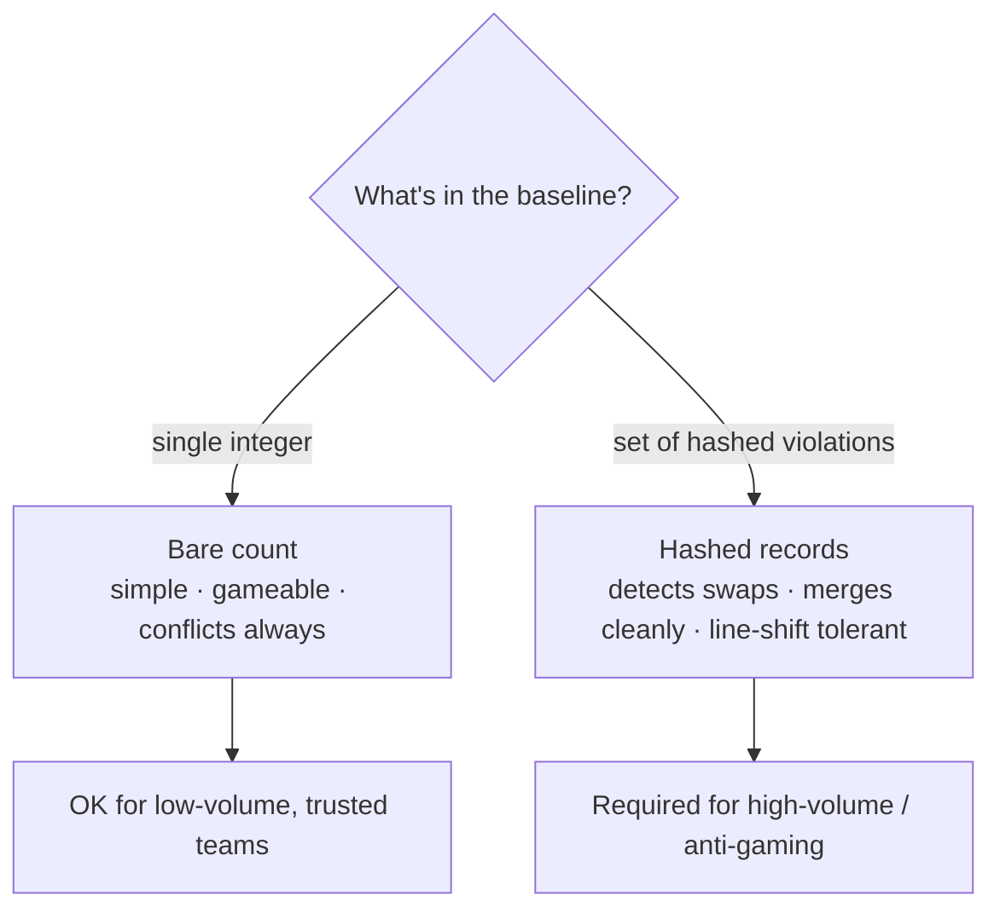
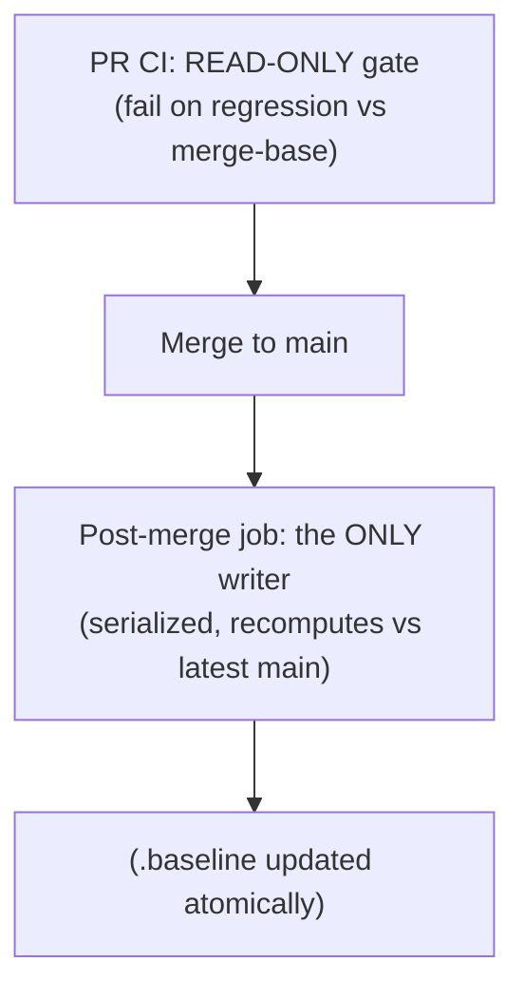
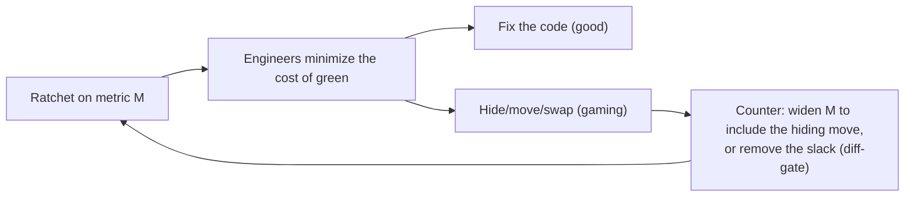

# Anti-Pattern Budgets & Ratcheting — Professional

> **Category:** [Anti-Patterns at Scale](../README.md) → **Anti-Pattern Budgets & Ratcheting** — *make the metric monotonically improve: stop the bleeding while you clean up legacy.*
> **Covers (collectively):** Baseline-and-ratchet · "No new violations" gates · Per-area debt budgets · Ratchet tooling · Failing the build on regression

---

## Table of Contents

1. [Introduction](#introduction)
2. [Prerequisites](#prerequisites)
3. [Baseline Storage: Bare Count vs Hashed Violations](#baseline-storage-bare-count-vs-hashed-violations)
4. [Merge Conflicts and How Tools Avoid Them](#merge-conflicts-and-how-tools-avoid-them)
5. [Race Conditions in Baseline Write-Back](#race-conditions-in-baseline-write-back)
6. [Monorepo Per-Package Budgets at Scale](#monorepo-per-package-budgets-at-scale)
7. [Statistical Noise and Flaky Counts](#statistical-noise-and-flaky-counts)
8. [Recompute Performance: Scope, Cache, Incremental](#recompute-performance-scope-cache-incremental)
9. [Goodhart's Law and Gaming, Mechanized](#goodharts-law-and-gaming-mechanized)
10. [When a Ratchet Entrenches a Bad Metric](#when-a-ratchet-entrenches-a-bad-metric)
11. [A Combined Failure-Mode Walkthrough](#a-combined-failure-mode-walkthrough)
12. [Common Mistakes](#common-mistakes)
13. [Test Yourself](#test-yourself)
14. [Cheat Sheet](#cheat-sheet)
15. [Summary](#summary)
16. [Further Reading](#further-reading)
17. [Related Topics](#related-topics)

---

## Introduction

> Focus: **Implementation and failure modes.** The baseline format and why it conflicts; race conditions in write-back; per-package monorepo budgets; flaky/noisy counts; recompute performance; mechanized Goodhart gaming; and the worst failure of all — a ratchet that perfectly enforces the wrong metric.

`senior.md` made the strategic calls: which metric, where the baseline lives, hotspots first. This file lives inside the implementation, where ratchets actually break. A ratchet is deceptively simple — *count, compare, fail* — but every one of those three steps has a failure mode that only shows up under real load:

- **Count** is not deterministic. Tools emit slightly different numbers on different machines, parallelism orderings, and tool versions; a flaky count means a flaky gate, and a flaky gate gets disabled.
- **Compare** depends on a baseline that, stored naïvely, conflicts on every merge and races on every concurrent write-back.
- **Fail** is only useful if the metric is sound — and a ratchet *entrenches* whatever metric you give it, so a bad metric becomes permanently load-bearing.

Two professional disciplines run through all of it:

1. **The baseline is shared mutable state under concurrency.** Every problem in this file — merge conflicts, write-back races, flaky resolution — is a *concurrency* problem in disguise. Treating the baseline like the shared global it is (immutable snapshots, deterministic recomputation, hashed records that merge cleanly) is the cure.
2. **A ratchet amplifies the metric.** It makes a metric *permanent and load-bearing*. So the cost of a bad metric is not "a slightly wrong number" — it's "an organization spends a year optimizing the wrong thing and can't stop because the gate is green." Choosing and *being able to retire* the metric is the deepest skill here.

> **The mental model:** a ratchet is a tiny distributed system. The baseline is its replicated state; PRs are concurrent writers; CI is the consistency mechanism. Build it like one — deterministic counts, conflict-free state, atomic write-back — not like a script that happens to work on your laptop.

---

## Prerequisites

- **Required:** [`senior.md`](senior.md) — metric choice, baseline storage trade-offs, merge-base comparison, hotspot-first rollout, the fitness-function frame.
- **Required:** You can reason about three-way merges at the byte level — *why* a particular file format conflicts and another doesn't.
- **Required:** Comfort with CI concurrency: parallel jobs, race conditions on a shared artifact, and atomic commit/push semantics.
- **Helpful:** Determinism in static analysis — why a linter's count can vary across runs (parallel file ordering, caching, plugin versions, locale).
- **Helpful:** concurrency-patterns, immutability-patterns, ci-cd-pipeline-design skills for the vocabulary used throughout.

---

## Baseline Storage: Bare Count vs Hashed Violations

The single design decision that determines a ratchet's operational behavior is **what the baseline file contains**. Two ends of a spectrum:

**Bare count** — the baseline is one integer.

```
1847
```

- **Cheap, human-readable, trivial to compare** (`current > baseline`).
- **Cannot distinguish "fixed X, added Y" from "no change"** — both leave the total at 1847. Gameable by swapping (`senior.md`).
- **Conflicts on every concurrent change** — two PRs both rewriting the single line collide (next section).

**Hashed per-violation record** — the baseline is a *set*, each violation identified by a stable key.

```jsonc
// .betterer.results (conceptual shape)
{
  "no new @ts-ignore": {
    "src/billing/charge.ts": [
      { "line": 42, "hash": "a1b2c3", "message": "@ts-ignore" },
      { "line": 88, "hash": "d4e5f6", "message": "@ts-ignore" }
    ],
    "src/auth/token.ts": [
      { "line": 12, "hash": "9z8y7x", "message": "@ts-ignore" }
    ]
  }
}
```

- **Detects swaps:** removing the `a1b2c3` violation and adding a new one with a different hash is visibly "−1 known, +1 unknown" → the new one fails the gate even though the total is unchanged.
- **Merges cleanly:** two PRs fixing violations in *different files* edit *different keys*; a structured three-way merge contains both with no conflict.
- **Survives line shifts:** keying on a **hash of the surrounding code** rather than the line number means inserting a blank line above doesn't invalidate every record. (Pure line-number keys are brittle — every edit shifts them.)
- **Costs:** a bigger file, a real hash function, and care that the hash is *stable* (whitespace-insensitive, position-tolerant) but *specific enough* to tell two violations apart.



> **The professional default:** for anything beyond a small, low-throughput repo, store **hashed per-violation records** (or gate the diff and store nothing). The bare count is a starter that you outgrow the moment two PRs conflict or someone swaps a violation.

---

## Merge Conflicts and How Tools Avoid Them

The committed-baseline ratchet's defining operational pain is **merge conflicts on the baseline file**. Understanding *why* tells you how to avoid it.

A git three-way merge conflicts when two branches change **the same region** of a file relative to the merge-base. A bare-count baseline is a single line, so *any two PRs that change the count* change that same line — guaranteed conflict:

```
 <<<<<<< HEAD (PR A fixed 3 warnings)
1844
 =======
1842   (PR B fixed 5 warnings)
 >>>>>>> PR-B
```

Worse than the annoyance is the **silent mis-resolution**: a developer resolving this picks one number (say 1844), discarding PR B's improvement *and* potentially *loosening* the ratchet — if both PRs actually fixed warnings, the true post-merge count might be 1839, but the file now says 1844, leaving 5 warnings' worth of slack for the next PR to fill for free.

How real tools and designs avoid it:

**1. Hashed records merge by key, not by line.**
Two PRs fixing violations in different files touch different JSON keys; a structured merge (or even git's line-based merge on a pretty-printed, one-violation-per-line file) combines them cleanly. `betterer`'s `.betterer.results` is engineered for exactly this — its format is chosen to minimize conflict surface.

**2. Treat the baseline as derived; recompute post-merge.**
Don't three-way-merge two stale baselines at all. Make the in-PR baseline *advisory* and recompute the authoritative one from the merged code on `main`:

```bash
#!/usr/bin/env bash
# post-merge-baseline.sh — runs on main after merge; the baseline is DERIVED,
# never hand-merged. This sidesteps baseline conflicts entirely.
set -euo pipefail
current=$(npx eslint . -f json | jq '[.[] | .errorCount + .warningCount] | add')
prev=$(cat .baseline)
if [ "$current" -le "$prev" ]; then
  echo "$current" > .baseline
  git add .baseline
  git commit -m "ratchet: recompute baseline → $current [skip ci]"
  git push
fi
```

The PR-time check still *blocks* regressions (comparing against the merge-base); the post-merge job just keeps the authoritative number honest without anyone merging the file by hand.

**3. Don't store a baseline — gate the diff.**
The new-code gate (SonarQube/Code Climate) has *no file* to conflict. Each PR's baseline is recomputed from its own merge-base. Zero conflict surface, at the cost of not reducing legacy on its own (`senior.md`).

**4. Mark the baseline as a generated artifact** in `.gitattributes` with a union or custom merge driver, so trivial cases auto-resolve:

```gitattributes
# Use the 'union' merge to keep BOTH sides' additions in an append-mostly list,
# then a post-merge hook normalizes. (Use with care — union can keep stale lines.)
.betterer.results merge=union
```

> **Rule:** the more PRs per day, the more the baseline must be either **conflict-free by construction** (hashed records, diff-gating) or **derived not merged** (post-merge recompute). A single integer hand-merged across hundreds of PRs is how a ratchet quietly loosens itself into uselessness.

---

## Race Conditions in Baseline Write-Back

Auto-tightening the baseline on a decrease is a **write to shared state**, and in CI that write races. Two scenarios:

**1. Concurrent post-merge recomputes.** Two PRs merge to `main` seconds apart; both trigger a post-merge job that recomputes and pushes the baseline. Classic lost-update / push race:

- Job for PR A reads baseline 1847, computes 1844, commits, pushes.
- Job for PR B (started before A's push) read 1847 too, computes 1842, tries to push → **non-fast-forward rejection** (good) or, if force-pushed (bad), **clobbers A's commit**, and the recomputed 1842 may be wrong because it was computed against pre-A code.

The cure is the standard one for shared mutable state: make the write **atomic and serialized**, or make it **idempotent and re-derivable**:

```bash
# Serialize baseline writes through a fast-forward-only push with retry.
# A push race fails the fetch-merge-push loop; retry recomputes against the
# now-updated main, so the final baseline reflects ALL merged changes.
for attempt in 1 2 3; do
  git fetch origin main
  git reset --hard origin/main
  current=$(recount)                 # recompute against the LATEST main
  prev=$(cat .baseline)
  [ "$current" -ge "$prev" ] && exit 0
  echo "$current" > .baseline
  git commit -am "ratchet: → $current [skip ci]"
  git push origin HEAD:main && exit 0 || sleep $((attempt * 2))
done
exit 1
```

The key insight: **recompute against the latest `main` inside the retry loop**, so the baseline is always derived from the actual merged state — never from a stale snapshot. This is the immutable-snapshot discipline: don't merge two computed numbers, re-derive the number from the current truth.

**2. In-PR write-back collides with the PR's own commits.** If the ratchet rewrites the baseline *during* a PR's CI run and the developer also pushes, you get a confusing "baseline changed under you" diff. Prefer: the PR-time check is **read-only** (it only *fails* on regression, like `betterer ci`), and tightening happens **only** in the controlled post-merge job. Separating the read path (gate) from the write path (tighten) removes the race surface entirely.



> **Discipline:** exactly one writer, and it recomputes from the live `main` under a fast-forward-only push with retry. Many readers (PR gates) are fine — they don't mutate. This is precisely the single-writer / immutable-snapshot pattern from concurrency, applied to a file in git.

---

## Monorepo Per-Package Budgets at Scale

In a large monorepo, a single global baseline is both a conflict magnet (every team touches it) and a fairness problem (one team's regression breaks all builds). The professional structure is **per-package budgets co-located with the package**, so blame, ownership, and conflict surface all align with team boundaries.

```
packages/
  billing/
    .ratchet.json        # billing's own budget; billing's PRs touch only this
  auth/
    .ratchet.json        # auth's own budget; never conflicts with billing's
  reporting/
    .ratchet.json
```

Per-package files give you three wins at once:

- **No cross-team conflicts.** Billing PRs and auth PRs edit different baseline files — they can never conflict on the ratchet.
- **Isolated failure.** A regression in `reporting/` fails only `reporting/`'s gate; `billing` keeps merging green.
- **Ownership via `CODEOWNERS`.** Each `.ratchet.json` is owned by its package's team, so a baseline-raising diff requires *that team's* approval — the loosening is visible to exactly the people accountable for it.

The trade-off is **orchestration cost**: you now run N ratchet checks, and you want to run only the ones whose package actually changed (recompute performance, below). A driver that maps changed files → affected packages → their ratchets keeps CI fast:

```python
# Run only the ratchets for packages touched by this PR (affected-targets).
changed = subprocess.run(
    ["git", "diff", "--name-only", "origin/main..."],
    capture_output=True, text=True).stdout.split()
affected = {f.split("/")[1] for f in changed if f.startswith("packages/")}
for pkg in affected:
    run_ratchet(f"packages/{pkg}/.ratchet.json")   # skip untouched packages
```

This mirrors how monorepo build tools (Bazel, Nx, Turborepo) compute the *affected* target set — the ratchet should ride the same affected-graph the build already computes, not re-scan the world.

> **Caution — "death by a thousand budgets."** Per-package is right when packages map to team ownership and conflict/fairness are real pains. Splitting *below* that (per-directory inside a package, per-file) usually costs more maintenance than it returns. Split to the **ownership boundary**, no finer.

---

## Statistical Noise and Flaky Counts

A ratchet assumes the count is **deterministic**: the same code yields the same number every run. When it doesn't, the gate flakes — sometimes red, sometimes green, on identical code — and a flaky gate is worse than no gate, because it trains engineers to *re-run until green* and ignore the signal.

Sources of non-determinism in the count:

- **Tool version drift.** A linter upgrade adds a rule → the count jumps overnight with no code change. CI and developer machines on different versions disagree.
- **Plugin / config differences.** A locally-installed editor plugin or a different `node_modules` resolution changes which rules fire.
- **Parallelism and ordering.** Some analyzers cap reported issues, dedupe across files non-deterministically, or short-circuit — so parallel runs report slightly different totals.
- **Environment-dependent rules.** A rule that reads the clock, locale, OS, or env (e.g. "no `console.log` except in dev") can fire differently across machines.
- **Caching artifacts.** A stale analysis cache reports last run's count; a cold cache reports a fuller one.

Defenses:

1. **Pin everything.** Exact tool versions, locked dependencies, a single canonical config. Run the authoritative count in **one** environment (CI, in a pinned container) and treat local runs as advisory.
2. **Make the count reproducible before you gate on it.** Run the counter 10 times on the same commit; if you don't get the same number every time, *fix the determinism first* — don't ratchet a number that drifts.

```bash
# Sanity check: the same commit must produce the same count every time.
for i in $(seq 1 10); do npx eslint . -f json | jq '[.[]|.errorCount+.warningCount]|add'; done | sort -u
# More than one line of output ⇒ your count is non-deterministic ⇒ DO NOT GATE YET.
```

3. **Handle the legitimate jump (a tool upgrade) explicitly.** When you intentionally bump the linter and the count rises for a real reason, **re-baseline in a dedicated, reviewed commit** that does nothing else — so the increase is auditable and isn't confused with a regression.
4. **Never ratchet a genuinely stochastic metric** (e.g. a flaky-test count, a timing-dependent measure) with an exact threshold. If the metric has inherent variance, gate on a **statistic with a tolerance** (e.g. "p95 over the last N runs ≤ baseline + noise band"), not an exact integer — or don't ratchet it at all.

> **The professional stance:** *a ratchet is only as trustworthy as the determinism of its count.* Before gating, prove the count is reproducible. A non-deterministic ratchet doesn't just fail — it teaches the whole team to ignore CI.

---

## Recompute Performance: Scope, Cache, Incremental


Three levers, in order of impact:

1. **Scope to changed files.** A PR only changes a handful of files; only those can introduce new violations. Run the analyzer on the **diff**, not the world:

```bash
# Lint only files this PR touched, against the merge-base.
git diff --name-only --diff-filter=ACM origin/main... -- '*.ts' | xargs npx eslint -f json
```

This is also exactly what the **new-code gate** does natively, which is part of why it scales: the work is proportional to the PR size, not the repo size.

2. **Cache the analysis.** Linters and type-checkers support incremental caches keyed by file content (`eslint --cache`, `tsc --incremental`, `golangci-lint`'s cache). Unchanged files hit the cache; only changed files are re-analyzed. Persist the cache across CI runs (CI cache action) so a PR pays only for what it changed.

3. **Ride the monorepo affected-graph.** Tools like Bazel/Nx/Turborepo already compute "which targets are affected by this change." Run the ratchet only on affected packages (per-package budgets above), reusing the build system's dependency graph instead of recomputing it.

| Approach | Work per PR | Catches | Note |
|---|---|---|---|
| **Recompute whole repo** | O(repo) | everything | too slow at scale; the anti-pattern |
| **Changed files only** | O(diff) | new violations in touched files | can miss violations *exposed* elsewhere by a change |
| **Cached incremental** | O(changed) | everything, fast | needs persistent CI cache |
| **Affected-graph** | O(affected subtree) | violations in impacted packages | reuses build system's graph |

> **The subtle correctness caveat:** scoping to changed files can *miss* a violation that your change **introduces in an unchanged file** (e.g. you delete a function and now an unrelated file's unused-import rule should fire — but you didn't touch that file). For most metrics this is rare and acceptable; for metrics with cross-file effects, run the **full** analysis on a slower cadence (nightly, pre-merge to main) as a backstop, while the fast changed-files gate runs per-PR. Speed on the hot path, completeness on a slower one.

---

## Goodhart's Law and Gaming, Mechanized

`senior.md` introduced Goodhart's law; here is its *mechanized* form — the specific ways a ratchet metric gets gamed in practice, and the counter for each:

| Gaming move | Mechanism | Counter |
|---|---|---|
| **Suppress, don't fix** | `// eslint-disable`, `@SuppressWarnings`, `# noqa`, `//nolint` | Count suppressions in the same metric; ratchet them too |
| **Swap escape hatch** | `@ts-ignore` → `@ts-expect-error` → `as any` → `: any` | Count the *whole family* of escapes as one metric |
| **Move, don't remove** | Relocate the violation to a file/dir excluded from analysis | Audit the exclude list; ratchet the *size of the exclude list* too |
| **Generate around it** | Push hand-written bad code into a generated file the linter skips | Lint generated code, or gate the generator |
| **Vendor it** | Move code into `vendor/`, `third_party/`, `node_modules`-adjacent dirs | Scope analysis to first-party paths explicitly, and watch what's added to vendored dirs |
| **Swap one for another (bare count)** | Fix violation X, add violation Y; total unchanged | Hashed per-violation baseline (detects the new Y) or diff-gating |
| **Re-baseline upward** | Quietly raise the baseline number to absorb the new violations | "Baseline must not rise" guard check + `CODEOWNERS` on the baseline file |

The unifying counter-principle: **make hiding a violation cost exactly as much as adding one.** Every gaming move is a way to make the metric go down (or stay flat) without improving the code; each is closed by widening the metric to include the hiding mechanism, or by removing the slack (diff-gating) the game exploits.



> **The asymptote:** you can never make a metric *perfectly* un-gameable — Goodhart guarantees pressure. The goal is to make **fixing genuinely cheaper than gaming** for the common cases, and to *monitor the exclude lists and suppression counts* as second-order ratchets so the gaming itself shows up as a regression somewhere.

---

## When a Ratchet Entrenches a Bad Metric

The deepest professional failure mode isn't a conflict or a race — it's a ratchet that works *perfectly* on the *wrong metric*. Because a ratchet makes a metric **permanent and load-bearing**, it doesn't just measure the metric — it *commits the organization to it*. Two ways this bites:

**1. The metric was a poor proxy.** You ratcheted "cyclomatic complexity per function ≤ 10." Engineers drive it down — by **shattering** one readable 12-branch function into five 3-branch functions that pass arguments around through shared state, producing *worse* code with a *better* number. The ratchet locked in the proxy, and now the proxy actively fights the goal it was meant to serve. The number says "improving"; the codebase is degrading.

**2. The metric became obsolete.** You ratcheted a rule that made sense in 2021 (e.g. "no use of the old HTTP client") and drove it to zero. Two years later the *new* client is deprecated and the rule is meaningless — but the binary gate it became still forbids a now-irrelevant pattern, and nobody remembers why. The ratchet outlived its purpose and is now pure friction.

The cure is to treat **the metric itself as something you must be able to retire**:

- **Tie every ratchet to a stated goal, written down where the gate lives.** Not "complexity ≤ 10" but "*because high-complexity functions in our hotspots cause the most incident-linked bugs — see [hotspot data].*" When the goal is explicit, you can later ask "is this metric still serving the goal?" and answer it.
- **Review ratchets periodically, like you review feature flags.** A ratchet is a long-lived gate; schedule a recurring audit (quarterly) that asks of each: *is the metric still a good proxy? Is it being gamed into harm? Is it obsolete?* Retire the ones that fail.
- **Be willing to delete a green ratchet.** A ratchet that reached zero and whose rule is now irrelevant should be *removed*, not kept "just in case" — that's the [Boat Anchor](../../01-development/01-bad-structure/junior.md) anti-pattern reappearing in your tooling. Keeping a meaningless gate trains the team to route around gates.
- **Watch for the proxy fighting the goal.** If driving the metric down is producing *uglier* code (functions shattered to dodge a complexity cap, tests added to hit a coverage number), the metric has become the enemy. Replace it with one closer to the real goal (mutation score over coverage; per-function review over a complexity integer).

> **The principle:** a ratchet is a *commitment device* — it makes a metric permanent on purpose. That power is exactly why choosing the metric, *and being able to retire it*, is the most important and most senior decision in this whole topic. A ratchet that flawlessly enforces the wrong thing is more dangerous than no ratchet, because its green build certifies that you're going the right way while you aren't.

---

## A Combined Failure-Mode Walkthrough

A realistic ratchet that hits *every* failure mode at once, and the professional rebuild.

**Before — a ratchet that's quietly broken in five ways:**

```bash
#!/usr/bin/env bash
# ratchet.sh — looks fine, broken five ways.
current=$(eslint . | grep -c warning)         # (1) flaky: greps human text, re-analyzes whole repo
baseline=$(cat .baseline)                       # (2) bare count → conflicts on every merge
if [ "$current" -ge "$baseline" ]; then         # (3) off-by-one: >= fails even when EQUAL... wait, it BLOCKS equal? no—
  echo "regression"; exit 1                      #     actually >= means equal also fails: build red on no change (bug)
fi
echo "$current" > .baseline                      # (4) writes baseline on EVERY run, even increases → never ratchets
git commit -am "update baseline" && git push     # (5) unserialized push → race/clobber with concurrent PRs
```

The defects: **(1)** counts human text and re-scans the whole repo (flaky + slow); **(2)** bare-count baseline conflicts on merges; **(3)** `>=` fails the build even when the count is *unchanged* (and the comment shows the author was already confused — a one-character bug); **(4)** unconditionally overwrites the baseline, so it absorbs *increases* too and never actually ratchets; **(5)** an unserialized push races with concurrent merges and can clobber another job's baseline.

**After — each failure mode addressed:**

```python
#!/usr/bin/env python3
"""ratchet.py — read-only PR gate. Deterministic, scoped, swap-proof, conflict-free."""
import json, subprocess, sys
from pathlib import Path

BASELINE = Path(".betterer.results")   # (2,4) hashed per-violation set: merges cleanly, detects swaps

def changed_files() -> list[str]:
    # (1) scope to the diff vs merge-base → fast and deterministic for this PR
    out = subprocess.run(
        ["git", "diff", "--name-only", "--diff-filter=ACM",
         "origin/main...", "--", "*.ts"],
        capture_output=True, text=True).stdout.split()
    return out

def current_violations(files) -> set[tuple]:
    if not files:
        return set()
    # (1) structured output, pinned tool version in CI container → reproducible count
    out = subprocess.run(["npx", "eslint", "-f", "json", *files],
                         capture_output=True, text=True).stdout
    return {(f["filePath"], m["ruleId"], hash_context(f["source"], m["line"]))
            for f in json.loads(out) for m in f["messages"]}

def main() -> int:
    known = load_known(BASELINE)
    now = current_violations(changed_files())
    # (3) compare SETS: a violation whose hash isn't in the baseline is NEW → fail.
    #     Equal or fewer never fails; only genuinely-new violations do.
    new = now - known
    if new:
        for v in new:
            print(f"❌ new violation (not in baseline): {v}")
        return 1
    return 0   # (4,5) PR gate is READ-ONLY: it never writes the baseline.
               #       Tightening happens only in the serialized post-merge job.

if __name__ == "__main__":
    sys.exit(main())
```

The write-back (tightening + commit + push) moves to the **single, serialized post-merge job** from the [race-conditions section](#race-conditions-in-baseline-write-back), which recomputes against the latest `main` under a fast-forward-only push with retry.

> **The lesson:** none of the five bugs were in the *idea* of the ratchet — they were all in treating the baseline as a casual file instead of as **shared mutable state in a concurrent system with a determinism requirement.** Deterministic count, scoped work, hashed conflict-free records, read-only PR gate, single serialized writer — that's a ratchet that survives a monorepo.

---

## Common Mistakes

Professional-level mistakes — subtle, and each one quietly disables a ratchet that *looks* like it's working:

1. **Gating on a non-deterministic count.** A count that drifts across tool versions/parallelism/env makes the gate flake, which trains the team to re-run until green and ignore the signal. Prove reproducibility before gating; pin everything; run the authoritative count in one environment.
2. **A bare-count baseline in a high-merge repo.** Conflicts on nearly every PR and mis-resolves to a looser number. Use hashed per-violation records, recompute post-merge, or diff-gate.
3. **Two (or more) writers to the baseline.** Concurrent post-merge jobs race and clobber. Exactly one serialized writer that recomputes against live `main` under fast-forward-only push with retry; PR gates are read-only.
4. **`>=` vs `>` off-by-one.** Failing on *equal* blocks every no-op PR (build red on no change); the gate should fail only on a genuine *increase* (`>`). A one-character bug that makes a ratchet either too strict or too loose.
5. **Writing the baseline on every run.** Unconditional write-back absorbs increases and the ratchet never ratchets. Write only on a decrease, and only from the controlled writer.
6. **Re-analyzing the whole repo per PR.** The ratchet becomes the slowest check and gets removed. Scope to changed files, cache incrementally, ride the affected-graph; full scan on a slower cadence as a backstop.
7. **Ignoring the gaming.** If suppressions, exclude-list growth, and escape-hatch swaps aren't counted, the metric measures gaming skill. Widen the metric to include the hiding move; ratchet the exclude list and suppression count as second-order metrics.
8. **Entrenching a bad or obsolete metric.** A ratchet makes a metric permanent. If the proxy fights the goal (functions shattered to dodge a complexity cap) or the rule is obsolete, the green build certifies the wrong direction. Tie each ratchet to a written goal, audit ratchets periodically, and delete the ones that no longer serve.
9. **Keeping a green, meaningless ratchet "just in case."** A reached-zero, now-irrelevant gate is a Boat Anchor in your CI. Remove it — keeping dead gates trains the team to route around gates.

---

## Test Yourself

1. Two PRs each fix warnings and both rewrite a bare-count baseline (`1847` → different numbers). Explain the conflict and the *silent mis-resolution* that loosens the ratchet. What baseline format avoids the conflict, and why?
2. Your post-merge baseline-update job runs concurrently for two near-simultaneous merges. Describe the lost-update race and the exact mechanism that makes the write safe.
3. A ratchet's count is `1844` on CI and `1846` on your laptop for the identical commit. List three plausible causes and the discipline that removes them.
4. Why does `if [ "$current" -ge "$baseline" ]; then exit 1` make a ratchet behave wrongly, and what's the correct comparison?
5. Scoping analysis to changed files makes the ratchet fast. Name the correctness case it can *miss*, and how you'd cover it without slowing every PR.
6. An engineer drives "cyclomatic complexity ≤ 10" to green by shattering one readable function into five that share state. The number improved; the code got worse. Name the law, the failure category, and two professional safeguards against it.
7. Why is "store nothing, gate the diff" (the new-code gate) simultaneously the answer to *merge conflicts*, *recompute performance*, and *swap-gaming* — and what does it *not* solve?
8. Why is "a ratchet that flawlessly enforces the wrong metric" more dangerous than no ratchet at all?

---

## Cheat Sheet

| Failure mode | Symptom | Fix |
|---|---|---|
| **Flaky count** | red/green on identical code | Pin tools/config; one authoritative env; prove reproducibility before gating |
| **Baseline conflicts** | merge conflict on every count change | Hashed per-violation records; recompute post-merge; or diff-gate (store nothing) |
| **Write-back race** | concurrent jobs clobber the baseline | One serialized writer; recompute vs latest `main`; ff-only push + retry; PR gate read-only |
| **`>=` off-by-one** | build red on no-op PRs | Fail only on a true increase (`>`) |
| **Unconditional write** | baseline never tightens | Write only on a decrease, only from the controlled writer |
| **Whole-repo recompute** | ratchet is the slowest check | Scope to changed files; `--cache`/incremental; affected-graph; full scan on slow cadence |
| **Gaming** | count drops, quality doesn't | Count suppressions/escapes/exclude-list; diff-gate; ratchet the gaming as 2nd-order metric |
| **Entrenched bad metric** | green build, worse code | Tie metric to written goal; audit ratchets quarterly; delete obsolete gates |

> **Three rules:** *(1) the baseline is shared mutable state — make it deterministic, conflict-free, and single-writer. (2) Make hiding a violation cost exactly as much as adding one. (3) A ratchet commits you to a metric — choose one you can also retire.*

---

## Summary

- A ratchet is *count → compare → fail*, and **each step has a production failure mode**: the count flakes, the comparison's baseline conflicts and races, and the metric — once ratcheted — becomes permanent and load-bearing.
- **Baseline format** is the decisive choice: a bare count is gameable and conflict-prone; **hashed per-violation records** detect swaps and merge cleanly; **gating the diff** stores nothing and sidesteps conflicts, recompute cost, and swap-gaming at once (but doesn't reduce legacy).
- **Merge conflicts** come from many PRs editing one baseline line; avoid them with hashed records, **post-merge recomputation** (baseline is *derived, not merged*), or diff-gating. Always compare against the **merge-base**.
- **Write-back is shared-state concurrency:** exactly **one serialized writer** that recomputes against the live `main` under a fast-forward-only push with retry; PR gates are **read-only**. This is the single-writer / immutable-snapshot pattern applied to a file in git.
- **Per-package monorepo budgets** co-located with packages eliminate cross-team conflicts, isolate failures, and attach ownership via `CODEOWNERS` — split to the *ownership boundary*, no finer, and run only **affected** ratchets.
- **A ratchet is only as good as the determinism of its count.** Pin tools and config, run the authoritative count in one environment, prove reproducibility before gating, and never ratchet a stochastic metric with an exact threshold.
- **Recompute cost** kills slow ratchets: scope to changed files, cache incrementally, ride the affected-graph, and run a full scan on a slower cadence as a backstop.
- **Goodhart is mechanized** — suppress, swap, move, generate, vendor, swap-for-another, re-baseline. The universal counter: *make hiding a violation cost as much as adding one*, and ratchet the gaming itself.
- **The worst failure is a perfect ratchet on a bad metric** — it makes the wrong target permanent and certifies the wrong direction with a green build. Tie each ratchet to a written goal, audit them like feature flags, and **be willing to retire** one that no longer serves.
- This completes the level ladder for Budgets & Ratcheting: `junior.md` (don't make it worse) → `middle.md` (baseline & tighten) → `senior.md` (roll out at scale) → **professional.md** (implementation & failure modes). Next, drill with the practice files.

---

## Further Reading

- **`betterer` internals** — the `.betterer.results` format and how per-violation hashing yields conflict-friendly baselines and swap detection.
- **SonarQube "Clean as You Code"** — diff-as-baseline at organizational scale; the "new code" quality gate.
- **Building Evolutionary Architectures** — Ford, Parsons, Kua (2nd ed. 2022) — fitness functions and their governance over time.
- **"Goodhart's Law"** (Strathern's formulation) and **"The Tyranny of Metrics"** — Jerry Z. Muller (2018) — how ratcheted metrics distort behavior and entrench bad proxies.
- **Software Engineering at Google** — Winters, Manshreck, Wright (2020) — large-scale CI, the affected-target graph, "no broken builds," and metric-driven quality at monorepo scale.
- **Monorepo tooling docs** — Bazel / Nx / Turborepo affected-graph computation, the basis for scoping ratchets to affected packages.

---

## Related Topics

- [Architecture Fitness Functions](../01-architecture-fitness-functions/senior.md) — the general frame; the ratchet is the monotonic-over-a-count fitness function, and its governance/entrenchment problems are shared.
- [Hotspot Analysis](../03-hotspot-analysis/senior.md) — churn × complexity prioritization that decides *which* package budget to drive down first.
- [Automated Large-Scale Refactoring](../04-automated-large-scale-refactoring/senior.md) — the mechanism that bulk-fixes a metric and lets the post-merge job drop the baseline by hundreds.
- [Bad Structure → Boat Anchor](../../01-development/01-bad-structure/junior.md) — the anti-pattern a stale, obsolete-but-green ratchet reproduces in your CI tooling.
- [Coupling & State → Professional](../../02-design/02-coupling-and-state/professional.md) — the shared-mutable-state-under-concurrency discipline that the baseline write-back is a direct instance of.
- concurrency-patterns · immutability-patterns · ci-cd-pipeline-design — the implementation toolkit referenced throughout.

---

## Check your understanding

1. Explain Anti-Pattern Budgets & Ratcheting — Professional Level in your own words and name the problem it solves.
2. How would you apply the ideas around Table of Contents, Introduction, Prerequisites in a realistic engineering change?
3. What failure mode or misuse should you look for, and what evidence would reveal it?
4. How would you introduce and govern Anti-Pattern Budgets & Ratcheting — Professional Level across teams through reversible, measurable increments?
5. What observable result would convince you that the approach improved the system?
