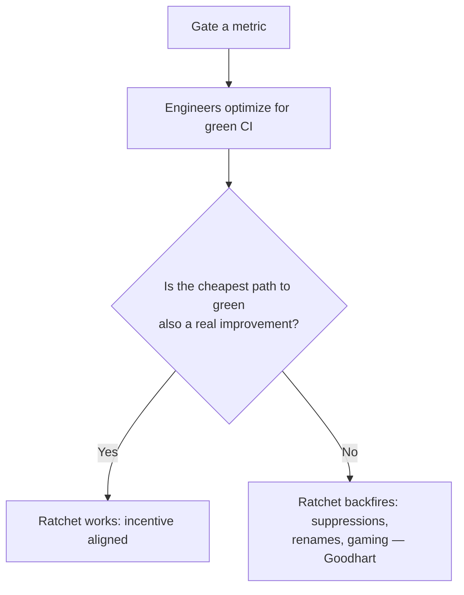
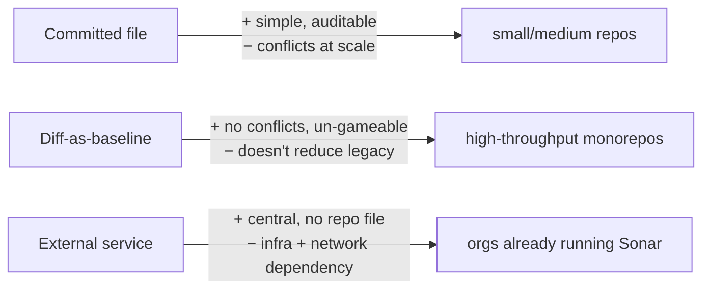
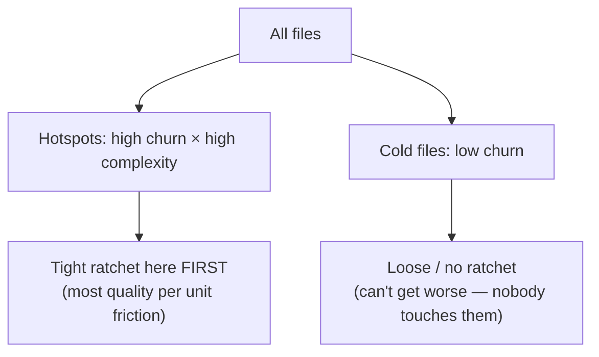
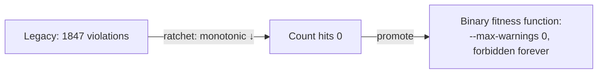

# Anti-Pattern Budgets & Ratcheting — Senior

> **Category:** [Anti-Patterns at Scale](../README.md) → **Anti-Pattern Budgets & Ratcheting** — *make the metric monotonically improve: stop the bleeding while you clean up legacy.*
> **Covers (collectively):** Baseline-and-ratchet · "No new violations" gates · Per-area debt budgets · Ratchet tooling · Failing the build on regression

---

## Table of Contents

1. [Introduction](#introduction)
2. [Prerequisites](#prerequisites)
3. [Choosing a Metric That Isn't Gameable](#choosing-a-metric-that-isnt-gameable)
4. [Where the Baseline Lives — and Why It Decides Everything](#where-the-baseline-lives--and-why-it-decides-everything)
5. [Surviving Merges and Rebases](#surviving-merges-and-rebases)
6. [Ratcheting the Hotspots First](#ratcheting-the-hotspots-first)
7. [A Ratchet Is a Fitness Function Over a Count](#a-ratchet-is-a-fitness-function-over-a-count)
8. [Rollout Playbook for a Large Legacy Codebase](#rollout-playbook-for-a-large-legacy-codebase)
9. [Combining with Incremental Strict-Mode Adoption](#combining-with-incremental-strict-mode-adoption)
10. [Common Mistakes](#common-mistakes)
11. [Test Yourself](#test-yourself)
12. [Cheat Sheet](#cheat-sheet)
13. [Summary](#summary)
14. [Further Reading](#further-reading)
15. [Related Topics](#related-topics)

---

## Introduction

> Focus: **Rolling out a ratchet across a large legacy codebase.** Pick a metric that can't be gamed, decide where the baseline lives, survive merges and rebases, ratchet the hotspots first, and see the ratchet for what it is — a fitness function over a count.

`middle.md` taught you to operate one ratchet on one metric. At senior level you're standing in front of a **2-million-line monorepo, 40 teams, 600 PRs a week**, and someone has asked you to "improve code quality." A naïve ratchet here dies in a week: the baseline file conflicts on every merge, teams game the metric within a sprint, the build is red for reasons nobody can fix, and the whole initiative gets quietly switched off.

The senior skills are the ones that make a ratchet *survive contact* with a large organization and a long timeline:

1. **Metric choice** — pick something that improves quality when you drive it down, and that can't be trivially gamed.
2. **Baseline mechanics at scale** — where the file lives, how it survives hundreds of concurrent merges and rebases, and how to keep it from becoming a merge-conflict magnet.
3. **Prioritization** — you can't ratchet everything; ratchet the *hotspots* (the files that change constantly) first, because that's where the bleeding actually costs money.
4. **The unifying frame** — a ratchet is just a [fitness function](../01-architecture-fitness-functions/senior.md) whose metric is a count and whose target is "monotonically non-increasing." Seeing it that way connects it to your whole quality-enforcement strategy.

> **The mental model:** at scale you are not enforcing a rule, you are deploying an *incentive*. Whatever you gate becomes the thing engineers optimize — so the entire game is choosing a gate where "the cheapest way to make CI green" is also "the codebase genuinely got better."

---

## Prerequisites

- **Required:** [`middle.md`](middle.md) — baselines, auto-tightening, per-directory budgets, `betterer` / `--max-warnings` / new-code gates.
- **Required:** Fluent with git internals enough to reason about three-way merges, rebases, and why a particular file format conflicts (or doesn't).
- **Required:** You've owned a CI pipeline for a multi-team repo and felt the cost of a flaky or globally-red build.
- **Helpful:** Familiarity with [hotspot analysis](../03-hotspot-analysis/senior.md) (churn × complexity) and [architecture fitness functions](../01-architecture-fitness-functions/senior.md) — this topic sits between them.
- **Helpful:** Goodhart's law and incentive design (the gaming discussion goes deeper in `professional.md`).

---

## Choosing a Metric That Isn't Gameable

A ratchet is an incentive. Engineers under deadline pressure will find the *cheapest* way to make the gate pass — so the metric must be one where the cheapest way is also the *right* way. A metric is **gameable** when there's a way to lower the count without improving the code.

| Tempting metric | How it's gamed | Better metric |
|---|---|---|
| **Total lines of code** | Split a file in two; minify; one-line everything | Doesn't measure quality at all — never ratchet LOC |
| **Lint warnings** | Add `// eslint-disable` to silence, not fix | Count warnings **plus suppressions** (disable comments) together |
| **`@ts-ignore` count** | Replace with `@ts-expect-error` or `any` casts | Count *all* type-escape hatches (`@ts-ignore`, `@ts-expect-error`, `as any`, `any`) |
| **Test count** | Add empty/trivial tests | Mutation score or coverage of *changed* lines, not test count |
| **Cyclomatic complexity total** | Move complexity into a helper that's also counted... or isn't | Per-function complexity over a threshold, counting helpers too |
| **TODO comments** | Rename `TODO` → `FIXME` → `NOTE` | Count the full family of debt markers |

The governing principle is **Goodhart's law**: *"When a measure becomes a target, it ceases to be a good measure."* You can't escape it entirely — anything you gate gets gamed *somewhat* — but you can choose metrics where gaming is harder than fixing:

- **Count the escape hatches, not just the violations.** If silencing a warning is cheaper than fixing it, count the silences too. The ratchet should make *hiding* a violation cost the same as *adding* one.
- **Prefer "new code is clean" over "total count."** Gating the *diff* (SonarQube/Code Climate new-code gate) is far harder to game than a global count, because there's no legacy pool to swap against — you can't fix an old violation to "pay for" a new one. The diff has no slack.
- **Prefer per-violation snapshots over bare counts.** `betterer`'s hashed `.betterer.results` defeats the "fix X, add Y, count unchanged" swap that a bare count permits.



> **Senior heuristic:** before you ratchet a metric, spend ten minutes being the adversary. *"If I had to make this number go down by Friday and didn't care about quality, what would I do?"* If your answer is fast and harmful, fix the metric (count the escape hatches, gate the diff) before you ship the gate.

---

## Where the Baseline Lives — and Why It Decides Everything

The storage choice for the baseline is not plumbing — it determines whether the ratchet survives at scale. Three options, with real trade-offs:

**1. A committed file in the repo** (`.betterer.results`, `.baseline`).
- ✅ Travels with the branch; review sees every change; no extra infrastructure; works offline.
- ❌ **Merge-conflict magnet** in a high-throughput monorepo — every PR that changes the count touches the same file (see next section). This is the single biggest operational pain.

**2. No baseline — gate the diff** (SonarQube new-code, Code Climate, a custom "lint only changed lines" script).
- ✅ **No file to conflict.** The PR's own diff is the baseline; nothing is persisted between PRs.
- ✅ Inherently un-gameable by swapping (no legacy pool to trade against).
- ❌ Doesn't *drive down* legacy on its own — it only stops new bleeding. You need a separate mechanism (Boy-Scout cleanup, scheduled hotspot work) to reduce the existing count.
- ❌ Needs reliable "which lines are new" detection (merge-base diff), which is fiddly across rebases and squashes.

**3. An external service / database** (SonarQube server stores the project's quality state).
- ✅ No file in the repo; central dashboards; cross-PR history.
- ❌ Another system to run and keep available; the gate now depends on a network call; harder to reproduce locally.



> **The senior call:** in a low-volume repo, a committed file is simplest and best. In a 600-PR/week monorepo, the committed-file conflict tax usually pushes you toward **diff-based gating for new code** plus a **separate scheduled mechanism** (or per-hotspot ratchets, below) to grind down legacy. Match the storage to the merge throughput.

---

## Surviving Merges and Rebases

The committed-baseline ratchet has one notorious failure mode at scale: **the baseline file conflicts on almost every merge.** Two PRs both improve the count, both rewrite `.baseline` from `1847` to a different lower number, and now they conflict — or worse, the merge "resolves" to the wrong number and silently loosens the ratchet.

How the good tools and good designs handle it:

- **Hash each violation instead of storing a bare number.** `betterer`'s `.betterer.results` is a structured map keyed by file + a hash of the offending code, not a single integer. Two PRs fixing *different* violations touch *different* keys, so they don't conflict — the merge cleanly contains both fixes. A bare-count file, by contrast, conflicts whenever two PRs change the count, because they edit the same line. *(The mechanics of these conflicts and their resolution are covered in depth in [`professional.md`](professional.md).)*
- **Recompute, don't merge.** Treat the baseline as a *derived artifact*: on merge to main, **regenerate** it from the merged code rather than three-way-merging two stale baselines. A post-merge CI job recomputes and commits the authoritative baseline. The in-PR baseline is advisory; the post-merge recompute is the source of truth.
- **Gate the diff, store nothing.** The new-code gate sidesteps the whole problem — there's no file to conflict because the baseline is recomputed from each PR's merge-base on the fly.

> **Rule of thumb:** *if your baseline is a single number in a file and your repo does more than a few dozen PRs a day, you will spend more time resolving baseline conflicts than fixing violations.* Move to per-violation hashing (betterer) or diff-based gating before that happens.

---

## Ratcheting the Hotspots First

You cannot ratchet every metric in every directory on day one — the build would be red everywhere and teams would revolt. Prioritization is a senior responsibility, and the right priority order comes from **[hotspot analysis](../03-hotspot-analysis/senior.md)**.

A hotspot is a file (or area) with **high churn × high complexity** — it changes constantly *and* it's gnarly. That intersection is where bad structure costs the most, because every change is expensive and risky. So:

> **Ratchet the hotspots first.** Freezing the count of complexity / warnings / escape-hatches in the files that change every week buys you the most quality-per-unit-of-friction. Freezing the count in a file nobody touches buys you nothing — it can't get worse anyway.

Concretely, derive your initial budget map from git history:

```bash
# Rank files by change frequency over the last year (churn).
git log --since='1 year ago' --name-only --pretty=format: \
  | grep -E '\.(go|ts|java)$' | sort | uniq -c | sort -rn | head -20
```

Cross that churn ranking with a complexity measure (lizard, gocyclo, `radon cc`), and the top of the list is where your first ratchets go. The cold, stable files can wait — or get a loose budget that essentially says "just don't make these worse," since they rarely change anyway.



This is the synthesis of three at-scale topics: **hotspot analysis** tells you *where*, the **ratchet** stops it getting worse, and (when you're ready to drive it down) **[automated refactoring](../04-automated-large-scale-refactoring/senior.md)** bulk-fixes the hotspot and drops the baseline by hundreds at once.

---

## A Ratchet Is a Fitness Function Over a Count

Step back and the ratchet snaps into a larger frame. An **[architecture fitness function](../01-architecture-fitness-functions/senior.md)** is any automated test that asserts a system characteristic (e.g. "domain never imports infrastructure," "p99 latency < 200ms," "no cycles in the dependency graph"). Fitness functions come in two flavors:

- **Binary / absolute:** the characteristic holds or it doesn't. *"There are zero import cycles."* Pass/fail.
- **Monotonic / ratcheting:** the characteristic is *improving and never regressing*. *"The number of import cycles is ≤ what it was, trending to zero."*

A ratchet is exactly the second kind — **a fitness function whose metric is a count and whose acceptance criterion is "monotonically non-increasing."** This isn't a pedantic re-labeling; it's a useful unification:

- It tells you **when to use which.** New, greenfield constraints get a *binary* fitness function (zero from day one — there's no legacy). Constraints you're retrofitting onto legacy get a *ratcheting* one (you can't demand zero, so you demand "no worse, trending down"). The ratchet is the fitness function you use *when binary-zero is currently unachievable.*
- It tells you the **end state**: a ratchet's job is finished when the count reaches zero, at which point you **promote it to a binary fitness function** (`--max-warnings 0`, "zero cycles") that simply forbids the violation forever. The ratchet is the on-ramp; the binary gate is the destination.



> **The senior framing to take to architecture reviews:** *"We have one fitness-function strategy. Where we're at zero, it's a binary gate. Where we have legacy debt, it's a ratchet driving toward zero, after which it becomes a binary gate."* One model, two phases.

---

## Rollout Playbook for a Large Legacy Codebase

A sequence that has survived contact with real monorepos:

1. **Pick one metric, pick the hotspots.** Don't boil the ocean. One high-value, hard-to-game metric (e.g. type-escape-hatches, or new-code lint cleanliness), applied first to the churniest files.
2. **Be the adversary.** Spend the ten minutes gaming your own metric. Count escape hatches; prefer diff-gating. Fix the metric *before* rollout.
3. **Measure the baseline and make the build green at it.** The very first run must be **green** — the gate must never start red, or it's dead on arrival. The baseline *is* whatever exists today.
4. **Gate non-blocking first, then blocking.** Run the ratchet as an informational check for a week so teams see it and trust it, then flip it to required. A gate that surprises people by blocking on day one breeds resentment.
5. **Choose storage for your throughput.** Low volume → committed file. High volume → diff-based new-code gate (+ per-hotspot ratchets for legacy). Never a bare-count file in a high-merge monorepo.
6. **Enforce the monotonic invariant.** Add the "baseline must not rise" check so nobody quietly loosens the ratchet.
7. **Drive it down deliberately.** The ratchet *stops the bleeding*; it doesn't heal. Pair it with Boy-Scout cleanup and scheduled hotspot work (and, when the metric is mechanical, [automated refactoring](../04-automated-large-scale-refactoring/senior.md) to drop the baseline by hundreds in one PR).
8. **Promote to binary at zero.** When a metric's count reaches zero, replace the ratchet with an absolute gate so it can never come back.

> **The political reality:** a ratchet succeeds or fails on whether teams *trust* it. A flaky count, a globally-red build for an unfixable reason, or a baseline that mysteriously rose erodes that trust fast. Start small, start green, start non-blocking — earn the right to make it required.

---

## Combining with Incremental Strict-Mode Adoption

A particularly powerful ratchet pattern: adopting a *stricter compiler/checker mode* on a legacy codebase that can't pass it everywhere yet. TypeScript `strict`, Python's `mypy --strict`, Go's stricter `vet`/lint passes, Rust clippy levels — all have the same shape: turning them on globally yields thousands of errors at once (unreachable zero-gate), but you can ratchet adoption **file by file**.

Two complementary techniques:

- **Per-file opt-in, ratchet the opt-out list.** Enable strict globally, then maintain a baseline list of files *excluded* from strict checking. The ratchet's metric is the **length of the exclusion list** — it can only shrink. Every PR that makes a file strict-clean removes it from the list; nothing may add to it.

```jsonc
// betterer-style: the metric is "files still NOT strict". It only goes down.
{
  "'shrink the non-strict file list'":
    "typescript('./tsconfig.strict.json').include('./src/**/*.ts')"
}
```

- **Ratchet the error *count* under strict.** Alternatively, turn strict on, count the resulting errors (say 4,200), baseline that, and ratchet the count toward zero — at which point you promote to `strict: true` with no exclusions (the binary gate).

Both turn an impossible flag-day migration ("make 2M lines strict-clean overnight") into a monotonic grind that any PR can advance and none can reverse — the exact value proposition of the whole topic, applied to the highest-leverage quality lever a typed language offers.

---

## Common Mistakes

Senior-level mistakes — the ones that kill a ratchet initiative rather than just annoy one team:

1. **Ratcheting a gameable metric.** LOC, raw warning count (silenceable), test count — engineers optimize the number, not the quality. Count the escape hatches and prefer diff-gating; be the adversary before you ship.
2. **A bare-count baseline file in a high-throughput monorepo.** It conflicts on nearly every merge and silently mis-resolves to the wrong number. Use per-violation hashing (betterer) or diff-based gating, or recompute post-merge.
3. **Comparing against `main`'s tip instead of the merge-base.** A PR gets blamed for violations introduced *after* it branched. Always diff against the merge-base.
4. **Starting red, blocking, and everywhere at once.** The fastest way to get a ratchet disabled. Start green, non-blocking, on the hotspots — earn required-status.
5. **Treating the ratchet as the cure.** It stops the bleeding; it does not heal. With no deliberate downward pressure (Boy-Scout + scheduled hotspot + automated refactoring), the count freezes forever at the baseline.
6. **Ratcheting cold files.** Freezing the count in files nobody touches buys nothing — they can't regress anyway. Spend your friction budget on hotspots.
7. **Never promoting to binary.** A metric that reaches zero but stays a ratchet can silently regress one day. At zero, swap to an absolute gate (`--max-warnings 0`).
8. **Forgetting the "baseline can't rise" guard.** Without it, the easiest way to make a red build green is to bump the baseline — quietly converting your ratchet into a no-op.

---

## Test Yourself

1. You're about to ratchet "total lines of code." Give two ways an engineer makes that number go down without improving anything, and name the law this illustrates.
2. Why is a bare-count baseline file a serious operational problem in a 600-PR/week monorepo, and what two designs avoid it?
3. A PR is failing the ratchet for violations it didn't introduce — they appeared on `main` after the branch was cut. What's the comparison-point bug, and what's the fix?
4. You can ratchet only a handful of areas first. Which do you pick, and what git-history signal drives that choice?
5. In what precise sense is a ratchet "a fitness function"? What does that frame tell you about a ratchet's *end state*?
6. You want to make a 2M-line TS codebase `strict`-clean. Turning `strict: true` on globally yields 4,200 errors. Describe two ratchet shapes that get you there incrementally.
7. Your team lead says "let's count warnings." You note the linter lets people write `// eslint-disable`. What do you change about the metric and why?

---

## Cheat Sheet

| Senior concern | The move |
|---|---|
| **Un-gameable metric** | Count escape hatches too; prefer diff-gating; be the adversary first |
| **Baseline at scale** | Low volume → committed file; high volume → diff/new-code gate + per-hotspot ratchets |
| **Merge conflicts** | Per-violation hashing (betterer) or recompute post-merge; never a bare-count file in a busy monorepo |
| **Comparison point** | Diff against the **merge-base**, not `main`'s tip |
| **Where to start** | Hotspots first (churn × complexity); skip cold files |
| **The frame** | Ratchet = fitness function over a count, target "monotonic ↓" |
| **End state** | At zero, **promote** to a binary gate (`--max-warnings 0`) |
| **Rollout** | Start **green**, **non-blocking**, on **hotspots**; earn required-status |
| **Strict adoption** | Ratchet the exclusion list *or* the error count toward zero |

> **One rule to remember:** *Whatever you gate becomes what engineers optimize — so make the cheapest path to green also the genuinely-cleaner codebase, and ratchet hardest where the code changes most.*

---

## Summary

- At scale a ratchet is an **incentive, not a rule**: engineers will take the cheapest path to a green build, so the entire skill is choosing a metric where the cheapest path is also a real improvement.
- **Pick an un-gameable metric.** LOC and silenceable warning counts get gamed (Goodhart). Count the **escape hatches** alongside violations, prefer **per-violation snapshots** (betterer) and **diff/new-code gating** (no legacy pool to swap against). Be the adversary before you ship.
- **Baseline storage decides survival.** A committed file is simplest but a **merge-conflict magnet** at high throughput; diff-based gating stores nothing and can't be swap-gamed but doesn't reduce legacy on its own; an external service centralizes at the cost of infra. Match storage to merge volume.
- **Survive merges** by hashing each violation (so different fixes don't conflict) or recomputing the baseline post-merge, and always compare against the **merge-base**, not `main`'s tip.
- **Ratchet the hotspots first** — high churn × complexity, found from git history — because that's where stopping the bleeding buys the most quality per unit of friction. Cold files can't regress anyway.
- A ratchet **is a fitness function over a count** with a "monotonic ↓" target. New constraints get a *binary* gate (zero from day one); legacy constraints get a *ratchet* that drives to zero and is then **promoted** to a binary gate.
- The same shape powers **incremental strict-mode adoption**: ratchet the exclusion list or the error count toward zero, turning an impossible flag-day migration into a monotonic grind any PR can advance.
- This completes the strategic view. Next: [`professional.md`](professional.md) — *implementation and failure modes: baseline-file merge conflicts, race conditions, monorepo budgets, statistical noise, recompute performance, and when a ratchet entrenches a bad metric.*

---

## Further Reading

- **Building Evolutionary Architectures** — Ford, Parsons, Kua (2nd ed. 2022) — fitness functions, including monotonic/ratcheting ones; the frame this section builds on.
- **"Goodhart's Law"** — Marilyn Strathern's formulation ("when a measure becomes a target…") — the metric-gaming reality every ratchet lives under.
- **Your Code as a Crime Scene** / **Software Design X-Rays** — Adam Tornhill — churn × complexity hotspots, the prioritization input for *what to ratchet first*.
- **`betterer` documentation** — per-violation hashing in `.betterer.results`, the merge-friendly baseline format.
- **SonarQube "Clean as You Code"** — the new-code (diff-as-baseline) gate at organizational scale.

---

## Related Topics

- [Architecture Fitness Functions](../01-architecture-fitness-functions/senior.md) — the general frame; a ratchet is the monotonic-over-a-count special case.
- [Hotspot Analysis](../03-hotspot-analysis/senior.md) — churn × complexity tells you *which* area to ratchet first.
- [Automated Large-Scale Refactoring](../04-automated-large-scale-refactoring/senior.md) — bulk-fix a metric and drop the baseline by hundreds in one PR.
- Clean Code → The Boy-Scout Rule — the opportunistic downward pressure that complements the ratchet's floor.
- Clean Code → Modules and Packages — the boundaries per-area budgets and ownership attach to.
- [Bad Shortcuts → Senior](../../01-development/02-bad-shortcuts/senior.md) — the compounding debt a ratchet is deployed to contain.
- Architecture → Anti-Patterns — the organizational dimension of managing debt as a budget.

---

## Check your understanding

1. Explain Anti-Pattern Budgets & Ratcheting — Senior Level in your own words and name the problem it solves.
2. How would you apply the ideas around Table of Contents, Introduction, Prerequisites in a realistic engineering change?
3. What failure mode or misuse should you look for, and what evidence would reveal it?
4. How would you validate a system-level decision about Anti-Pattern Budgets & Ratcheting — Senior Level under uncertainty?
5. What observable result would convince you that the approach improved the system?
