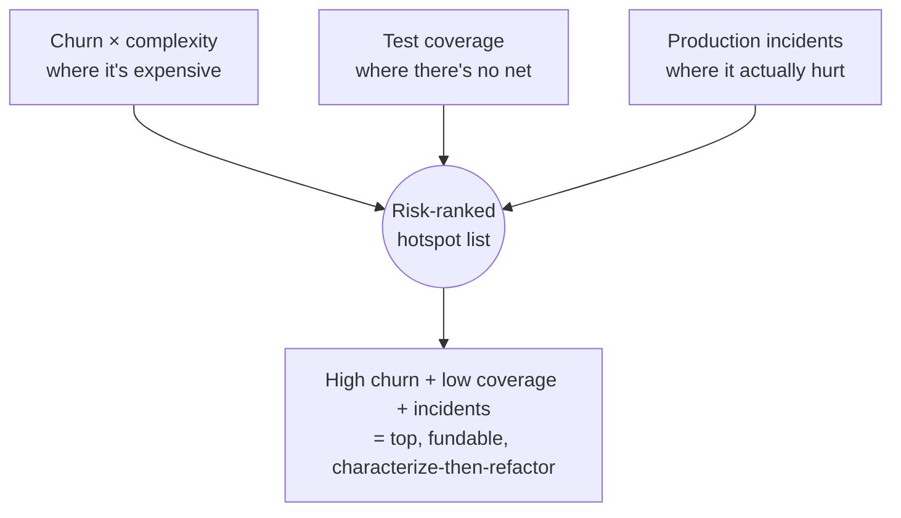

# Hotspot Analysis — Professional

> **Category:** [Anti-Patterns at Scale](../README.md) → **Hotspot Analysis** — *use git history to find the few files where complexity and change frequency collide — that is where anti-patterns actually cost money.*
> **Covers (collectively):** Churn × complexity · Code-as-a-crime-scene · Change / temporal coupling · Knowledge maps & bus factor · Defect-density prioritization

---

## Table of Contents

1. [Introduction](#introduction)
2. [Prerequisites](#prerequisites)
3. [Mining Huge, Long-Lived Repos](#mining-huge-long-lived-repos)
4. [The Normalization Pitfalls That Skew Churn](#the-normalization-pitfalls-that-skew-churn)
5. [Filtering: What to Exclude Before You Rank](#filtering-what-to-exclude-before-you-rank)
6. [Statistical Care: Confidence, Windows, Normalization](#statistical-care-confidence-windows-normalization)
7. [Combining Hotspots with Coverage and Production Incidents](#combining-hotspots-with-coverage-and-production-incidents)
8. [Automating a Hotspot Dashboard](#automating-a-hotspot-dashboard)
9. [The Limits: When Churn Is Not Badness](#the-limits-when-churn-is-not-badness)
10. [Common Mistakes](#common-mistakes)
11. [Test Yourself](#test-yourself)
12. [Cheat Sheet](#cheat-sheet)
13. [Summary](#summary)
14. [Further Reading](#further-reading)
15. [Related Topics](#related-topics)

---

## Introduction

> Focus: **Scaling and rigor.** Mining a 15-year, million-commit monorepo without the answer being dominated by renames, vendored code, and bulk-format commits; treating churn as a *noisy statistic* not a verdict; fusing it with coverage and real incidents; automating a dashboard; and respecting the hard limit — *churn alone is never badness.*

`senior.md` gave you the metrics: churn × complexity, temporal coupling, defect coupling, and a prioritized backlog. Those scripts work beautifully on a clean 50k-commit service. Run them unchanged on a 15-year, multi-language monorepo with two large reformatting events, a `vendor/` tree, three mass-renames, and a `git filter-repo` rewrite in its past, and the top of your ranking will be *garbage* — `vendor/jquery.min.js`, a generated `*.pb.go`, and whatever file the 2021 Prettier migration touched.

The professional skill is making the analysis **survive reality**: the history of a real long-lived codebase is full of events that have nothing to do with the difficulty of changing code but that *look exactly like churn*. Get the normalization and filtering wrong and you'll confidently point a refactoring team at the wrong files — worse than having no data, because it's *credible*-looking wrong data.

This level is about defending the analysis against three threats: **scale** (it must run on huge histories), **noise** (renames, vendoring, bulk commits, bots), and **misinterpretation** (churn is a signal, not a verdict — a config file legitimately churns forever). Get those right and a hotspot dashboard becomes a standing instrument the whole org trusts.

> **The mindset shift:** at this scale you are doing **observational data science on a messy log**, not running a clever git command. The result is only as good as the cleaning, the controls, and the humility about what the number does and does not mean.

---

## Prerequisites

- **Required:** [`senior.md`](senior.md) — you can compute churn × complexity, temporal coupling (degree + support), and defect density, and assemble a prioritized backlog.
- **Required:** Comfortable with `git` plumbing on large repos: `--follow`, `--find-renames`, `--numstat`, `.mailmap`, shallow/partial clones, and the cost of full-history traversal.
- **Required:** Enough statistics to reason about sampling windows, percentiles, normalization, and "is this difference signal or noise?" — you won't compute p-values, but you must not be fooled by raw counts.
- **Helpful:** You've operated a metrics pipeline (a scheduled job writing to a time-series store / dashboard) and understand incident data (a tracker, on-call/SRE postmortems, deploy logs).
- **Helpful:** Familiarity with `code-maat`/CodeScene from `senior.md` — this file is partly "what those tools do that your script doesn't, and why."

---

## Mining Huge, Long-Lived Repos

On a million-commit history, naive full traversal is slow and memory-hungry. Practical techniques:

- **Bound by time first, always.** A rolling window (e.g., 12 months) both improves relevance *and* slashes the data: `--since` lets git stop walking early. Never analyze full history by default on a large repo.

```bash
# Only walk the window; --since prunes the traversal, not just the output.
git log --since='12 months ago' --no-merges --numstat --format='%x00%H' -- . \
  > window.log
```

- **Stream, don't slurp.** Parse the log as a stream (line by line / commit-block by commit-block) rather than loading it all into memory. The `senior.md` scripts build dictionaries incrementally — that scales; reading the whole `git log` into one string does not on a huge repo.

- **Restrict paths early.** If you only care about `services/payments/`, pass it as a pathspec (`-- services/payments/`) so git filters during traversal instead of you filtering after.

- **Use `--numstat` once and derive both metrics.** A single `--numstat --name-only`-style pass gives you commit-touch churn *and* line churn *and* the file sets for coupling — don't traverse history three times.

- **Watch the coupling cost.** Pairwise coupling is O(files²) *per commit*; a few giant commits dominate runtime and memory. The `MAX_FILES_PER_COMMIT` cap from `senior.md` is a performance control as much as a correctness one.

- **Cache the parsed log.** History before yesterday doesn't change. Persist the parsed per-commit data (e.g., to Parquet/SQLite) and append only new commits on each run. A daily dashboard should parse *one day* of new history, not re-walk 12 months.

> Rule of thumb: if your analysis re-reads the entire history on every run, it won't survive contact with a real monorepo. Window it, stream it, and incrementally cache it.

---

## The Normalization Pitfalls That Skew Churn

These are the events in a real history that *masquerade as churn* and will sit at the top of an un-cleaned ranking. Each needs an explicit normalization.

### 1. Renames and moves break file identity

Churn is "how often *this file* changed" — but a rename makes git see a delete + an add, splitting one file's history into two and *resetting* its churn count. Move a hot file into a new directory and it drops off your ranking entirely; the new path looks brand-new and calm.

```bash
# Follow a single file across renames so its churn isn't split.
git log --follow --format= --name-only -- src/payments/gateway.py | wc -l

# Repo-wide: ask git to detect renames so churn aggregates to the new path.
git log --find-renames=40% --numstat --format='%x00%H' --since='12 months ago'
```

`--follow` works for *one* path; for a whole-repo ranking you need `--find-renames` (or `-M`) so the rename is recorded as a rename, then aggregate churn onto the *current* path. CodeScene/code-maat handle this; a naive script silently mis-ranks every recently-moved file.

### 2. Bulk-format commits inflate everyone

A single "run Prettier / gofmt / clang-format on the whole repo" commit touches thousands of files and adds/deletes millions of lines — none of it meaningful change. It spikes *line* churn enormously and adds one commit-touch to *every* file, and (as `senior.md` warned) fabricates O(n²) temporal coupling.

```bash
# Find suspiciously broad commits (candidates to exclude from churn).
git log --since='3 years ago' --format='%H %s' --shortstat \
  | awk '/files? changed/ { if ($1+0 > 200) print prev, "->", $1, "files"; }
         { prev=$0 }'
```

The fix is to maintain an **exclude-list of bulk commits** (formatting migrations, license-header sweeps, mass dependency bumps) and skip them. Git even supports this natively for blame:

```bash
# Record bulk-format commit SHAs here; git blame ignores them.
echo "a1b2c3d4...  # repo-wide gofmt, 2024-03" >> .git-blame-ignore-revs
git config blame.ignoreRevsFile .git-blame-ignore-revs
```

Reuse that same ignore-list in your churn/coupling pipeline.

### 3. Vendored, generated, and minified code

`vendor/`, `node_modules/` (if committed), `*.min.js`, generated `*.pb.go`/`*_pb2.py`, lockfiles, and snapshots all churn and are large — perfect false hotspots — but you will never refactor them. They are not *your* code's complexity.

`.gitattributes` already marks much of this as `linguist-generated`/`linguist-vendored`; reuse that classification, and exclude generated paths explicitly.

### 4. Author identity fragmentation

For ownership / bus-factor analysis, the same human appears as "Jane Doe", "jdoe", "Jane D." across years and machines, splitting their ownership and *understating* bus-factor risk. Normalize with `.mailmap`:

```
# .mailmap — collapse identities so ownership/bus-factor is accurate.
Jane Doe <jane@corp.com> <jdoe@laptop.local>
Jane Doe <jane@corp.com> Jane D. <jane.d@old-corp.com>
```

### 5. Bot and automation commits

Dependabot, release bots, auto-formatters, and merge-queue commits add churn that isn't human effort. Filter by author (`--author`, or an exclude-list of bot emails) before computing churn or ownership, or bots will look like your most active "developers" and busiest files.

```bash
git log --since='12 months ago' --perl-regexp \
  --author='^(?!.*(dependabot|renovate|github-actions)).*$' \
  --format= --name-only | sort | uniq -c | sort -rn
```

---

## Filtering: What to Exclude Before You Rank

Pull the normalizations above into one explicit, version-controlled filter config so the analysis is reproducible and reviewable:

```yaml
# hotspots.yaml — the filter contract for the whole pipeline.
window: "12 months ago"
exclude_paths:
  - "vendor/**"
  - "node_modules/**"
  - "**/*.min.js"
  - "**/*.pb.go"
  - "**/*_pb2.py"
  - "**/generated/**"
  - "**/*.lock"
  - "**/*.snap"
exclude_commits_file: ".git-blame-ignore-revs"   # bulk reformat/license/migration SHAs
exclude_authors: ["dependabot[bot]", "renovate[bot]", "github-actions[bot]"]
max_files_per_commit: 25       # drop bulk commits from coupling AND churn
min_support: 8                 # coupling trust floor
rename_detection: "--find-renames=40%"
mailmap: true
source_extensions: [".py", ".go", ".java", ".ts", ".tsx", ".kt", ".rb", ".rs"]
```

> Make the filter **explicit and reviewed**, never ad-hoc. The exclude-list *is* the analysis: a reviewer who disagrees with your hotspot ranking should be able to read `hotspots.yaml`, see exactly what was dropped and why, and challenge it. An un-filtered ranking and a silently-filtered ranking are both untrustworthy; a *declared* filter is auditable.

A useful discipline: every excluded path/commit gets a one-line reason. "We dropped `vendor/`" is fine; "we dropped `src/orders/`" had better have a very good reason, because excluding *source* is how a ranking gets quietly gamed.

---

## Statistical Care: Confidence, Windows, Normalization

At scale, raw counts mislead. Treat the metrics as noisy samples.

### Support and confidence, not raw degree

(From `senior.md`, sharpened.) A coupling degree of 1.0 from 2 commits and 0.7 from 90 commits are not comparable. Require minimum support, and prefer ranking by a *lower confidence bound* than by the point estimate — the same reason you'd rank products by a Wilson score, not raw "100% positive (1 review)". A simple, robust version: discard pairs below `min_support`, then rank survivors by degree. A rigorous version: compute a confidence interval on the degree and rank by its lower bound, so high-support pairs outrank lucky low-support ones.

### Window choice is a parameter, not a default

The window encodes "what counts as *currently* expensive." Run **two windows** and compare:

- **Long (12–24 months):** structural, stable hotspots — the chronic problems.
- **Short (90 days):** what's hot *now* — emerging hotspots and the effect of recent work.

A file high in *both* is a chronic, still-active hotspot (top priority). High in long-only is cooling (maybe you already fixed it). High in short-only is *emerging* — catch it before it calcifies. The *delta* between windows is often more actionable than either window alone.

### Normalize complexity across languages

In a polyglot repo, raw LOC isn't comparable: 200 lines of Go ≠ 200 lines of Python ≠ 200 lines of Terraform. For a cross-language ranking, normalize each axis to **percentiles within its language** (or use a language-aware cyclomatic tool like `lizard`), then combine. Otherwise the most verbose *language* dominates the ranking rather than the most complex *code*.

### Beware survivorship and recency bias

Deleted files vanish from the ranking — but a file that was so painful it got rewritten *was* a hotspot; its lesson is gone from a current-state snapshot. And recent commits are over-represented in a short window simply because the team happened to work there this sprint. The window controls recency; nothing controls survivorship except remembering it exists.

> **Discipline:** never present a single number as a verdict. Present *churn + complexity + support + window* together, the way `senior.md` insisted you read raw columns next to a score — and say which window produced it.

---

## Combining Hotspots with Coverage and Production Incidents

Churn × complexity tells you where it's *expensive to change*. Fusing two more data sources tells you where it's *dangerous*, which is what actually justifies the work to a business.

### Hotspot × test coverage = the danger zone

A hotspot you edit constantly **and** that has *low* test coverage is the highest-risk code in the system: frequent change with no safety net. Join coverage (from your coverage report) onto the hotspot ranking:

| File | Churn | Complexity | Coverage | Verdict |
|---|---:|---:|---:|---|
| `payments/gateway.py` | 214 | high | **31%** | **Danger zone — refactor *and* add tests first** |
| `orders/service.py` | 97 | high | 88% | Hot but covered — safer to change |
| `legacy/report.py` | 6 | high | 12% | Low coverage but dormant — leave it |

Low coverage matters *only where churn is high*. The actionable cell is **high churn × high complexity × low coverage** — and the prescription is "characterize with tests *before* refactoring," exactly the safety-net order from the refactoring chapters.

### Hotspot × production incidents = the funded case

Link your incident/postmortem data (the files implicated in outages, the modules in SEV reports) to the hotspot ranking. A hotspot that also shows up in incident postmortems is no longer an aesthetic argument — it's "*this file was implicated in 4 of last quarter's 9 incidents*." That sentence funds a refactoring project; "this file is complex" does not.

```bash
# If postmortems reference the fixing commits, map incidents → files.
# (incidents.csv: incident_id, fix_commit_sha)
while IFS=, read -r incident sha; do
  git show --format= --name-only "$sha"
done < incidents.csv | sort | uniq -c | sort -rn | head
```



> The progression of justification: complexity → "ugly." + churn → "expensive." + low coverage → "dangerous." + incidents → "**costing us outages.**" Each layer makes the refactoring case harder to refuse, and the last one writes the funding ticket.

---

## Automating a Hotspot Dashboard

A one-off analysis ages out in a week. The professional deliverable is a **standing instrument**: a scheduled job that re-runs the (filtered, normalized) analysis and publishes trends.

A workable architecture:

1. **Scheduled job** (nightly CI cron) runs the pipeline against the latest history, reading `hotspots.yaml` for filters.
2. **Incremental parse + cache** — append only new commits to a stored, parsed history (SQLite/Parquet); don't re-walk 12 months nightly.
3. **Emit metrics to a time-series store** — per-file churn, complexity, coupling degree, coverage, with a timestamp, so you get *trends*, not snapshots.
4. **Dashboard** shows: top hotspots this window, biggest *movers* (files climbing fastest — your early warning), coupling pairs crossing module boundaries, and the danger-zone join (hot × low-coverage).
5. **Alert on regression**, tied to the ratchet from `senior.md`: if a baselined hotspot's complexity *increases*, or a new file enters the top-N, fail a check or open a ticket automatically.

```bash
# Skeleton of the nightly job (filters + analysis + publish).
hotspots analyze --config hotspots.yaml --format json > today.json
hotspots diff baseline.json today.json --fail-on-regression   # ratchet gate
hotspots publish today.json --to metrics-store                # trend data
```

The dashboard's most valuable view isn't the absolute ranking — it's the **trend**: which hotspots are cooling (your refactoring is working) and which are heating (intervene now). A static top-10 is a photo; the trend is the movie, and the movie is what informs decisions.

> CodeScene productizes exactly this (trends, X-rays, knowledge maps, automatic goals/alerts). Build the lightweight version yourself first so you know what the dashboard *means*; buy the tool when the analysis needs to be authoritative, multi-repo, and maintained by someone other than you.

---

## The Limits: When Churn Is Not Badness

The most important professional judgment: **churn is a signal, not a verdict, and high churn is frequently *correct*.** Treating the ranking as a list of "bad files" is the failure mode that discredits the whole technique.

Legitimately high-churn code that is **not** a problem:

- **Configuration and feature-flags.** A `feature_flags.yaml` or routing table that changes daily is doing its *job*. High churn, near-zero complexity — not a hotspot (the `senior.md` quadrant), and not badness even if complexity is moderate.
- **The active core of a healthy product.** The module implementing your most-iterated-on feature *should* churn — that's where the product is being built. High churn here means the team is delivering, not that the code is rotten. Refactoring it to "reduce churn" would be refactoring away your own velocity.
- **Files under deliberate, healthy refactoring.** A file churns while you're actively improving it. That's churn you *caused on purpose*; it'll subside.
- **Boundary/adapter files** that legitimately change whenever an external API does — the churn is imported from outside, not generated by bad internal structure.

The discriminator is always **complexity (and coverage and incidents) alongside churn**, never churn alone:

- High churn + **low** complexity → almost always fine (config, routes, flags).
- High churn + **high** complexity + **low** coverage + **incidents** → the real, fundable hotspot.
- High churn + high complexity + high coverage + no incidents → hot but *managed*; lower priority.

And even a true hotspot ranking only tells you **where to look**, never **what to do**. The number is a pointer into the code; the *diagnosis* (God Object? missing abstraction? brittle test?) and the *prescription* (extract, introduce a contract, characterize) still require reading the code and applying everything from the earlier anti-pattern and refactoring chapters.

> **The hard limit:** hotspot analysis is a *prioritization* instrument, not a *judgment* one. It answers "where is the cost concentrated?" with data. It does **not** answer "is this code bad?" or "what should change?" — and a team that forgets this will refactor its own config files and its own product velocity into oblivion while feeling rigorous about it.

---

## Common Mistakes

1. **Running the clean-repo scripts on a messy monorepo.** Without rename detection, bulk-commit exclusion, and vendored/generated filtering, the top of your ranking is `jquery.min.js` and the Prettier migration. Clean *first*, rank *second*.
2. **Ignoring renames.** `--follow`/`--find-renames` aside, a naive count resets churn on every move, so recently-relocated hot files vanish from the ranking. Aggregate churn onto the current path across renames.
3. **Letting bulk-format and bot commits count.** They inflate line churn, add a touch to every file, and fabricate coupling. Maintain `.git-blame-ignore-revs` + an author/bot exclude-list and reuse them across the whole pipeline.
4. **Ranking coupling by degree without support, or by raw count without confidence.** A 1.0 from 2 commits beats a 0.7 from 90 if you sort naively. Floor by support; ideally rank by a lower confidence bound.
5. **Comparing LOC across languages.** The most *verbose* language wins instead of the most *complex* code. Normalize per-language (percentiles or a language-aware cyclomatic tool).
6. **Hiding the filter.** A silently-filtered ranking is as untrustworthy as an un-filtered one. Put every exclusion in a reviewed, version-controlled config with a reason per line.
7. **Stopping at "it's complex."** The fundable case needs coverage and incident data fused in. "Hot × low-coverage × in 4 postmortems" funds the work; "complex" doesn't.
8. **Treating the ranking as a verdict on code quality.** High churn is often *correct* (config, the active product core). Always read complexity/coverage/incidents alongside churn; never refactor a file to "lower its churn."
9. **Shipping a one-off snapshot.** Hotspots move. Without a scheduled, trend-tracking dashboard you miss the most useful signal — what's *heating up* — and you re-do the analysis from scratch every quarter.
10. **Expecting the number to do the thinking.** It points; you diagnose and prescribe by reading the code with the earlier chapters' knowledge. The metric is a flashlight, not a fix.

---

## Test Yourself

1. You run the `senior.md` scripts unchanged on a 12-year monorepo and the top three "hotspots" are `vendor/lib.min.js`, a generated `*.pb.go`, and `package-lock.json`. List the normalizations/filters that would remove all three, and where you'd record them.
2. A formerly-hot file was moved into a new directory last month and has now disappeared from your churn ranking. What happened, and which git options fix it for (a) one file and (b) a whole-repo ranking?
3. Why does a single repo-wide `gofmt` commit corrupt *both* churn and temporal coupling, and what's the standard mechanism to neutralize it across your whole pipeline?
4. You have two coupling pairs: A–B (degree 1.0, support 2) and C–D (degree 0.7, support 90). Which is the more trustworthy structural fact and why? How should the ranking handle this beyond a `min_support` floor?
5. In a polyglot repo, your LOC-based complexity axis ranks Java and Terraform files far above Python ones. What's the bias and how do you correct it?
6. Give the four-layer escalation of *justification* for refactoring a file (ugly → … → fundable), naming the data source each layer adds.
7. A `feature_flags.yaml` is the single most-churned file in the repo, by a wide margin. Is it a hotspot? Give the rule that decides, and explain why "reduce its churn" would be the wrong goal.
8. Describe the minimum architecture for a hotspot *dashboard* (not a one-off run) and name the single most valuable view it provides. Why is incremental caching essential at scale?

---

## Cheat Sheet

| Threat | Symptom in the ranking | Normalization / fix |
|---|---|---|
| **Renames/moves** | Hot file vanishes after a move | `--follow` (one file) / `--find-renames` + aggregate to current path |
| **Bulk-format commits** | Everything churns; fake coupling everywhere | `.git-blame-ignore-revs` + `max_files_per_commit`; reuse in churn *and* coupling |
| **Vendored/generated** | `*.min.js`, `*.pb.go`, lockfiles top the list | exclude paths; reuse `.gitattributes` linguist flags |
| **Identity fragmentation** | Bus factor understated; ownership split | `.mailmap` |
| **Bots** | Dependabot is your "busiest dev" | exclude bot authors/emails |
| **Cross-language LOC** | Verbose language dominates | per-language percentiles or `lizard` (cyclomatic) |
| **Low support coupling** | 1.0 from 2 commits ranks #1 | `min_support` floor; rank by confidence lower bound |
| **Snapshot rot** | Last week's analysis is stale | scheduled job + incremental cache + **trend** view |

**Three golden rules:**
- *Clean before you rank — renames, bulk commits, vendored/generated code, and bots masquerade as churn; the filter config IS the analysis and must be reviewed.*
- *Churn is a noisy signal, never a verdict — present churn + complexity + coverage + incidents + window together, and rank coupling by support/confidence, not raw degree.*
- *Fuse coverage and incidents to make the case fundable, automate it as a trend dashboard tied to a ratchet — but remember the metric points, you diagnose.*

---

## Summary

- The `senior.md` metrics are correct but assume a clean history. On a huge, long-lived monorepo the answer is dominated by **noise** unless you normalize and filter first — an un-cleaned ranking confidently points at the wrong files, which is worse than no data.
- **Scale it** by windowing (`--since` prunes traversal), streaming the log, restricting paths, deriving all metrics from one pass, and **incrementally caching** parsed history so a daily run parses one day, not twelve months.
- **Normalize the pitfalls that masquerade as churn:** renames (`--follow`/`--find-renames`, aggregate to current path), bulk-format commits (`.git-blame-ignore-revs` + file-count cap), vendored/generated code (path + linguist excludes), author fragmentation (`.mailmap`), and bot commits (author excludes).
- **Make the filter explicit and reviewed** in a version-controlled config — the exclude-list *is* the analysis; a silently-filtered ranking is as untrustworthy as an un-filtered one, and excluding *source* is how a ranking gets gamed.
- **Apply statistical care:** rank coupling by support/confidence not raw degree; run long *and* short windows and watch the delta; normalize complexity per-language; stay aware of survivorship and recency bias. Never present one number as a verdict.
- **Fuse coverage and incidents:** hot × **low-coverage** is the danger zone (characterize-then-refactor); hot × **production incidents** is the *fundable* case. Justification escalates ugly → expensive → dangerous → costing-outages.
- **Automate a dashboard**, not a one-off: scheduled, incrementally cached, trend-tracking, with regression alerts tied to the ratchet. The trend (what's heating/cooling) beats any static ranking — and CodeScene productizes exactly this once you've understood it by hand.
- **Respect the hard limit:** churn is a signal, not badness. Config, flags, and the active product core *should* churn; only churn × complexity (× low coverage × incidents) is a real hotspot. The metric tells you *where to look*, never *what's wrong* or *what to do* — that's still your reading of the code with every earlier chapter's knowledge.
- This completes the level ladder for Hotspot Analysis: [`junior.md`](junior.md) (what a hotspot is) → [`middle.md`](middle.md) (compute churn × complexity yourself) → [`senior.md`](senior.md) (coupling + a prioritized backlog) → **professional.md** (scale, rigor, fusion, dashboards, and limits). Hotspot analysis is the targeting system for the rest of [Anti-Patterns at Scale](../README.md) — now aim the other techniques with it.

---

## Further Reading

- **Software Design X-Rays** — Adam Tornhill (2018) — scaling hotspot analysis, normalization, defect/coupling rigor, and the design of CodeScene's analyses.
- **Your Code as a Crime Scene** — Adam Tornhill (2nd ed. 2024) — the method end-to-end, including social/ownership analysis and the limits of the technique.
- **code-maat** — the open-source miner; its handling of renames, log formats, and multiple analyses is the reference implementation for "do it rigorously."
- **Accelerate** — Forsgren, Humble, Kim (2018) — why fusing code metrics with delivery/incident data is the credible way to argue for engineering investment.
- **The Visual Display of Quantitative Information** — Edward Tufte (2nd ed. 2001) — for designing a hotspot dashboard whose trends are honest and legible.
- **git documentation** — `git log --follow/--find-renames/--numstat`, `.mailmap`, `.git-blame-ignore-revs`, `gitattributes` (`linguist-generated`/`linguist-vendored`) — the plumbing this level depends on.

---

## Related Topics

- [Hotspot Analysis → Senior](senior.md) — the coupling and backlog metrics this file scales and hardens.
- [Hotspot Analysis → Middle](middle.md) — the churn × complexity scripts this file makes production-grade.
- [Architecture Fitness Functions](../01-architecture-fitness-functions/senior.md) — gate the dashboard's metrics so fixed hotspots can't regress.
- [Anti-Pattern Budgets & Ratcheting](../02-anti-pattern-budgets-and-ratcheting/senior.md) — baseline hotspot metrics and forbid regression; the dashboard's alerting layer.
- [Automated Large-Scale Refactoring](../04-automated-large-scale-refactoring/senior.md) — mechanically fix a hotspot the dashboard surfaces across many files.
- [Strangler-Fig & Seams](../05-strangler-fig-and-seams/senior.md) — replace a hotspot too dangerous (hot × low-coverage × incidents) to refactor in place.
- Refactoring → Code Smells — diagnose *what's wrong* with the file once the ranking points at it.
- [Coupling & State → Professional](../../02-design/02-coupling-and-state/professional.md) — the runtime/build cost of the coupling temporal analysis surfaces from history.
- Architecture → Anti-Patterns — the organizational view of the same costs the dashboard quantifies.

---

## Check your understanding

1. Explain Hotspot Analysis — Professional Level in your own words and name the problem it solves.
2. How would you apply the ideas around Table of Contents, Introduction, Prerequisites in a realistic engineering change?
3. What failure mode or misuse should you look for, and what evidence would reveal it?
4. How would you introduce and govern Hotspot Analysis — Professional Level across teams through reversible, measurable increments?
5. What observable result would convince you that the approach improved the system?
