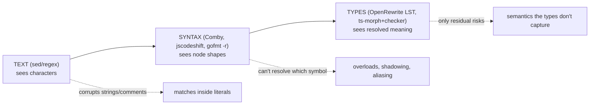
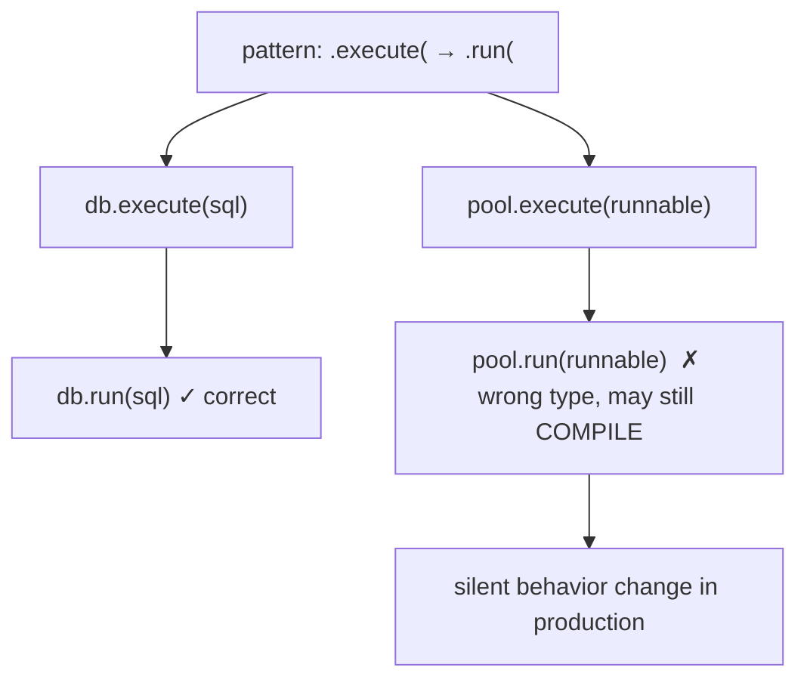
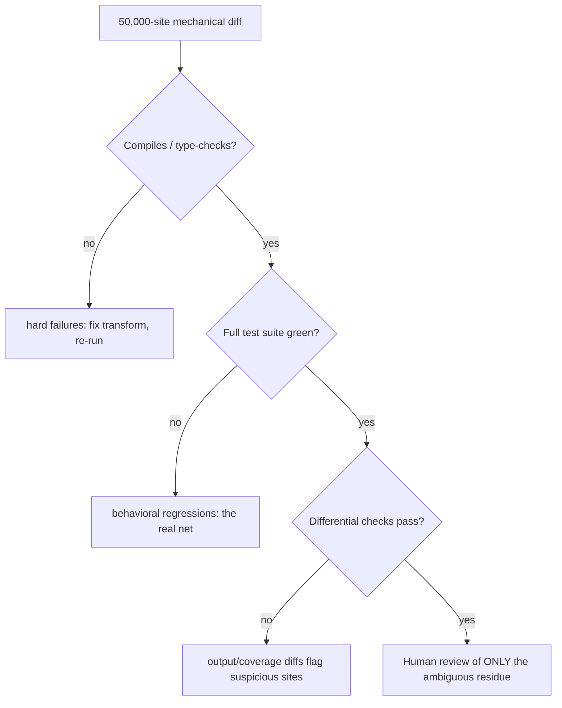
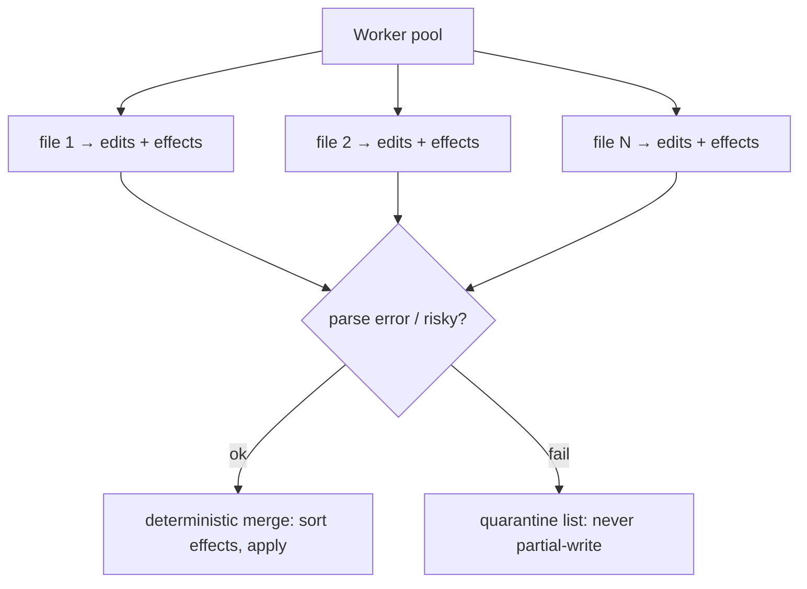

# Automated Large-Scale Refactoring — Professional

> **Category:** [Anti-Patterns at Scale](../README.md) → **Automated Large-Scale Refactoring** — *apply the same fix to hundreds of sites mechanically, safely, and reviewably — codemods, not find-and-replace.*
> **Covers (collectively):** Codemods & AST transforms · Type-aware rewrites · Pattern tools (Comby, Semgrep, gofmt -r) · Idempotency & verification · Landing huge mechanical diffs

---

## Introduction

> Focus: **Correctness and scale** — the difference between a transform that's *plausible* and one that's *provably right* across millions of lines, where a confident-but-wrong codemod can silently corrupt hundreds of files in a single mechanical-looking diff that every reviewer waves through.

[`senior.md`](senior.md) made the rollout reviewable: chunked, owned, revertible, ratcheted. It assumed the transform was *correct*. This file attacks that assumption, because at professional scale the most dangerous codemod is not the one that crashes — it's the one that runs cleanly, produces a tidy diff, compiles, and is **wrong in 0.3% of sites** you can't see by eye. Across 50,000 sites that's 150 corruptions hiding in a diff humans approved precisely *because* it looked mechanical.

Two questions define this level:

1. **How much does the transform actually *understand*?** Text knows nothing. Syntax knows shapes. Types know meaning. The corruptions in this file all come from a transform reasoning at one level about a problem that requires the next level up — a syntactic tool deciding something only the type checker can know.
2. **How do you *verify* a change you can't read in full?** You cannot review 50,000 sites. So verification shifts from human reading to *machines that can*: the compiler, the type checker, the test suite, and differential checks — plus the small, targeted human review of exactly the cases the machines flag as ambiguous.

> **The mental model:** a large-scale codemod is an *unproven theorem* applied 50,000 times. "It compiles and the diff looks clean" proves almost nothing — overload resolution, shadowing, and aliasing produce code that compiles and runs *different behavior*. The professional's job is to make the transform reason at the level the problem demands (usually types), and then route every site through a verifier strong enough to catch the cases it got wrong.

---

## Prerequisites

- **Required:** Fluent with [`senior.md`](senior.md) — you can chunk, route, ratchet, and roll back a mechanical migration across a monorepo.
- **Required:** You understand name resolution and overload resolution in at least one statically-typed language: scope, shadowing, imports, overload sets, generics/erasure, implicit conversions.
- **Required:** You can read a compiler error, a test diff, and a type signature, and tell a real regression from noise.
- **Helpful:** Exposure to a type-aware refactoring engine (OpenRewrite, ts-morph with the checker, IntelliJ's structural replace) and to build/test parallelism on a large repo.
- **Helpful:** property-based-testing, refactoring-techniques, big-o-analysis for verification breadth, the underlying moves, and reasoning about transform cost at scale.

---

## The Correctness Spectrum: Text → Syntax → Types

Every transform tool sits at one of three levels of understanding. The level determines which mistakes it *cannot* avoid:



| Level | Tool examples | Knows | Blind to |
|---|---|---|---|
| **Text** | `sed`, regex | characters | everything — strings, comments, syntax |
| **Syntax** | Comby, jscodeshift, `gofmt -r` | node *kinds* and structure | *which* symbol a name refers to — types, scope, overloads, imports |
| **Types** | OpenRewrite (LST), ts-morph (+checker), IDE structural search | the *resolved* meaning: this `save` is `Repository#save(Order)`, this `List` is `java.util.List` | only semantics types don't encode (side effects, runtime values, reflection) |

The junior lesson "code is a tree, not a string" moves you from Text to Syntax and eliminates the string/comment corruptions. The *professional* lesson is the second jump: **a name is not a symbol.** Two identical-looking `save()` calls, two `List` types, two `+` operators can resolve to entirely different things. Only a type-aware tool knows which — and the corruptions below all live in the gap between "looks the same" and "is the same."

---

## Why OpenRewrite's LST Beats Text for Java

[OpenRewrite](https://docs.openrewrite.org) is the reference example because it was built specifically to refuse the Syntax-level compromise. Instead of an AST (which records what was *written*), it builds a **Lossless Semantic Tree (LST)**: a tree where every type reference, method invocation, and variable is **fully resolved and attributed with its real type**, *and* every byte of original formatting is preserved so output is a minimal diff.

Why a plain AST is not enough for Java:

```java
// Goal: replace deprecated org.apache.commons.lang.StringUtils.isEmpty
//       with org.apache.commons.lang3.StringUtils.isEmpty (lang → lang3).

import org.apache.commons.lang.StringUtils;   // the OLD one
// ...
if (StringUtils.isEmpty(name)) { ... }        // which StringUtils is this?
```

A syntactic tool sees the call `StringUtils.isEmpty(name)` and the bare identifier `StringUtils`. It **cannot** tell, from syntax alone, whether `StringUtils` here resolves to `commons.lang` (rewrite it) or `commons.lang3` (leave it) or a *third* `StringUtils` the team wrote themselves (definitely leave it) — that depends on the `import`, which depends on the classpath. Rewrite blindly and you "fix" calls that were already correct and miss aliased ones.

OpenRewrite's LST has already resolved `StringUtils` to its fully-qualified declaring type using the actual classpath. The recipe matches on the *resolved type* `org.apache.commons.lang.StringUtils`, so it rewrites exactly the right calls and updates the import — and it knows whether two files import the symbol under different names:

```java
// An OpenRewrite recipe (declarative YAML) keyed on the RESOLVED type, not the text.
// ChangeMethodName/ChangeType operate on type-attributed LST elements.
---
type: specs.openrewrite.org/v1beta/recipe
name: com.example.MigrateStringUtils
recipeList:
  - org.openrewrite.java.ChangeType:
      oldFullyQualifiedTypeName: org.apache.commons.lang.StringUtils   # matched by TYPE
      newFullyQualifiedTypeName: org.apache.commons.lang3.StringUtils
# Because the match is type-resolved, a self-written `StringUtils` or an
# already-lang3 import is correctly left untouched, and the import statement
# is rewritten in lockstep — none of which a text/syntax tool can guarantee.
```

> **The general principle:** when "the same name can mean different things," correctness *requires* type resolution. Java's overloading, generics, star imports, and inheritance make this the norm, not the exception — which is why Java mass-refactoring standardized on a type-aware engine while JS/TS got by longer with syntactic tools. ts-morph closes the gap on the TS side by driving the real compiler's type checker; the principle is identical. **Match on resolved symbols, not on spellings.**

---

## The Edge Cases That Silently Corrupt

These are the cases where a syntactic transform compiles, looks right, and is wrong. Each is a place where a *name* is not a *symbol*.

**1. Overload resolution.** Renaming `log(x)` → `trace(x)` when `log` is overloaded:

```java
void log(String msg) { ... }
void log(String msg, Throwable t) { ... }   // a DIFFERENT method, same name
```

A syntactic rename of "the method `log`" hits both overloads. But maybe you only meant the single-arg one — or the two-arg overload's replacement is `traceWithCause`, not `trace`. Syntax sees one name; the type system sees two distinct methods (an *overload set*) selected by argument types. Only type-aware matching can target the right member of the set.

**2. Variable shadowing.** Renaming a field `count` → `total` when a local shadows it:

```java
class Stats {
    int count;                       // the field you mean to rename
    void add() {
        int count = compute();       // a LOCAL that shadows the field
        this.count += count;         // `this.count` = field; bare `count` = local
    }
}
```

A name-based rewrite of every `count` corrupts the local too, silently changing which variable each reference binds to. Scope resolution — knowing that bare `count` in `add()` is the *local*, not the field — is required to rename only the field's references (`this.count` and the declaration). Syntax can't see the binding; the type/scope resolver can.

**3. Aliasing and re-exports.** A symbol imported under another name, or re-exported:

```python
from billing import charge as bill   # `bill` IS `billing.charge`, aliased
bill(amount)                          # a syntactic search for `charge(` misses this entirely
```

Migrating `charge(...)` by syntactic pattern misses every aliased call site (`bill(...)`) — a *silent miss*, the worst kind, because the diff looks complete. Resolution follows the alias to the real symbol; pattern matching follows the spelling and stops.

**4. Generics, erasure, and inferred types.** `List l` vs `List<String> l` vs `var l = makeList()`:

```java
var items = repo.findAll();   // type is inferred; the spelling "List" never appears
```

A textual/syntactic rule keyed on the literal token `List` misses the `var` site entirely, and a rule keyed on `List<T>` may mishandle the raw `List`. Type resolution sees that `items` *is* a `List<Order>` regardless of how it was spelled.

**5. Same operator, different semantics.** `a + b` is integer add, float add, string concat, or operator overload depending on operand types. A transform rewriting "addition" must know which — a concern syntax structurally cannot answer.

> Each case shares one shape: **the transform reasoned about a spelling when correctness depended on a resolved meaning.** That is the entire failure family at this level, and it is invisible in the diff — the code compiles and looks like what you intended.

---

## A Worked Edge Case: How a Confident Codemod Goes Wrong

Make it concrete end-to-end, then show verification catching it.

**The task.** A library renamed a method: `Connection.execute(sql)` → `Connection.run(sql)`. You write a syntactic codemod: *rewrite every call `.execute(` to `.run(`.* It's a one-line Comby pattern, it produces a clean 1,800-site diff, it compiles. Ship it?

**The hidden corruption.** Your codebase has *another*, unrelated class with an `execute` method:

```java
// the library type you MEANT to migrate
db.execute("SELECT ...");          // ✓ should become db.run(...)

// a completely different type — a thread-pool executor — that ALSO has execute()
pool.execute(() -> doWork());      // ✗ MUST NOT change: ExecutorService#execute(Runnable)
```

The syntactic rule `.execute(` → `.run(` rewrites **both**, because both are spelled `.execute(`. `pool.run(...)` happens to compile *if* `pool`'s type also has a `run` method (many do) — so the compiler stays green. Now you've silently changed `pool.execute(Runnable)` (fire-and-forget submission) into `pool.run(...)` (different semantics, or a different overload), in some unknown subset of 1,800 sites. The diff looks perfectly mechanical. Every reviewer approves it *because* it looks mechanical.



**The type-aware fix.** Match on the *resolved receiver type*, not the spelling. With OpenRewrite (`ChangeMethodName` is keyed on a method pattern that includes the declaring type), or ts-morph guarding on `getExpression().getType()`:

```
# OpenRewrite: the method pattern names the DECLARING TYPE, so only the right one matches.
org.openrewrite.java.ChangeMethodName:
  methodPattern: "com.lib.Connection execute(..)"   # ← Connection.execute only
  newMethodName: run
# pool.execute(Runnable) has declaring type java.util.concurrent.Executor → never matches.
```

**How verification catches it even if the transform was wrong.** Suppose you shipped the bad syntactic version. Three independent nets:

1. **Compile** catches the subset where `pool` has *no* `run` method → red build, immediate. (Necessary but *insufficient* — it misses the cases that happen to compile.)
2. **Tests** catch the cases where `pool.run(...)` compiles but behaves differently — a thread-pool test that asserts work was submitted now fails. This is why behavioral tests, not just the compiler, are the real net.
3. **Differential / targeted review** catches the rest: you grep the diff for changed `.execute(` sites and *partition by receiver type* (a type-aware query), then review only the sites whose receiver isn't `Connection`. That's ~tens of sites to read, not 1,800.

The lesson: the corruption was created by reasoning at the **syntax** level about a **type**-level problem, and it was caught by verifiers that operate *above* the level that produced it. You climb the spectrum either before (write a type-aware transform) or after (verify with compile + tests + type-partitioned review) — ideally both.

---

## Verification at Scale: Compile, Test, Diff-Review

You cannot read 50,000 sites. Verification becomes a *layered filter*, each layer catching what the previous can't, ending in a small human-reviewable residue:



1. **Compile / type-check the whole tree.** Cheapest, broadest net; catches every rewrite that produced ill-typed code. *Insufficient alone* — the dangerous corruptions compile.
2. **Run the full test suite.** The primary behavioral net. A codemod that changes behavior should break a test; if your coverage is thin on the touched code, **the codemod is exactly the moment to add characterization tests first** (pin current behavior, then refactor). No coverage on a hotspot you're mass-editing is a stop condition.
3. **Differential verification** for changes that *should* be behavior-preserving: run the same inputs through old and new builds and diff outputs (golden tests, recorded-traffic replay, `git diff` of generated artifacts). For pure refactors the diff should be *empty*; any difference is a corruption.
4. **Type-partitioned diff review.** Don't review the diff linearly. Use a type-aware query to group changed sites by receiver type / resolved symbol, then human-review only the *unexpected* groups (the `pool.execute` cluster). Reviewing 1,800 identical correct sites teaches nothing; reviewing the 30 anomalous ones is the whole job.
5. **Reconcile counts** (from [`senior.md`](senior.md)): sites changed vs. an independent count of the old pattern. A gap means silent misses (aliasing) or silent over-matches.

> **The discipline:** structure verification so machines read what machines can read (compiler, tests, differential), and humans read only the residue the machines flag as ambiguous. "I skimmed the diff and it looked mechanical" is not verification — it's the exact reasoning that lets a confident-but-wrong codemod through.

---

## Determinism: A Codemod That Isn't Reproducible Can't Be Verified

Verification, re-run-on-rebase, and "regenerate the mechanical commit and diff it" ([`senior.md`](senior.md)) all assume the transform is **deterministic**: same input → byte-identical output, every run, on every machine. Non-determinism quietly destroys all three.

Sources of non-determinism to eliminate:

- **Unordered traversal.** Iterating a hash map of files/nodes in arbitrary order can change which of two overlapping edits wins, or the order of added imports. **Sort inputs** (file lists, import insertions, generated members) into a stable order.
- **Parallel write races.** Workers editing shared state (a shared import index, a counter for generated names) race. Keep per-file work independent and merge results deterministically.
- **Timestamps / environment / absolute paths** leaking into output (headers, generated comments). Strip them or fix them.
- **Tool/version drift.** Pin the transform tool *and* parser versions; record them in the commit message. A different formatter version reprints untouched code differently and pollutes the diff.

```bash
# Determinism check: run the transform twice from a clean tree into two output dirs,
# then diff them. They MUST be byte-identical.
git worktree add /tmp/run-a HEAD && git worktree add /tmp/run-b HEAD
( cd /tmp/run-a && run-codemod ) ; ( cd /tmp/run-b && run-codemod )
diff -r /tmp/run-a /tmp/run-b && echo "DETERMINISTIC" || echo "NON-DETERMINISTIC — fix before rollout"
```

> Determinism is what lets a reviewer **regenerate** commit-A and confirm it equals what landed — the trust contract from [`senior.md`](senior.md). A non-deterministic codemod can't be verified that way, can't be cleanly re-run after a rebase, and produces noisy diffs that hide real changes. Treat it as a correctness bug, not a cosmetic one.

---

## Performance, Parallelism, and Failure Quarantine on Millions of LOC

At 10M+ LOC, parsing-and-attributing every file is the dominant cost, and a transform that's correct but takes 9 hours or dies on file 40,000 won't actually land.

**Performance.**
- **Type-aware is expensive.** Building an attributed tree (OpenRewrite LST, ts-morph with the checker) requires resolving the classpath/project — often the bulk of runtime. Build the type model *once* and reuse it across the whole run; don't re-resolve per file.
- **Incremental scoping.** Combine with [hotspots](../03-hotspot-analysis/senior.md): you rarely need to attribute the entire repo to fix one pattern in 2,000 files. Scope the parse to the affected modules.
- **Cache parses.** Re-running after a rebase should reparse only changed files.

**Parallelism — and its hazard.** File-level transforms are embarrassingly parallel (jscodeshift forks workers; OpenRewrite parallelizes recipe runs). The hazard is **cross-file state**: import indexes, "have I already added this helper?" flags, generated-name counters. Shared mutable state across workers is both a race *and* a source of non-determinism (previous section). Keep each file's transform pure; collect cross-file effects (new imports, new files) as an *ordered* post-pass merged deterministically.



**Failure quarantine.** Across millions of LOC you *will* hit files that fail to parse (an unsupported syntax extension, a generated blob, a genuinely broken file). The rule: **a file either transforms cleanly or is quarantined whole — never half-edited.** A transform that throws mid-file and leaves a partial write is a corruption that compiles-or-doesn't unpredictably. Catch per-file, record the failure to a quarantine list, leave the file untouched, and report the list as part of the rollout's [bucketing](../05-strangler-fig-and-seams/senior.md) ([`senior.md`](senior.md)'s changed / unchanged / skipped / quarantined). A run that quarantines 12 files and tells you which is fine; a run that silently corrupts 12 files is a disaster.

> **The professional posture on a giant run:** isolate per file (pure transform), parallelize for throughput, merge cross-file effects deterministically, and quarantine — never partially apply — anything that errors. Throughput buys you nothing if it costs you determinism or leaves half-written files.

---

## The Confident-but-Wrong Codemod: The Core Professional Hazard

Everything in this file orbits one failure mode, so name it directly. The dangerous codemod has all of these at once:

- It **runs without error** — no crash, no obvious red flag.
- It **produces a clean, mechanical-looking diff** — uniform, repetitive, easy to skim.
- It **compiles** — because the wrong rewrite happens to type-check.
- It is **wrong in a small fraction of sites** — invisible by eye in a 50,000-site diff.
- It is **approved precisely because it looks mechanical** — reviewers extend the "it's just the tool" trust the diff doesn't deserve.

This is more dangerous than a transform that crashes, because a crash *announces itself* and a silent corruption *hides behind its own tidiness*. The very property that makes a mechanical diff fast to review (uniformity) is what lets a 0.3% corruption ride along unnoticed.

The defenses, all from the sections above, as a single posture:

1. **Reason at the right level.** If correctness depends on which symbol a name resolves to (overloads, shadowing, aliasing, inferred types) — and in a typed language it usually does — use a **type-aware** transform. Don't solve a type-level problem with a syntax-level tool.
2. **Don't trust "it compiles."** The compiler misses the corruptions that happen to type-check. **Tests are the real net** — add characterization tests on the touched code *before* the run if coverage is thin.
3. **Verify above the level that produced the change.** Type-partitioned diff review, differential output checks, count reconciliation — machines read the bulk, humans read only the flagged residue.
4. **Make it deterministic and quarantine failures**, so the verification you run is meaningful and nothing is half-written.

> **The one-sentence version:** a mechanical diff's tidiness is *exactly* why a 0.3% corruption survives review — so professional correctness means making the transform reason about resolved symbols, not spellings, and routing every site through verifiers (tests above all) strong enough to catch the fraction the transform got wrong.

---

## Common Mistakes

1. **Solving a type-level problem with a syntactic tool.** Overloads, shadowing, aliasing, and inferred types require resolved symbols. Match on the declaring type / resolved symbol (OpenRewrite LST, ts-morph + checker), not on the spelling.
2. **Treating "it compiles" as verification.** The most dangerous corruptions type-check. The compiler is a necessary first filter, not the net — behavioral tests are.
3. **Mass-editing code with thin test coverage.** If the touched code isn't covered, you have no behavioral net. Add characterization tests *before* the run, or don't run it there yet.
4. **Reviewing a giant diff linearly.** You can't read 50,000 sites and uniformity hides the anomalies. Partition by resolved type/symbol and review only the unexpected groups.
5. **Shipping a non-deterministic transform.** Unordered traversal, parallel write races, or version drift make the change unreproducible, un-re-runnable, and noisy — and it can't be verified by regeneration. Pin versions, sort effects, prove byte-identical reruns.
6. **Sharing mutable state across parallel workers.** Import indexes and name counters race and add non-determinism. Keep per-file transforms pure; merge cross-file effects in a deterministic post-pass.
7. **Partially writing files that error.** A transform that throws mid-file leaves a corrupted half-edit. Catch per file, quarantine whole, never partial-write.
8. **Ignoring silent misses.** Aliasing and re-exports make the diff *look* complete while real call sites went untouched. Reconcile changed-site counts against an independent, resolution-aware count.
9. **Extending mechanical-trust to a transform whose correctness you haven't established.** "It looks mechanical" is the reviewer's trap, not their due diligence. Trust the *tested, type-aware, verified* transform — not the tidy appearance of its output.

---

## Test Yourself

1. Place these on the correctness spectrum and name the bug class each *cannot* avoid: `sed`, Comby, OpenRewrite.
2. Why can a syntactic rename of `StringUtils.isEmpty` corrupt a Java codebase that imports two different `StringUtils`, and what specifically does OpenRewrite's LST know that lets it get it right?
3. Give three distinct edge cases where a *name* is not a *symbol*, and for each say what resolution a syntactic tool lacks.
4. Walk through the `.execute( → .run(` example: how does the corruption stay green under the compiler, which verification layer actually catches it, and how would a type-aware transform have prevented it?
5. Why is "it compiles and the diff looks clean" insufficient verification for a 50,000-site mechanical change? What layered filter do you use instead?
6. Explain two ways a codemod can be non-deterministic, why that breaks verification, and the command-level check that detects it.
7. You're transforming 10M LOC in parallel and the run hits a file that fails to parse. What must happen to that file, and what must *never* happen?
8. Define the "confident-but-wrong codemod" and explain why it's more dangerous than one that crashes. Name the four defenses.

---

## Cheat Sheet

| Hazard | Why it survives review | Defense |
|---|---|---|
| Name ≠ symbol (overload, shadow, alias, inferred type) | Looks identical syntactically; compiles | Match on **resolved symbol/declaring type** (OpenRewrite LST, ts-morph + checker) |
| Wrong rewrite that type-checks | Green build = false assurance | **Tests** as the real net; characterization tests first if coverage thin |
| 50,000-site diff | Can't read it; uniformity hides anomalies | **Type-partitioned** review of unexpected groups only; differential checks; count reconciliation |
| Non-determinism | Can't regenerate/verify; noisy diffs | Sort effects, pin tool+parser versions, pure per-file transforms; `diff -r` two runs |
| Parse failure mid-run | Half-written corrupt file | **Quarantine whole**, never partial-write; report the list |
| Type-aware cost on M LOC | 9-hour or OOM run never lands | Build type model once, scope to hotspots, cache parses, parallelize pure transforms |

> **One rule to remember:** *A mechanical diff's tidiness is exactly why a 0.3% corruption survives review. Reason about resolved symbols, not spellings — and let tests, not the compiler, be the net.*

---

## Summary

- At professional scale the deadliest codemod doesn't crash — it **runs clean, compiles, produces a tidy diff, and is wrong in a fraction of sites**, approved *because* it looks mechanical. Tidiness conceals the corruption.
- Transforms live on a **Text → Syntax → Types** spectrum. The junior jump (Text→Syntax) kills string/comment corruption. The professional jump (Syntax→Types) is the realization that **a name is not a symbol** — overloads, shadowing, aliasing, and inferred types all make identical spellings mean different things.
- **OpenRewrite's LST** wins for Java because correctness there *requires* type resolution: it matches on resolved declaring types and rewrites imports in lockstep, getting right exactly the cases a syntactic tool guesses on. ts-morph reaches the same level by driving the real type checker.
- The corruptions all come from **reasoning at one level about a problem that needs the next** — a syntactic tool deciding something only the type system knows (the `.execute(`→`.run(` example silently rewriting `Executor#execute`).
- **Verification is a layered filter** because you can't read 50,000 sites: compile (broad, but misses what type-checks) → **tests** (the real behavioral net; add characterization tests first if coverage is thin) → differential/golden checks → **type-partitioned** human review of only the anomalous residue → count reconciliation. "I skimmed it" is not verification.
- **Determinism is a correctness property**: same input → byte-identical output, or you can't regenerate, re-run, or verify. Sort effects, pin versions, keep per-file transforms pure; prove it by diffing two runs.
- **At millions of LOC**: build the type model once and scope to hotspots, parallelize *pure* per-file transforms (cross-file effects merged deterministically), and **quarantine whole files that error — never partial-write.**
- This completes the level ladder: [`junior.md`](junior.md) (code is a tree) → [`middle.md`](middle.md) (write + test a codemod) → [`senior.md`](senior.md) (land the diff at scale) → **professional.md** (make it provably correct and fast). Next, drill with the practice files.

---

## Further Reading

- **OpenRewrite** — [docs.openrewrite.org](https://docs.openrewrite.org) — the Lossless Semantic Tree, type-attributed recipes, and why text-level Java refactoring is a dead end.
- **ts-morph** — [ts-morph.com](https://ts-morph.com) — driving the TypeScript type checker from a transform for symbol-accurate rewrites.
- **"Software Engineering at Google"** — Winters, Manshreck, Wright (2020) — Ch. 22 (*Large-Scale Changes*) and Ch. 11–14 on testing at scale; verifying changes you can't read.
- **Working Effectively with Legacy Code** — Michael Feathers (2004) — characterization tests: pinning behavior before a mass refactor touches it.
- **Refactoring** — Martin Fowler (2nd ed., 2018) — behavior-preservation as the property every verifier is checking.
- **Comby / Semgrep semantics docs** — where syntactic structural matching ends and where you must escalate to type resolution.

---

## Related Topics

- Refactoring → Refactoring Techniques — the behavior-preserving moves a verified transform automates.
- [Hotspot Analysis](../03-hotspot-analysis/senior.md) — scope the expensive type-aware parse to where it pays off; sequence verification effort.
- [Architecture Fitness Functions](../01-architecture-fitness-functions/senior.md) — the type-aware detector that both seeds the codemod and gates regressions.
- [Strangler Fig & Seams](../05-strangler-fig-and-seams/senior.md) · [Expand–Contract Refactors](../06-expand-contract-refactors/senior.md) — keeping every intermediate state of a verified migration shippable.
- Architecture → Anti-Patterns — the system-level debt these transforms repay.
- [Bad Structure → Senior](../../01-development/01-bad-structure/senior.md) · [Bad Shortcuts → Senior](../../01-development/02-bad-shortcuts/senior.md) — sibling-category context.
- property-based-testing · refactoring-techniques · big-o-analysis — the verification breadth, underlying moves, and cost reasoning behind a million-LOC run.

---

## Check your understanding

1. Explain Automated Large-Scale Refactoring — Professional Level in your own words and name the problem it solves.
2. How would you apply the ideas around Table of Contents, Introduction, Prerequisites in a realistic engineering change?
3. What failure mode or misuse should you look for, and what evidence would reveal it?
4. How would you introduce and govern Automated Large-Scale Refactoring — Professional Level across teams through reversible, measurable increments?
5. What observable result would convince you that the approach improved the system?
