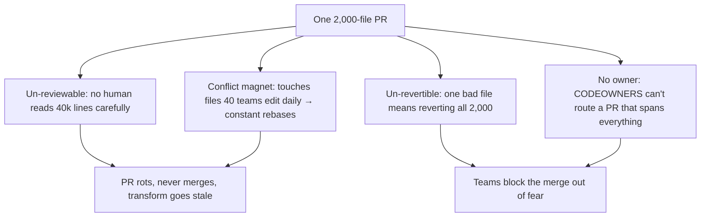
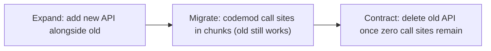
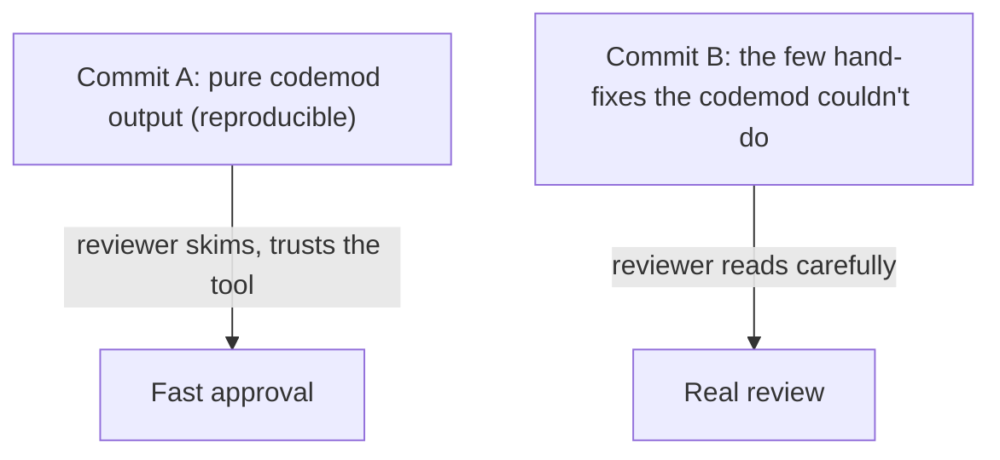
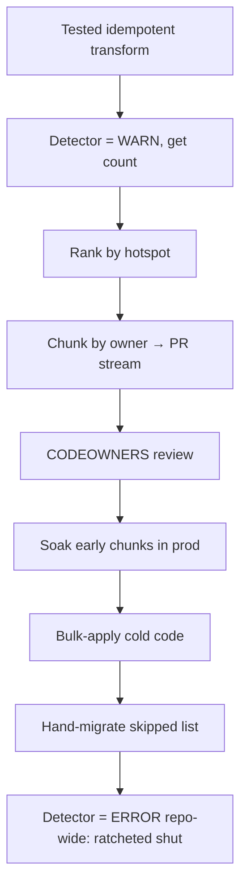

# Automated Large-Scale Refactoring — Senior

> **Category:** [Anti-Patterns at Scale](../README.md) → **Automated Large-Scale Refactoring** — *apply the same fix to hundreds of sites mechanically, safely, and reviewably — codemods, not find-and-replace.*
> **Covers (collectively):** Codemods & AST transforms · Type-aware rewrites · Pattern tools (Comby, Semgrep, gofmt -r) · Idempotency & verification · Landing huge mechanical diffs

---

## Introduction

> Focus: **Rolling a transform across a monorepo / many repos** — the engineering is no longer the transform; it's *landing* a 40,000-line mechanical diff that humans must review, that won't conflict for weeks, that can be rolled back, and that doesn't come right back.

[`middle.md`](middle.md) ended with a tested, idempotent transform and a clean-branch dry run. That works on `src/`. It does not survive contact with a monorepo where the same transform touches 2,000 files across 40 teams, where a single PR that large is un-reviewable and will rot in merge conflicts before anyone approves it, and where — even if it lands perfectly — a teammate reintroduces the old pattern next week because nothing stops them.

At the senior level the codemod is the *easy* part. The hard parts are organizational and procedural:

- **Sequencing** — *where* to apply first (hotspots) so the riskiest, most-changed code is fixed under the most scrutiny, and the rest follows.
- **Chunking** — slicing one enormous diff into many small, independently reviewable, independently revertible PRs.
- **Commit hygiene** — keeping the mechanical change *byte-for-byte separable* from any human judgment, so a reviewer can trust "this was generated" and skim, while real decisions get real review.
- **Review routing** — getting each chunk in front of the team that owns it (CODEOWNERS), because a 2,000-file PR has no meaningful owner.
- **Closing the door** — a [fitness function](../01-architecture-fitness-functions/senior.md) or lint rule that fails CI the moment the old pattern reappears, so the refactor stays done.

> **The mental model:** a large-scale refactor is a *migration*, and migrations are judged by how they land, not by how cleverly they transform. A perfect transform shipped as one un-reviewable, un-revertible, conflict-prone PR is a worse outcome than a dumber transform shipped as 50 boring ones that each merge in an afternoon.

---

## Prerequisites

- **Required:** Solid with [`middle.md`](middle.md) — you can author a tested, idempotent codemod (jscodeshift/ts-morph/Comby) and verify it with fixtures.
- **Required:** Fluent with `git` at the rollout level: branches, `git rebase`, `git revert`, splitting commits, `git diff --stat`, and reading large diffs efficiently.
- **Required:** You've shepherded a non-trivial change through code review and CI in your repo's actual workflow (PRs, required checks, owners).
- **Helpful:** Familiarity with your repo's CODEOWNERS / review-routing mechanism and its CI gates.
- **Helpful:** [Hotspot analysis](../03-hotspot-analysis/senior.md) and [architecture fitness functions](../01-architecture-fitness-functions/senior.md) — this file ties the rollout to both. refactoring-techniques and ci-cd-pipeline-design for the surrounding practice.

---

## The Real Problem: Landing the Diff, Not Writing It

A 40,000-line, 2,000-file diff has four properties that make it fail as a single PR, independent of whether the transform is correct:



The senior craft is converting that one doomed PR into a *stream* of small ones, each of which: is small enough to actually review, touches code owned by one team, can be reverted alone, and rebases trivially because it's in flight for hours, not weeks. Everything below is a technique for producing that stream.

---

## Sequence the Rollout with Hotspots and Fitness Functions

Don't apply everywhere at once, and don't apply in arbitrary order. Use [hotspot analysis](../03-hotspot-analysis/senior.md) to **sequence**:

- **Apply to hotspots first.** A hotspot is code that is both high-churn and high-complexity — the files most edited and most defect-prone. They are where the old pattern hurts most and where a correct transform pays off immediately. They're also where you want *maximum review attention*, which a small early PR attracts and a giant late one doesn't.
- **Apply to cold, stable code last (or in bulk).** Files nobody touches carry little conflict risk; you can batch them into larger mechanical PRs once the transform has proven itself on the hot, scrutinized files.

```bash
# Rank files by churn (a crude hotspot proxy) to decide what to convert first.
git log --since="12 months ago" --name-only --pretty=format: \
  | grep -E '\.(ts|go|java)$' | sort | uniq -c | sort -rn | head -30
```

Then close the loop with a [fitness function](../01-architecture-fitness-functions/senior.md): the *same* structural pattern your codemod matches becomes a CI check that **fails** when the old shape exists. Order of operations:

1. Write the detector (Semgrep rule / lint / ArchUnit test) that finds the old pattern — but set it to **warn, not fail**, so you can see the true count.
2. Run the codemod across hotspots, landing chunked PRs.
3. As each area reaches zero matches, flip the detector to **fail** *for that area* (path-scoped), so it can't regress while you finish the rest.
4. When the global count hits zero, make the detector a hard, repo-wide gate.

This is the difference between a refactor and a *ratchet*: you don't just fix the code, you make the fixed state the only state CI will accept.

---

## Splitting a Huge Diff into Reviewable Chunks

A reviewer can meaningfully review ~400 lines; beyond that, approval becomes rubber-stamping. Split along a boundary that maps to ownership and to revert granularity. Common axes:

- **By package / directory** — most natural; aligns with CODEOWNERS and lets each team review its own.
- **By team / service** — for polyrepo or service-per-directory layouts.
- **By batch size** — cap each PR at *N* files when no smaller boundary exists.

A codemod runner usually lets you scope by path, so you generate one chunk per directory:

```bash
#!/usr/bin/env bash
# chunk-rollout.sh — one PR per top-level package, mechanical change isolated.
set -euo pipefail
TRANSFORM=transform.js

for pkg in packages/*/; do
  name="$(basename "$pkg")"
  git switch -c "codemod/fetch-client/$name" main

  npx jscodeshift -t "$TRANSFORM" "$pkg"        # apply ONLY to this package
  git diff --quiet && { echo "no change in $name, skipping"; git switch main; git branch -D "codemod/fetch-client/$name"; continue; }

  git commit -am "refactor($name): fetch() → httpClient.get() [codemod, no behavior change]"
  gh pr create --fill --label codemod --reviewer "@$(owner_of "$pkg")"
  git switch main
done
```

Each PR now: touches one package, has one owner, reverts in isolation, and rebases in minutes. The `git diff --quiet` skip is important — packages that don't match produce *no* PR, so you never create empty noise (more on non-matching files below).

> **Stacked PRs for ordered dependencies.** If chunk B depends on chunk A (e.g., A adds the shared `httpClient` module, B uses it), use a stacked-PR workflow (Graphite, `spr`, or manual base-branch chaining) so reviewers see each layer cleanly and you don't merge B before A. Most mechanical rollouts are *independent* per chunk, which is the easy, preferred case — design the transform so chunks don't depend on each other when you can.

---

## Staged and Partial Application

You rarely flip the whole codebase in a day. Two staging strategies keep a half-done migration *coherent* instead of broken:

**1. Coexistence (expand) before removal (contract).** Don't delete the old API in the same change that introduces the new one. Make them coexist, migrate call sites in chunks, then remove the old API once nothing calls it. This is the [expand–contract pattern](../06-expand-contract-refactors/senior.md) applied to a codemod rollout: the old and new shapes are valid *simultaneously* so partial progress always compiles and ships.



**2. Per-area completeness.** Within a chunk, apply the transform *fully* — don't leave a directory half-converted. A half-converted file mixing `fetch(...)` and `httpClient.get(...)` is confusing and the fitness function can't be turned on for it. Partial application is a property of the *rollout* (some areas done, some not), never of an individual file or PR.

> A partly-migrated repo is normal and fine **if** every intermediate state compiles, passes tests, and ships. The failure mode is a flag-day cutover that requires all 2,000 sites to change at once — that's the un-reviewable PR again, wearing a deadline.

---

## Commit Hygiene: Never Mix Mechanical and Semantic

This is the single highest-leverage senior discipline in large-scale refactoring. A reviewer faced with a 400-line diff must answer "is this safe?" — and the answer is *trivial* if the diff is **purely mechanical** (a tool generated it; behavior is unchanged by construction) and *expensive* if it's mixed with hand edits.

So keep them in **separate commits, ideally separate PRs**:



Concretely:

```bash
# Commit 1: ONLY the codemod output. Reproducible — anyone can regenerate it.
npx jscodeshift -t transform.js packages/billing/
git commit -am "refactor(billing): fetch() → httpClient.get() [codemod, mechanical, no behavior change]"

# Commit 2: the handful of call sites the codemod flagged but couldn't safely rewrite
# (dynamic callee, unusual options object). THESE get careful human review.
$EDITOR packages/billing/legacy/oddCall.ts
git commit -am "refactor(billing): hand-migrate 3 dynamic fetch() sites the codemod skipped"
```

The commit message states **mechanical / no behavior change** explicitly, and ideally names the transform and its version so a reviewer (or future you) can *regenerate* commit 1 and diff it against what landed — verifying the tool actually produced it. If a "mechanical" commit contains a line the tool would never emit, that line is a smuggled semantic change and must be split out. Reviewers should treat any hand edit hiding inside a mechanical commit as a red flag, not a convenience.

> **The reviewer's contract:** "If you tell me this commit is the verbatim output of `transform.js@v3`, I will trust the transform's tests and skim for surprises. If you mix in three hand-fixes, I now have to read all 400 lines to find them — you've made me review the machine's work to catch your three lines." Honor that contract and your mechanical PRs merge in an afternoon.

---

## Routing Review with CODEOWNERS

A 2,000-file PR has no owner; a per-package PR has exactly one. Chunking by directory exists partly so CODEOWNERS can do its job:

```
# .github/CODEOWNERS — each package routes to its team automatically
/packages/billing/    @org/payments-team
/packages/checkout/   @org/checkout-team
/packages/search/     @org/search-team
```

With chunked PRs, the rollout script's `gh pr create --reviewer ...` (or simply opening the PR) auto-requests the owning team. Benefits compound:

- **Domain reviewers catch what the transform can't.** The payments team knows `fetch()` in `billing/` hits an endpoint with retry semantics the codemod didn't preserve. A generic reviewer of a 2,000-file PR would never notice.
- **Approval is distributed**, so no single bottleneck reviewer gates the whole migration.
- **Accountability is local** — if `billing/`'s chunk regresses, the payments team owns the revert.

> For the truly cold, ownerless corners of a monorepo, a single platform-team PR for the leftover files is acceptable *after* the owned hotspots are done — by then the transform is battle-tested and the remaining files are low-risk.

---

## Handling Non-Matching and Quarantined Files

Across thousands of files, three populations need explicit handling — never silent.

1. **Files with zero matches.** They produce no diff and no PR (the `git diff --quiet` skip above). That's correct, but **count** them: if you expected `billing/` to have call sites and it has none, your transform may be missing a syntactic variant. Reconcile the matched-file count against an independent grep/Semgrep count of the old pattern.

2. **Files the transform *should* change but *can't* safely.** Dynamic dispatch (`obj[name]()`), reflection, string-built identifiers, macros — cases where a structural transform genuinely can't prove the rewrite is correct. The transform should **detect and skip** these, and emit them as a worklist:

```bash
# Have the transform print skipped sites to a file the team works through by hand.
npx jscodeshift -t transform.js src/ 2>&1 | grep "SKIPPED:" > skipped-sites.txt
wc -l skipped-sites.txt    # the human-migration backlog
```

3. **Files that error or look risky — quarantine them.** Generated code, vendored third-party code, and files that fail to parse should be *excluded by path* and listed, not crashed through. A transform that throws halfway leaves the tree partly edited.

```bash
# Exclude generated/vendored trees; quarantine parse failures into a list.
npx jscodeshift -t transform.js \
  --ignore-pattern '**/generated/**' \
  --ignore-pattern '**/vendor/**' \
  src/ 2>quarantine.log || true
```

> **The rule: every file ends up in a named bucket — *changed*, *correctly-unchanged*, *skipped-for-humans*, or *quarantined*.** A file in none of these is a file you didn't account for, which is exactly where a silent corruption or a missed site hides. The buckets are how you prove the rollout is *complete*, not just *run*.

---

## Rollback and the Re-Run Property

Two properties from earlier levels become operational safety nets at scale.

**Rollback is per-chunk because the rollout is chunked.** When `billing/`'s PR turns out to break a downstream consumer, you `git revert` *that one PR* — not all 2,000 files. This is the entire payoff of independent, separately-merged chunks: blast radius equals one package, not the migration.

```bash
git revert -m 1 <merge-commit-of-billing-chunk>   # undo exactly one chunk
```

**Re-run beats forward-fix, thanks to idempotency.** Because the transform is idempotent ([`middle.md`](middle.md)), the recovery move for a chunk that landed slightly wrong is usually: fix the *transform*, revert the bad chunk, and re-run — rather than hand-patching the output. Hand-patching the output of a generated change destroys the "this is just the tool's output" property and means the next re-run will fight your patch. **Fix the generator, not the generated.**

> **Soak each early chunk before mass-applying.** Land the first 2–3 hotspot chunks, let them run in production for a few days, and watch metrics. If they're clean, the transform is validated and you can accelerate the cold-code bulk. If not, you've learned it on 3 packages, not 2,000.

---

## Locking the Old Pattern Out for Good

A refactor that isn't enforced regresses — someone copies the old pattern from a tutorial, or reverts to muscle memory. Convert the codemod's match pattern into a [fitness function](../01-architecture-fitness-functions/senior.md) so CI rejects the old shape:

```yaml
# .semgrep.yml — the SAME structural pattern the codemod matched, now a CI gate.
rules:
  - id: no-bare-fetch
    pattern: fetch(...)
    message: "Use httpClient.get() instead of bare fetch() (see migration RFC-142)."
    severity: ERROR
    paths:
      include: [packages/]   # widen as each area reaches zero matches
```

```bash
semgrep --config .semgrep.yml --error    # fails CI if a bare fetch() reappears
```

The sequencing matters: keep the rule at `severity: WARNING` (or scoped to only the migrated paths) until an area is fully converted, then promote it to `ERROR` for that area. Promote globally only when the global count is zero. This is the **ratchet**: each notch you tighten can't loosen, so the migration's progress is monotonic — it can only move toward done, never back. The codemod removes the existing instances; the fitness function prevents new ones. You need both, or you'll be running the same codemod again in six months.

---

## A Rollout Playbook

The end-to-end senior procedure, in order:

1. **Write + test the transform** ([`middle.md`](middle.md)): fixtures incl. negative cases, idempotent, dry-run clean.
2. **Add the detector as a *warning*** (Semgrep/lint/ArchUnit) and get the true global match count.
3. **Rank targets by hotspot** (churn × complexity); convert hottest first.
4. **Chunk by package/owner**; one mechanical PR per chunk, each ≤ a reviewable size.
5. **Keep commits pure**: codemod output in its own commit/PR, hand-fixes separate.
6. **Route via CODEOWNERS**; the owning team reviews its chunk.
7. **Bucket every file**: changed / correctly-unchanged / skipped-for-humans / quarantined; reconcile counts.
8. **Soak the first chunks** in prod; if clean, **bulk-apply** cold code.
9. **Work the skipped list** by hand (the cases the transform couldn't prove).
10. **Promote the detector to ERROR**, path-by-path, then repo-wide at zero. The door is shut.



---

## Common Mistakes

1. **Shipping one giant PR.** It's un-reviewable, un-revertible, and a permanent conflict magnet. Chunk by owner; stream small PRs.
2. **Mixing mechanical and semantic changes in one commit.** It forces the reviewer to read the machine's output line-by-line to find your three hand edits. Keep codemod output verbatim and separate.
3. **Applying everywhere before validating anywhere.** Soak the first hotspot chunks in production; learn on 3 packages, not 2,000.
4. **Hand-patching generated output instead of fixing the transform.** It destroys reproducibility and the next re-run fights your patch. Fix the generator, revert, re-run.
5. **No reconciliation of match counts.** If you don't compare files-changed against an independent count of the old pattern, silently-missed sites go unnoticed. Reconcile; bucket every file.
6. **Skipping the fitness function.** Without a CI gate, the old pattern walks right back in. Ratchet: warn → fix → fail, per area, then global.
7. **Forcing a flag-day cutover.** Requiring all sites to change at once recreates the un-reviewable PR. Use expand–contract so partial states always ship.
8. **Ignoring generated/vendored code.** Running the transform through generated or third-party trees creates churn that will be overwritten or that you don't own. Exclude by path and quarantine parse failures.
9. **Bypassing CODEOWNERS "to move faster."** A generic approver can't catch domain-specific breakage (retry semantics, auth headers). Route each chunk to its owner.

---

## Test Yourself

1. Your tested, idempotent transform touches 2,000 files. List four reasons shipping it as a single PR fails *independent of whether the transform is correct*.
2. How does hotspot analysis decide the *order* of a rollout, and why apply to hot code first rather than cold?
3. A reviewer is handed a 400-line "mechanical" PR that also contains three hand-edited lines. Why is that a problem, and what's the fix?
4. Describe the four buckets every file must end up in during a large rollout, and why a file in none of them is dangerous.
5. A chunk you merged yesterday broke a downstream consumer. Walk through the recovery using the properties chunking and idempotency give you.
6. Why do you keep the old-pattern detector at `WARNING` during the migration and only promote it to `ERROR` later — and why path-by-path before repo-wide?
7. What is the "ratchet," and which two tools together produce it (one removes existing instances, one prevents new ones)?
8. The codemod can't safely rewrite `obj[methodName]()` (dynamic dispatch). What should the transform do with such sites, and where do they go?

---

## Cheat Sheet

| Concern | Move |
|---|---|
| Giant un-reviewable diff | Chunk by package/owner → stream of small PRs, each independently revertible |
| Where to start | Hotspots first (churn × complexity); cold code bulk-applied last |
| Reviewer trust | Mechanical commit = verbatim tool output, separate from any hand edits |
| Routing | CODEOWNERS sends each chunk to its owning team |
| Partial state | Expand–contract: old + new coexist; every intermediate state ships |
| Files that can't be rewritten | Transform detects + skips → human worklist |
| Generated/vendored | Exclude by path; quarantine parse failures |
| Recovery | Revert the one chunk; fix the *transform*, not the output; re-run (idempotent) |
| Stay fixed | Detector: WARN → fix → ERROR per path → repo-wide (the ratchet) |
| Completeness proof | Every file in a bucket; reconcile match counts |

> **One rule to remember:** *The transform is the easy part. A refactor is a migration — judged by how it lands: chunked, owned, separable, revertible, soaked, and ratcheted shut.*

---

## Summary

- At scale the codemod is the *easy* part; the engineering is **landing the diff** — chunked, reviewable, owned, revertible, and enforced.
- **A single 2,000-file PR fails on its own merits**: un-reviewable, un-revertible, a perpetual conflict magnet, and ownerless. Convert it into a *stream* of small per-owner PRs.
- **Sequence with hotspots:** convert high-churn, high-complexity code first (most pain, most scrutiny), bulk-apply cold code last.
- **Commit hygiene is the highest-leverage discipline:** keep the codemod output verbatim and separate from hand-fixes, name the transform/version, so reviewers can trust "this is the machine's output" and skim — and so a smuggled semantic change stands out.
- **Route with CODEOWNERS** so domain experts catch what the transform can't (retry semantics, auth, ordering); chunk so every PR has exactly one owner.
- **Bucket every file** — changed / correctly-unchanged / skipped-for-humans / quarantined — and reconcile counts, so the rollout is provably *complete*, not merely run. Exclude generated/vendored trees; emit un-rewritable sites to a human worklist.
- **Rollback per chunk; re-run, don't hand-patch.** Idempotency means you fix the transform and regenerate rather than editing generated output; chunking means a revert touches one package.
- **Ratchet it shut:** the codemod removes existing instances, a fitness function fails CI on new ones — promoted WARN → ERROR, path-by-path, then repo-wide. The refactor stays done.
- Next: [`professional.md`](professional.md) — *correctness and scale: syntactic vs type-aware transforms (why OpenRewrite's LST beats text for Java), edge cases like shadowing and overloads, verifying a 10k-file diff by compile + tests, performance and parallelism over millions of LOC, deterministic output, and how a confident-but-wrong codemod silently corrupts hundreds of files — and how verification catches it.*

---

## Further Reading

- **"Software Engineering at Google"** — Winters, Manshreck, Wright (2020) — Ch. 22, *Large-Scale Changes*: the canonical account of atomic vs. chunked LSCs, Rosie/sharding, and review at scale.
- **OpenRewrite docs** — [docs.openrewrite.org](https://docs.openrewrite.org) — recipe-based, type-aware mass refactoring designed for monorepo rollouts.
- **Semgrep** — [semgrep.dev](https://semgrep.dev) — structural detection + autofix; the natural source of both the codemod *and* its fitness-function gate.
- **Refactoring** — Martin Fowler (2nd ed., 2018) — the behavior-preserving, small-step discipline that makes a migration reviewable.
- **Your repo's CODEOWNERS & branch-protection docs** — the actual routing and gating you'll wire the rollout into.

---

## Related Topics

- [Hotspot Analysis](../03-hotspot-analysis/senior.md) — sequence the rollout: convert the highest-churn, highest-risk code first.
- [Architecture Fitness Functions](../01-architecture-fitness-functions/senior.md) — turn the codemod's match pattern into the CI gate that keeps the old shape out.
- [Strangler Fig & Seams](../05-strangler-fig-and-seams/senior.md) — incremental replacement; the seams a large refactor cuts along.
- [Expand–Contract Refactors](../06-expand-contract-refactors/senior.md) — coexist old + new so every intermediate rollout state ships.
- Refactoring → Refactoring Techniques — the behavior-preserving moves under the mechanical change.
- Architecture → Anti-Patterns — the structural debt these rollouts repay at the system level.
- [Bad Structure → Senior](../../01-development/01-bad-structure/senior.md) · [Bad Shortcuts → Senior](../../01-development/02-bad-shortcuts/senior.md) — sibling-category context for what these refactors undo.

---

## Check your understanding

1. Explain Automated Large-Scale Refactoring — Senior Level in your own words and name the problem it solves.
2. How would you apply the ideas around Table of Contents, Introduction, Prerequisites in a realistic engineering change?
3. What failure mode or misuse should you look for, and what evidence would reveal it?
4. How would you validate a system-level decision about Automated Large-Scale Refactoring — Senior Level under uncertainty?
5. What observable result would convince you that the approach improved the system?
