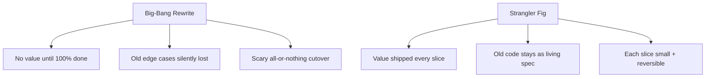
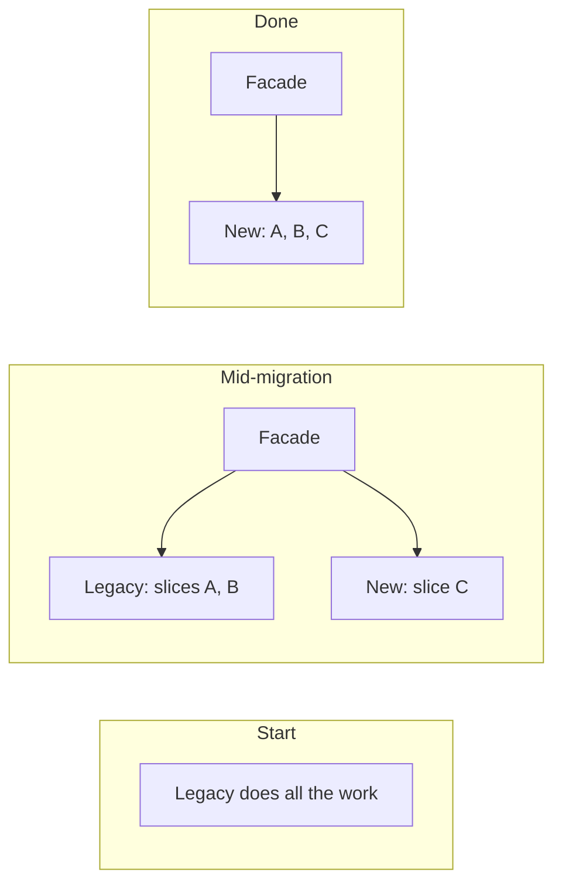

# Strangler Fig & Seams — Junior

> **Category:** [Anti-Patterns at Scale](../README.md) → **Strangler Fig & Seams** — *replace a legacy component incrementally — wrap it, route around it, grow the new one until the old is dead — instead of a big-bang rewrite.*
> **Covers (collectively):** Strangler Fig pattern · Seams · Branch by Abstraction · Characterization tests · Parallel-run / shadow & verification

---

## Introduction

> Focus: **Why a rewrite usually fails; what a seam is.**

You will, sooner than you expect, be handed code that everyone hates. It's old, tangled, badly named, and slow. The obvious move feels like: *throw it away and rewrite it properly.* That instinct is almost always wrong, and this topic is about what to do instead.

The professional answer is to **replace legacy code in small slices while it keeps working** — never in one dramatic switch-over. Two ideas make that possible:

- **The Strangler Fig** — a strategy. You grow the new system *around* the old one, move one piece of work at a time onto the new code, and delete the old piece once nothing calls it. The old system shrinks slice by slice until it's gone.
- **A Seam** — a technique. A seam is a place where you can **change what code does without editing that code in the place it runs.** Seams are what let you insert the new behavior beside the old.

At the junior level you don't plan whole migrations yet — that's [`senior.md`](senior.md). Your job is to *understand why the big rewrite is a trap* and to *recognize and create a seam* in the small piece of code in front of you today.

> **The mindset shift:** "rewrite" sounds like progress and feels heroic; it is usually the riskiest thing you can do. The slow, boring, slice-by-slice replacement is the one that actually ships.

---

## Prerequisites

- **Required:** You can write functions, classes, and interfaces in at least one language (examples here use Java, Go, and Python).
- **Required:** You understand what an *interface* (or abstract type / protocol) is — a contract that hides which concrete implementation is behind it.
- **Helpful:** You've worked with **legacy code** at least once — code you were scared to change because you couldn't predict what would break.
- **Helpful:** Basic familiarity with unit tests; later levels lean on tests heavily.

---

## Why the Rewrite Almost Always Fails

The "let's just rewrite it" plan fails for reasons that have very little to do with how good a programmer you are:

1. **The old system is the spec.** Years of bug fixes, edge cases, and "we handle this weird customer" logic live *only* in the old code. Nobody wrote them down. A rewrite from the visible requirements quietly drops all of them, and you rediscover each one as a production incident.
2. **You can't ship until it's 100% done.** A rewrite delivers *zero* value until the day it fully replaces the old system. For months you have two codebases, double the bugs, and nothing to show. Meanwhile the old system keeps changing — so you're chasing a moving target.
3. **"Second-system" bloat.** Given a blank page, teams pile in every feature they always wanted. The rewrite balloons, the deadline slips, and management eventually cancels it — leaving you with the old system *plus* a half-finished new one.
4. **Big-bang cutover is terrifying.** Flipping everything to the new system on one night means if anything is wrong, *everything* is wrong, and rollback means reverting the whole world.

The incremental approach inverts every one of these: it ships value continuously, keeps the old behavior as a living reference, and makes each step small enough to verify and undo.



---

## The Strangler Fig Metaphor

The name comes from a real plant. A **strangler fig** seed sprouts in the canopy of a host tree and sends roots down *around* the trunk. Over years the fig grows a complete structure of its own around the host. Eventually the original tree dies and rots away — and the fig is left standing, now fully self-supporting, in the exact shape of the tree it replaced.

Martin Fowler borrowed this for software:

- The **host tree** is the legacy system.
- The **new fig** is your replacement, growing *around* the old one rather than inside it.
- You **route work** over to the new structure one slice at a time.
- When **nothing uses the old piece anymore**, you delete it — the legacy "dies and rots away."

The whole point: at every moment, *something* is running and serving real traffic. You are never in a state where the old system is broken but the new one isn't ready. You grow new, route over, delete old — repeat — until the legacy is gone.



The thin **facade** in the middle picture is doing the routing: callers talk to the facade, and *it* decides whether each request goes to the old code or the new code. That routing layer is the senior-level machinery; here, just notice that it lets old and new coexist.

---

## What a Seam Is

The term **seam** comes from Michael Feathers' *Working Effectively with Legacy Code*. His definition is precise and worth memorizing:

> A **seam** is a place where you can alter behavior in your program **without editing in that place.**

Read that twice. The power is *"without editing in that place."* If the only way to change what a piece of code does is to open it up and rewrite its insides, you have no seam — and legacy code is hard precisely because it's full of behavior with no seams. A seam gives you a *different* spot — a parameter, an interface, a config value — where you can swap behavior in and out.

The most common seam is an **interface (object seam).** When code calls through an interface rather than naming a concrete class, you can hand it a different implementation without touching the calling code at all:

```java
// NO seam: callers name the concrete class. To change behavior you must
// edit every call site — there's no place to swap it out.
class Report {
    void send() {
        new SmtpMailer().mail(render());   // hard-wired to SMTP
    }
}

// SEAM: callers depend on an interface. The behavior can be changed from
// OUTSIDE — by passing a different Mailer — without editing Report at all.
interface Mailer { void mail(String body); }

class Report {
    private final Mailer mailer;
    Report(Mailer mailer) { this.mailer = mailer; }   // the seam is right here
    void send() { mailer.mail(render()); }
}
```

In the second version, `Report` has a seam: the `Mailer` it receives. A test can pass a fake mailer; production can pass the real one; and tomorrow you can pass a *new* implementation — all **without editing `Report`.** That "swap from outside" ability is the foundation of every technique in this whole topic.

---

## A Tiny Worked Example: Wrapping a Legacy Function

Let's create a seam where there isn't one. Suppose you have a gnarly legacy pricing function you can't safely change yet, but you want to start migrating callers toward a new implementation.

**Step 1 — the legacy function, called directly everywhere:**

```go
// Legacy: 200 lines of accumulated pricing rules. Called from 30 places.
func calcPrice(order Order) int {
    // ...tax, discounts, loyalty, currency rounding, the works...
    return total
}
```

There's no seam: every caller says `calcPrice(o)` by name. To swap in new code you'd have to edit all 30 callers at once.

**Step 2 — introduce an interface (the seam):**

```go
// A seam: an interface that BOTH the old and a future new implementation satisfy.
type Pricer interface {
    Price(order Order) int
}

// Wrap the legacy function so it satisfies the interface — behavior unchanged.
type LegacyPricer struct{}
func (LegacyPricer) Price(o Order) int { return calcPrice(o) }
```

**Step 3 — make callers depend on the seam, not the function:**

```go
// Callers now hold a Pricer. They no longer name calcPrice directly.
type Checkout struct {
    pricer Pricer
}

func (c *Checkout) Total(o Order) int {
    return c.pricer.Price(o)   // goes wherever the injected Pricer points
}
```

Wire it up with `LegacyPricer` for now and nothing changes — same behavior, same output. But you've gained something huge: **the day a new implementation exists, you swap it in at one wiring point**, and no caller code changes.

```go
// Today:
checkout := &Checkout{pricer: LegacyPricer{}}

// Tomorrow, when the new one is ready and verified:
checkout := &Checkout{pricer: NewPricer{}}   // one line; callers untouched
```

That single swappable point is your strangler fig in miniature: old behavior wrapped, callers routed through a seam, new implementation ready to grow in. The senior level scales this from one function to a whole subsystem.

---

## Seams You Already Have

You don't always have to *build* a seam — many already exist in code that was written with normal good practices. Recognizing them is half the skill:

| Seam | Where the swap happens | Example |
|---|---|---|
| **Object / interface seam** | Pass a different implementation of an interface | The `Mailer` and `Pricer` examples above |
| **Parameter seam** | Pass a different function or value as an argument | `sort(items, byPrice)` vs `sort(items, byName)` |
| **Config / flag seam** | Flip a setting read at startup | `USE_NEW_PRICER=true` chooses the implementation |
| **Subclass / override seam** | Override a method in a subclass (or test double) | A test subclass overrides `now()` to return a fixed time |

The richest seam is the object seam, because it swaps a whole bundle of behavior cleanly. If you take one habit from this file, make it this: **depend on interfaces, inject implementations.** Code written that way is *already* ready to be strangled.

---

## The Vocabulary You'll Hear

You'll meet these words in standups and design docs. Here's the junior-level gist; deeper levels unpack each.

- **Branch by Abstraction** — the disciplined recipe for swapping an implementation behind a seam: add the abstraction, move every caller to it, build the new implementation, flip the seam, delete the old. Full walkthrough in [`middle.md`](middle.md).
- **Characterization test** (a.k.a. *golden-master* test) — a test that captures *what the legacy code does right now*, even if that behavior is weird. You write it *before* you change anything, so you'll know the instant your change alters behavior. Also in [`middle.md`](middle.md).
- **Parallel run / shadow** — run the old and new implementations *side by side* on real input and compare their outputs, without the new one affecting users. It's how you build confidence that "new == old" before cutting over. Covered in [`senior.md`](senior.md) and [`professional.md`](professional.md).

---

## Common Mistakes

1. **Reaching for the rewrite.** "It'd be faster to start fresh" is the single most expensive sentence in software. Default to incremental; justify a rewrite only when the slice-by-slice path is genuinely impossible.
2. **Confusing a seam with a code edit.** If your plan to change behavior is "open the file and rewrite the body," that's not a seam — that's editing in place, with all the risk that entails. A seam changes behavior *from outside.*
3. **Hard-wiring concrete classes.** `new SmtpMailer()` inside a method destroys the seam you could have had. Depend on the interface; receive the implementation.
4. **Changing behavior while creating the seam.** Introducing the seam (wrapping legacy behind an interface) must be a *pure refactor* — same behavior, byte for byte. "Improve it while I'm in here" is how a safe step becomes a bug.
5. **Deleting the old code too early.** The old path is your safety net and your spec. Delete it only when you've verified nothing uses it — not the moment the new code compiles.

---

## Test Yourself

1. In one sentence each, give two concrete reasons a big-bang rewrite of a legacy system usually fails.
2. State Michael Feathers' definition of a *seam.* What four words make it powerful?
3. Why is an interface a seam but a directly-called concrete class is not?
4. You have `func calcTax(o Order) int` called directly from 20 places, and you want to start migrating to a new tax engine. What is the *first* step, and why does it not change any behavior?
5. A teammate says: "While I'm wrapping the legacy pricer behind an interface, I'll also fix that rounding bug I spotted." Why is that a bad idea *in this step*?

---

## Cheat Sheet

| Concept | One-line meaning | Why it matters |
|---|---|---|
| **Big-bang rewrite** | Throw it all away, build fresh, switch over once | Usually fails: loses the spec, ships late, scary cutover |
| **Strangler Fig** | Grow new around old; route work over slice by slice; delete old when unused | Always something running; each step small + reversible |
| **Seam** | A place to change behavior *without editing in place* | The mechanism that lets old + new coexist |
| **Object seam** | Depend on an interface; inject the implementation | Swap whole behaviors from outside — the richest seam |
| **Wrap the legacy** | Put old code behind an interface unchanged | Creates a seam where there was none, with zero behavior change |

> **One rule to remember:** *Don't rewrite — strangle. And before you can strangle anything, find or make a seam.*

---

## Summary

- The instinct to **rewrite** legacy code is almost always a trap: rewrites lose the undocumented spec, deliver no value until fully done, bloat with new features, and end in a terrifying all-or-nothing cutover.
- The **Strangler Fig** is the alternative: grow the new system *around* the old, route work over one slice at a time, and delete each old piece once nothing uses it — so something always works and every step is small and reversible.
- A **seam** is a place where you can change behavior *without editing in that place.* It is the technique that lets old and new code coexist. The richest seam is the **object seam**: depend on an interface, inject the implementation.
- You create a seam by **wrapping legacy code behind an interface as a pure refactor** — no behavior change — then routing callers through the interface, so a new implementation can be swapped in later at one point.
- At this level you recognize *why* incremental beats big-bang and you can *make a seam* in a small piece of code. Next: [`middle.md`](middle.md) — *introduce a seam methodically with Branch by Abstraction, and pin the legacy's current behavior with characterization tests before you touch it.*

---

## Further Reading

- **Working Effectively with Legacy Code** — Michael Feathers (2004) — the source of *seams*; the whole book is about changing code that has none.
- **StranglerFigApplication** — Martin Fowler, martinfowler.com (2004) — the original write-up of the metaphor and strategy.
- **Refactoring** — Martin Fowler (2nd ed., 2018) — Extract Interface, Encapsulate, and the small behavior-preserving steps that create seams.
- **The Pragmatic Programmer** — Hunt & Thomas (20th anniv. ed., 2019) — on why grand rewrites and "second systems" go wrong.

---

## Related Topics

- Refactoring → Refactoring Techniques — Extract Interface and the small safe steps that introduce a seam.
- Design Patterns → Structural — Adapter and Facade: the patterns you wrap legacy code with.
- Architecture → Anti-Patterns — the system-shape view of legacy and migration.
- [Bad Structure → Junior](../../01-development/01-bad-structure/senior.md) — the kind of tangled code that ends up needing a strangler migration.
- [Expand–Contract Refactors → Senior](../06-expand-contract-refactors/senior.md) — the sibling pattern for evolving an interface or schema without a flag day.

---

## Check your understanding

1. Explain Strangler Fig & Seams — Junior Level in your own words and name the problem it solves.
2. How would you apply the ideas around Table of Contents, Introduction, Prerequisites in a realistic engineering change?
3. What failure mode or misuse should you look for, and what evidence would reveal it?
4. What small example would prove that you can apply Strangler Fig & Seams — Junior Level correctly?
5. What observable result would convince you that the approach improved the system?
