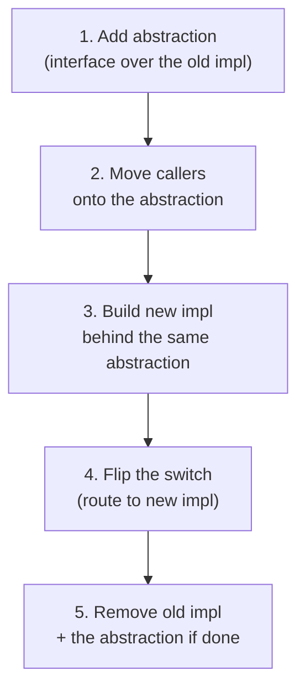

# Strangler Fig & Seams — Middle

> **Category:** [Anti-Patterns at Scale](../README.md) → **Strangler Fig & Seams** — *replace a legacy component incrementally — wrap it, route around it, grow the new one until the old is dead — instead of a big-bang rewrite.*
> **Covers (collectively):** Strangler Fig pattern · Seams · Branch by Abstraction · Characterization tests · Parallel-run / shadow & verification

---

## Table of Contents

1. [Introduction](#introduction)
2. [Prerequisites](#prerequisites)
3. [Pin the Behavior First: Characterization Tests](#pin-the-behavior-first-characterization-tests)
4. [Golden-Master Tests for Tangled Output](#golden-master-tests-for-tangled-output)
5. [Branch by Abstraction, Step by Step](#branch-by-abstraction-step-by-step)
6. [A Full Worked Migration](#a-full-worked-migration)
7. [Why Each Step Is Safe](#why-each-step-is-safe)
8. [Branch by Abstraction vs Feature Branch](#branch-by-abstraction-vs-feature-branch)
9. [Common Mistakes](#common-mistakes)
10. [Test Yourself](#test-yourself)
11. [Cheat Sheet](#cheat-sheet)
12. [Summary](#summary)
13. [Further Reading](#further-reading)
14. [Related Topics](#related-topics)

---

## Introduction

> Focus: **Introduce a seam; branch by abstraction.**

[`junior.md`](junior.md) gave you the *why* (rewrites fail) and the *what* (a seam lets old and new coexist). This file gives you the *how*: the two disciplined techniques that turn "swap in a new implementation" from a scary leap into a sequence of individually safe steps.

There are exactly two skills here, and they go together:

1. **Characterization tests** — before you change a single line of legacy code, you *pin its current behavior* with tests. Not the behavior you *wish* it had — the behavior it *actually has*, bugs and all. These tests are your alarm: the moment your change alters output, they fail.
2. **Branch by Abstraction** — the canonical five-step recipe for replacing an implementation behind a seam without ever breaking the build or stopping the world: add an abstraction, move callers to it, build the new implementation behind it, flip the switch, remove the old.

The thread connecting both: **you must be able to tell, at every step, whether behavior changed.** Characterization tests give you that signal; Branch by Abstraction keeps every step small enough that when the signal fires, you know exactly which step caused it.

> **The mental model:** you are not "rewriting a module." You are performing a series of *behavior-preserving* moves, each verified, with one clearly-marked step where behavior is *intended* to change (the new implementation taking over). Everything else must be provably identical.

---

## Prerequisites

- **Required:** [`junior.md`](junior.md) — you know what a seam is and can wrap a legacy function behind an interface.
- **Required:** You can write unit tests and run them quickly in your language (Java/JUnit, Go `testing`, Python `pytest`).
- **Required:** Comfort with interfaces / dependency injection — passing an implementation in rather than constructing it inside.
- **Helpful:** Familiarity with a feature-flag or config mechanism, even a simple boolean read from the environment.
- **Helpful:** The unit-testing-patterns and mocking-strategies skills for vocabulary used below.

---

## Pin the Behavior First: Characterization Tests

The cardinal rule of touching legacy code: **before you change behavior, capture the behavior you have.** A *characterization test* does exactly that. Its job is not to assert that the code is *correct* — it's to assert that the code does *what it currently does*, so any future change that alters that becomes visible immediately.

The technique, from Feathers, is almost mechanical:

1. Write a test that calls the legacy code with some input and asserts a placeholder (e.g. `assertEquals("CHANGEME", result)`).
2. Run it. It fails, and the failure message *tells you the actual output.*
3. Paste that actual output into the assertion.
4. Now the test passes — it has *characterized* (pinned) the real behavior.

```python
# Step 1: assert a deliberately-wrong placeholder.
def test_characterize_shipping():
    assert compute_shipping(weight=4.2, zone="EU", express=True) == "CHANGEME"

# Run it. pytest prints:  AssertionError: assert 18.75 == 'CHANGEME'
# So the real, current answer is 18.75 (whether or not that's "right").

# Step 2: lock in the actual behavior.
def test_characterize_shipping():
    assert compute_shipping(weight=4.2, zone="EU", express=True) == 18.75
```

You now have a tripwire. If anyone — including future-you, mid-migration — changes `compute_shipping` in a way that turns 18.75 into 18.80, this test screams. Note what you did *not* do: you did **not** decide whether 18.75 is correct. Maybe it's a bug. That's fine. The characterization test's promise is narrow and exactly what you need: *"behavior did not change unintentionally."*

> **Why this is non-negotiable:** legacy code's value is its behavior, and most of that behavior is undocumented. Without characterization tests you are migrating blind — you literally cannot tell whether your "equivalent" new implementation matches the old one. The tests turn "I think it's the same" into "the suite is green."

Cover the cases that matter: typical inputs, boundaries, and especially the *weird* ones you find in `git log` and bug-tracker history — those undocumented edge cases are precisely what a rewrite would lose.

---

## Golden-Master Tests for Tangled Output

Some legacy code produces output too large or messy to assert field by field — a generated HTML invoice, a CSV export, a 4 KB JSON blob, a rendered PDF. Writing individual assertions is hopeless. The answer is a **golden-master** (a.k.a. *snapshot* or *approval*) test: capture the entire output once, save it as the "golden" reference file, and on every run compare the fresh output against it.

```go
// Golden-master test: render with a fixed input, compare to a saved reference.
// The -update flag regenerates the golden file when a change is INTENTIONAL.
var update = flag.Bool("update", false, "rewrite golden files")

func TestInvoiceGolden(t *testing.T) {
    got := RenderInvoice(fixtureOrder())     // the legacy renderer's full output
    golden := "testdata/invoice.golden.html"

    if *update {
        os.WriteFile(golden, got, 0o644)     // bless the new output as the reference
        return
    }
    want, _ := os.ReadFile(golden)
    if !bytes.Equal(got, want) {
        t.Errorf("invoice output changed:\n%s", diff(want, got))  // show the diff
    }
}
```

Workflow: run once with `-update` to record the legacy's current output as the golden file, commit it, and from then on the test fails on *any* change to that output — printing a diff that shows exactly what moved. When you deliberately change behavior, you review the diff carefully and re-bless with `-update`. The golden master is a characterization test for output that's too big to spell out.

> **Caution:** golden masters must be **deterministic.** Strip or freeze anything that varies run to run — timestamps, random IDs, map iteration order, locale — or the test fails for reasons that have nothing to do with your change. Non-determinism is the number-one reason snapshot tests get ignored and rot.

---

## Branch by Abstraction, Step by Step

With behavior pinned, you can replace the implementation. **Branch by Abstraction** is the technique for doing that *on the mainline* (no long-lived feature branch), keeping the build green at every commit. It has five steps:



1. **Add an abstraction** over the part you want to replace. Create an interface; make the *existing* code implement it. No behavior changes — this is the seam from `junior.md`.
2. **Move all callers** onto the abstraction. Now nothing references the old concrete code directly; everything goes through the interface. Still no behavior change; ship it.
3. **Build the new implementation** behind the *same* abstraction. It can be incomplete — it lives beside the old one and nothing routes to it yet. The build stays green because the old implementation is still in charge.
4. **Flip the switch.** Point the abstraction at the new implementation — usually behind a config flag so you can flip back instantly. *This* is the one step where behavior is intended to change. Your characterization tests now verify new == old.
5. **Remove the old implementation** once the new one is proven in production. Delete the flag, the old class, and — if no longer needed — the abstraction itself.

The magic of this ordering: steps 1, 2, 3, and 5 are *pure refactors* (behavior preserved), and step 4 is a *single, reversible* behavior change. You never have a broken mainline, and you can pause for days between any two steps with everything still working.

---

## A Full Worked Migration

Let's migrate a notification system from a legacy SMS sender to a new provider, end to end, in Go.

**Starting point — callers hard-wired to the legacy sender:**

```go
// Legacy, called directly from many handlers.
func sendSMSLegacy(to, body string) error { /* old vendor SDK */ }
```

**Step 0 — characterize.** Pin what the legacy does for the inputs that matter (formatting, truncation at 160 chars, how it handles `+` prefixes, error cases) so we can later assert the new sender matches.

**Step 1 — add the abstraction (the seam):**

```go
type SMSSender interface {
    Send(to, body string) error
}

// Wrap the legacy unchanged — pure refactor, behavior identical.
type legacySender struct{}
func (legacySender) Send(to, body string) error { return sendSMSLegacy(to, body) }
```

**Step 2 — move callers onto the abstraction:**

```go
type Notifier struct{ sms SMSSender }

func (n *Notifier) Alert(to, msg string) error {
    return n.sms.Send(to, msg)   // no caller names sendSMSLegacy anymore
}
// Wire with legacySender{} for now — output unchanged. Commit, ship.
```

**Step 3 — build the new implementation behind the same interface:**

```go
type twilioSender struct{ client *twilio.Client }
func (t twilioSender) Send(to, body string) error { /* new vendor */ }
```

It compiles and is tested in isolation, but nothing routes to it yet — `legacySender` is still wired in. Mainline stays green.

**Step 4 — flip the switch behind a flag:**

```go
func newSMSSender() SMSSender {
    if os.Getenv("SMS_PROVIDER") == "twilio" {
        return twilioSender{client: dial()}
    }
    return legacySender{}        // default: old path, instant rollback by env
}
```

Flip the flag for 1% of traffic, then 10%, then 100%, watching error rates and your characterization tests. If anything looks wrong, set the env var back — instant, total rollback with no deploy.

**Step 5 — remove the old path** once `twilio` has run at 100% cleanly long enough to trust:

```go
// Delete legacySender, sendSMSLegacy, the flag, and the branch.
func newSMSSender() SMSSender { return twilioSender{client: dial()} }
```

The legacy is gone. At no point was the build broken, and at no point was there a state you couldn't roll back from in seconds.

---

## Why Each Step Is Safe

It's worth being explicit about *why* this ceremony pays off, because under deadline pressure the temptation is to skip to step 4:

| Step | Behavior change? | What protects you |
|---|---|---|
| 1. Add abstraction | No — pure refactor | Characterization tests stay green; trivial to review |
| 2. Move callers | No — pure refactor | Same; mechanical, often tool-assisted |
| 3. Build new impl | No — nothing routes to it | New code is dead until wired; can't break prod |
| 4. Flip the switch | **Yes — intended** | Flag = instant rollback; characterization tests verify new == old; gradual % rollout |
| 5. Remove old | No — dead code deletion | Old path is unreferenced; git keeps history |

The single point of real risk is step 4, and it is the *most* protected: it's reversible by a config flip, gated behind a gradual rollout, and watched by the tests you wrote in step 0. Compare that to a feature branch where 4,000 lines change at once and "flip the switch" means merging the whole thing on one terrifying afternoon.

---

## Branch by Abstraction vs Feature Branch

A common confusion: "isn't Branch by Abstraction just a feature branch?" No — and the difference is the whole point.

- A **feature branch** isolates work in version control. The new and old code diverge in *git*; integration is deferred to a big merge at the end, with all the conflict and big-bang risk that implies.
- **Branch by Abstraction** isolates work in the *code* (behind an interface/flag) while keeping everything on the **mainline**, continuously integrated. New and old coexist in the running system; you integrate constantly and cut over gradually.

Branch by Abstraction is what makes **trunk-based development** possible for large changes: you can land a half-finished replacement on `main` every day because it's inert behind the abstraction until you flip the flag. There's no long-lived branch to rot and no merge-day cliff.

---

## Common Mistakes

1. **Changing behavior while adding the abstraction.** Steps 1–3 must be *pure refactors.* If you "improve" the code while wrapping it, you've conflated a refactor with a behavior change and lost your safety guarantee.
2. **Skipping characterization tests** because "I understand the code." You don't understand the undocumented edge cases — nobody does, that's why it's legacy. Pin the behavior first or you're migrating blind.
3. **Characterizing only the happy path.** The edge cases *are* the spec. Mine `git log`, bug tickets, and weird production inputs; those are exactly what a naive rewrite drops.
4. **Non-deterministic golden masters.** Timestamps, random IDs, and map ordering make snapshot tests fail randomly, so people start ignoring them — and then they protect nothing. Freeze all sources of variance.
5. **Flipping the switch for 100% of traffic at once.** The flag exists so you can roll out gradually (1% → 10% → 100%) and roll *back* instantly. Going straight to 100% throws away the main benefit.
6. **Leaving the abstraction and old code forever (step 5 never happens).** The migration isn't done until the old path and the flag are deleted. A half-finished strangler is its own anti-pattern — see [`professional.md`](professional.md) on the migration that never finishes.

---

## Test Yourself

1. What is the purpose of a characterization test, and how is it different from a normal unit test that checks correctness?
2. Describe the four-step mechanical recipe for *writing* a characterization test when you don't yet know the code's output.
3. List the five steps of Branch by Abstraction in order. Which single step is the only one that intentionally changes behavior?
4. Why does Branch by Abstraction keep the build green at every commit, whereas a long-lived feature branch defers all the risk to merge day?
5. When is a *golden-master* test the right tool instead of field-by-field assertions, and what is the one property the output must have for it to work?
6. Your teammate adds the abstraction (step 1) and, in the same commit, renames variables and fixes a rounding bug. Why does this undermine the whole technique?

---

## Cheat Sheet

| Technique | What it does | When to reach for it |
|---|---|---|
| **Characterization test** | Pins current actual behavior (bugs and all) | Always, *before* touching legacy code |
| **Golden-master / snapshot** | Pins large/messy output as a reference file + diff | Output too big to assert field by field |
| **Branch by Abstraction** | 5-step in-place replacement, build green throughout | Replacing an impl without a long-lived branch |
| **Feature flag at the seam** | Routes the abstraction old↔new at runtime | Step 4: gradual rollout + instant rollback |

**The Branch-by-Abstraction order (memorize):**
*Add abstraction → move callers → build new → flip switch → remove old.*
Steps 1, 2, 3, 5 are pure refactors; only step 4 changes behavior — and it's flag-gated and reversible.

> **One rule to remember:** *Pin the behavior, then replace the implementation in steps where only one step is allowed to change behavior — and that step is reversible.*

---

## Summary

- Before changing legacy code, **pin its current behavior** with **characterization tests** (assert a placeholder, run, paste the real output) and **golden-master tests** for output too large to spell out. They detect *unintended* change; they make no claim about correctness — that's the point.
- Characterize the **edge cases**, mined from `git log` and bug history — those undocumented behaviors are exactly what a rewrite silently drops.
- **Branch by Abstraction** replaces an implementation in five steps: add an abstraction (the seam), move callers onto it, build the new impl behind it, flip the switch (flag-gated), remove the old. Four steps are pure refactors; only the flip changes behavior, and it's reversible.
- This keeps the **mainline green at every commit** and enables trunk-based development for large changes — no long-lived feature branch, no merge-day cliff. Flip gradually (1% → 10% → 100%), watch the tests, roll back with a config flip if needed.
- The migration isn't finished until **step 5** deletes the old path and the flag. Leaving it half-done is its own problem.
- Next: [`senior.md`](senior.md) — *plan a strangler migration of a whole subsystem: a routing facade over old and new, slice-by-slice cutover, parallel-run verification, and coexisting data.*

---

## Further Reading

- **Working Effectively with Legacy Code** — Michael Feathers (2004) — the characterization-test recipe and the full taxonomy of seams.
- **BranchByAbstraction** — Martin Fowler, martinfowler.com — the canonical five-step description and its relation to continuous integration.
- **Refactoring** — Martin Fowler (2nd ed., 2018) — Extract Interface, Move Function, and the behavior-preserving steps that make 1–3 and 5 safe.
- **Continuous Delivery** — Humble & Farley (2010) — Branch by Abstraction in the context of trunk-based development and release flags.
- **Approval Testing** (Llewellyn Falco / `approvaltests`) — golden-master testing as a discipline, including diff tooling.

---

## Related Topics

- Refactoring → Refactoring Techniques — Extract Interface and the safe moves behind steps 1–3.
- Design Patterns → Structural — Adapter (wrap legacy to fit a new interface) and Facade (the routing seam).
- Architecture → Anti-Patterns — the system-level view of incremental migration.
- [Coupling & State → Senior](../../02-design/02-coupling-and-state/senior.md) — dependency injection, the wiring that makes the seam swappable.
- [Expand–Contract Refactors → Senior](../06-expand-contract-refactors/senior.md) — the sibling technique for changing an interface/schema in compatible steps.
- [Hotspot Analysis → Senior](../03-hotspot-analysis/senior.md) — how to pick *which* legacy subsystem is worth stranglering first.

---

## Check your understanding

1. Explain Strangler Fig & Seams — Middle Level in your own words and name the problem it solves.
2. How would you apply the ideas around Table of Contents, Introduction, Prerequisites in a realistic engineering change?
3. What failure mode or misuse should you look for, and what evidence would reveal it?
4. Which local design trade-off would make you choose or reject Strangler Fig & Seams — Middle Level in an existing codebase?
5. What observable result would convince you that the approach improved the system?
