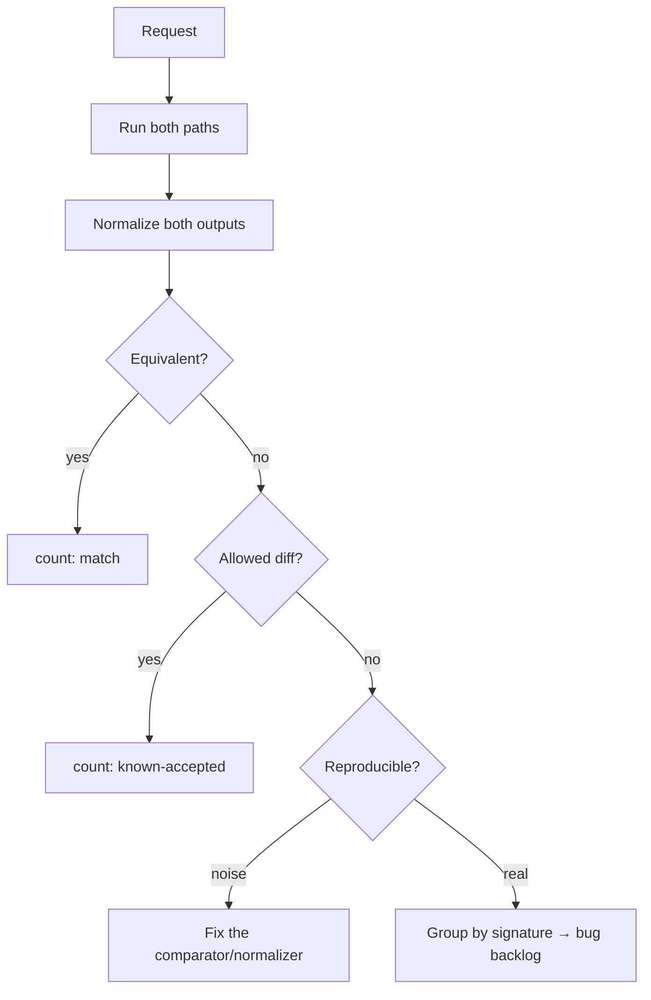
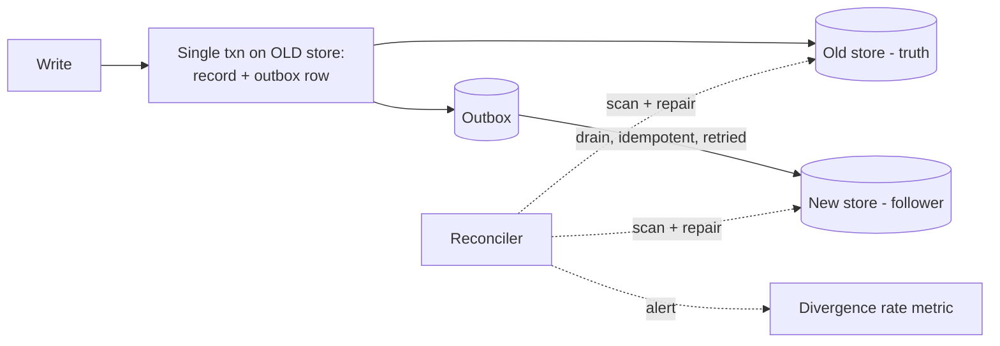

# Strangler Fig & Seams — Professional

> **Category:** [Anti-Patterns at Scale](../README.md) → **Strangler Fig & Seams** — *replace a legacy component incrementally — wrap it, route around it, grow the new one until the old is dead — instead of a big-bang rewrite.*
> **Covers (collectively):** Strangler Fig pattern · Seams · Branch by Abstraction · Characterization tests · Parallel-run / shadow & verification

---

## Introduction

> Focus: **Correctness & performance during coexistence** — the cost of shadow traffic, in-production diffing and discrepancy handling, dual-write/dual-read integrity, feature-flag ordering, rollback safety, routing latency, and the migration that *never finishes* — the permanent two-systems tax — and how to force completion.

[`senior.md`](senior.md) planned the migration: facade, slices, parallel-run, data coexistence, deletion criteria. This file lives inside the **coexistence window** — the weeks or months when *both* systems run at once — where the real costs and the real incidents are.

The professional truths of this level:

1. **Coexistence is the most expensive and most dangerous state of the whole migration, and you choose how long to stay in it.** Two code paths, two data stores, double the infrastructure, and the integrity hazards that only exist *because* two things write the same truth. The state you're trying to leave is the state you're paying the most for.
2. **The dominant failure mode is not a botched cutover — it's a migration that never finishes.** A stalled strangler leaves the facade, both implementations, and the dual-write running *forever*, a permanent tax that compounds. The single most important professional skill here is **forcing completion.**

Everything below is paired with how you *measure* it and how it *fails*, because at this level "it seems equivalent and fast enough" is not an engineering claim.

> **The mental model:** coexistence is a *temporary, expensive, hazardous bridge* you build to cross a river. Bridges are for crossing, not living on. Every mechanism here either makes the crossing safe (diffing, dual-write integrity, rollback) or makes sure you actually reach the other side and tear the bridge down (flag hygiene, completion forcing).

---

## Prerequisites

- **Required:** [`senior.md`](senior.md) — the routing facade, slicing, parallel-run, equivalence measurement, and data-coexistence shapes are the structures this file stress-tests.
- **Required:** A working model of distributed-systems failure: partial failure, retries, idempotency, at-least-once delivery, and why dual-write is not atomic.
- **Required:** Comfort reading production telemetry — latency percentiles (p50/p99/p999), error budgets, and a contention/latency profile.
- **Helpful:** Experience operating feature-flag systems and a real rollback under pressure.
- **Helpful:** The transaction-isolation, event-driven-architecture, observability-stack, and retry-pattern skills for the integrity and measurement machinery.

---

## The Cost of Coexistence: A Map

Before optimizing any one piece, see the whole bill. Running two systems costs more than running either alone, on several axes at once:

| Cost axis | Where it comes from | How you measure it |
|---|---|---|
| **Compute** | Shadow runs the new path on top of legacy; both implementations deployed | CPU/req before vs during shadow; instance count delta |
| **Latency** | The routing facade adds a hop; sync shadow adds the slower of two paths | p99 of facade vs direct; shadow-on vs shadow-off |
| **Data** | Dual-write storage; two stores; reconciliation jobs | Storage $, write IOPS, reconciliation lag |
| **Integrity risk** | Two writers to one logical truth; partial dual-write failures | Divergence rate between stores |
| **Cognitive** | Engineers must hold *both* systems + the routing in their heads | Onboarding time; "which path served this?" incidents |
| **Opportunity** | Team capacity locked in the migration instead of features | Migration duration × team size |

The compute and latency costs are *temporary if the migration finishes* and *permanent if it doesn't* — which is the whole argument of the final section. Keep this table in mind: every decision below trades one of these axes against safety, and your job is to keep the bridge cheap *and short-lived*.

---

## Shadow-Traffic Cost and How to Bound It

Parallel-run doubles the work for shadowed requests — and if you implement it naively it also doubles your *latency* and can take down production by overloading the new path. Bounding shadow cost is a hard requirement, not an optimization.

**Synchronous shadow is a latency trap.** If the facade waits for *both* paths before responding, the user's latency becomes `max(legacy, modern)` — and during early migration the new path is often slower and less stable. You've made every shadowed request as slow as your worst implementation.

```go
// WRONG: synchronous shadow — user waits for the slower of the two paths.
func (s *Shadow) Compare(ctx context.Context, r Req) Receipt {
    want := s.legacy.Charge(ctx, r)   // user blocks here...
    got  := s.modern.Charge(ctx, r)   // ...AND here. p99 = max(legacy, modern).
    s.diff(want, got)
    return want
}
```

```go
// RIGHT: legacy serves the user immediately; modern runs async, bounded, sampled.
func (s *Shadow) Compare(ctx context.Context, r Req) Receipt {
    want := s.legacy.Charge(ctx, r)            // user gets this now; no extra wait
    if s.sampled(r) {                          // shadow a SAMPLE, not 100%, early on
        go func() {
            sctx, cancel := context.WithTimeout(detach(ctx), shadowBudget)
            defer cancel()                     // bounded: a slow modern can't pile up
            if got, err := s.modern.Charge(sctx, r); err == nil {
                s.diff(want, got)
            }
        }()
    }
    return want
}
```

The four levers that bound shadow cost:

- **Asynchronous** — the user never waits on the shadow path; latency stays at legacy's.
- **Sampled** — shadow 1% or 5% early (when the new path is fragile and you just need a diff *signal*), ramp to 100% only when it's stable and you need *coverage*. Sampling cuts cost linearly.
- **Bounded** — a timeout and a concurrency cap on shadow work so a slow or wedged new path can't exhaust goroutines/threads/connections and harm production.
- **Isolated resources** — shadow uses its own connection pool / thread pool / rate limit, so it can't starve the path that's actually serving users.

> **Measure it:** compare p99 with shadow off vs on (must be ≈ unchanged — if not, your shadow is synchronous or unbounded), and watch the new path's own error rate under shadow load (it's a free load test of the new system). Detached context is essential: the shadow must not inherit the user request's cancellation/deadline, or it'll be killed before it can produce a comparable result.

---

## Diffing in Production: Discrepancies Are the Job

In [`senior.md`](senior.md), equivalence was a function. In production at scale, *handling the diffs* — millions of them — is an operational discipline. The diff pipeline is the real work of the coexistence window.



Three things separate a working diff pipeline from a wall of noise:

1. **Normalize aggressively, then comparators per field.** The first version of any diff pipeline drowns in *false* discrepancies — reordered JSON, formatted floats, non-deterministic IDs, timestamps. Most "diffs" early on are bugs in your *comparator*, not in the new code. Fix the comparator until what remains is real.
2. **Group by signature, not by instance.** Ten million diffs are not ten million problems; they're usually a handful of *root causes* (one rounding rule, one timezone bug, one null-handling difference) each producing millions of instances. Cluster by a normalized signature so the backlog is the size of the *causes*.
3. **Sample what you store.** Persisting every diff with full request/response context will swamp your storage and your eyes. Store *all signatures*, but only a *sample of instances* per signature plus a count — enough to reproduce, not enough to drown.

> **The diff rate is a release gate with a defined shape, not just a threshold.** You want it *monotonically decreasing* and *flat-at-floor* before cutover. A diff rate that's low but *spiky* (occasional bursts) means an unhandled input class — don't cut over on the average; cut over on the worst sustained window. Real-world (GitHub's Scientist, AWS, Stripe-style migrations) experience: the long tail of diffs is where the genuinely scary behavior differences hide, and it's the last 0.1% that takes the most calendar time.

---

## Dual-Write / Dual-Read Integrity

The data side is where coexistence turns from "expensive" to "dangerous." When both the old and new stores must reflect the same writes, you have a distributed-systems problem dressed as a migration.

**Dual-write is not atomic.** Writing to two stores is two operations; any failure between them leaves the stores divergent:

```go
// The integrity hazard: this is two writes, not one transaction.
func write(r Record) error {
    if err := oldStore.Put(r); err != nil { return err }
    return newStore.Put(r)   // if THIS fails, oldStore has it and newStore doesn't → divergence
}
```

A crash, timeout, or partial failure between the two `Put`s leaves the stores inconsistent, and the gap silently grows. The mitigations, in increasing order of robustness:

- **Designate one authoritative store + asynchronous replication.** Write only to the old (authoritative) store synchronously; replicate to the new store via an outbox / CDC stream. The new store is *eventually* consistent and explicitly a follower — no two-writer ambiguity. This is the safest dual-write because it's really single-write-plus-replication.
- **Outbox pattern for atomicity.** Write the record *and* an "also write to new store" event in **one** transaction to the old store; a separate process drains the outbox to the new store with retries. The single local transaction makes the intent atomic; delivery is at-least-once, so the new-store write must be **idempotent**.
- **Reconciliation as a safety net, always.** Regardless of write strategy, run a background job that scans both stores, detects divergence, and repairs it — and *alerts on the divergence rate.* Divergence will happen; the question is whether you detect and bound it. A rising divergence rate is your early warning that the dual-write is broken.



**Dual-read** (read both, compare) is the read-side analogue of shadow and has the same rule: the **authoritative** store's answer is served; the follower's is compared. The read switch — making the new store authoritative — happens only after divergence has been zero for a burn-in. And there is an **ordering constraint**: you must dual-*write* (and reconcile to zero divergence) *before* you switch reads, or the new store will serve data it never fully received.

> **Measure integrity, don't assume it:** a continuous divergence-rate metric from the reconciler is the single most important number in the data migration. It should be zero or trending to zero; any sustained nonzero value means the dual-write is dropping records and the read switch must wait.

---

## Feature-Flag Mechanics and Ordering

Flags are the steering wheel of the migration, and their *mechanics* and *ordering* cause subtle, dangerous bugs.

**Mechanics that matter under load:**

- **Evaluation must be cheap and side-effect-free.** A flag checked on every request that hits a database or a remote config service per call adds latency and a dependency to *every* request. Evaluate against a locally-cached snapshot, refreshed in the background.
- **Decisions must be consistent for an entity across a request — and often across requests.** If the flag is sampled per call, one user's multi-step flow can hit *new* on step 1 and *old* on step 2, corrupting state. Make routing **sticky per entity** (hash the entity ID), so a given user/order is consistently on one side.
- **Flag state must be observable.** You need to know, per request, which path served it — emit it as a tag on every metric and log line, or you can't debug "this one came out wrong."

**Ordering — flags must be flipped in a dependency-respecting sequence.** The classic data-migration ordering is non-negotiable:

```
1. Deploy new code, flag OFF (new path inert)        — code present, unused
2. Turn ON dual-write                                 — both stores now receive writes
3. Backfill historical data into the new store        — new store becomes complete
4. Reconcile to zero divergence                       — prove the stores agree
5. Turn ON dual-read / shadow-read, compare           — verify reads match
6. Flip read authority to the new store               — new store now serves reads
7. Turn OFF write to the old store                     — old store now dead
8. Remove flags, dual-write, old store                 — migration complete
```

Get this order wrong and you fail in specific ways: switch reads (step 6) before backfill+reconcile (3–4) and the new store serves missing data; turn off old-store writes (step 7) before reads are switched (6) and you read stale data. Each flag has a **precondition** that must be *proven by a metric*, not assumed.

> **Flag hygiene is migration hygiene.** Every flag is a branch in your code *and* in your mental model. A migration with eight live flags and no record of which precondition each guards is one fat-fingered toggle away from an incident. Document each flag's precondition and its removal trigger *when you create it.*

---

## Rollback Safety Under Coexistence

The promise of the strangler is "instant rollback." That promise is *only true for stateless cutover.* Once dual-write and read-switches are involved, rollback gets sharp edges.

- **Routing rollback is instant and safe.** Flipping the read/route flag back to legacy is a config change with no data implications — *as long as the old store is still being written.* This is why you keep writing to the old store (step 7 is *last*): it preserves a coherent state to roll back *to*.
- **Rollback after the old store stops receiving writes is no longer free.** Once step 7 turns off old-store writes, the old store goes stale immediately. Rolling back now means the legacy path serves stale data — so rollback is no longer "flip a flag," it's "replay the gap." Treat step 7 as the **point of no easy return** and gate it hardest.
- **In-flight state straddling the cutover.** A multi-step workflow (saga, checkout) that started on the old path and is mid-flight when you flip can land in a state neither side fully owns. Either make cutover boundaries align with workflow boundaries (only route *new* workflows to the new side; let in-flight ones finish on the old) or make state portable between sides.
- **Idempotency makes rollback and retry safe.** If both paths and the rollback can re-apply an operation without double-effect (keyed by an idempotency token), then a confused rollback is recoverable rather than catastrophic.

> **Rehearse the rollback before you need it.** Roll a slice back in staging (and ideally once in prod, deliberately, at low traffic) so the rollback path is *tested*, not theoretical. The worst time to discover your rollback replays stale data is during the incident that requires it.

---

## Routing-Layer Latency

The facade is on the hot path of *every* request for the entire migration. Its overhead is multiplied by your full traffic and paid the whole coexistence window — so it must be near-free.

- **The facade adds at minimum one indirection; keep it to that.** An in-process interface dispatch is nanoseconds. The cost creeps in when the facade does *real work* per request: a remote flag lookup, a JSON re-serialization to bridge old/new formats, an extra network hop for a network-level facade.
- **Network-level facades (gateway/proxy) add a real hop.** An Envoy/Nginx interception layer adds a proxy round-trip — usually sub-millisecond, but it's a new failure domain and a new latency floor on *100%* of traffic. Budget it and measure its p99, not just its p50.
- **Format-bridging is a hidden cost.** If the facade translates between the legacy and new request/response formats on every call (because the new system speaks a different schema), that serialization is per-request CPU on the hot path. Minimize it; ideally callers speak the new format and only the *legacy adapter* translates.

> **Measure the facade's own latency in isolation.** Add a span/timer around just the routing+dispatch logic and watch its p99. The acceptable answer is "noise." If the facade shows up as a non-trivial slice of request latency, you're paying that across every request for the whole migration — fix it before you ramp traffic.

---

## The Dominant Failure: The Migration That Never Finishes

Every mechanism above protects a *correct* migration. But the failure that actually destroys value is more mundane and more common: **the migration that stalls at 80% and never finishes.** This is the single most important thing in this file.

**How it happens:** The new path is launched, the hard slices are cut over, the demo is given, the win is celebrated — and then the team is pulled onto the next priority. The last few slices (the rare ones: month-end batch, the one weird enterprise customer, the admin tool nobody loves) are annoying and low-visibility, so they're never done. The facade, both implementations, the dual-write, the reconciler, and eight feature flags all stay live **forever.**

**Why it's the dominant cost:** every cost in [the coexistence map](#the-cost-of-coexistence-a-map) was supposed to be *temporary*. A migration that never finishes makes all of them *permanent*:

- Double the code: every future change must be made — and tested — in *both* systems, forever.
- Permanent integrity risk: the dual-write and its divergence hazard never go away.
- Permanent cognitive load: every engineer forever asks "which path serves this? do I change old, new, or both?"
- The flags calcify into load-bearing config nobody dares remove.

A *finished* strangler is cheaper than the legacy you started with. An *unfinished* one is **more expensive than never having started** — you've added the entire new system on top of the old one and kept both.

```mermaid
flowchart LR
    L[Legacy only] --> M["Coexistence<br/>(expensive, temporary)"]
    M -->|"finish: delete legacy"| N["New only<br/>(cheaper than legacy)"]
    M -->|"stall at 80%"| P["TWO systems FOREVER<br/>(more expensive than the legacy<br/>you started with)"]
    style P fill:#3a1212,stroke:#a33
    style N fill:#12331a,stroke:#3a7
```



**How to force completion:**

- **Make "done" a deletion, scheduled up front.** The migration's definition of done is "the legacy code, dual-write, reconciler, and flags are *deleted*" — with a target date set at kickoff, not "when convenient." Track *legacy lines remaining* and *flags remaining* as the burndown, not "% traffic on new" (which hits ~100% long before the work is done).
- **Budget the long tail explicitly.** The rare slices are the *whole* second half of the work. Put them in the plan from day one; don't let "100% of *traffic*" be mistaken for "100% of *cases*."
- **Make backsliding fail the build.** A [fitness function](../01-architecture-fitness-functions/senior.md) that fails CI when any *new* code imports the legacy package stops the old system from regrowing, and a "legacy path request counter must be zero" assertion can *gate* the deletion. The build, not willpower, enforces the endgame.
- **Time-box coexistence and treat overrun as an incident.** If the coexistence window blows past its deadline, that's not "we're busy" — it's a scheduled cost overrunning, and it gets escalated like one. The longer the bridge stands, the more it costs.

> **The professional's hardest job on a strangler migration is not the cutover — it's killing the legacy after the exciting part is over.** Plan the funeral at the wedding.

---

## A Worked Example: Strangling a Ledger

A double-entry **ledger** sits at the core of a payments system: append-only, money-exact, read by reporting and compliance. It's the worst thing to rewrite big-bang and the best illustration of coexistence done right.

**Constraints:** every entry must balance to the cent; no entry may be lost or duplicated; reads feed compliance reports that *must* match the old system exactly during transition.

**The plan, with this level's mechanics applied:**

1. **Facade** in front of `ledger.Post(entry)` and `ledger.Balance(account)` — sticky routing keyed by `account_id` so an account is consistently on one side.
2. **Dual-write via outbox.** `Post` writes the entry *and* an outbox row in one transaction to the old (authoritative) ledger; a drainer applies it to the new ledger, **idempotent on `entry_id`** (re-delivery must not double-post — fatal for a ledger).
3. **Backfill** historical entries into the new ledger; **reconcile** by comparing per-account balances old vs new; **divergence metric must read exactly zero** (a ledger tolerates *no* rounding allowance — `equivalent()` here is strict equality, unlike a pricing migration).
4. **Shadow reads** for `Balance`: serve the old ledger's balance, compute the new one async, diff. Drive disallowed-diff rate to a hard **zero** over a burn-in spanning a month-end close (the rare, high-stakes path).
5. **Canary the read switch** by account cohort: internal accounts → 1% → 10% → 100%, watching the divergence metric and report-equality checks at each step.
6. **Ordering enforced:** old-store writes stay on (step 7 last) until reads are 100% on the new ledger and a full reporting cycle has matched — so rollback stays a flag flip, not a gap replay.
7. **Completion forced:** kickoff sets a deletion date; the burndown tracks *legacy ledger lines + live flags*, not traffic %; a fitness function fails CI on any new import of `legacyledger`; the last slices (admin adjustments, a quarterly compliance export) are in the plan from day one.

```go
// Idempotent dual-write drain for a ledger: re-delivery must NOT double-post.
func (d *Drainer) apply(e Entry) error {
    // Insert is a no-op if entry_id already present → at-least-once delivery is safe.
    _, err := newLedger.Exec(
        `INSERT INTO entries(entry_id, acct, cents) VALUES($1,$2,$3)
         ON CONFLICT (entry_id) DO NOTHING`, e.ID, e.Acct, e.Cents)
    return err   // reconciler will catch anything this drops; divergence metric alerts
}
```

**What makes this professional rather than merely correct:** the divergence metric is wired to alerting before any traffic moves; the diff gate is *strict zero* because it's money; rollback safety is preserved by keeping old-store writes on until the very end; and — most importantly — the legacy ledger's deletion is a *scheduled, tracked deliverable*, so this doesn't become the ledger migration that ran "almost done" for three years.

---

## Common Mistakes

1. **Synchronous shadow.** Waiting for both paths makes user latency `max(legacy, modern)` and lets a slow new path harm production. Shadow async, sampled, bounded, with isolated resources and a detached context.
2. **Drowning in false diffs.** Most early discrepancies are comparator bugs (ordering, float format, IDs, timestamps), not real behavior differences. Fix the normalizer first; group remaining diffs by signature, not instance.
3. **Cutting over on the *average* diff rate.** A low-but-spiky diff rate hides an unhandled input class. Gate on the worst sustained window across a full business cycle, not the mean.
4. **Treating dual-write as atomic.** Two `Put`s are not a transaction; a failure between them diverges the stores. Use single-authoritative-write + outbox/CDC, make the follower write idempotent, and run a reconciler with a divergence-rate alert.
5. **Wrong flag ordering.** Switching reads before backfill+reconcile serves missing data; turning off old-store writes before the read switch serves stale data. Each flag has a precondition that must be *proven by a metric*, in sequence.
6. **Per-call (non-sticky) routing.** Sampling the flag per request sends one user's multi-step flow to *both* sides, corrupting state. Route sticky per entity.
7. **Believing rollback is always free.** It is — until old-store writes are turned off, after which rollback means replaying a gap. Gate that step hardest and rehearse the rollback before you need it.
8. **A facade that does real work per request.** Remote flag lookups and per-call format-bridging add latency to 100% of traffic for the whole window. Keep the facade to a cached decision + a dispatch.
9. **Declaring victory at 100% traffic.** Traffic hits ~100% long before the *cases* are all migrated. The long tail (rare/batch/admin paths) is the second half of the work.
10. **Never finishing.** The dominant failure. An unfinished strangler is more expensive than the legacy you started with. Make "done" a *scheduled deletion*, burn down legacy LOC and flags, and let CI fail on backsliding.

---

## Test Yourself

1. Why does a *synchronous* shadow implementation make user-facing p99 latency equal to `max(legacy, modern)`, and what four properties must an async shadow have to bound its cost safely?
2. You're staring at 8 million production diffs. Why is that probably *not* 8 million problems, and what two pipeline techniques turn it into a workable backlog?
3. Explain precisely why a naive `oldStore.Put(r); newStore.Put(r)` is an integrity hazard, and describe the outbox-based fix including why the follower write must be idempotent.
4. Give the correct flag-flip ordering for a store migration and name two specific failures caused by getting two of the steps out of order.
5. Rollback is advertised as "instant." Identify the exact step after which rollback is *no longer* free, and explain what rollback then costs.
6. Why must migration routing be *sticky per entity* rather than sampled per call? Give a concrete corruption scenario.
7. Describe the "migration that never finishes." Why is a stalled strangler *more* expensive than never starting, and what are three concrete mechanisms that force completion?
8. In the ledger example, why is the equivalence threshold *strict zero* rather than the "sub-cent rounding allowed" tolerance you might accept in a pricing migration?

---

## Cheat Sheet

| Coexistence concern | The hazard | The discipline | Measure with |
|---|---|---|---|
| **Shadow cost** | Sync shadow → p99 = max(old,new); unbounded → overload | Async, sampled, bounded, isolated, detached ctx | p99 shadow-on vs off; new-path error rate |
| **In-prod diffing** | Drowning in false/duplicate diffs | Normalize → group by signature → sample instances | Disallowed-diff rate (worst sustained window) |
| **Dual-write** | Two Puts ≠ atomic → store divergence | Single-auth write + outbox/CDC; idempotent follower; reconciler | Divergence rate (must trend to 0) |
| **Flag ordering** | Read-switch before backfill = missing data; off-old-writes early = stale | Dependency-ordered flips; each precondition proven by a metric | Per-flag precondition metric |
| **Routing** | Per-call routing corrupts multi-step flows | Sticky-per-entity routing | "Which path served this?" tag on every metric |
| **Rollback** | Free until old-store writes off; then = gap replay | Keep old writes on until last; gate that step; rehearse | Tested rollback (staging + low-traffic prod) |
| **Facade latency** | Per-request work × 100% traffic × whole window | Cached decision + dispatch only; no per-call remote/format work | Isolated facade-span p99 (must be noise) |
| **Never finishing** | Stall at 80% → two systems forever (worse than start) | Done = scheduled deletion; burn down LOC+flags; CI gates backsliding | Legacy LOC remaining; live-flag count |

> **One rule to remember:** *Coexistence is an expensive, hazardous bridge — make the crossing safe with diffing, idempotent dual-write, ordered flags, and tested rollback; then actually reach the far side and tear the bridge down. The migration that never finishes is more expensive than the legacy you set out to replace.*

---

## Summary

- The **coexistence window** is the most expensive and most dangerous state of the migration, on compute, latency, data, integrity, and cognitive axes — and you choose how long to stay in it. Every mechanism here either makes the crossing safe or makes it *end*.
- **Shadow traffic** must be **async, sampled, bounded, resource-isolated, and detached-context** — a synchronous shadow makes user p99 = `max(old, new)` and lets a slow new path harm production. Measure p99 shadow-on vs off.
- **In-production diffing** is the real work: normalize away false diffs (most early diffs are comparator bugs), **group by signature** not instance, sample stored instances, and gate cutover on the **worst sustained** diff window, not the average.
- **Dual-write is not atomic.** Use a single authoritative write + **outbox/CDC** to an **idempotent** follower, and always run a **reconciler with a divergence-rate alert** — that metric is the most important number in the data migration. Dual-write and reconcile to zero *before* switching reads.
- **Feature flags** must be cheap to evaluate, **sticky per entity**, observable per request, and flipped in **dependency order** (dual-write → backfill → reconcile → dual-read → read-switch → off-old-writes → delete); each step's precondition is proven by a metric.
- **Rollback is free only while old-store writes are on.** The step that turns them off is the point of no easy return — gate it hardest and rehearse the rollback before you need it. Align cutover with workflow boundaries and make operations idempotent.
- **Routing-layer latency** is paid on 100% of traffic for the whole window — keep the facade to a cached decision plus a dispatch, and measure its isolated p99.
- **The dominant failure is the migration that never finishes.** A stalled strangler makes every temporary cost permanent and is *more expensive than never starting.* Force completion: define *done* as a **scheduled deletion**, burn down **legacy LOC and live flags** (not traffic %), budget the long tail, and let CI fail on backsliding. Plan the funeral at the wedding.
- This completes the level ladder: [`junior.md`](junior.md) (why not rewrite; what a seam is) → [`middle.md`](middle.md) (branch by abstraction; characterization) → [`senior.md`](senior.md) (plan a subsystem migration) → **professional.md** (correctness & performance of coexistence, and forcing completion). Next, drill the practice files.

---

## Further Reading

- **Monolith to Microservices** — Sam Newman (2019) — parallel-run, dual-write, the data-coexistence patterns, and the discipline of finishing a migration.
- **GitHub's Scientist** library and the post *"Move Fast and Fix Things"* — production diffing (shadow + compare) as a packaged practice, including sampling and discrepancy handling.
- **Designing Data-Intensive Applications** — Martin Kleppmann (2017) — dual-write hazards, the outbox/CDC pattern, idempotency, and reconciliation.
- **Release It!** — Michael Nygard (2nd ed., 2018) — canary, rollback safety, isolating shadow resources, and operating systems mid-change.
- **Database Reliability Engineering** — Campbell & Majors (2017) — backfill, dual-write ordering, and read-switch mechanics under production constraints.
- **Accelerate** — Forsgren, Humble, Kim (2018) — trunk-based development and the throughput case for finishing migrations rather than carrying long-lived branches/flags.

---

## Related Topics

- Refactoring → Refactoring Techniques — the behavior-preserving moves underneath each cutover slice.
- Design Patterns → Structural — Facade/Adapter/Proxy: the routing and bridging layer's structural backbone.
- Architecture → Anti-Patterns — the system-shape view of stalled migrations and the two-systems tax.
- [Expand–Contract Refactors → Senior](../06-expand-contract-refactors/senior.md) — the schema-level engine of the dual-write/read-switch ordering used here.
- [Hotspot Analysis → Senior](../03-hotspot-analysis/senior.md) — choosing a target worth the coexistence cost.
- [Architecture Fitness Functions → Senior](../01-architecture-fitness-functions/senior.md) — the CI gate that stops backsliding and can gate legacy deletion.
- [Coupling & State → Professional](../../02-design/02-coupling-and-state/professional.md) — the concurrency/integrity hazards (atomic publication, idempotency) that dual-write inherits.

---

## Check your understanding

1. Explain Strangler Fig & Seams — Professional Level in your own words and name the problem it solves.
2. How would you apply the ideas around Table of Contents, Introduction, Prerequisites in a realistic engineering change?
3. What failure mode or misuse should you look for, and what evidence would reveal it?
4. How would you introduce and govern Strangler Fig & Seams — Professional Level across teams through reversible, measurable increments?
5. What observable result would convince you that the approach improved the system?
