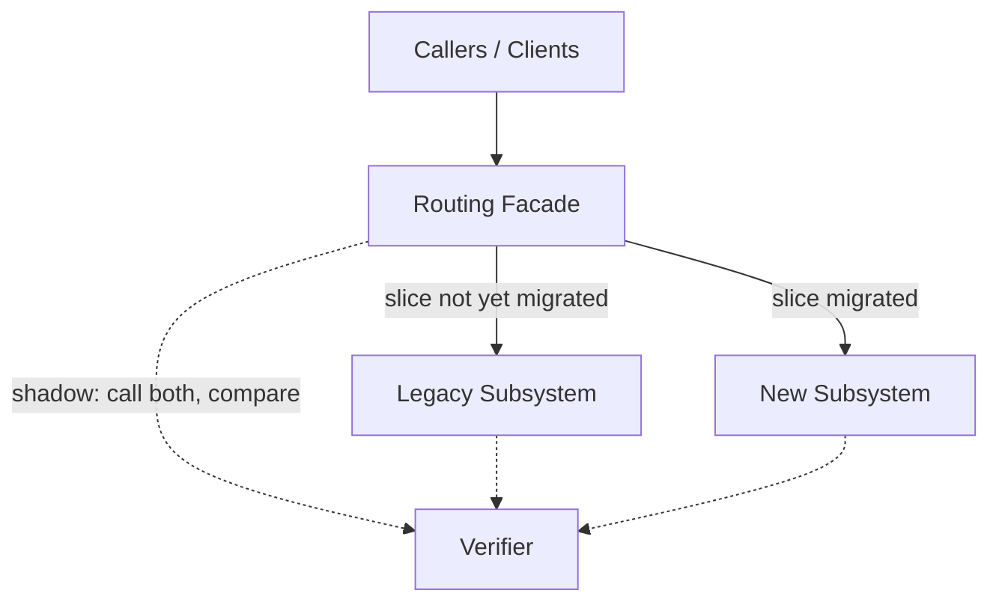
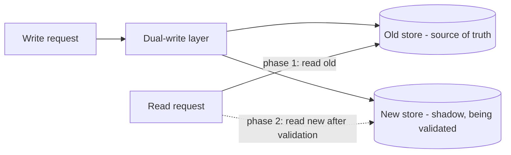
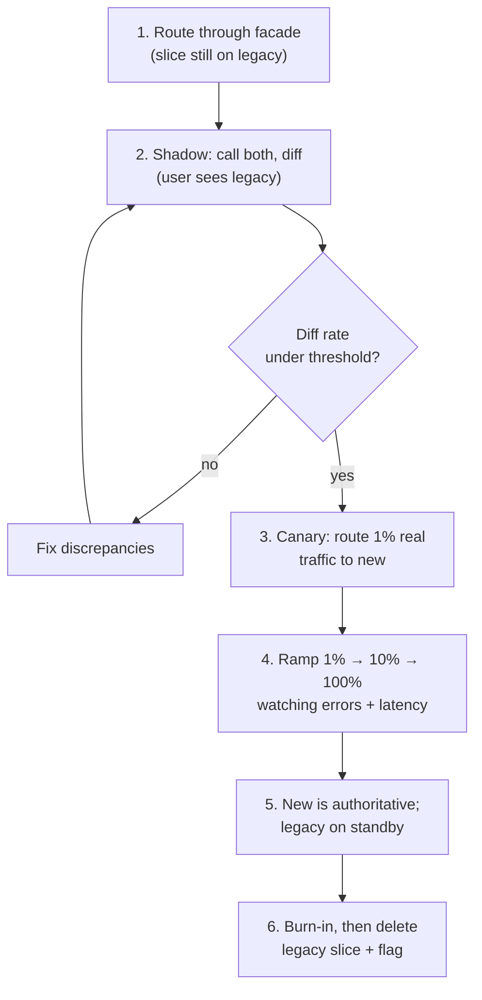

# Strangler Fig & Seams — Senior

> **Category:** [Anti-Patterns at Scale](../README.md) → **Strangler Fig & Seams** — *replace a legacy component incrementally — wrap it, route around it, grow the new one until the old is dead — instead of a big-bang rewrite.*
> **Covers (collectively):** Strangler Fig pattern · Seams · Branch by Abstraction · Characterization tests · Parallel-run / shadow & verification

---

## Introduction

> Focus: **Plan a strangler migration of a subsystem.**

[`middle.md`](middle.md) replaced *one implementation* behind a seam with Branch by Abstraction. This file scales that up to a **whole subsystem** — a payments engine, a search index, an auth service, a 200-table billing module — running in production, serving real traffic, that you must replace without a flag day.

At this level the unit of work isn't a function; it's a *migration program* that may run for months. The senior responsibilities are:

- **Design the routing layer** — a facade that decides, per request, whether work goes to the old subsystem or the new one, and can shift that decision gradually.
- **Slice the subsystem** into independently cutover-able units, and sequence them by risk and value.
- **Verify equivalence in production** with parallel-run (shadow) before trusting the new path — call both, compare, and only cut over when the diff is empty.
- **Make data and state coexist** across two subsystems that may use different stores, schemas, or even different databases.
- **Decide when the old path is dead** and can be deleted — the step that turns a coexistence tax into a finished migration.

> **The mental model:** a strangler migration is a *control problem.* You are continuously steering a dial from "100% old" toward "100% new," reading instruments (diff rate, error rate, latency) at each notch, with a fast path back to the last safe position. The facade is the dial; parallel-run is the instrument; the data layer is the part everyone underestimates.

---

## Prerequisites

- **Required:** [`middle.md`](middle.md) — Branch by Abstraction and characterization/golden-master tests are the per-slice mechanism this plan orchestrates.
- **Required:** Comfort with feature flags, gradual rollout (percentage / cohort routing), and reading production telemetry (error rate, latency percentiles).
- **Required:** A working model of data migration: dual-write, backfill, and read-path switching (the [`database-migration-patterns`](../06-expand-contract-refactors/senior.md) ideas).
- **Helpful:** Experience with one real subsystem you wish someone had strangled instead of rewritten.
- **Helpful:** The caching-strategies, observability-stack, and event-driven-architecture skills for the routing, measurement, and dual-write machinery.

---

## The Migration Plan on One Page

Before any code, a strangler migration is a written plan with these parts. If you can't fill these in, you're not ready to start:

| Element | The question it answers |
|---|---|
| **Seam location** | Where does the routing facade sit? (API gateway, service boundary, in-process interface?) |
| **Slices** | What are the independently cutover-able units, in what order? |
| **Equivalence definition** | What does "the new path matches the old" *mean*, field by field? What differences are allowed? |
| **Verification method** | Parallel-run / shadow? Characterization replay? For how long, at what traffic %? |
| **Data strategy** | One store or two? Dual-write? Backfill? Which side owns the truth during coexistence? |
| **Rollback plan** | How do we get back to "old" in seconds, at any slice, any percentage? |
| **Done definition** | What proves the old path is dead and deletable? Who deletes it, when? |

The last row is the one teams forget, and forgetting it is how a migration becomes permanent. We'll return to it.

---

## The Routing Facade: One Door, Two Houses

The heart of a strangler migration is a **facade** (Fowler calls it an *interception layer*): a thin component that every caller goes through, which routes each request to either the legacy subsystem or the new one. Callers don't know — and must not care — which side served them.



The facade gives you the three controls a migration needs:

- **A single switching point.** Routing logic lives in *one* place, not scattered across callers — so cutover is a config change, not a code change in 40 files.
- **Granular routing.** It can route by slice (customer type, region, endpoint), by percentage, or by individual entity ID — so you cut over a *little* at a time.
- **Shadow capability.** It can call *both* sides for the same request (one for real, one observed) and hand both results to a verifier.

```go
// In-process routing facade over a subsystem. The router decides per request
// which side handles it; callers see only the PaymentService interface.
type PaymentService interface{ Charge(ctx context.Context, r ChargeReq) (Receipt, error) }

type Facade struct {
    legacy, modern PaymentService
    route          func(ChargeReq) bool   // true → modern; driven by flags/cohorts
    shadow         *Shadow                // optional parallel-run verifier
}

func (f *Facade) Charge(ctx context.Context, r ChargeReq) (Receipt, error) {
    if f.shadow != nil {
        f.shadow.Compare(ctx, r)          // call both off the hot path, diff results
    }
    if f.route(r) {
        return f.modern.Charge(ctx, r)
    }
    return f.legacy.Charge(ctx, r)        // default during migration
}
```

For a network subsystem the same facade lives at the edge — an API gateway, an Nginx/Envoy route, or a reverse proxy — splitting traffic by path or header. The principle is identical: **one interception point that can route, split, and shadow.**

---

## Slicing: Choosing the Cutover Unit

You don't cut over a subsystem; you cut over *slices* of it. A good slice is **independently routable, independently verifiable, and independently reversible.** Common ways to slice:

- **By endpoint / operation.** Migrate `GET /orders` first (read-only, low-risk), then `POST /orders` (mutating, high-risk) later. Reads before writes is the classic ordering.
- **By entity cohort.** Migrate internal test accounts, then 1% of real customers, then a region, then everyone. Routing is keyed on the entity ID.
- **By feature / capability.** Migrate "shipping calculation" before "tax calculation" before "discounts," each behind the same facade.

Sequence slices by **(risk, value, dependency):**

- **Start with a slice that is low-risk and high-learning** — often a read-only path or an internal cohort. It exercises the whole machinery (facade, shadow, telemetry) where a mistake is cheap.
- **Respect data dependencies.** If slice B reads data that slice A writes, A's data strategy must land first.
- **Save the riskiest slice (irreversible writes, money movement) for when the machinery is proven** and you trust your equivalence verification.

> **The first slice's real job is to validate the *process*, not to deliver the most value.** Pick something small enough to fail safely; you're testing your facade, your shadow comparison, and your rollback as much as your new code.

---

## Parallel-Run: Calling Both and Comparing

Characterization tests (from [`middle.md`](middle.md)) prove equivalence on the inputs *you thought of.* Production has inputs you didn't. **Parallel-run** (a.k.a. *shadow traffic* or *dark launch*) closes that gap: for real production requests, call **both** the legacy and new implementations, return the legacy result to the user, and **compare** the two off the hot path.

```go
// Shadow: legacy serves the user; modern runs in the background; diffs are logged.
// The user NEVER sees the modern result during shadowing — it's observation only.
type Shadow struct {
    legacy, modern PaymentService
    onDiff         func(ChargeReq, got, want Receipt)
}

func (s *Shadow) Compare(ctx context.Context, r ChargeReq) {
    want, errL := s.legacy.Charge(ctx, r)     // authoritative result (user sees this)
    go func() {                               // modern runs async, off the user's path
        got, errM := s.modern.Charge(detach(ctx), r)
        if !equivalent(want, errL, got, errM) {
            s.onDiff(r, got, want)            // record the discrepancy for triage
        }
    }()
}
```

The discipline that makes parallel-run trustworthy:

- **The user always gets the legacy (authoritative) result during shadowing.** The new path is *observed*, not *trusted*, until the diff rate is acceptably low.
- **Shadow must not cause side effects.** If `modern.Charge` actually moves money or sends email, shadowing it *double-charges* customers. Shadow only **read-only or sandboxed** operations, or run the modern side in a dry-run mode (covered hard in [`professional.md`](professional.md)).
- **You watch the diff rate over time.** It should trend toward zero as you fix discrepancies. Only when it's flat-at-acceptable do you start *actually* routing real traffic to the new side.

Parallel-run is how you replace "I'm pretty sure it's equivalent" with "we ran 10 million real requests through both and the diff rate is 0.003%, all of them this one known rounding case."

---

## Measuring Equivalence

"New == old" is not a boolean; it's a *definition you must write down.* Two outputs can differ for reasons that are fine (a reformatted timestamp) or fatal (a different charge amount). Equivalence measurement has three parts:

1. **A normalization step** that strips *legitimate* differences before comparing — field ordering, whitespace, non-deterministic IDs, timestamps you don't care about. Without this, every diff is noise.
2. **A classification of differences** into *allowed* (known, documented, acceptable) and *disallowed* (a real behavior change). The disallowed-diff rate is the number you're driving to zero.
3. **A diff store and triage process** — every disallowed diff gets logged with enough context to reproduce, grouped by signature, and worked off like a bug backlog.

```python
# Equivalence is a function you OWN, not "=="; it encodes what may legitimately differ.
def equivalent(old: Receipt, new: Receipt) -> Diff | None:
    o, n = normalize(old), normalize(new)   # drop timestamp, id, field order
    if o == n:
        return None
    if only_difference_is(o, n, field="rounding_cents", tol=1):
        return None                          # known + accepted: sub-cent rounding
    return Diff(old=o, new=n)                # real, disallowed discrepancy → triage
```

> **The diff rate is your release gate.** Define the threshold up front (e.g. "disallowed diff rate < 0.01% sustained over 7 days at 100% shadow"), and don't route real traffic to the new side until it's met. "It looks the same" is not a number; "0.003% sustained" is.

---

## Data and State Coexistence

The part senior engineers underestimate: while old and new code coexist, so does their *data.* The new subsystem may use a different schema, a different store, even a different database engine — and both sides may be reading and writing the *same logical entities* during the migration window.

Three coexistence shapes, roughly in order of difficulty:

- **Shared store, both sides read/write.** Easiest. Old and new operate on the same tables; you migrate the *code* but not the data. Works when the new code can live with the old schema (often you pair this with an [expand–contract](../06-expand-contract-refactors/senior.md) schema change running in parallel).
- **New store, one-way backfill + dual-write.** The new subsystem has its own schema. You **backfill** existing data into it, then **dual-write** every change to both stores so they stay in sync, while reads still come from the old store. When the new store is proven consistent, you switch reads to it, then stop writing to the old.
- **Two stores, two owners, reconciled.** Hardest. Both sides own *some* of the truth and you reconcile asynchronously. Avoid if you possibly can; it's where data-integrity incidents live.



The key senior judgment is **who owns the source of truth at each moment.** During coexistence exactly one side should be authoritative for any given entity; the other is a validated shadow. Ambiguity about ownership ("both write, last-writer-wins") is how you lose data. The detailed integrity mechanics — dual-write atomicity, reconciliation, ordering — are [`professional.md`](professional.md).

---

## Per-Slice Cutover Lifecycle

Each slice walks the same lifecycle. This is Branch by Abstraction's "flip the switch" step, expanded with production verification:



1. **Route** the slice through the facade (still serving legacy).
2. **Shadow** it: call both, diff, drive the disallowed-diff rate under threshold.
3. **Canary**: route a tiny slice of *real* traffic to the new side; now the user actually gets the new result. Watch error rate and latency.
4. **Ramp** the percentage up, with a hard rule: *any* regression rolls the percentage back instantly.
5. **New is authoritative**; keep legacy warm and reachable for fast rollback.
6. **Burn-in, then delete** — the next section.

You can have *several slices at different phases at once*: slice A at 100%-new-and-deleted, slice B canarying, slice C still shadowing. The facade tracks each slice's phase independently.

---

## When to Delete the Old Path

Deletion is not cleanup trivia — it is the step that *defines done.* A strangler migration with the legacy still wired in is not finished; it's a system paying a permanent two-codebase tax. But delete too early and you've thrown away your rollback.

Delete the legacy slice when **all** of these hold:

- The new path has served **100% of real traffic** for a defined **burn-in period** (long enough to cover your slowest cycles — month-end billing, quarterly reports, the rare code paths).
- The **disallowed-diff rate is zero** (or fully explained) across that period.
- **No traffic reaches the legacy path** — proven by instrumentation (a request counter on the legacy branch reading zero, not by assumption).
- **Rollback is no longer the cheapest mitigation** — i.e., you'd now fix-forward rather than revert to legacy, because the new path is the trusted one.

Then delete *everything*: the legacy implementation, the dual-write to the old store, the routing branch, and the flag. Each leftover is future confusion and future bugs.

> **Instrument the legacy path before you trust that it's dead.** Add a counter (and a log line) to the legacy branch. "I think nothing calls it" has caused countless incidents; "the legacy counter has read zero for 30 days across two month-end closes" is evidence. Delete on evidence, not belief.

---

## Ties to the Sibling Topics

A strangler migration doesn't happen in isolation — it's wired into the other at-scale practices:

- **[Hotspot Analysis](../03-hotspot-analysis/senior.md)** tells you *which subsystem to strangle first.* Don't migrate the legacy module that's stable and rarely touched; migrate the one that's both high-churn and high-defect — the hotspot. Strangling stable code is wasted risk.
- **[Expand–Contract Refactors](../06-expand-contract-refactors/senior.md)** is the *schema/interface-level* sibling and the data-coexistence engine of a strangler migration. Expand–contract evolves a contract without a flag day; strangler replaces an implementation behind one. You'll run expand–contract on the database *inside* a strangler migration.
- **[Architecture Fitness Functions](../01-architecture-fitness-functions/senior.md)** keep the migration *honest.* A fitness function that fails the build when a new caller imports the *legacy* package prevents the old path from regrowing dependencies while you're trying to kill it — and a "no traffic to legacy" assertion can gate deletion.

Together: hotspots pick the target, the strangler/facade does the replacement, expand–contract handles the data, and fitness functions stop backsliding.

---

## Common Mistakes

1. **No written equivalence definition.** "Make it work like the old one" isn't testable. Define field-by-field what must match and what may legitimately differ, before you build anything.
2. **Shadowing a side-effecting operation.** Running the new charge/email/write path "just to compare" double-charges or double-sends. Shadow only read-only or dry-run operations; this is the most dangerous parallel-run mistake.
3. **Slicing too coarsely.** "Migrate the whole payments service" is a big-bang in disguise. Slice until each unit is independently routable, verifiable, and reversible.
4. **Migrating code but ignoring data.** The data coexistence strategy (shared store / backfill+dual-write / reconciliation) is usually harder than the code and must be designed first. Code-only plans stall the moment two stores disagree.
5. **Ambiguous source of truth.** "Both sides write, last-writer-wins" during coexistence loses data. Exactly one side is authoritative per entity at any moment.
6. **Trusting the new path on day one.** Skip shadow + canary and route 100% immediately, and you've reinvented the big-bang cutover with extra steps. Drive the diff rate to zero first, then ramp.
7. **Picking the wrong first slice.** The riskiest, money-moving slice first means you debug your facade and rollback under maximum stress. Start where failure is cheap.
8. **Never finishing (no deletion).** The migration "works" so attention moves on, and the legacy lives forever behind the facade. The two-system tax is the dominant long-run cost — see [`professional.md`](professional.md).

---

## Test Yourself

1. What three controls does a routing facade give a strangler migration that scattered, per-caller routing logic cannot?
2. Why must the **user always receive the legacy result while a slice is in shadow mode**, and what catastrophic mistake does shadowing a *side-effecting* operation cause?
3. Equivalence between old and new output is "not a boolean." Name the three components of a real equivalence-measurement setup.
4. You're migrating a payments subsystem with its own new database. Describe the backfill + dual-write sequence that lets reads safely switch from the old store to the new one.
5. Give the four conditions that must *all* hold before you delete a legacy slice — and explain why "I think nothing calls it" is not one of them.
6. How does **Hotspot Analysis** change *which* subsystem you choose to strangle first, and why is strangling stable legacy code usually a waste?
7. You can have several slices in different phases simultaneously. Give an example three-slice state and explain why that's a feature, not chaos.

---

## Cheat Sheet

| Stage | What you do | The instrument / gate |
|---|---|---|
| **Plan** | Define seam, slices, equivalence, data strategy, rollback, *done* | The one-page plan; the "done" row is non-optional |
| **Facade** | One interception point that routes, splits %, and shadows | Config-driven routing, not per-caller edits |
| **Slice** | Independently routable/verifiable/reversible units, sequenced by risk | First slice validates the *process*, not max value |
| **Shadow** | Call both, user gets legacy, diff off the hot path | Disallowed-diff rate trending to zero (read-only only!) |
| **Equivalence** | Normalize → classify → triage diffs | A written definition + a numeric threshold |
| **Cutover** | Canary 1% real traffic → ramp → 100% | Error rate + latency; instant % rollback |
| **Data** | Shared store, or backfill+dual-write, or reconcile | Exactly one source of truth per entity |
| **Delete** | Remove legacy, dual-write, branch, flag | Legacy-path counter == 0 over a full burn-in |

> **One rule to remember:** *Steer the dial from 100%-old to 100%-new while reading instruments at every notch — and the migration isn't done until the legacy is deleted on the evidence of a zeroed counter.*

---

## Summary

- A subsystem strangler migration is a **months-long control problem**: a routing facade is the dial, parallel-run is the instrument, and you steer from 100%-old to 100%-new one slice at a time with a fast path back to the last safe notch.
- The **routing facade** is a single interception point that routes per-request (by slice, percentage, or entity), can split traffic gradually, and can **shadow** (call both, compare). It replaces scattered per-caller routing with one config-driven switch.
- **Slice** the subsystem into independently routable, verifiable, reversible units; sequence by risk and value; let the **first slice validate the process** where failure is cheap (reads before writes).
- **Parallel-run** proves equivalence on *real* production traffic: serve the legacy result, run the new path as observation, and drive the **disallowed-diff rate** to a written threshold before routing real traffic. Never shadow a side-effecting operation — it double-acts.
- **Equivalence is a definition you own** — normalize legitimate differences, classify allowed vs disallowed diffs, triage the rest — gated by a number, not a vibe.
- **Data coexistence** is usually the hard part: shared store, or backfill + dual-write + read-switch, or (avoid) two-owner reconciliation. Exactly one side owns the truth per entity at any moment.
- **Delete the old path on evidence** — a zeroed legacy-traffic counter across a full burn-in — because an undeleted strangler is a permanent two-system tax, not a finished migration.
- This ties to the siblings: [hotspots](../03-hotspot-analysis/senior.md) pick the target, [expand–contract](../06-expand-contract-refactors/senior.md) handles the schema, and [fitness functions](../01-architecture-fitness-functions/senior.md) stop the legacy from regrowing.
- Next: [`professional.md`](professional.md) — *the correctness and performance of coexistence itself: shadow cost, in-prod diffing, dual-write integrity, flag ordering, rollback safety, routing latency, and the dominant failure — the migration that never finishes.*

---

## Further Reading

- **StranglerFigApplication** and **EventInterception** — Martin Fowler, martinfowler.com — the facade/interception layer and incremental cutover.
- **Monolith to Microservices** — Sam Newman (2019) — strangler fig at the service boundary, branch-by-abstraction, parallel-run, and the data-coexistence patterns (dual-write, backfill) in depth.
- **Working Effectively with Legacy Code** — Michael Feathers (2004) — seams as the per-slice mechanism inside the larger plan.
- **Database Reliability Engineering** — Campbell & Majors (2017) — backfill, dual-write, and read-switch mechanics for the data side.
- **Release It!** — Michael Nygard (2nd ed., 2018) — canary, gradual rollout, and the production-safety mindset the cutover lifecycle relies on.

---

## Related Topics

- Refactoring → Refactoring Techniques — the per-slice behavior-preserving moves the facade orchestrates.
- Design Patterns → Structural — Facade and Adapter: the structural backbone of the routing layer.
- Architecture → Anti-Patterns — system-shape view of migration and the big-rewrite trap.
- [Expand–Contract Refactors → Senior](../06-expand-contract-refactors/senior.md) — the schema/interface sibling and the engine of data coexistence.
- [Hotspot Analysis → Senior](../03-hotspot-analysis/senior.md) — choosing *which* legacy subsystem is worth strangling first.
- [Architecture Fitness Functions → Senior](../01-architecture-fitness-functions/senior.md) — CI gates that stop the legacy path from regrowing dependencies.
- [Bad Structure → Senior](../../01-development/01-bad-structure/senior.md) — the tangled subsystems that become migration targets.

---

## Check your understanding

1. Explain Strangler Fig & Seams — Senior Level in your own words and name the problem it solves.
2. How would you apply the ideas around Table of Contents, Introduction, Prerequisites in a realistic engineering change?
3. What failure mode or misuse should you look for, and what evidence would reveal it?
4. How would you validate a system-level decision about Strangler Fig & Seams — Senior Level under uncertainty?
5. What observable result would convince you that the approach improved the system?
