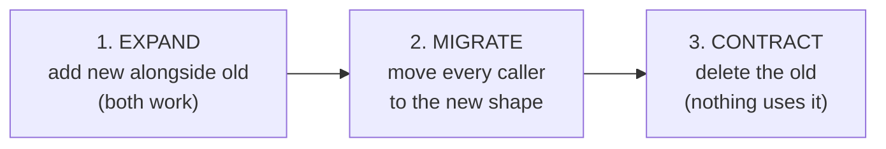

# Expand-Contract Refactors — Junior

> **Category:** [Anti-Patterns at Scale](../README.md) → **Expand-Contract Refactors** — *change a contract callers depend on in two safe phases: make new and old both work (expand), migrate, then remove the old (contract) — never one atomic edit you cannot do.*
> **Covers (collectively):** Parallel Change (expand-contract) · Backward & forward compatibility · Deprecation windows · Schema / API / event / DB evolution · Dual-write / dual-read & Tolerant Reader

---

## Introduction

> Focus: **Why "change the signature and fix all callers in one commit" fails at scale.**

You wrote a function. It takes a parameter. Six months later you realize the parameter has the wrong type, the wrong name, or there should be two of them. The obvious move is: change the function, then fix every place that calls it, all in one commit. Done.

That works fine when *you* own all the callers and they all live in one file you can see. It falls apart the moment a caller is somewhere you can't edit in the same commit — another team's service, an old mobile app a user hasn't updated, a scheduled job that's mid-run, a config file in production. For those callers there is no "fix them all at once." The old shape and the new shape have to **coexist** for a while.

**Expand-Contract** (Martin Fowler calls it **Parallel Change**) is the technique for exactly this. Instead of one risky atomic edit, you split the change into three safe steps:

1. **Expand** — add the new thing *next to* the old one. Both work now.
2. **Migrate** — move every caller from the old thing to the new thing, at their own pace.
3. **Contract** — once nothing uses the old thing, delete it.

At the junior level your goal is to internalize *why* the atomic edit is a trap and to practice the three steps on the simplest possible contract: a method signature.

> **The mindset shift:** you don't own "the moment of the change." Other code, other people, and old clients all depend on the shape you're changing, and they change on *their* schedule, not yours. Expand-Contract is how you change a shape without controlling everyone who touches it.

---

## Prerequisites

- **Required:** You can write functions/methods with parameters and call them from other code (examples here use Java, Go, and Python).
- **Required:** You understand what "backward compatible" means at a gut level — *old code keeps working.*
- **Helpful:** You've experienced a build break because someone changed a function you were calling, or you broke someone else's build by changing one of yours.
- **Helpful:** Basic `git` — these refactors are a sequence of small commits, not one big one.

---

## Glossary

| Term | Definition |
|------|-----------|
| **Contract** | The promise a piece of code makes to its callers: its name, parameters, return shape, and behavior. Callers rely on it. |
| **Caller** | Any code that uses your contract — calls your function, reads your field, parses your event. |
| **Breaking change** | A change that makes existing callers stop working (compile error, crash, wrong result). |
| **Backward compatible** | Old callers keep working unchanged after your change. The whole point of the *expand* step. |
| **Expand-Contract / Parallel Change** | Evolve a contract in three steps: add the new alongside the old (expand), migrate callers, remove the old (contract). |
| **Deprecated** | Marked "still works, but don't use it — it's going away." A signpost during the migrate step. |
| **Overload** | Two methods with the same name but different parameters. A common way to "expand" in Java. |

---

## Why "Change It and Fix All Callers" Fails

Here is the move that feels right and is wrong at scale:

```java
// You change the signature...
public void sendEmail(String to, String subject) { ... }
//        becomes
public void sendEmail(String to, String subject, String fromName) { ... }
//                                                ^^^^^^^^^^^^^^^ new required param
```

The instant you do this, **every existing call `sendEmail("a@b.com", "Hi")` stops compiling.** If all those calls are in your file, fine — fix them and move on. But consider where callers actually live:

- **Another team's service** calls your API. You can't edit their repo. Their next deploy is in three weeks.
- **An old mobile app** on a user's phone sends the old request shape. You can't force them to update.
- **A nightly batch job** is running *right now* against the old contract.
- **A config file** in production still has the old key name.

For any of these, "fix all the callers in one commit" is *impossible* — the callers aren't yours to fix, or aren't deployed yet, or are mid-flight. The atomic edit assumes you control the whole world at one instant. You don't.

```mermaid
flowchart TD
    YOU["You change the contract<br/>(one atomic commit)"]
    YOU -->|breaks| A[Other team's service]
    YOU -->|breaks| B[Old mobile client]
    YOU -->|breaks| C[Running batch job]
    YOU -->|breaks| D[Production config]
    style YOU fill:#3a2a2a
```



The lesson: **a contract with callers you don't control cannot be changed atomically.** It must be changed in two phases — first make both shapes valid, *then* remove the old one once everyone has moved.

---

## What a Contract Is

"Contract" sounds formal, but it's just *the shape other code depends on.* You're using a contract whenever you have callers you can't see or can't edit in the same change. Contracts show up at many sizes:

| Contract | The shape callers depend on |
|---|---|
| **Method signature** | name, parameter list, return type |
| **Config key** | the exact key name, e.g. `timeout_ms` |
| **Event / message field** | the field name and type in a JSON/protobuf event |
| **Database column** | the column name and type other queries `SELECT` |
| **Public API endpoint** | the URL, request body, response body |

Expand-Contract applies to *all* of these the same way. At this level we'll practice on the smallest one — a method signature — because the idea transfers directly to the bigger ones (you'll see those in [`middle.md`](middle.md)).

---

## The Three Steps

For any contract change, the shape is always the same:



1. **Expand** — Introduce the new shape *without removing the old one.* After this step, both the old and new ways work. This step is **backward compatible**: no existing caller breaks. It is safe to deploy on its own.

2. **Migrate** — Move callers from old to new, one at a time, at whatever pace they can manage. The other team updates when they deploy; the mobile app updates as users upgrade; you update your own calls immediately. Nobody is forced to move in lockstep.

3. **Contract** — Once you've verified *nothing* still uses the old shape, delete it. Now the contract is clean again, and you're ready for the next change.

The magic is in step 1: by making the new shape **additive** (a thing you *add*, not a thing you *change*), you never break a caller. The risky deletion in step 3 only happens after you've confirmed there's nothing left to break.

---

## Worked Example: Renaming a Parameter Safely

Say you want to add a `fromName` to `sendEmail`, but other callers exist that you can't fix in this commit.

### Step 1 — Expand (add an overload; both work)

In Java, the cleanest "expand" for a method signature is an **overload** — same name, new parameter list, old one delegates to the new one:

```java
// OLD signature still exists and still works — no caller breaks.
public void sendEmail(String to, String subject) {
    sendEmail(to, subject, "Support");   // delegate, supplying a default
}

// NEW signature added alongside it.
public void sendEmail(String to, String subject, String fromName) {
    // the real implementation lives here now
}
```

After this commit, `sendEmail("a@b.com", "Hi")` *and* `sendEmail("a@b.com", "Hi", "Alice")` both compile and both work. You can deploy this safely — it breaks nobody.

In Python, the equivalent "expand" is an **optional parameter with a default**:

```python
def send_email(to: str, subject: str, from_name: str = "Support") -> None:
    ...   # old two-argument calls keep working; new callers pass from_name
```

In Go (no overloads, no default args), you "expand" by adding a *new function* beside the old one:

```go
// old: still here, delegates to the new one
func SendEmail(to, subject string) error {
    return SendEmailFrom(to, subject, "Support")
}

// new: the real implementation
func SendEmailFrom(to, subject, fromName string) error { ... }
```

### Step 2 — Migrate (move callers, at their own pace)

Now update callers to use the three-argument form. *Your* calls you fix immediately. Calls in other repos get updated whenever those teams next touch them. There's no rush and no coordination flag day — both forms work, so callers move independently.

```java
// before
sendEmail(user.email, "Welcome");
// after (migrated)
sendEmail(user.email, "Welcome", "Onboarding Team");
```

### Step 3 — Contract (delete the old once nothing uses it)

Once you've confirmed no caller uses the two-argument form anymore (search the codebase, check the logs), delete it:

```java
// DELETE the old two-arg overload. Only the three-arg version remains.
public void sendEmail(String to, String subject, String fromName) { ... }
```

The contract is clean again. Crucially, the *only* dangerous step (deletion) happened **after** you proved there was nothing left to break — not before.

---

## Why Three Steps Beat One

| | Atomic edit (one commit) | Expand-Contract (three steps) |
|---|---|---|
| **External callers** | Break instantly | Keep working through the whole migration |
| **Deploy safety** | All-or-nothing; one bad moment | Each step deploys independently and safely |
| **Rollback** | Revert the whole thing | Revert just the last step |
| **Coordination** | Everyone must change at once (a "flag day") | Each caller moves on its own schedule |
| **Risk** | Concentrated in one big change | Spread thin; deletion only after it's proven safe |

The trade is that Expand-Contract is *more work* and lives in the codebase *longer* (you carry both shapes for a while). That's a real cost — but it's the price of changing something you don't fully control without breaking it. When you *do* control every caller in one commit, the atomic edit is fine. The skill is knowing which situation you're in.

---

## Common Mistakes

1. **Making the "expand" change non-additive.** If your new step *changes* the old behavior instead of *adding* beside it, you've broken compatibility and lost the whole benefit. Expand must be purely additive.
2. **Making the new parameter required, not optional.** A required new parameter breaks every old call instantly — that's just the atomic edit in disguise. Give it a default (or add an overload) so old calls still work.
3. **Skipping straight to contract.** Deleting the old shape before callers have migrated is the breaking change you were trying to avoid. Delete *last*, and only after verifying nothing uses it.
4. **Forgetting to actually migrate.** If you expand but never finish migrating, you carry both shapes forever — the "stuck in expand" problem (you'll see how bad this gets in [`professional.md`](professional.md)).
5. **Assuming you can see all the callers.** A grep of your own repo misses other teams' services and old deployed clients. The whole reason for this technique is the callers you *can't* see.

---

## Test Yourself

1. Why can't you change a method's signature and "fix all the callers in one commit" when one of the callers is another team's service?
2. Name the three steps of Expand-Contract in order, and say in one phrase what each does.
3. Which of the three steps is backward compatible (breaks nobody), and which is the only dangerous one?
4. You need to add a required `currency` argument to `charge(amount)`. Sketch the *expand* step in Java (or Python) so no existing call breaks.
5. A teammate "expanded" by renaming the method *and* changing its behavior in one commit. Why is that not really an expand step?

---

## Cheat Sheet

| Step | What you do | Safe to deploy alone? | Rule |
|---|---|---|---|
| **1. Expand** | Add the new shape *beside* the old (overload / optional param / new function) | Yes — purely additive | New thing must not change or remove the old thing |
| **2. Migrate** | Move callers old → new, each at its own pace | Yes — both shapes work | No flag day; no lockstep coordination |
| **3. Contract** | Delete the old shape | Yes — *after* verifying nothing uses it | This is the only dangerous step; do it last |

> **One rule to remember:** *You can't atomically change a contract whose callers you don't control. Make new and old both work, migrate, then remove the old.*

---

## Summary

- **"Change the signature and fix all callers in one commit" fails** the moment a caller is something you can't edit in that commit — another team's service, an old client, a running job, a config in production.
- A **contract** is any shape other code depends on: a method signature, a config key, an event field, a DB column, an API. Expand-Contract applies to all of them.
- The fix is three steps: **Expand** (add the new alongside the old — backward compatible, breaks nobody), **Migrate** (move callers at their own pace), **Contract** (delete the old, the one dangerous step, done last after verifying nothing uses it).
- The cost is carrying both shapes for a while; the benefit is changing something you don't control without breaking it. When you *do* control every caller, the atomic edit is fine — knowing which case you're in is the skill.
- Next: [`middle.md`](middle.md) — *applying the three steps to real contracts beyond a method: config keys, event fields, and database columns, with deprecation markers and the Tolerant Reader on the consumer side.*

---

## Further Reading

- **Martin Fowler — "ParallelChange"** (martinfowler.com bliki) — the original three-step (expand / migrate / contract) description.
- **Refactoring** — Martin Fowler (2nd ed., 2018) — Change Function Declaration, and the "migration" mechanics behind safe signature changes.
- **The Pragmatic Programmer** — Hunt & Thomas (20th anniv. ed., 2019) — decoupling and designing for change.
- **Semantic Versioning** (semver.org) — what counts as a "breaking" vs "additive" change to a contract.

---

## Related Topics

- [Strangler Fig & Seams](../05-strangler-fig-and-seams/senior.md) — the larger sibling technique: replacing a whole component incrementally instead of one contract.
- Clean Code → Abstraction & Information Hiding — why hiding implementation behind a small contract makes contracts easier to evolve.
- Clean Code → Error Handling — tolerating missing/old fields without crashing (the consumer side of compatibility).
- [Abstraction Failures → Senior](../../02-design/03-abstraction-failures/senior.md) — what happens when the contract you expose is the wrong shape to begin with.
- [`middle.md`](middle.md) · [`senior.md`](senior.md) · [`professional.md`](professional.md) — the same technique on real contracts, across services, and at zero downtime.

---

## Check your understanding

1. Explain Expand-Contract Refactors — Junior Level in your own words and name the problem it solves.
2. How would you apply the ideas around Table of Contents, Introduction, Prerequisites in a realistic engineering change?
3. What failure mode or misuse should you look for, and what evidence would reveal it?
4. What small example would prove that you can apply Expand-Contract Refactors — Junior Level correctly?
5. What observable result would convince you that the approach improved the system?
