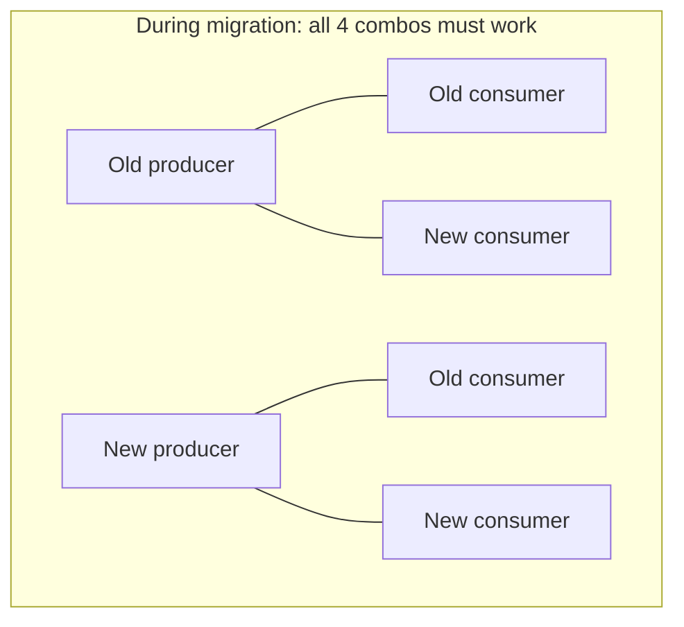
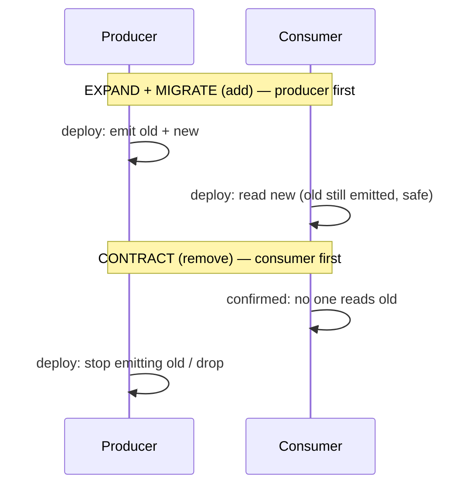
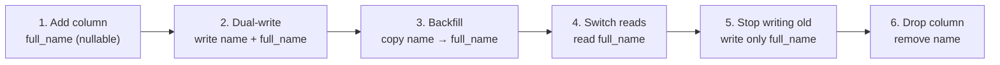
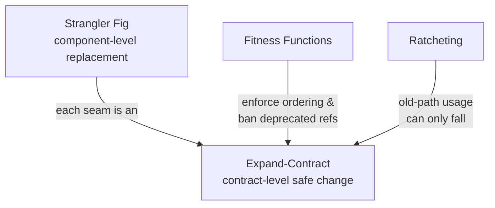

# Expand-Contract Refactors — Senior

> **Category:** [Anti-Patterns at Scale](../README.md) → **Expand-Contract Refactors** — *change a contract callers depend on in two safe phases: make new and old both work (expand), migrate, then remove the old (contract) — never one atomic edit you cannot do.*
> **Covers (collectively):** Parallel Change (expand-contract) · Backward & forward compatibility · Deprecation windows · Schema / API / event / DB evolution · Dual-write / dual-read & Tolerant Reader

---

## Introduction

> Focus: **Coordinating across producer & consumer** — who deploys first, how long the deprecation window runs, how you track the last remaining callers, and the full canonical column rename.

[`middle.md`](middle.md) applied the three steps to four contract types, but kept the producer and consumer conceptually together. At the senior level the defining reality is that **the two sides deploy independently** — your service and the consuming service, your schema migration and your application code, the old client and the new server. You cannot deploy them atomically, and the *order* in which they roll out determines whether anyone breaks.

This is where Expand-Contract stops being a refactoring trick and becomes a coordination discipline. The senior questions are:

- **Who deploys first?** Get the order wrong and you have a window where a new reader hits an old producer (or vice versa) and breaks.
- **How long do we hold both shapes?** The *deprecation window* is a real, sometimes long, period during which you carry the cost of both paths.
- **How do we know it's safe to contract?** You must *track* the last remaining callers and remove the old shape only when their count is provably zero.
- **The canonical column rename** — add → backfill → dual-write → switch reads → stop writing old → drop — is the worked example that ties every ordering decision together.

> **The mental model:** an expand-contract migration is a small distributed protocol you run over time. Each step has a precondition ("safe only if the other side is already in state X") and a deploy order. The senior skill is sequencing the steps so that *at no point* does a deployed reader depend on something a deployed writer hasn't provided yet — and never running the dangerous step (removal) until a *measurement*, not a hope, says nothing depends on the old shape.

---

## Prerequisites

- **Required:** Solid with [`middle.md`](middle.md) — the three steps across method/config/event/DB contracts, deprecation, tolerant readers.
- **Required:** You operate services that deploy independently and have seen a rollout where two services were briefly on different versions.
- **Required:** Comfortable with online schema changes (`ADD COLUMN`, backfilling large tables in batches, building indexes concurrently) and the locking behavior of your database.
- **Helpful:** Experience with feature flags, blue/green or rolling deploys, and reading per-version request metrics.
- **Helpful:** database-migration-patterns, api-versioning, monitoring-alerting skills for the migration, versioning, and tracking vocabulary used here.

---

## The Core Problem: Two Things Deploy Separately

Every senior-level expand-contract has two sides that change at different times:

| Migration | "Producer" side | "Consumer" side |
|---|---|---|
| API change | the service exposing the endpoint | the client/service calling it |
| Event schema change | the service emitting the event | the services consuming it |
| DB column rename | the schema (and the writing code) | the reading code |
| Config key rename | the code reading config | the config files in each env |

Because the two sides deploy separately, there is *always* a window where one side is new and the other is old. Expand-Contract works precisely because the **expand** step makes *both* old-and-new valid, so it doesn't matter which side is mid-deploy — every combination of (old/new producer) × (old/new consumer) still works. That's the invariant you're protecting: **during the migration, every deployed combination of versions must be compatible.**



If any one of those four combinations breaks, you have a window of downtime during rollout. The whole point of expand (write/emit/support both) is to make all four green.

---

## Deployment Ordering: Who Deploys First

The general rule: **deploy the side that *adds capability* before the side that *depends* on it.** Producer-before-consumer for *reads*; the reverse for *removal*.

### Adding (expand + migrate): producer first

The consumer can only safely read the new field/column/endpoint once the producer is emitting it. So:

1. **Producer deploys first**, now emitting both old and new (expand). Old consumers ignore the new field (tolerant reader); they keep working.
2. **Consumers deploy next**, switching to read the new field (migrate). The producer is already emitting it, so the new read always finds it.

Deploy them in the other order and you get a window where a new consumer reads a field the old producer isn't emitting yet → missing-field break.

### Removing (contract): consumer first

To remove the old shape, the *last reader* of it must be gone before the producer stops providing it:

1. **All consumers stop reading the old field first** (they've migrated).
2. **Producer stops emitting / drops it last** (contract).

Stop emitting first and a not-yet-migrated consumer breaks.



> **The asymmetry is the senior insight:** *additive* changes roll producer→consumer; *subtractive* changes roll consumer→producer. The old shape must come into existence before anything depends on it and must outlive everything that depends on it. Get the direction backward and you create the exact downtime window expand-contract exists to prevent.

---

## Deprecation Windows and Tracking the Last Callers

Between "we've deprecated the old shape" and "we've removed it" lies the **deprecation window** — the period you carry both shapes. You cannot end it on a guess; you end it when you can *prove* the old shape has no callers left.

### Make remaining usage measurable

You cannot grep other teams' deployed services. So instrument the old path to **count its own use**:

```go
// Instrument the deprecated read so "remaining callers" is a live metric,
// not a guess. When this counter sits at zero for a full window, contract is safe.
func (e OrderEvent) Amt() int {
    metrics.Counter("event.amt.deprecated_read",
        "consumer", callerService()).Inc()   // who still reads the old field?
    return e.amt
}
```

For an HTTP API, emit `Deprecation` / `Sunset` headers *and* a per-version request metric:

```
Deprecation: true
Sunset: Wed, 30 Sep 2026 00:00:00 GMT
Link: <https://docs.example.com/migrate/v2>; rel="deprecation"
```

```promql
# Track old-version calls broken down by caller. Contract when this is flat zero.
sum by (caller) (rate(http_requests_total{api_version="v1"}[1h]))
```

The principle: **the contract step is gated on a metric reaching zero, held there for the full window** (long enough to cover slow callers, monthly batch jobs, cached clients). The metric labeled by caller also tells you *exactly whom to chase* — the last three services still on v1 by name.

### How long is the window?

There's no universal number, but the window must cover the *slowest* legitimate caller:

| Caller type | Window must cover |
|---|---|
| Your own services | one deploy cycle (hours–days) |
| Other internal teams | their sprint / release cadence (weeks) |
| Monthly/quarterly batch jobs | at least one full run cycle (a month+) |
| Cached/old mobile clients | the client-version sunset policy (often months) |
| Third-party public API users | your published deprecation policy (often 6–12 months) |

> **The window is set by your slowest caller, not your fastest.** A monthly reconciliation job that reads the old column means the window is at least a month even if every online service migrated in a day.

---

## The Canonical DB Column Rename, Step by Step

Renaming `users.name` → `users.full_name` with zero downtime is *the* reference expand-contract. A naked `ALTER TABLE users RENAME COLUMN name TO full_name` breaks every deployed query referencing `name` the instant it commits. Here is the safe sequence, with the precondition for each step.



**1. Add the new column (expand — schema).** Nullable, no default backfill, so it's a fast metadata-only change on most databases:
```sql
ALTER TABLE users ADD COLUMN full_name TEXT;   -- cheap; existing rows get NULL
```

**2. Dual-write (expand — code).** Deploy app code that writes *both* columns on every insert/update. *Precondition: the column exists (step 1 is live).* Now new rows have both values.
```sql
UPDATE users SET name = $1, full_name = $1 WHERE id = $2;  -- write both
```

**3. Backfill existing rows (migrate — data).** Copy old → new for rows written before dual-write, in **batches** to avoid a long lock / replication lag:
```sql
-- Batched backfill; repeat until 0 rows affected. Keeps locks short.
UPDATE users SET full_name = name
WHERE full_name IS NULL
LIMIT 5000;
```
After this, *every* row has `full_name` populated.

**4. Switch reads (migrate — code).** Deploy code that reads `full_name`. *Precondition: every row has it (step 3 done) and we're still writing both (step 2).* You can roll back to reading `name` instantly because dual-write keeps both correct.

**5. Stop writing the old column (contract — code).** *Precondition: nothing reads `name` anymore (step 4 fully rolled out, confirmed by metric).* Deploy code that writes only `full_name`.

**6. Drop the old column (contract — schema).** *Precondition: nothing reads or writes `name`.*
```sql
ALTER TABLE users DROP COLUMN name;   -- the dangerous step, now provably safe
```

Each arrow is a **separate deploy**, and steps 4 and 5 in particular must be fully rolled out and verified before the next begins — because during a rolling deploy, old and new app instances run simultaneously. Dual-write (step 2) is exactly what keeps those mixed-version instances consistent: an old instance writing `name` and a new instance reading `full_name` both see correct data because every write touches both columns.

> **Why dual-write spans the middle:** it's the bridge that keeps old-writers and new-readers consistent during the rolling window. You add it *before* anything reads the new column and remove it *after* nothing reads the old — the same "old shape outlives its readers" rule, applied to data.

---

## Communicating the Migration

A senior-level migration is as much a communication task as a code task — the callers you're coordinating are *people on other teams*. The migration only completes when *they* act, so make acting easy:

- **Announce the expand,** not just the deprecation. Tell consumers the new field/endpoint exists and is preferred *before* you pressure them to leave the old one.
- **Publish the sunset date and the metric.** "v1 read count is at 4 callers; sunset is 2026-09-30" turns a vague "please migrate" into a tracked, shared deadline.
- **Provide the migration path, not just the warning.** A `Link: rel="deprecation"` header or a short migration guide ("replace `amt` with `amount_cents`, same units") removes the excuse.
- **Name the laggards from the metric.** The per-caller counter lets you DM the three teams still on v1 instead of broadcasting to everyone.
- **Record the migration as a tracked work item** with the steps, the ordering, and the gating metric — so anyone can see what state the migration is in and what unblocks the next step. (This is where [strangler-fig](../05-strangler-fig-and-seams/senior.md) migrations and expand-contract migrations look identical: both are long-lived, multi-step, cross-team efforts that need a visible state machine.)

> **The migration that never finishes is usually a communication failure, not a technical one.** The code to emit both shapes is easy; getting the last two teams to move is the hard part — and it's a tracking-and-nudging problem.

---

## How This Ties to Strangler, Fitness Functions, and Ratcheting

Expand-Contract doesn't live alone in this chapter — it's the contract-level mechanic that the other at-scale tools rely on or protect:

- **[Strangler Fig](../05-strangler-fig-and-seams/senior.md)** replaces a whole component incrementally. Every *seam* where the new implementation takes over from the old is an expand-contract on a contract: route to both, migrate traffic, retire the old. Expand-Contract is strangler-fig zoomed in to a single contract.
- **[Architecture Fitness Functions](../01-architecture-fitness-functions/senior.md)** can *enforce* the discipline: a CI rule that fails the build if code references a column/field marked deprecated, or if a "drop" migration ships without a preceding "stop-write" deploy. The fitness function makes "don't contract before migrate" a gate, not a convention.
- **[Anti-Pattern Budgets & Ratcheting](../02-anti-pattern-budgets-and-ratcheting/senior.md)** is how you stop the deprecation window from drifting forever. Treat "remaining old-path callers" as a budget that can only *ratchet down* — the count is allowed to fall but never rise, so no new code re-adopts the deprecated shape while you're trying to retire it.



> Together they form the loop: **strangler** decides *what* to replace, **expand-contract** makes each contract change *safe*, **fitness functions** keep the new shape from being violated, and **ratcheting** stops the old shape from creeping back while the window is open.

---

## Common Mistakes

1. **Wrong deploy order on adds.** Deploying the new *reader* before the producer emits the new field gives you a window where the read finds nothing. Additive changes go producer-first.
2. **Wrong deploy order on removes.** Stopping the old emit before the last consumer migrated breaks that consumer. Subtractive changes go consumer-first; the old shape is removed *last*.
3. **Contracting on a guess instead of a metric.** Deleting the old column/field/endpoint because "it's probably unused" eventually deletes one that a monthly job still reads. Gate removal on a per-caller usage metric at zero for a full window.
4. **Backfilling in one giant statement.** A single `UPDATE` over millions of rows locks the table / floods replication. Backfill in batches with short transactions.
5. **Collapsing dual-write and switch-reads into one deploy.** During a rolling deploy, mixed-version instances run together; if writes and reads flip in the same release, an old instance and a new instance disagree about which column is truth. Keep them as separate, fully-rolled-out steps with dual-write spanning both.
6. **Setting the window by your fastest caller.** Online services migrate in a day; the monthly batch job sets the real window. Size it to the slowest legitimate consumer.
7. **Treating it as purely technical.** The migration finishes when other teams act. No announcement, no sunset date, no named laggards → a deprecation window that never closes (the trap [`professional.md`](professional.md) dissects).

---

## Test Yourself

1. During an additive change (adding a new event field consumers will read), which side deploys first — producer or consumer — and what breaks if you do it the other way?
2. During the *removal* (contract) step, which side goes first, and state the general rule that covers both the add and remove orderings in one sentence.
3. In the canonical column rename, why must dual-write begin *before* you switch reads to the new column and continue *until after* you stop reading the old one?
4. You want to drop a deprecated `v1` API. What concrete signal tells you it's safe, and how do you produce that signal across callers you can't see?
5. Why is the length of a deprecation window set by your *slowest* caller, and give an example of a caller that quietly extends it.
6. Explain how a single expand-contract relates to a strangler-fig migration, and how a fitness function can enforce expand-contract ordering.

---

## Cheat Sheet

| Concern | Senior rule |
|---|---|
| **Add ordering** | Producer first (emit both), then consumers read new |
| **Remove ordering** | Consumers stop reading old first, producer removes last |
| **One-line invariant** | Old shape exists *before* anything depends on it; outlives *everything* that depends on it |
| **Mixed-version window** | Every (old/new producer) × (old/new consumer) combo must work — that's what *expand* guarantees |
| **Gate for contract** | Per-caller usage metric at **zero**, held for a full window — not a guess |
| **Window length** | Sized to the **slowest** legitimate caller (batch jobs, cached clients) |
| **DB column rename** | add → dual-write → backfill (batched) → switch reads → stop writing old → drop |
| **Dual-write span** | Starts before reads switch, ends after reads leave the old column |
| **Communication** | Announce expand, publish sunset + metric, provide migration path, name laggards |

> **One rule to remember:** *Sequence the steps so no deployed reader ever depends on something a deployed writer hasn't provided yet — and remove the old shape only when a metric, not a hope, says nothing uses it.*

---

## Summary

- At scale the two sides of a contract — producer and consumer, schema and code — **deploy separately**, so there's always a mixed-version window. The expand step exists to make *every* (old/new) × (old/new) combination compatible during that window.
- **Ordering is asymmetric:** additive changes deploy **producer-first** (emit before anyone reads); subtractive changes deploy **consumer-first** (stop reading before anyone stops emitting). The old shape must exist before anything depends on it and outlive everything that does.
- The **contract step is gated on a metric, not a guess** — instrument the old path to count its callers (labeled by caller), and remove only when that count is zero for a full deprecation window sized to your *slowest* caller.
- The **canonical column rename** — add → dual-write → batched backfill → switch reads → stop writing old → drop — sequences every ordering decision; dual-write is the consistency bridge spanning the mixed-version window.
- The migration **finishes when other teams act**, so it's a communication task: announce the expand, publish the sunset date and the metric, provide the migration path, and chase the named laggards.
- Expand-Contract is the contract-level mechanic inside **strangler-fig** (each seam is an expand-contract), can be **enforced by fitness functions** (ordering as a CI gate), and protected by **ratcheting** (old-path usage can only fall).
- Next: [`professional.md`](professional.md) — *the zero-downtime failure modes: dual-write consistency and partial failure, dual-read reconciliation, the performance cost of both paths, proving the contract step is truly safe, rollback, and the dominant failure — getting stuck forever in "expand."*

---

## Further Reading

- **Refactoring Databases: Evolutionary Database Design** — Ambler & Sadalage (2006) — the column-rename and schema-evolution transformations, step by step.
- **Database Reliability Engineering** — Campbell & Majors (2017) — online schema change, batched backfills, and migration operations at scale.
- **Building Evolutionary Architectures** — Ford, Parsons, Kua (2nd ed., 2022) — fitness functions and incremental change as architectural practice.
- **Martin Fowler — "ParallelChange"** and **"BranchByAbstraction"** (martinfowler.com) — the contract-level and component-level views of the same discipline.
- **api-versioning**, **database-migration-patterns**, **monitoring-alerting** skills — deploy ordering, online migrations, and usage-tracking playbooks.

---

## Related Topics

- [Strangler Fig & Seams → Senior](../05-strangler-fig-and-seams/senior.md) — component-level replacement; each seam is an expand-contract.
- [Architecture Fitness Functions → Senior](../01-architecture-fitness-functions/senior.md) — enforce expand-contract ordering and ban deprecated references as a CI gate.
- [Anti-Pattern Budgets & Ratcheting → Senior](../02-anti-pattern-budgets-and-ratcheting/senior.md) — keep old-path usage falling, never rising, while the window is open.
- Clean Code → Abstraction & Information Hiding — a small, well-hidden contract is far cheaper to evolve.
- [Abstraction Failures → Senior](../../02-design/03-abstraction-failures/senior.md) — when the contract you're migrating was the wrong shape to expose.
- Architecture → Anti-Patterns — the system-level view of distributed coordination and compatibility.
- [`junior.md`](junior.md) · [`middle.md`](middle.md) · [`professional.md`](professional.md) — the technique from one method to the zero-downtime failure modes.

---

## Check your understanding

1. Explain Expand-Contract Refactors — Senior Level in your own words and name the problem it solves.
2. How would you apply the ideas around Table of Contents, Introduction, Prerequisites in a realistic engineering change?
3. What failure mode or misuse should you look for, and what evidence would reveal it?
4. How would you validate a system-level decision about Expand-Contract Refactors — Senior Level under uncertainty?
5. What observable result would convince you that the approach improved the system?
