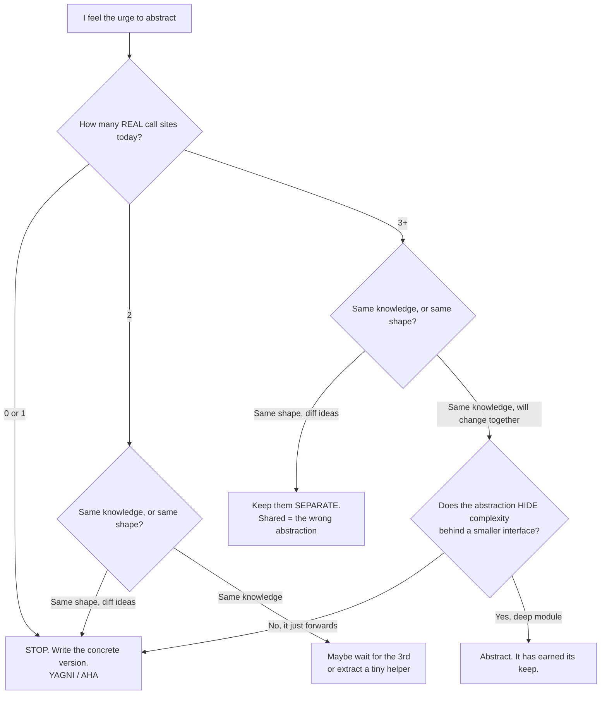

# Premature Abstraction at Scale — Middle

> **Category:** [Anti-Patterns at Scale](../README.md) → **Premature Abstraction at Scale** — *the "clean", generic, decoupled design nobody needed — when over-abstraction is itself the anti-pattern, and how to unwind it at scale.*
> **Covers (collectively):** Speculative Generality · Wrapper-itis & needless indirection · Premature decoupling & one-implementation interfaces · The Wrong Abstraction · AHA / Rule of Three / YAGNI as the cure

---

## Table of Contents

1. [Introduction](#introduction)
2. [Prerequisites](#prerequisites)
3. [The Real Skill: Telling a Seam From a Speculation](#the-real-skill-telling-a-seam-from-a-speculation)
4. [Speculative Parameters: Flexibility on Spec](#speculative-parameters-flexibility-on-spec)
5. [Deep Wrapper Layers: When Indirection Pays and When It Doesn't](#deep-wrapper-layers-when-indirection-pays-and-when-it-doesnt)
6. [Pattern-for-Pattern's-Sake](#pattern-for-patterns-sake)
7. [The Rule of Three — and the Trap Inside It](#the-rule-of-three--and-the-trap-inside-it)
8. [When an Abstraction Has Earned Its Keep](#when-an-abstraction-has-earned-its-keep)
9. [The Decision: A Flowchart You Can Run](#the-decision-a-flowchart-you-can-run)
10. [Resisting It in Review](#resisting-it-in-review)
11. [Common Mistakes](#common-mistakes)
12. [Test Yourself](#test-yourself)
13. [Cheat Sheet](#cheat-sheet)
14. [Summary](#summary)
15. [Further Reading](#further-reading)
16. [Related Topics](#related-topics)

---

## Introduction

> Focus: **Spotting it & resisting it** — and the harder skill of knowing when an abstraction has genuinely earned its keep.

[`junior.md`](junior.md) taught you to *recognize* the shapes: one-implementation interfaces, config nobody sets, frameworks with one user, wrapper-itis, the wrong abstraction. At the middle level the problem gets harder, because **you are now the one writing the code**, and every speculative abstraction arrives disguised as good judgment. "Let me make this configurable." "Let me extract an interface so it's testable." "Let me add a base class so the next case is easy." Each feels responsible. Some are. Most, written *before the evidence*, are not.

This file is about the discipline of **resisting the abstraction reflex** while you write — and, just as important, the judgment to know when you've waited long enough and an abstraction has truly earned its keep.

> **The distinction that defines this topic.** [Over-Engineering → middle](../../01-development/03-over-engineering/middle.md) teaches you to *calibrate* speculative generality in the file you're writing. **This topic is the at-scale / staff angle:** the same instinct, but framed around the cost a wrong abstraction inflicts once it's *spread across a codebase* — and the mechanics of unwinding it later, which you'll execute in [`senior.md`](senior.md). Here you learn to *stop creating it*, because the cheapest wrong abstraction to remove is the one you never wrote.

> **The mindset shift:** the question is never "could this be more abstract?" — almost anything could. The question is **"do I have enough real evidence that this variation exists to justify paying for the flexibility now?"** Abstraction is a forward purchase. Buy it when you know the price and the need, not on speculation.

---

## Prerequisites

- **Required:** Fluency with [`junior.md`](junior.md) — the five shapes, YAGNI, AHA, Rule of Three, "duplication is cheaper than the wrong abstraction."
- **Required:** You write interfaces, generics, base classes, and config in production code, and you've maintained code you abstracted "for the future."
- **Helpful:** [Over-Engineering → middle](../../01-development/03-over-engineering/middle.md) — the file-level calibration of essential vs accidental complexity.
- **Helpful:** dry-principle and dependency-injection skills — DRY is the instinct this topic disciplines; DI is the most common vector for the one-implementation interface.

---

## The Real Skill: Telling a Seam From a Speculation

Every abstraction is a **seam** — a place where the code is split so the two sides can vary independently. A seam is *justified* when real variation exists on both sides of it. It's *speculative* when you put it there for a variation you *imagine*.

| | **Justified seam** | **Speculative seam** |
|---|---|---|
| **Evidence** | A second (third) *real, different* implementation exists | "We might need…" / "It'd be cleaner if…" |
| **Driver** | A present requirement | A hypothetical future |
| **What's behind it** | Genuinely different behavior | One thing, or three copies of the *same* thing |
| **Cost if wrong** | — | Indirection on every read, and a wrong shape to unwind |

The whole middle-level skill is **looking behind the seam.** When you feel the urge to abstract, ask: *what real, different thing is on the other side of this interface / parameter / layer?* If the honest answer is "nothing yet," you're about to write a speculation.

---

## Speculative Parameters: Flexibility on Spec

The most common way a careful engineer over-abstracts is by adding parameters "for flexibility" that no caller needs.

```go
// Speculative: a function generalized for callers that don't exist.
// Today there is exactly one caller, and it always passes the same values.
func FetchUser(
    ctx context.Context,
    id string,
    opts ...FetchOption,   // WithCache, WithTimeout, WithFields, WithRetries…
) (*User, error) { /* a switchboard over options nobody sets */ }
```

Each option is an axis of imagined variation. The functional-options pattern is genuinely good *when you have many real, varying call sites* — and pure overhead when you have one. The honest version is what today's single caller actually needs:

```go
func FetchUser(ctx context.Context, id string) (*User, error) { /* the real need */ }
```

A useful tell: **count the distinct argument *combinations* across all call sites.** If 30 call sites all pass the same three arguments, those aren't parameters — they're constants wearing a costume. Inline them and the signature gets honest.

> **The asymmetry that should guide you:** *adding* a parameter later is a cheap, local, mechanical change. *Removing* one is a breaking change across every call site. So the default is to add the minimum and grow on demand — because growing is easy and shrinking is hard. (At the level of a published library API this asymmetry is even sharper; see [`professional.md`](professional.md).)

---

## Deep Wrapper Layers: When Indirection Pays and When It Doesn't

Layers are abstraction's most seductive form because they look like *architecture*. A controller → service → repository → DAO stack appears in every textbook. But a layer is only worth its cost if it **holds a real responsibility** — if it *does something* that the layer below doesn't.

```python
# Pays its way: each layer has a distinct job.
class OrderController:           # HTTP concerns: parse request, status codes, auth
    def post(self, req): ...
class OrderService:              # business rules: validate, price, orchestrate
    def place(self, order): ...
class OrderRepository:           # persistence: map domain ↔ rows, transactions
    def save(self, order): ...
```

versus

```python
# Doesn't: each layer only forwards. This is wrapper-itis (Lasagna Code).
class OrderService:
    def __init__(self, repo): self.repo = repo
    def get(self, id): return self.repo.get(id)        # forwards, nothing added
class OrderRepository:
    def __init__(self, dao): self.dao = dao
    def get(self, id): return self.dao.get(id)         # forwards, nothing added
```

This connects to **deep vs shallow modules** (Ousterhout): a *deep* module hides a lot of complexity behind a small interface — high value per layer. A *shallow* module's interface is almost as complex as its implementation — it barely earns the cognitive cost of existing. A pure pass-through is the shallowest possible module: zero value, full cost.

> **The test for a layer:** *delete it in your head.* If the callers above and below could connect directly with no loss of meaning, the layer is wrapper-itis. If removing it would force real logic to leak across a boundary it belongs on, the layer is earning its keep. (See Clean Code → Deep Modules.)

---

## Pattern-for-Pattern's-Sake

Design patterns are *named solutions to recurring problems.* Applied without the problem, they become the disease they're named to cure. The tells:

- **A Strategy with one strategy.** A `PricingStrategy` interface with a single `DefaultPricing` is a one-implementation interface in a pattern costume.
- **A Factory that constructs one type.** `WidgetFactory.create()` that always `return new Widget()` adds a layer and removes nothing. Just call `new Widget()`.
- **An AbstractBase nobody else extends.** A base class with one subclass is an inheritance tax: now behavior lives across two files (the **Yo-yo Problem**) for no benefit.
- **An Observer/event bus for one synchronous caller.** Indirection and lost stack traces in exchange for decoupling you don't need yet.

```java
// Pattern-for-pattern's-sake: a Factory + Strategy stack to compute one number.
interface DiscountStrategy { double apply(Order o); }
class StandardDiscount implements DiscountStrategy { public double apply(Order o){ return o.total()*0.9; } }
class DiscountStrategyFactory { static DiscountStrategy create(){ return new StandardDiscount(); } }
// Usage: DiscountStrategyFactory.create().apply(order)  →  just: order.total() * 0.9
```

The pattern isn't wrong; the *timing* is. The `Strategy` pattern earns its keep when you have **several real, swappable pricing rules** and need to select among them at runtime. With one rule, it's pure ceremony. The middle-level discipline: reach for a pattern *because you have its problem*, not because the code "feels like it wants one."

---

## The Rule of Three — and the Trap Inside It

The **Rule of Three** says: don't abstract on the first or second occurrence; wait for the third. But there's a trap inside it that catches careful engineers, so state it precisely:

> Wait for three **real, *different*** call sites — **not** three *copies of the same thing*.

```python
# THREE COPIES OF THE SAME THING — not a green light to abstract.
# These three will always change together; they're literally identical knowledge.
def email_admin(msg):   send("admin@co", msg)
def email_admin2(msg):  send("admin@co", msg)   # copy
def email_admin3(msg):  send("admin@co", msg)   # copy
# This is real duplication — collapse it. It's one idea repeated.
```

```python
# THREE REAL, DIFFERENT USES — now an abstraction can fit all three.
def total_with_vat(items):      return base(items) * 1.20    # tax — set by law
def total_with_margin(items):   return base(items) * 1.30    # profit — set by sales
def total_with_discount(items): return base(items) * 0.90    # promo — set by marketing
# These look similar but are THREE DIFFERENT IDEAS that diverge independently.
# A shared total(items, rate) is the WRONG abstraction — it couples three things
# that change for three different reasons. Keep them separate.
```

The subtlety the Rule of Three hides: *three* matters less than *different and stable*. Three identical copies are simple duplication you should merge today (same knowledge). Three superficially-similar-but-conceptually-distinct uses are exactly the trap — they tempt you into the wrong abstraction. The real question behind the rule is: **"would these three change together, for the same reason?"** Yes → abstract. No → keep them apart even though they rhyme.

---

## When an Abstraction Has Earned Its Keep

So when *should* you abstract? An abstraction has earned its keep when **all** of these hold:

1. **Three or more real call sites** that are genuinely *different* (not copies).
2. **They share *knowledge*, not just *shape*** — they would change together, for the same reason. (If a requirement change hits one, it hits all of them.)
3. **The variation is on the *stable* axis.** You're abstracting over the part that's proven to vary (e.g., the storage backend) and leaving concrete the part that's proven not to.
4. **The abstraction is *narrower* than its implementations** — it hides real complexity behind a smaller interface (a *deep* module), rather than just relabeling it.
5. **Removing it would force you to repeat a real decision**, not just retype some characters.

```go
// Earned: three REAL, DIFFERENT storage backends, all behind one honest contract.
// They share the knowledge "how this app persists a Session" and vary on the
// stable axis "which store" — exactly what an interface is for.
type SessionStore interface {
    Get(id string) (*Session, error)
    Put(s *Session) error
}
type RedisStore    struct{ /* ... */ }   // prod
type PostgresStore struct{ /* ... */ }   // self-hosted tier
type MemoryStore   struct{ /* ... */ }   // tests + local dev
```

Three real implementations, one genuine concept, variation on the stable "which store" axis — this interface pays for itself on the first new backend. Contrast the junior file's `EmailSender` with one impl: same shape, no evidence, premature.

---

## The Decision: A Flowchart You Can Run



> The two exits that catch careful engineers: **"same shape, different ideas"** (the wrong abstraction) and **"it just forwards"** (wrapper-itis). Both *feel* like DRY and good design. Both are premature.

---

## Resisting It in Review

You'll see speculative abstraction in others' PRs (and your own). Useful, non-confrontational questions to leave as review comments:

- *"Where's the second implementation of this interface? If it's one, can we use the concrete type and extract when the second one lands?"*
- *"Which call sites set this option to a non-default value? If none, can we drop it for now?"*
- *"This layer forwards to the one below — what responsibility does it hold that the next layer doesn't?"*
- *"These two helpers look alike — would a single requirement change affect both, or could they diverge? If they'd diverge, let's keep them separate."*
- *"Could we ship the boring version and add the abstraction when the third case actually arrives?"*

The framing that lands: **adding the abstraction later is cheap and local; removing the wrong one later is expensive and global.** You're not arguing against abstraction — you're arguing for *deferring* it until the evidence is in.

---

## Common Mistakes

1. **Abstracting on the second occurrence.** Two is the danger zone — enough to *feel* like a pattern, not enough to *be* one. Wait for the third, and check it's a different idea.
2. **Counting copies as call sites.** Three identical copies are duplication to merge, not three uses that justify a parameterized abstraction. The Rule of Three is about *different* uses.
3. **"It's more testable with an interface."** If the interface exists only to inject a mock, you may be over-mocking — see mocking-strategies. Test the concrete unit; reach for a seam when the dependency is genuinely external.
4. **Adding options "while I'm here."** Every speculative parameter is a future you must keep working and testing. Add the option when a caller needs it, not when you're nearby.
5. **Mistaking a shallow layer for architecture.** Layers in a diagram aren't free. A pass-through layer is the *opposite* of good design — it adds reading cost and hides nothing.
6. **Reaching for a pattern because the code "feels like it wants one."** Patterns solve *named problems*. If you can't name the problem the pattern solves *here, today*, you have pattern-for-pattern's-sake.
7. **Treating DRY as "no two lines may look alike."** DRY is about duplicated *knowledge*, not duplicated *text*. Sometimes the DAMP (Descriptive And Meaningful Phrases) choice — a little repetition for clarity — is correct, especially in tests. (Detailed in [`professional.md`](professional.md).)

---

## Test Yourself

1. You're writing a function and feel the urge to add a `format` option. What's the single question that tells you whether to add it now?
2. Distinguish a **justified seam** from a **speculative seam**. What's the one thing you look for behind the seam?
3. The Rule of Three says wait for three uses. Why is "three *copies of the same thing*" **not** what the rule means — and what should you do with three identical copies?
4. Give two of the five conditions under which an abstraction has *earned its keep*.
5. Your colleague adds a `PricingStrategy` interface with a single `StandardPricing` implementation "so we can add tiers later." Name the anti-pattern and the question you'd raise in review.
6. When is a controller → service → repository layering *good*, and when is it wrapper-itis? What's the one-step test?

---

## Cheat Sheet

| Situation | Speculative (don't) | Earned (do) |
|---|---|---|
| **An interface** | One impl, "for testability/later" | Two-plus *real, different* impls |
| **A parameter / option** | No caller sets a non-default value | A real caller needs the variation now |
| **A layer** | Only forwards to the next layer | Holds a distinct responsibility (deep module) |
| **A design pattern** | Code "feels like it wants one" | You can name the recurring problem it solves *here* |
| **Two similar pieces** | Same *shape* → merge into the wrong abstraction | Same *knowledge* (change together) → extract |

> **The middle-level rule:** *Abstract over what has **proven** to vary, never over what **might**. Look behind every seam: if there's nothing real on the other side, you're buying flexibility you won't use — and you'll pay for it on every read.*

---

## Summary

- The middle-level skill is **resistance plus judgment**: stopping yourself from abstracting on speculation, and recognizing when an abstraction has genuinely earned its keep.
- Watch the three vectors a careful engineer over-abstracts through: **speculative parameters** (options nobody sets), **deep wrapper layers** (pass-through layers that only forward), and **pattern-for-pattern's-sake** (a Strategy with one strategy, a Factory for one type).
- The **Rule of Three** is real but has a trap: it means three *real, different* uses that share *knowledge* — not three copies of the same thing, and not three things that merely *look* alike. The true test is "would these change together, for the same reason?"
- An abstraction has earned its keep when there are 3+ real, different call sites sharing knowledge, on a stable axis of variation, behind a *deep* (complexity-hiding) interface. Anything less is premature.
- The asymmetry that should bias every call: **adding** an abstraction later is cheap and local; **removing** the wrong one later is expensive and global. Default to concrete; grow on evidence.
- Next: [`senior.md`](senior.md) — *unwinding a wrong abstraction that's already spread across a codebase: inlining it back to duplication so the real seams reveal themselves, and the codemod that does it at scale.*

---

## Further Reading

- **["The Wrong Abstraction"](https://sandimetz.com/blog/2016/1/20/the-wrong-abstraction)** — Sandi Metz (2016) — and the talk *"All the Little Things"* (RailsConf 2014) where she derives the rule live by re-introducing duplication.
- **["AHA Programming"](https://kentcdodds.com/blog/aha-programming)** — Kent C. Dodds — "Avoid Hasty Abstractions"; abstraction as a cost/benefit bet over time.
- **A Philosophy of Software Design** — John Ousterhout (2018) — deep vs shallow modules; "the best modules are deep"; why pass-through is a liability.
- **Refactoring** — Martin Fowler (2nd ed., 2018) — *Speculative Generality*, *Inline Function/Class*, *Collapse Hierarchy*, *Remove Flag Argument*.
- **["The Rule of Three"](https://blog.codinghorror.com/rule-of-three/)** — Jeff Atwood — the heuristic and its limits.

---

## Related Topics

- [Over-Engineering → middle](../../01-development/03-over-engineering/middle.md) — file-level calibration of speculative generality, essential vs accidental complexity.
- [Abstraction Failures → senior](../../02-design/03-abstraction-failures/senior.md) — Golden Hammer, Inner-Platform Effect, Interface Bloat — the same instinct gone wrong at design scale.
- Clean Code → Abstraction & Information Hiding — what a good abstraction hides, and where to draw the boundary.
- Clean Code → Deep Modules & Complexity — deep vs shallow modules; the test for whether a layer earns its keep.
- Clean Code → Classes — cohesion, and the inheritance tax behind the Yo-yo Problem.
- dry-principle · dependency-injection · mocking-strategies — DRY as the instinct to discipline; the two most common vectors for premature seams.

---

## Check your understanding

1. Explain Premature Abstraction at Scale — Middle Level in your own words and name the problem it solves.
2. How would you apply the ideas around Table of Contents, Introduction, Prerequisites in a realistic engineering change?
3. What failure mode or misuse should you look for, and what evidence would reveal it?
4. Which local design trade-off would make you choose or reject Premature Abstraction at Scale — Middle Level in an existing codebase?
5. What observable result would convince you that the approach improved the system?
