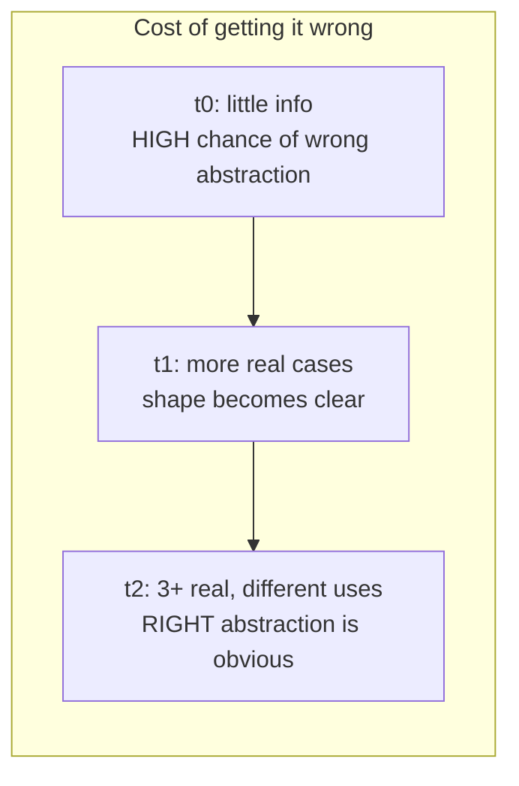
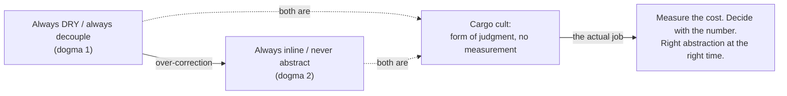

# Premature Abstraction at Scale — Professional

> **Category:** [Anti-Patterns at Scale](../README.md) → **Premature Abstraction at Scale** — *the "clean", generic, decoupled design nobody needed — when over-abstraction is itself the anti-pattern, and how to unwind it at scale.*
> **Covers (collectively):** Speculative Generality · Wrapper-itis & needless indirection · Premature decoupling & one-implementation interfaces · The Wrong Abstraction · AHA / Rule of Three / YAGNI as the cure

---

## Introduction

> Focus: **Measuring the cost of abstraction and governing it across an org without dogma** — the readability/onboarding tax, the runtime cost of dispatch and layers, the build cost of a deep generic graph, AHA as a cost curve, DRY-vs-DAMP, and the meta-point that *hunting abstractions everywhere is itself an anti-pattern.*

[`junior.md`](junior.md) was recognition; [`middle.md`](middle.md) was resistance and earned-keep judgment; [`senior.md`](senior.md) was unwinding a wrong abstraction at scale. This file goes one layer down and one layer up at once. **Down**, to the concrete, *measurable* costs of indirection — the slower onboarding, the megamorphic call site, the allocation per layer, the compile-time blowup of a deeply generic type graph — because at this level "it's harder to read" must become a number. **Up**, to org-level governance: how a staff/principal engineer sets a culture of *appropriate* abstraction without the rule-worship that produces the opposite failure — engineers who delete every interface and forbid every helper because they read a blog post.

> **The distinction that defines this topic.** [Over-Engineering → professional](../../01-development/03-over-engineering/professional.md) measures the cost of over-engineering *in a component*. **This topic is the at-scale governance angle:** the diffuse cost of a wrong abstraction spread across a codebase and teams, and the *org-wide taste* that prevents both over- and under-abstraction. The deepest professional point is reflexive: **the search for abstractions to delete can itself become a cargo cult.** "Always inline" is as dogmatic as "always DRY." The job is judgment with measurement, not a new rule to obey.

> **The professional mindset shift:** never argue about abstraction from intuition. "This is over-abstracted" and "we need an abstraction here" are both *claims with a cost you can measure* — onboarding time, p99 latency, build wall-clock, defect rate, change-coupling. The senior unwinds; the professional **quantifies the cost, decides with the number, and sets a policy that scales the decision to a thousand engineers without becoming a religion.**

---

## Prerequisites

- **Required:** Fluency with [`senior.md`](senior.md) — unwinding the wrong abstraction, "shared abstraction is coupling," the inline-as-codemod, extract-vs-wait.
- **Required:** You can read a flame graph and a CPU profile, run a microbenchmark with statistical rigor (`benchstat`/JMH/`pyperf`), and read build/compile timing output.
- **Required:** A working model of dispatch mechanics: monomorphic vs polymorphic vs megamorphic call sites, inline caches, devirtualization, JIT inlining, vtable/interface-table lookups.
- **Helpful:** Exposure to a deeply generic codebase (heavy templates/generics, type-level programming) and its compile-time behavior.
- **Helpful:** profiling-techniques, big-o-analysis, refactoring-techniques skills, and org-level experience setting engineering standards.

---

## Measure First: What Indirection Actually Costs

Before any claim that something is "over-abstracted" or "needs an abstraction," reach for the instrument that quantifies the cost.

| Cost dimension | What to measure | Instrument |
|---|---|---|
| **Readability / onboarding** | Files opened to understand one change; time-to-first-PR; review back-and-forth | Code-navigation traces, onboarding surveys, PR cycle-time, "files touched per change" from git |
| **Change coupling** | Files that change *together* through the abstraction | `code-maat`/Tornhill change-coupling, `git log` co-change mining |
| **Dispatch cost** | Monomorphic vs megamorphic call sites; failed devirtualization/inlining | `perf`/`pprof` + `-gcflags=-m` (Go), JIT logs (`-XX:+PrintInlining`, `-XX:+PrintCompilation`), async-profiler |
| **Allocation per layer** | Wrapper objects, boxing, closure captures per call | `pprof -alloc_objects`, JFR allocation profiling, `pyinstrument`/`tracemalloc` |
| **Build / compile cost** | Compile wall-clock, instantiation count, incremental rebuild scope | Go `-debug-actiongraph`, Rust `cargo build --timings`, C++ `-ftime-trace`, `javac`/Gradle build scans |
| **Binary / bundle size** | Code bloat from generic instantiation, retained pass-through | `bloaty`, bundle analyzers, `nm`/symbol counts |

```bash
# Go: did the optimizer have to keep an interface call indirect (no devirtualization)?
go build -gcflags='-m -m' ./...  2>&1 | grep -E 'devirtualizing|cannot inline|escapes to heap'

# Java: which megamorphic/abstract call sites the JIT refused to inline.
java -XX:+UnlockDiagnosticVMOptions -XX:+PrintInlining -jar app.jar 2>&1 | grep -i 'not inlined'

# Build cost of a deep generic graph (C++ shown; analogous flags exist elsewhere).
clang++ -ftime-trace foo.cpp   # → foo.json, open in chrome://tracing to see template-instantiation time
```

> **Discipline (same as the rest of this chapter):** if you cannot name the number that would change after you add or remove an abstraction, you are arguing taste, not engineering. Every cost below is paired with the way to measure it on *your* code. Numbers in this file are labeled illustrative — reproduce them.

---

## The Readability & Onboarding Cost

The most pervasive cost of premature abstraction is also the hardest to put on a dashboard: **indirection taxes every read.** A new engineer tracing one request through controller → service → handler → strategy → factory → impl opens six files to find the one line that does the work. Each hop is a context switch, a "go to definition," a held mental frame.

This is **deep vs shallow modules** (Ousterhout) measured at org scale: a shallow pass-through module's whole purpose is to be traversed, so it *adds* the cognitive cost of existing while hiding nothing. Multiply by every read by every engineer over the lifetime of the code, and a "harmless" extra layer becomes one of the largest line items in the codebase's total cost of ownership.

How to make it a number instead of a vibe:

- **Files-touched-per-change**, mined from git: a change that consistently touches 6 files where the logic is 1 file's worth signals indirection tax. Track the distribution over time.
- **PR cycle-time and review rounds** on the area: heavily-layered code attracts more "where does this actually happen?" review comments.
- **Onboarding time-to-first-meaningful-PR** by area: areas dense with speculative indirection reliably onboard slower; survey new hires on where they got lost.

> **The professional framing:** "it's hard to read" is not an aesthetic complaint — it's an *unbounded, compounding cost* paid by every future reader. The way to win the argument is to bound it: *this layer adds ~N files to the median change and ~M minutes to comprehension, for zero behavioral benefit.* Now it's a trade, not a taste.

---

## The Runtime Cost: Dispatch, Allocation, Layers

Premature abstraction is usually defended as "free at runtime." Often it isn't. Three concrete, measurable runtime costs:

### 1. Virtual / interface dispatch and lost inlining

A call through an interface or virtual method is an *indirect* call. In a hot loop, the difference between a direct call (which the compiler/JIT can inline, then optimize across) and an indirect one (which it often can't) is real.

```go
// Indirect: the call goes through an interface table. If the call site sees
// many concrete types (megamorphic), the compiler can't devirtualize or inline,
// and each call pays the indirect-call + missed-optimization cost.
type Transform interface{ Apply(x float64) float64 }
func pipeline(xs []float64, t Transform) {
    for i := range xs { xs[i] = t.Apply(xs[i]) }   // indirect call per element
}

// Direct: monomorphic, inlinable. The optimizer can fold Apply into the loop,
// keep values in registers, and vectorize. One-impl interfaces give up exactly
// this — for substitutability that doesn't exist.
func pipelineSquare(xs []float64) {
    for i := range xs { xs[i] = xs[i] * xs[i] }
}
```

- A **monomorphic** call site (one concrete type) is cheap and often devirtualized/inlined. A **megamorphic** one (many types) defeats the JIT's inline cache and stays indirect. A one-implementation interface is monomorphic *today* but still blocks inlining in languages where the compiler can't prove no second type will appear at runtime — you paid the indirection and got the "flexibility" you don't use.
- Confirm with `-gcflags='-m -m'` (Go devirtualization notes), `-XX:+PrintInlining` (JVM), or a flame graph showing time in dispatch/itable lookup.

### 2. Allocation per wrapper layer

Each "decorator" or wrapper layer that wraps a value or captures a closure can allocate. A four-layer pass-through that each allocate a wrapper object turns one logical call into four allocations and four GC-tracked objects.

```python
# Each wrapper allocates an object and adds a frame. With pure pass-throughs,
# that's allocation + call overhead per layer for zero behavioral gain.
service = Logging(Caching(Retrying(RealClient())))   # 3 wrappers, 0 of them needed yet
```

Confirm with an allocation profile (`pprof -alloc_objects`, JFR, `tracemalloc`) and a flame graph; a deep wrapper stack shows up as call-overhead frames and allocation churn that a collapsed version doesn't have.

### 3. Layer overhead in aggregate

Individually each hop is nanoseconds; in a hot path called millions of times, the sum is measurable in p99 latency and CPU. The fix is not "never layer" — it's *don't pay for layers that hold no responsibility.* A layer that does real work earns its call overhead; a pass-through doesn't.

> **The honest caveat:** for most code, dispatch and layer overhead are *noise* — correctness and readability dominate, and a clean interface with one impl that isn't on a hot path costs nothing worth measuring. The point is not "indirection is slow"; it's "when someone *claims* an abstraction is free, and it's on a hot path, **measure** — sometimes it's a real tax you're paying for unused flexibility."

---

## The Build Cost: A Deep Generic Graph

The least-appreciated cost of premature abstraction is paid by the *compiler*. Deeply generic, highly-parameterized code — abstraction built "to be reusable" — can blow up compile time, binary size, and incremental-build scope.

- **Template / generic instantiation explosion.** Each distinct type a generic is instantiated with produces (in monomorphizing languages — C++ templates, Rust generics, Go generics with stenciling) a separate specialized copy. A deeply nested generic graph (`Pipeline<Stage<Transform<T>>>` across many `T`) multiplies instantiations, inflating compile time and binary size. C++ `-ftime-trace` and Rust `cargo build --timings` make the instantiation cost visible.
- **Incremental builds widen.** A heavily-generic "core" abstraction that everything depends on means a change to it recompiles every instantiation — the abstraction has fused the build graph the way a [dependency cycle](../../02-design/02-coupling-and-state/professional.md) does. The "reusable" base is also a build-fan-out hub.
- **Type-checking cost.** Elaborate type-level abstraction (deep generic bounds, conditional types) shifts work to the type checker. In TypeScript, over-clever generic types can make `tsc` and the editor language server crawl; `tsc --extendedDiagnostics` shows the check time.

```bash
# C++: see template-instantiation time of a "reusable" generic header.
clang++ -ftime-trace -c heavily_generic.cpp     # inspect the InstantiateClass/Function entries

# Rust: where compile time goes across a generic-heavy crate graph.
cargo build --timings                            # opens an HTML report; watch codegen units & monomorphization

# TypeScript: is a clever generic taxing the type checker?
tsc --extendedDiagnostics | grep -E 'Check time|Instantiation'
```

> **The professional point:** "make it generic so it's reusable" has a *compile-time price* that scales with instantiation count and graph depth — and it's paid by every engineer on every build, forever. A generic abstraction with one or two real instantiations is paying that price for reuse that never happens. Measure instantiation count and incremental-rebuild scope before declaring a generic abstraction "free."

---

## A Worked Before/After With Measured Cost

A real pattern: a team built a generic, pluggable `ValidationPipeline<T>` "so any entity could be validated the same way." In practice it validates exactly two types, `Order` and `User`, with completely different rules.

**Before — generic, layered, dispatched:**

```go
type Rule[T any] interface{ Check(T) error }
type Pipeline[T any] struct{ rules []Rule[T] }
func (p Pipeline[T]) Validate(v T) error {
    for _, r := range p.rules {        // indirect call per rule, per item
        if err := r.Check(v); err != nil { return err }
    }
    return nil
}
// Plus: RuleFactory, RuleRegistry, a config to order rules, 9 one-method Rule
// impls split across 9 files. Two real entity types. Dozens of one-impl rules.
```

Measured cost of *before* (illustrative — reproduce on your box):

```
Readability:   median change to Order validation touches 7 files (registry, factory,
               3 rule files, config, the pipeline). Onboarding survey: #1 "where do I
               even add a rule?" question in the codebase.
Runtime:       pprof shows ~38% of Validate() time in interface dispatch + slice iteration
               overhead, not in actual checks; rules never inline (megamorphic site).
Build:         Pipeline[T] instantiated for 2 types; the generic graph + 9 rule files add
               ~1.9s to a clean build of the package; editing the Rule interface recompiles
               all 9 impls + both instantiations.
```

**After — inlined to two honest validators:**

```go
// Order and User validation are different knowledge. Each is a plain function
// with its real checks inline. No generics, no registry, no dispatch.
func ValidateOrder(o Order) error {
    if o.Total < 0           { return errNegativeTotal }
    if len(o.Items) == 0     { return errEmptyOrder }
    if o.Currency == ""      { return errNoCurrency }
    return nil
}
func ValidateUser(u User) error {
    if u.Email == ""         { return errNoEmail }
    if u.Age < 0             { return errBadAge }
    return nil
}
```

Measured cost of *after*:

```
Readability:   median change touches 1 file. New engineers find ValidateOrder by name.
Runtime:       checks inline; the 38% dispatch overhead is gone (benchstat: -41% ns/op on
               the validation micro-benchmark — confirm the CAUSE via -gcflags=-m showing
               the checks now inline, not just the wall clock).
Build:         no generic instantiation, 9 files → 2 functions; ~1.9s off the package build;
               a change to Order validation recompiles one file.
```

The generic pipeline cost real readability, real runtime, and real build time — to support a plug-in flexibility that two hard-coded validators never needed. **Each loss was measured separately** (files-per-change from git, dispatch % from `pprof`, instantiation time from the build profile) so we know *which* cost the abstraction imposed and that removing it actually paid off.

> If a *third, genuinely different* entity appears and the three share real validation *knowledge*, extract a narrow abstraction then — against three real shapes, with the runtime/build cost measured, not assumed. That's the earned-keep test from [`middle.md`](middle.md), now with numbers.

---

## AHA in Depth: Abstraction as a Cost/Benefit Curve Over Time

**AHA — Avoid Hasty Abstractions** (Kent C. Dodds, building on Metz) — is best understood as a statement about a *curve over time*, not a one-time decision.



The core idea: **your knowledge of the right abstraction increases over time as real use cases accumulate.** Abstracting at `t0` — when you have the *least* information — maximizes the chance of the wrong abstraction. Waiting until `t2`, when three real, different uses have revealed the true axis of variation, maximizes the chance of the *right* one. AHA says: **optimize for change by avoiding the hasty abstraction, because a wrong abstraction is harder to recover from than a missing one.**

This reframes the whole topic as expected-value over time:

- **Cost of duplication** is *linear and reversible*: N copies, mergeable later with a codemod.
- **Cost of the wrong abstraction** is *super-linear and sticky*: coupling, flag-growth, an expensive unwind across N callers ([`senior.md`](senior.md)).
- Because the *information needed to abstract correctly arrives later*, the rational policy is to **defer until the information is in** — which is exactly YAGNI, the Rule of Three, and "duplication is cheaper than the wrong abstraction," all the same idea viewed as a timing decision under uncertainty.

> AHA is not "never abstract" — Dodds is explicit that *both* premature abstraction *and* dogmatic anti-abstraction are failures. It's "abstract *when you know*, not *when you guess*." The professional skill is sensing where you are on the information curve.

---

## DRY vs DAMP: Picking the Right Default per Context

DRY (Don't Repeat Yourself) and DAMP (Descriptive And Meaningful Phrases) are not opposites to pick a side on — they're **defaults for different contexts**, and the professional sets the right one per context.

| Context | Default | Why |
|---|---|---|
| **Core domain logic / business rules** | **DRY** | A rule encoded once changes once; duplicated *knowledge* drifts and causes correctness bugs. |
| **Tests** | **DAMP** | A test should be readable top-to-bottom in isolation. Over-DRY tests (shared setup, helpers, factories hiding the arrange) make failures hard to diagnose; a little repetition keeps each test a self-contained story. |
| **Across service / team boundaries** | **DAMP-leaning** | Shared code across boundaries is coupling that defeats the independence those boundaries exist for. A little duplication is cheaper than a shared library that re-couples teams ([`senior.md`](senior.md)). |
| **Truly identical, single-owner knowledge** | **DRY** | If it's the same idea, owned by one team, that *will* change together — extract it. |

The discriminator is always the same question from [`middle.md`](middle.md): **is this the same *knowledge* or the same *shape*?** DRY targets duplicated *knowledge* (the same decision in two places). It was *never* meant to forbid two lines that merely look alike. Applying DRY to *shape* produces the wrong abstraction; applying DAMP to genuinely-shared *knowledge* produces drift and bugs. The professional knows which default the context wants and why.

> **The precise statement of DRY** (Hunt & Thomas): *"Every piece of knowledge must have a single, authoritative representation."* Knowledge — not text. Half the wrong abstractions in industry come from misreading DRY as "no two pieces of code may look similar."

---

## The Meta-Anti-Pattern: Hunting Abstractions Everywhere

Here is the reflexive, deepest point of this entire topic. Once an engineer internalizes "premature abstraction is bad," a *new* failure appears: **treating the deletion of abstractions as an unconditional good.** This is itself a cargo cult — the form of senior judgment ("I removed the interface") without the substance (measuring whether it was actually costing anything).

The symptoms of the *anti-abstraction* cargo cult:

- **Inlining good abstractions.** Deleting a deep module with three real implementations because "interfaces are premature" — re-introducing duplication that *was* genuinely shared knowledge, causing the exact drift DRY prevents.
- **"Always inline" / "never use a Strategy" as a rule.** Replacing one dogma (always DRY, always decouple) with the mirror dogma. A rule applied without measurement is rule-worship regardless of which way it points.
- **Performative simplicity.** Removing helpful indirection to *look* anti-over-engineering, while the change makes the code worse — flattening a legitimately deep module into a fat function because "fewer files = simpler."
- **Reopening settled abstractions for ideology.** Spending review cycles arguing to delete an abstraction that is fine, costs nothing measurable, and is load-bearing — bikeshedding in the name of YAGNI.



> **The professional truth:** the goal was never "fewer abstractions." It was *the right abstraction at the right time, justified by a measurable cost or benefit.* An engineer who reflexively hunts and deletes abstractions has simply adopted the opposite superstition. The only non-cult position is: **measure the cost, decide with the number, and be willing to add an abstraction, keep one, or delete one based on evidence — not on which slogan you read last.**

---

## Governing Abstraction Without Rule-Worship

A staff/principal engineer's job is to scale this judgment to hundreds of engineers without it degrading into either dogma. How to set org-wide taste:

- **Heuristics, not laws.** Publish the Rule of Three, AHA, and DRY-vs-DAMP as *defaults with stated rationale and explicit exceptions*, not as commandments. The rationale is what scales; a rule without its "why" becomes cargo cult the moment it meets a case it doesn't fit.
- **ADRs for non-trivial abstractions and their removal.** A new shared abstraction (or a decision to unwind one) gets a short Architecture Decision Record citing the *real, current* call sites and the cost measured. "Three cited, different call sites" as a review norm turns the Rule of Three into a checkable artifact.
- **Fitness functions to catch the *extremes*, not to mandate the mean.** A CI rule can flag a *new one-impl interface* or a *cross-boundary shared module* for review (see [`senior.md`](senior.md) and [Architecture Fitness Functions](../01-architecture-fitness-functions/senior.md)) — a prompt for a human decision, *not* an auto-reject. Automating the *flag* is good; automating the *verdict* recreates rule-worship in YAML.
- **Make the cost visible.** Dashboards for files-per-change, change-coupling, build time per package, and hot-path dispatch % turn abstraction debates from taste into trades. Engineers argue better with numbers in front of them.
- **Model the judgment in review.** The most scalable governance is senior engineers consistently asking, in reviews, *"what real variation does this earn its keep against, and what does it cost?"* — and being equally willing to *defend* a good abstraction against a reflexive deletion. Culture is set by what gets praised and questioned, repeatedly, in the open.

> **The line a principal walks:** strong enough defaults that a thousand engineers don't each re-derive YAGNI from scratch, loose enough that the defaults bend for the case that genuinely needs an abstraction. Dogma in either direction — "always DRY" or "always inline" — outsources judgment to a slogan. The deliverable is *taste, measured and explained*, propagated through rationale, ADRs, visible cost, and modeled review behavior.

---

## Common Mistakes

Professional-level mistakes — sophisticated and expensive:

1. **Arguing "over-abstracted" without a number.** "This is too abstract" loses to "but it's clean." Bound the cost — files-per-change, dispatch %, build seconds, onboarding time — and it becomes an undeniable trade.
2. **Assuming indirection is free at runtime.** On a hot path, one-impl interfaces and wrapper stacks cost dispatch and allocation the optimizer can't always remove. Measure with `pprof`/JIT logs before declaring it free.
3. **Ignoring the compiler's bill.** A deeply generic "reusable" abstraction can dominate compile time and incremental-rebuild scope. Reuse that never materializes still charges every build. Measure instantiation count and rebuild scope.
4. **Over-DRYing tests.** Tests want DAMP — a readable, self-contained story. Shared setup and factories that hide the arrange make failures undiagnosable. Different default, different context.
5. **Reading DRY as "no two lines may look alike."** DRY is about duplicated *knowledge*, not *text*. Misapplying it to shape is the single largest source of wrong abstractions.
6. **Catching the anti-abstraction cargo cult.** Reflexively deleting interfaces/helpers to *look* un-over-engineered is the mirror dogma. Inlining a *good* abstraction re-creates the drift DRY exists to prevent. Measure before you delete, exactly as you measure before you abstract.
7. **Automating the verdict, not the flag.** A fitness function that auto-rejects every one-impl interface mandates a mean and recreates rule-worship. Flag for human judgment; don't legislate the answer.
8. **Setting rules without rationale.** A heuristic published as a commandment becomes a cargo cult the moment it meets an exception. The "why" is the part that scales.

---

## Test Yourself

1. A teammate insists a six-layer call chain is "fine, it's clean." How do you convert the readability objection from a taste argument into a measured cost? Name two metrics.
2. Why can a one-implementation interface have a *runtime* cost even though there's only one type? How would you confirm it on Go and on the JVM?
3. Explain how a "reusable" deeply-generic abstraction can inflate **compile time** and **incremental-build scope**. Name a tool to measure each.
4. State AHA as a statement about a *curve over time*. Why does abstracting at `t0` maximize the chance of the wrong abstraction?
5. Give the correct default (DRY or DAMP) for: core business rules, unit tests, and code shared across two teams' services — with a one-line justification each.
6. What is the *meta*-anti-pattern this topic warns about at the professional level, and why is "always inline / never abstract" just as much a cargo cult as "always DRY"?
7. You're a principal setting org-wide abstraction policy. Why publish the Rule of Three as a *heuristic with rationale and exceptions* rather than a hard CI rule that rejects every one-impl interface?
8. In the worked validation example, the `before` was slower, harder to read, and slower to build. What's the discipline that lets you attribute each loss to the abstraction rather than to luck?

---

## Cheat Sheet

| Cost claim about an abstraction | Make it a number with | Decision rule |
|---|---|---|
| "It's hard to read / slow to onboard" | files-per-change (git), PR cycle-time, onboarding survey, change-coupling | Bound the tax; a pass-through layer that adds files for no behavior goes |
| "It's free at runtime" | `pprof`/`-gcflags=-m`, `-XX:+PrintInlining`, alloc profile, flame graph | On a hot path, indirection/alloc the optimizer can't remove is a real cost |
| "Make it generic, it's reusable" | `-ftime-trace`, `cargo build --timings`, `tsc --extendedDiagnostics`, rebuild scope | Reuse that never materializes still charges every build — measure instantiations |
| "We should DRY this up" | "same knowledge or same shape?" + co-change mining | DRY *knowledge*; DAMP *shape*, tests, and cross-boundary code |
| "We should inline all our abstractions" | the same cost measurements, applied symmetrically | Anti-abstraction is also a cargo cult — measure before deleting a *good* one |

> **The professional rule:** *Both over-abstraction and reflexive anti-abstraction are failures of measurement. Quantify the cost (readability, dispatch, allocation, compile time, coupling), decide with the number, and govern with heuristics-plus-rationale — never with a slogan in either direction.*

---

## Summary

- At the professional level, "over-abstracted" and "we need an abstraction" are **claims with measurable costs** — onboarding/files-per-change, dispatch and allocation, compile time and rebuild scope, change-coupling. Stop arguing taste; produce the number.
- **Readability/onboarding** is the most pervasive cost: indirection taxes every read by every engineer forever. Bound it with files-per-change and onboarding metrics, grounded in deep-vs-shallow-module theory.
- **Runtime cost is real but conditional:** one-impl interfaces and wrapper stacks cost dispatch and allocation the optimizer can't always erase — on a *hot path*. Measure (`pprof`, JIT inlining logs, alloc profiles); elsewhere it's noise.
- **Build cost is the under-appreciated one:** a deeply generic "reusable" abstraction inflates instantiation count, compile time, binary size, and incremental-rebuild scope — paid on every build for reuse that may never come.
- **AHA** is a timing decision under uncertainty: information about the right abstraction arrives *later*, so abstracting early maximizes the chance of the wrong shape. Duplication is linear and reversible; the wrong abstraction is super-linear and sticky. Defer until the evidence is in.
- **DRY vs DAMP** are context-defaults, not a side to pick: DRY for knowledge and core domain logic; DAMP for tests, shape-similarity, and cross-boundary code. DRY was always about duplicated *knowledge*, never duplicated *text*.
- **The meta-anti-pattern:** hunting and deleting abstractions everywhere is itself a cargo cult — "always inline" is as dogmatic as "always DRY." The only non-cult position is measure, decide with the number, and add/keep/delete on evidence.
- **Govern without rule-worship:** heuristics with rationale and exceptions, ADRs citing real call sites, fitness functions that *flag for review* (not auto-verdict), visible cost dashboards, and senior judgment modeled in review — defending good abstractions as readily as questioning bad ones.
- This completes the level ladder: `junior.md` (recognize) → `middle.md` (resist + earned-keep) → [`senior.md`](senior.md) (unwind at scale) → **professional.md** (measure the cost, govern the org). Next, drill with the practice files.

---

## Further Reading

- **["The Wrong Abstraction"](https://sandimetz.com/blog/2016/1/20/the-wrong-abstraction)** — Sandi Metz (2016) — the foundation the whole topic rests on.
- **["AHA Programming"](https://kentcdodds.com/blog/aha-programming)** — Kent C. Dodds — abstraction as a cost/benefit decision over time; both dogmas named as failures.
- **A Philosophy of Software Design** — John Ousterhout (2018) — deep vs shallow modules; quantifying the cognitive cost of indirection.
- **The Pragmatic Programmer** — Hunt & Thomas (20th anniv. ed., 2019) — DRY as *knowledge*, and the DRY/DAMP distinction in practice.
- **Systems Performance** — Brendan Gregg (2nd ed., 2020) — flame graphs and the profiling methodology to put a number on dispatch and allocation cost.
- **What Every Programmer Should Know About Memory** — Ulrich Drepper (2007) — why indirect calls and pointer-chasing cost (cache and branch-prediction effects behind dispatch).
- **Building Evolutionary Architectures** — Ford, Parsons, Kua (2nd ed., 2022) — fitness functions as governance that flags without dictating.

---

## Related Topics

- [Over-Engineering → professional](../../01-development/03-over-engineering/professional.md) — the cost of over-engineering measured *in a component* (this file is the at-scale governance angle).
- [Abstraction Failures → senior](../../02-design/03-abstraction-failures/senior.md) — the wrong abstraction at design granularity; Inner-Platform, Golden Hammer, Interface Bloat.
- [Coupling & State → professional](../../02-design/02-coupling-and-state/professional.md) — how a shared/generic core fuses the build graph the way a dependency cycle does.
- [Architecture Fitness Functions → senior](../01-architecture-fitness-functions/senior.md) — flagging the extremes (one-impl interfaces, cross-boundary sharing) for review, not auto-verdict.
- [Hotspot Analysis → senior](../03-hotspot-analysis/senior.md) · [Automated Large-Scale Refactoring → senior](../04-automated-large-scale-refactoring/senior.md) — where and how to act on the measured cost.
- Clean Code → Abstraction & Information Hiding · Clean Code → Classes — what a good, deep abstraction is.
- profiling-techniques · big-o-analysis · refactoring-techniques · dry-principle — the measurement and decision toolkits referenced throughout.
- Architecture → Anti-Patterns — the system-level siblings.

---

## Check your understanding

1. Explain Premature Abstraction at Scale — Professional Level in your own words and name the problem it solves.
2. How would you apply the ideas around Table of Contents, Introduction, Prerequisites in a realistic engineering change?
3. What failure mode or misuse should you look for, and what evidence would reveal it?
4. How would you introduce and govern Premature Abstraction at Scale — Professional Level across teams through reversible, measurable increments?
5. What observable result would convince you that the approach improved the system?
