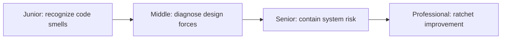
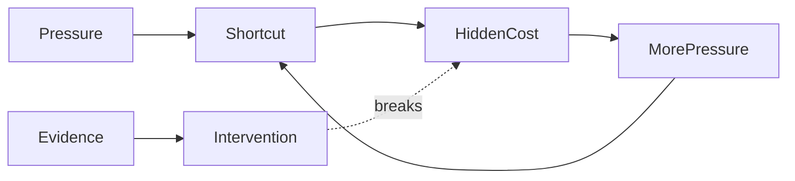

# Anti-Patterns

> An anti-pattern is a repeated response that feels locally useful but creates predictable long-term failure.

This guide preserves development, design, concurrency, async, testing, performance, and at-scale anti-patterns without a separate page for every smell.

| Level | Guide | You are done when |
|---|---|---|
| Junior | [Recognize local smells](junior.md) | You can explain the concrete harm and make one safe improvement. |
| Middle | [Diagnose design forces](middle.md) | You can distinguish a symptom from the structural cause. |
| Senior | [Manage systemic anti-patterns](senior.md) | You can reduce coupling, flaky feedback, and migration risk incrementally. |
| Professional | [Govern at scale](professional.md) | You can measure hotspots, automate ratchets, and prevent recurrence. |

## Practice rule

Never refactor because a label sounds bad. Name the observed cost, the force creating it, the safer behavior, and the evidence that confirms improvement.

## Related

- [Legacy Code](../legacy-code/README.md)
- [Technical Debt](../technical-debt/README.md)
- [Object-Oriented Design](../object-oriented-design/README.md)
