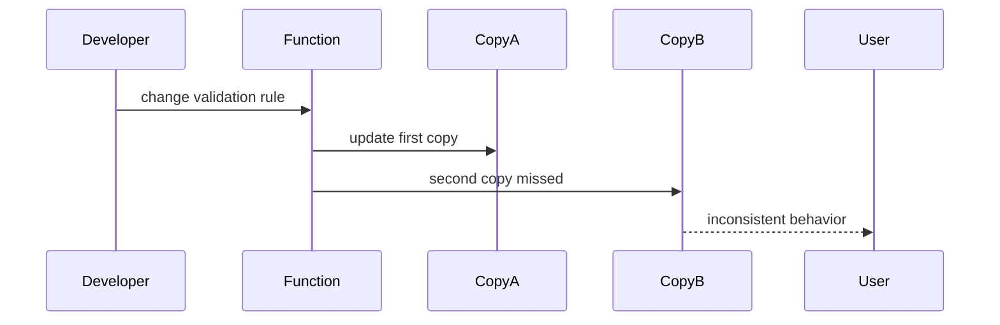

# Anti-Patterns — Junior

Focus on visible harm: code that is difficult to read, test, or change.

Common signals include duplicated business rules, long functions mixing unrelated work, global mutable state, misleading names, swallowed errors, tests that depend on execution order, and optimization without measurement.

Use a small loop: reproduce behavior, add a focused test, make one structural improvement, rerun the test, and inspect the diff. Do not combine cleanup with unrelated feature changes.

Avoid replacing every repeated line with a helper. Extract only when the code represents the same concept and changes for the same reason.

## Test yourself

1. When is duplication safer than a false abstraction?
2. Why are swallowed exceptions dangerous?
3. What test should precede a risky cleanup?
4. Which evidence justifies a performance optimization?

Continue to [`middle.md`](middle.md).
