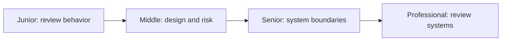
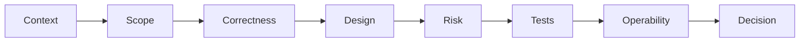

# Code Review

> Review changes to improve correctness, maintainability, security, shared understanding, and delivery flow.

| Level | Guide | You are done when |
|---|---|---|
| Junior | [Review one clear change](junior.md) | You can verify intent, behavior, tests, and readability respectfully. |
| Middle | [Review design and risk](middle.md) | You can identify boundary, security, and performance consequences. |
| Senior | [Review system evolution](senior.md) | You can protect invariants, compatibility, rollout, and operations. |
| Professional | [Design review capability](professional.md) | You can improve review quality and flow across an organization. |

## Practice rule

Review in risk order: understand intent and scope first, then correctness, design, security, performance, tests, and maintainability. Style automation should not consume human attention.

## Related

- [Documentation](../documentation/README.md)
- [Object-Oriented Design](../object-oriented-design/README.md)
