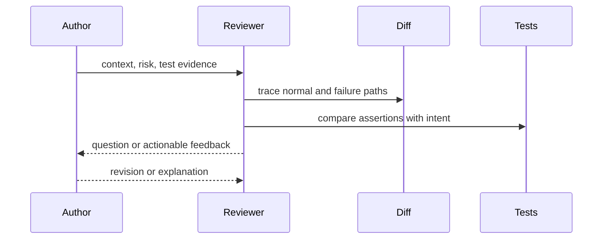

# Code Review — Junior

Read the ticket and change description before the diff. Ask what behavior should change, what must not change, and how the author verified it.

Classify feedback: blocking correctness or safety issue, strong design suggestion, question, or optional nit. Explain why a change matters and suggest an example when useful. Do not use review to display superiority.

Check names, edge cases, error behavior, duplicated rules, test quality, and accidental secrets. Run the focused test when the risk justifies it.

## Test yourself

1. Why read context before the diff?
2. Which comment is blocking versus optional?
3. How do you make feedback actionable?
4. What does a passing test still fail to prove?

Continue to [`middle.md`](middle.md).
