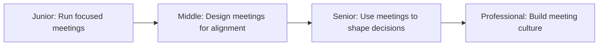
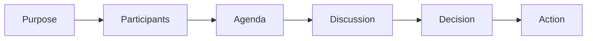

# Meeting

> Run meetings that make decisions, build alignment, and respect people's time. A good meeting is rare; a bad meeting is expensive.

| Level | Guide | You are done when |
|---|---|---|
| Junior | [Run focused meetings](junior.md) | You can run a meeting with a clear agenda, make a decision, and document the outcome. |
| Middle | [Design meetings for alignment](middle.md) | You can design a meeting that builds shared understanding and surfaces disagreements. |
| Senior | [Use meetings to shape decisions](senior.md) | You can use meetings to guide decisions without controlling them, and know when not to meet. |
| Professional | [Build meeting culture](professional.md) | You can establish meeting norms that scale, reduce meeting load, and increase decision quality. |

## Practice rule

Every meeting should have a clear purpose, the right people, and a documented outcome. If you can't state the purpose in one sentence, don't meet.

## Related

- [Delegation](../delegation/README.md)
- [Ownership](../ownership/README.md)
- [Problem Solving](../problem-solving/README.md)
