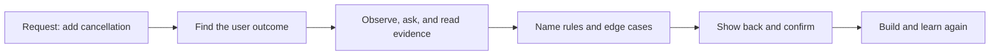

# Elicitation - Problem

**Elicitation** means drawing out or receiving useful information from people and other sources. In software work, it helps a team turn a vague request into a shared picture of the need, the rules, and the limits before it commits to a solution.

## The problem it solves

People usually report a problem in the language of a solution: “Add a cancel button,” “send an alert,” or “put this field on the page.” That is a useful starting clue, but it does not say what must happen in every case.

If a team builds the first suggested solution without asking further, it can ship a button that:

- cancels an order that has already been dispatched;
- leaves a customer unsure whether their refund is coming;
- breaks a warehouse handoff; or
- solves a rare complaint while ignoring the real delay.

The International Institute of Business Analysis describes elicitation as getting information from stakeholders or other sources. It can include conversation, document research, observation, experiments, and information a team is given. It is ongoing work, not one meeting at the start of a project.

## The mechanism: need before solution

1. **Start with the outcome.** Ask who has the problem, what they are trying to achieve, and what goes wrong today. A requirement is a usable representation of a need, not merely a feature request.
2. **See the current work.** Read the existing policy, trace a real example, inspect data, or observe the person doing the job. What people say they do and what the process actually allows can differ.
3. **Ask for rules and edges.** Ask what must always happen, what must never happen, who can act, what information is needed, and what changes the answer.
4. **Show back what you heard.** Use a short written summary, flow, example, or prototype. Ask the people who know the work whether it matches reality.
5. **Keep checking while building.** A design, test result, or early release can reveal a missing rule. Update the shared understanding instead of treating the first note as final.

## Worked example: “Let customers cancel an order”

A product manager asks for a **Cancel order** button. The team could immediately add it. Instead, it elicits the need.

| Question | What the team learns |
|---|---|
| Who needs this and why? | Customers want to correct a mistaken order without waiting for support. Support wants fewer manual tickets. |
| What happens today? | A customer contacts support. Support can cancel only before the warehouse starts picking. |
| What must not happen? | A picked, dispatched, or delivered order must not be cancelled through self-service. |
| What proves success? | Eligible customers receive a clear cancellation result and refund status; ineligible orders explain the next step. |
| What is still uncertain? | Whether payment providers can reverse every payment method immediately. |

The request is now clearer than “add a button”:

> An authenticated customer may cancel an order while its status is `paid` or `awaiting_fulfilment`. The system must reject cancellation once picking begins, show why, start the refund process, and record the action for support.

This is not the final design. It is a shared, testable picture of the need. The team can now discuss a button, an API, a refund workflow, and warehouse events without confusing any one of them for the original problem.

## Questions that uncover the next detail

- What user outcome makes this request worth doing?
- Can you show me the current path using one real recent case?
- What rule decides whether this case is allowed?
- Who sees the result or is affected if it is wrong?
- What exception has support or operations had to handle before?
- How would we know the new path worked for the user?

Continue to [Mistake](mistake.md).
