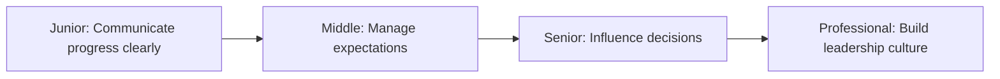

# Manage Up

> Managing up means working effectively with your manager and leadership. It's about communicating clearly, setting expectations, and building trust.

| Level | Guide | You are done when |
|---|---|---|
| Junior | [Communicate progress clearly](junior.md) | You can share updates, raise issues early, and ask for help effectively. |
| Middle | [Manage expectations](middle.md) | You can set realistic expectations, negotiate scope, and handle feedback. |
| Senior | [Influence decisions](senior.md) | You can shape decisions, escalate issues, and guide your manager. |
| Professional | [Build leadership culture](professional.md) | You can establish norms for managing up, develop managers, and create psychological safety. |

## Practice rule

Before each 1-on-1 with your manager, write: what you accomplished, what you're working on, what blockers you have, and what you need from them. Update this weekly.

## Related

- [Communication](../communication/README.md)
- [Ownership](../ownership/README.md)
- [Negotiation and Debate](../negotiation-and-debate/README.md)
- [Meeting](../meeting/README.md)
