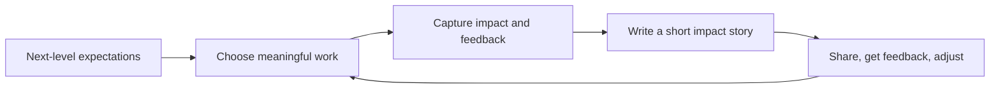

# Manage Up - Problem

**Managing up** means giving your manager the facts, context, and asks they need to help you and represent your work fairly. It is not flattery or taking responsibility for the manager's job. It is making the working relationship useful in both directions.

## The problem it solves

Strong work can be hard to recognize when its impact stays inside a ticket, pull request, or one team.

- Your manager may know you shipped an API but not that it cut support work by half.
- A promotion panel may see a list of tasks but not the harder problem you led, the people you aligned, or the result for customers.
- You may keep waiting for feedback and discover too late that your manager expected evidence of a larger scope.
- A manager cannot remove a blocker or advocate for you if they learn about it at the deadline or review cycle.

Promotion is not simply a reward for being busy. It is a decision that you already work at the next level's expected scope and impact. [Staff Engineer's guidance on promotion visibility](https://staffeng.com/guides/being-visible/) makes a related point: decision-makers cannot support work they do not know well enough to recall. Regular career conversations give you and your manager a place to align on goals, evidence, and support needs.

## The mechanism: make impact easy to see

1. **Understand the bar.** Ask for the written expectations of your current and next level. Find the expected impact, technical judgment, teamwork, and influence; do not guess from a title.
2. **Choose work that can show the bar.** Pick a real problem where you can own a meaningful result, work with others, and leave evidence behind. Do not collect side projects only because they look impressive.
3. **Record evidence while it is fresh.** Capture the starting problem, your decisions, collaborators, results, feedback, and what you learned. A metric is useful, but so are a customer result, lower operational risk, or a better team capability.
4. **Turn activity into a short impact story.** State the context, what you did, why it mattered, evidence of the result, and who else contributed. This lets a manager repeat the story accurately in a promotion discussion.
5. **Share at the right cadence.** Give concise updates in a one-on-one, project review, or written note. End with a clear ask: feedback on the gap, help with a blocker, or agreement on the next stretch opportunity.

## Worked example: improve the failed-payment recovery path

Mai is a senior backend engineer who wants to be considered for staff engineer. Her company expects a staff engineer to lead a cross-team problem, improve a business or customer outcome, and help other engineers move faster.

The payments team sees that failed card payments create many support tickets and lost renewals. Mai does more than implement retry code:

| Part | What Mai does | Evidence she keeps |
|---|---|---|
| Context | Finds that 18% of renewal failures become support tickets and that support cannot explain retry status. | Dashboard baseline and support examples. |
| Ownership | Brings together payments, support, and product; writes the decision record and owns the technical plan. | Meeting decisions, design note, and partner feedback. |
| Delivery | Builds a clear retry state, safe retry rules, alerts, and a support-facing status view. | Rollout plan, tests, and operational runbook. |
| Result | Cuts ticket rate from 18% to 7% and gives two teammates ownership of the alerting and status components. | Post-release metric and feedback from support and teammates. |

Her update is not “I shipped payment retries.” It is: “I led the failed-payment recovery work across payments and support. We reduced renewal-failure tickets from 18% to 7%, and the support team can now see the retry state. I made the retry rules and rollout safer, and Linh and Arjun now own the alerting and status pieces. For staff readiness, where is this still below the expected cross-team scope?”

That story makes the value, scope, and next feedback request visible without claiming credit for work others did.

## Useful questions for a one-on-one

- What does good performance at my next level look like here, in observable terms?
- Which part of my recent work is strongest evidence, and what evidence is missing?
- What is one problem where I could demonstrate the missing scope with real support?
- Who needs to see or give feedback on this work for an accurate picture?
- What would make you comfortable advocating for me in the next review cycle?

Continue to [Mistake](mistake.md).
