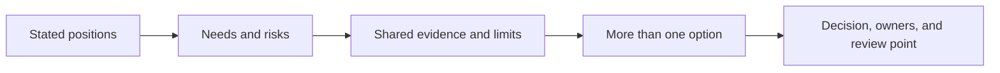

# Negotiation and Debate - Problem

**Negotiation** finds an agreement when people need different things. **Debate** tests ideas so the group can make a better decision. Both work when people argue about the problem, not about each other.

## The problem it solves

Software teams often get stuck on a false choice:

- Product says, "Ship it Friday."
- Engineering says, "Delay it two weeks."
- Each side repeats its answer, defends its reputation, and treats the other side as the obstacle.

Those are **positions**: what someone says they want. The useful discussion is about **interests**: why they need it and what risk they are trying to avoid. The [principled-negotiation method](https://en.wikipedia.org/wiki/Getting_to_Yes) names four moves: separate people from the problem, focus on interests rather than positions, create options that help both sides, and use objective criteria. Objective criteria are facts or measures both sides agree should guide the decision.

## The mechanism: position to decision

1. **Frame one decision.** Name the choice, deadline, decision owner, and what happens if no decision is made. Do not start with a vague request for agreement.
2. **Uncover interests.** Ask each person what they need, what they fear, and what would make the option acceptable. Repeat their answer back before offering yours.
3. **Set shared criteria.** Choose facts that matter to the decision: customer date, error budget, load-test result, rollback time, cost, or support impact. This moves the argument away from seniority and confidence.
4. **Generate real options.** Write at least two ways to meet the interests. A partial launch, a pilot, a feature flag, or a later phase may work better than splitting the difference.
5. **Decide and commit.** Record the choice, why it met the criteria, who owns each next step, and when new evidence would reopen the decision. Debate ends when the decision is made, unless the facts change.

## Worked example: a launch date versus a safety check

Product wants the new data-export feature in Friday's launch because a customer will see it in a renewal meeting. Engineering wants to delay it because the export queue has not passed a load test or a rollback rehearsal.

**The decision:** "What can we safely show or release by Friday without putting customer data at risk?"

| Side | Position | Interest |
|---|---|---|
| Product | Include data export on Friday. | Give the customer credible proof that the feature is coming. |
| Engineering | Delay the release two weeks. | Avoid a queue failure that cannot be stopped or rolled back quickly. |
| Support | Do not surprise customers. | Know who can use the feature and what to say if it fails. |

1. You first repeat the interests: Product needs customer confidence, engineering needs a safe stop-and-recover path, and support needs a clear promise.
2. The group agrees on criteria: the feature must pass the agreed load test, rollback must complete within 15 minutes, and the customer must see the real workflow rather than a slide.
3. The group writes three options: release to everyone Friday; show the workflow only in a staging demo; or enable it for one opted-in customer behind a feature flag after the tests pass.
4. Releasing to everyone fails the safety criteria. A staging demo meets the meeting need but gives no production proof. The pilot can meet both needs if the test and rollback rehearsal pass by Thursday.
5. The decision record says: "Run the pilot Friday for one opted-in customer if both checks pass; otherwise use the staging demo and move the pilot to next week." It names the test owner, feature-flag owner, support contact, and Thursday review time.

No one had to lose for the other side to win. The team stopped arguing about "Friday versus two weeks" and chose an option against facts both sides accepted.

## Debate is not a fight

- Ask for a claim, its evidence, and the risk if it is wrong.
- Critique the claim, not the speaker: "The load test does not cover peak traffic" is useful; "You always rush releases" is not.
- Give people time to write concerns before a loud discussion. Atlassian's [Sparring practice](https://www.atlassian.com/team-playbook/plays/sparring) uses focused questions, specific feedback, and silent writing to make feedback safer and more useful.
- Once the decision owner makes the call, support the execution. If new evidence breaks the agreed criteria, bring that evidence back rather than reopening the same argument.

Continue to [Mistake](mistake.md).
