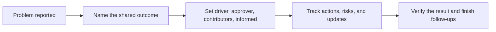

# Ownership - Problem

**Ownership in a team** means keeping a shared outcome moving until it is safely done. You do not do every task yourself. You make sure the work, decision, and handoffs do not disappear between people.

## The problem it solves

Software work often crosses product, support, QA, security, and more than one engineering team. A task can be "assigned" yet still fail because nobody is driving the shared result.

- A developer fixes code, but nobody decides whether to roll it back first.
- Support knows customers are affected, but engineering does not know which customers.
- Several people investigate, but no one records the next decision or follows through on the prevention work.

Ownership gives the group one person who keeps the result visible and moving. That person coordinates; they do not become the person who must perform every piece of work.

## The mechanism: own the outcome, not every task

1. **Name the outcome.** State the result people need, the limit of the work, and how you will know it is safe. "Fix payments" is a task-shaped sentence. "Stop new duplicate charges, find affected customers, and confirm checkout is safe" is an outcome.
2. **Make roles clear.** For a decision that crosses people or teams, use four simple roles from [DACI](https://www.atlassian.com/team-playbook/plays/daci): a **Driver** keeps the work and people together; one **Approver** makes the call; **Contributors** bring the needed knowledge; **Informed** people need the result but do not need to decide it.
3. **Keep the work visible.** Write down the current facts, decision, risks, next actions, owners, and next update time. Clear roles and named responsibilities expose both duplicated work and work nobody has accepted, as described in Atlassian's [roles-and-responsibilities practice](https://www.atlassian.com/team-playbook/plays/roles-and-responsibilities).
4. **Close the loop.** Check the outcome, tell affected people what changed, and keep prevention work assigned until it is complete. A [Google SRE postmortem guide](https://sre.google/workbook/postmortem-culture/) makes the same point for incidents: action items need a clear owner, priority, and trackable end state.

## Worked example: duplicate charges after a checkout release

Support reports three customers were charged twice after a checkout rollout. You own the payments service, so you become the Driver for the immediate response.

**The outcome:** "Stop any new duplicate charges today, identify affected customers, and prove the checkout path is safe before re-enabling the rollout."

| Role | Person or group | Their job |
|---|---|---|
| Driver | You | Keep facts, actions, decisions, and updates together. |
| Approver | The incident lead | Decide whether to disable checkout or roll back the release. |
| Contributors | Payments engineer, QA, support | Find the cause, test the fix, identify and help affected customers. |
| Informed | Product lead and customer-support lead | Know the impact, decision, and expected next update. |

1. You write the known facts: three duplicate charges, the rollout time, affected payment method, and customer impact.
2. You ask the Approver to choose between disabling the new flow and rolling back. The group chooses rollback because it stops further charges fastest.
3. You give each action one owner and a check: the payments engineer compares idempotency keys, QA tests the rollback in staging, and support confirms the affected-customer list.
4. You send the agreed update time and record the decision. You do not have to run every query or test yourself.
5. After rollback, the team checks that duplicate-charge alerts are quiet and that a new checkout test passes. The prevention item, "reject a repeated payment request with the same idempotency key," gets its own owner and due date.

The ownership work was not writing all the code. It was making sure the customer outcome, decision, handoffs, and follow-up remained connected.

## A quick test

- Can anyone name the outcome without reading a long thread?
- Is there one person driving the work and one person able to make each needed decision?
- Does every next action have an owner and a way to show it is done?
- Will affected people hear the outcome without having to chase it?

Continue to [Mistake](mistake.md).
