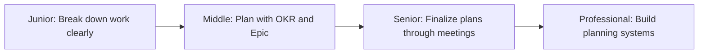

# Planning

> Planning is how you translate business goals into concrete work. Good planning makes execution clear and reduces surprises.

| Level | Guide | You are done when |
|---|---|---|
| Junior | [Break down work clearly](junior.md) | You can decompose a feature into tasks, estimate effort, and identify dependencies. |
| Middle | [Plan with OKR and Epic](middle.md) | You can write OKRs, define Epics, and create work breakdown structures. |
| Senior | [Finalize plans through meetings](senior.md) | You can run planning meetings, align stakeholders, and make trade-off decisions. |
| Professional | [Build planning systems](professional.md) | You can establish planning processes, measure planning quality, and scale planning across teams. |

## Practice rule

Before starting work, write: what you're building, why it matters, how you'll measure success, what's in scope, what's out of scope, and how long it will take. Update this as reality changes.

## Related

- [Ownership](../ownership/README.md)
- [Estimation](../estimation/README.md)
- [Communication](../communication/README.md)
- [Meeting](../meeting/README.md)
