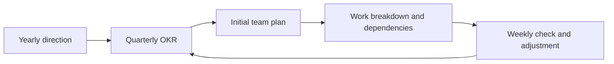

# Planning - Problem

**Planning** turns a direction into a sequence of choices: what outcome matters, what the team will do now, what it will not do, and how it will notice when it needs to change course. A plan is a shared model for making decisions, not a promise that the future will stay still.

## The problem it solves

Without a usable plan, a team can stay busy while moving in the wrong direction.

- A yearly goal becomes a pile of unrelated tickets.
- An OKR becomes a list of features, so nobody can tell whether users benefited.
- The team discovers a dependency halfway through the quarter, after its launch date has already been promised.
- Status reports say “on track” until the deadline, because nobody checks the result that matters.

Planning connects levels of work without pretending each one has the same certainty. The annual direction says where to invest. An OKR says what outcome should change. An initial team plan makes the next period concrete. A work breakdown shows what work is needed. A regular cadence turns evidence into a revised plan.

## The mechanism: annual direction to weekly learning

1. **Choose a yearly direction.** Pick a small number of strategic bets and the user or business change each should create. This is a direction, not a detailed 12-month backlog.
2. **Set OKRs for the next cycle.** An objective describes the desired change in plain language. Key results measure whether it happened. A feature can support a key result, but it is not the key result itself.
3. **Make the initial team plan.** Agree on the outcome, scope, non-goals, people needed, rough capacity, key risks, and first milestone. Put the uncertain parts in the open.
4. **Break work down.** Decompose the scope into deliverables and work packages small enough to own, estimate, sequence, and check. Map dependencies before promising dates.
5. **Track on a cadence.** Check progress against key-result milestones and delivery evidence. Decide whether to continue, adjust scope, remove a blocker, or stop work that no longer serves the outcome.

## Worked example: reduce time to first useful report

The company’s yearly direction is: **make new customers successful sooner**. The analytics team owns one part of that direction: new customers struggle to create their first report.

| Planning level | Decision |
|---|---|
| Yearly direction | Reduce the time between signup and a customer’s first useful result. |
| Quarterly objective | Make first-time reporting feel simple and dependable. |
| Key results | Reduce median time to first saved report from 10 days to 3; raise the share of new accounts with a saved report in 14 days from 30% to 55%; keep report-creation failure below 1%. |
| Initial team plan | Start with guided setup for one common report type. Exclude custom report builders and new integrations this quarter. |
| Work breakdown | Research the current journey, define the default template, build guided steps, add event tracking, test failures, release to a small cohort. |
| Cadence | Review the funnel and failure rate weekly; review the key results monthly; reset the next-quarter plan after the quarterly review. |

The team has not promised every detail of the year. It has made the next bet testable and has a way to learn whether the work is helping.

## What each planning layer must answer

- **Yearly planning:** What few outcomes deserve sustained investment, and what will we deliberately not prioritize?
- **OKR:** What change do we want in this cycle, and what measurable evidence will show it?
- **Initial team plan:** What is in and out, who is needed, what are the main assumptions, and what is the first useful milestone?
- **Work breakdown:** What deliverables and work packages make up the chosen scope? Who owns them, and what must happen first?
- **Cadence tracking:** What metric, milestone, risk, or dependency will we review; who owns the update; and what decision follows if it is off track?

Continue to [Mistake](mistake.md).
