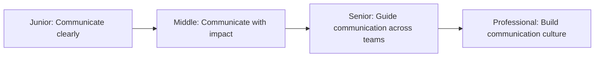

# Communication

> Communicate clearly and honestly with colleagues. Good communication builds trust, prevents misunderstandings, and makes teams more effective.

| Level | Guide | You are done when |
|---|---|---|
| Junior | [Communicate clearly](junior.md) | You can explain ideas clearly, listen actively, and give constructive feedback. |
| Middle | [Communicate with impact](middle.md) | You can tailor your message to your audience, handle difficult conversations, and build alignment. |
| Senior | [Guide communication across teams](senior.md) | You can facilitate communication between teams, resolve conflicts, and shape how decisions are communicated. |
| Professional | [Build communication culture](professional.md) | You can establish communication norms, teach communication skills, and measure communication health. |

## Practice rule

Clarity, honesty, and listening are non-negotiable. Adapt your style to your audience, but never sacrifice truth for comfort.

## Related

- [Delegation](../delegation/README.md)
- [Meeting](../meeting/README.md)
- [Ownership](../ownership/README.md)
