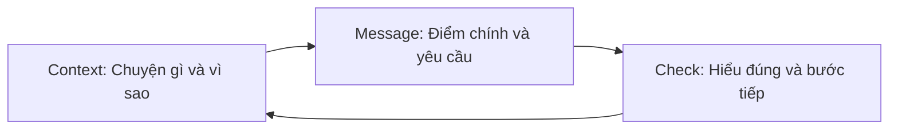

# Speaking clearly

Kỹ năng nói rõ giúp người nghe hiểu điều quan trọng, biết việc cần làm, và có cơ hội sửa một hiểu nhầm trước khi nó thành quyết định sai. Đây không phải là nói nhiều hơn hay dùng từ chuyên môn hơn. Đó là chọn đúng lượng thông tin cho đúng người.

## Vấn đề nó giải quyết

Trong một cuộc họp, người nói thường bắt đầu từ thứ họ vừa tìm ra: log, chi tiết kỹ thuật, hoặc cả quá trình điều tra. Người nghe lại cần biết một điều khác: chuyện gì đang xảy ra, nó ảnh hưởng gì đến họ, và họ cần quyết định hay làm gì.

- Người làm sản phẩm cần biết ngày phát hành và ảnh hưởng tới người dùng.
- Kỹ sư cần bằng chứng, phương án, và rủi ro kỹ thuật.
- Lãnh đạo cần quyết định, tác động, và điều gì cần hỗ trợ.

Việc đổi mức độ chi tiết theo người nghe không làm thông tin kém trung thực. Nó giúp họ tiếp nhận thông tin cần thiết. Atlassian cũng khuyên điều chỉnh nội dung, giọng điệu và độ chi tiết theo nhu cầu của từng nhóm; trong khi đó, CDC khuyên xác định người nghe, mục đích và thông điệp chính trước khi bắt đầu. [Atlassian](https://www.atlassian.com/work-management/project-collaboration/communication-plan), [CDC](https://www.cdc.gov/nceh/clearwriting/mod1/index.html)

## Framework: Context → Message → Check

### 1. Context — đặt bối cảnh vừa đủ

Nói một hoặc hai câu để người nghe biết:

- Ta đang nói về việc gì?
- Vì sao việc này quan trọng với họ ngay lúc này?
- Mục tiêu của cuộc nói chuyện là thông báo, xin quyết định, hay xin giúp đỡ?

Đừng kể toàn bộ lịch sử trước khi nêu điểm chính. Hướng dẫn plain language của CDC đề xuất đặt thông tin quan trọng nhất trước và dùng từ quen thuộc với người nghe. [CDC](https://www.cdc.gov/niosh/bulletin/2017/clear-communication.html)

### 2. Message — nói điểm chính trước

Nêu một câu mà người nghe có thể lặp lại được. Sau đó mới thêm bằng chứng, lựa chọn, hoặc chi tiết cần thiết.

- Dùng câu chủ động: “Tôi đề nghị lùi phát hành hai ngày.”
- Nói tác động cụ thể: “Nếu phát hành hôm nay, đơn trả tiền có thể bị ghi hai lần.”
- Kết thúc bằng yêu cầu rõ: “Tôi cần Product xác nhận thay đổi ngày phát hành trước 15:00.”

Một thông điệp chính không có nghĩa chỉ có một ý trong cả cuộc họp. Nó giúp người nghe biết ý nào quan trọng nhất trước khi đi vào phần còn lại.

### 3. Check — kiểm tra sự hiểu và chốt bước tiếp

Đừng dùng “Mọi người hiểu chứ?” vì câu đó thường chỉ nhận được im lặng. Thay vào đó:

- Mời câu hỏi cụ thể: “Điều gì trong rủi ro hoặc kế hoạch này còn chưa rõ?”
- Hỏi lại để kiểm tra: “Minh, em có thể tóm tắt quyết định và người phụ trách giúp anh không?”
- Chốt bằng văn bản: quyết định, chủ sở hữu, thời hạn, và điều kiện cần xem lại.

## Một ví dụ xuyên suốt: rủi ro trước ngày phát hành

Bạn phát hiện luồng hoàn tiền có thể gửi lệnh hai lần khi mạng chập chờn. Sản phẩm dự kiến phát hành tính năng thanh toán vào thứ Sáu.

**Nói với nhóm kỹ sư:**

> Bối cảnh: trong kiểm thử hoàn tiền, chúng ta thấy retry có thể gọi nhà cung cấp hai lần. Điểm chính: tôi đề nghị chặn phát hành cho đến khi có idempotency key và test retry. Nếu không, một khách có thể nhận hai khoản hoàn. Tôi cần hai người review PR trước 11:00; sau đó chúng ta sẽ chạy lại kịch bản lỗi mạng.

**Nói với Product:**

> Bối cảnh: tính năng thanh toán thứ Sáu có rủi ro hoàn tiền trùng. Điểm chính: tôi đề nghị lùi hai ngày để tránh lỗi tiền của khách hàng. Phần còn lại của release vẫn sẵn sàng. Chị có thể xác nhận ngày mới và thông báo cho support hôm nay không?

**Nói với lãnh đạo:**

> Bối cảnh: chúng ta phát hiện rủi ro tài chính trước release. Điểm chính: team sẽ lùi phần thanh toán hai ngày để sửa và kiểm thử; các hạng mục khác vẫn phát hành. Không cần thêm người lúc này; tôi sẽ cập nhật kết quả kiểm thử vào 16:00 hôm nay.

Sự thật không đổi. Context, độ chi tiết, và yêu cầu thay đổi theo điều mỗi người cần làm.

## Nguồn

- [CDC — Know your audience and identify your main message](https://www.cdc.gov/nceh/clearwriting/mod1/index.html)
- [CDC/NIOSH — Clear communication practices](https://www.cdc.gov/niosh/bulletin/2017/clear-communication.html)
- [Atlassian — Create an effective communication plan](https://www.atlassian.com/work-management/project-collaboration/communication-plan)
- [Toastmasters — Know your audience and purpose](https://toastmasters.org/magazine/magazine-issues/2025/september/how-to-write-a-speech-with-purpose)
