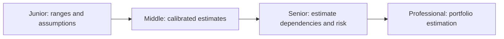
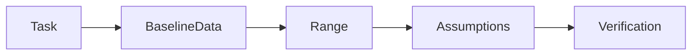

# Estimation

> Estimate timeline, effort, and risk by anchoring in evidence, not confidence. Good estimates are ranges with assumptions, not point numbers with false precision.

| Level | Guide | You are done when |
|---|---|---|
| Junior | [Estimate with ranges](junior.md) | You can estimate timeline and effort with a range and state your assumptions. |
| Middle | [Build calibrated estimates](middle.md) | You can estimate using historical data, adjust for differences, and track accuracy. |
| Senior | [Estimate dependencies and risk](senior.md) | You can estimate across dependent tasks, account for correlation, and model failure modes. |
| Professional | [Estimate portfolios](professional.md) | You can estimate across multiple initiatives, allocate resources, and adjust forecasts. |

## Practice rule

Every estimate needs three things: a range (not a point), the assumptions behind it, and the evidence it's based on. Track actual vs. estimated to improve calibration.

## Related

- [Delegation](../delegation/README.md)
- [Meeting](../meeting/README.md)
- [Ownership](../ownership/README.md)
