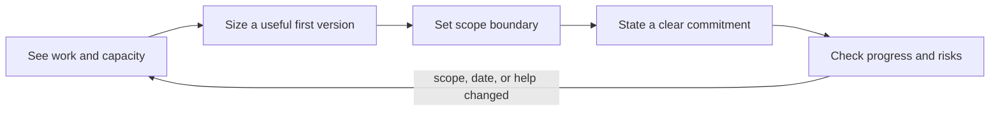

# Time Management — Problem

**What it solves:** a deadline is not a promise to work harder. It is a choice about what outcome fits the time, people, and uncertainty available. Good time management makes that choice visible early enough for the team to change scope, date, or help.

A scope of work should say what is included, excluded, constrained, and due; otherwise a new request has no clear impact to discuss. [Atlassian's scope-of-work guide](https://www.atlassian.com/agile/project-management/scope-of-work) calls out objectives, deliverables, assumptions, constraints, milestones, and deadlines as the pieces that keep people aligned.

## The mechanism: Pressure Commitment Loop

Use this loop when you receive work, especially when the request feels urgent:

1. **See the work.** Write the desired outcome, the deadline, current commitments, and who is needed. Do not answer from memory.
2. **Size the first useful version.** Break the outcome into a few deliverable parts. Use similar finished work as evidence; give a range and name assumptions instead of pretending the number is certain. Reviewing past estimates improves future estimation and team alignment, as [Atlassian notes](https://www.atlassian.com/agile/project-management/estimation).
3. **Draw the boundary.** Mark each part as must-have, nice-to-have, or out of scope. A fixed time box can still protect quality when scope is allowed to change; this is the core of Basecamp's [fixed-time, variable-scope](https://basecamp.com/shapeup/1.2-chapter-03) approach.
4. **Choose and say the commitment.** Say yes only to a specific outcome, date, and set of assumptions. Say no, later, smaller, or "yes if we stop X" when capacity does not fit.
5. **Check before the deadline checks you.** At agreed checkpoints, compare completed scope and remaining uncertainty with the date. Escalate a trade-off while it can still change the outcome.

## Worked example: a Friday export deadline

On Monday, Maya is asked to add CSV export for the billing dashboard before a customer demo on Friday. Her current work is fixing an invoice bug due Wednesday.

- **See the work:** the demo needs a customer to download the visible invoice table. The request does not say that scheduled emails, custom columns, or exports of every historical invoice are required. Maya has about two focused days after the bug fix, not five full days.
- **Size the first useful version:** similar table-download work took one to two days. She lists: choose the visible rows and columns, create the CSV, make the download work, test ordinary and empty results. She adds time for product review and an unknown: the dashboard's current filters may not be reusable.
- **Draw the boundary:** must-have is a manual download using the current columns and filters. Nice-to-have is choosing columns. Out of scope is scheduled email export and a redesign of reporting.
- **Choose and say the commitment:** "Yes, I can deliver manual CSV download for the dashboard's current view by Friday, if the invoice bug stays the priority through Wednesday and we keep scheduled exports out. If scheduled export is required for the demo, we need to move Friday or take the invoice fix out."
- **Check:** on Wednesday, filter reuse proves harder than expected. Maya reports that the download works without filters, while reusing filters risks Friday. The product owner chooses the simple download for the demo and creates a follow-up for filter support.

Maya did not refuse the customer need. She made the trade-off explicit before a late surprise forced one.

## A clear yes and a clear no

- **Clear yes:** "I will deliver _this outcome_ by _this date_, assuming _these conditions_."
- **Clear no with support:** "I cannot add that without risking _current commitment_. I can do _smaller outcome_, start on _later date_, or swap it for _other work_. Which trade-off do you want?"

Knowing your current workload before answering, being direct, explaining the constraint, and offering an alternative are practical ways to decline work without leaving people stranded, as described in [Asana's guide to saying no at work](https://asana.com/resources/how-to-say-no-professionally).

Continue to [Mistake](mistake.md).
