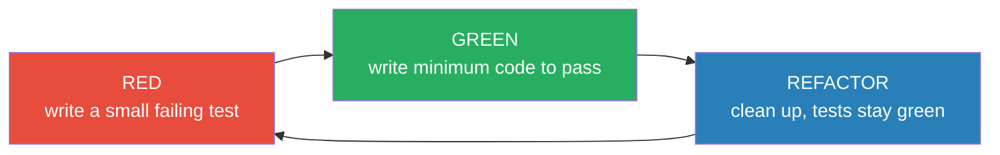

# The Three Laws of TDD — Junior

> **Category:** [Craftsmanship Disciplines](../README.md) — write production code only to make a failing test pass, in the tightest possible loop.

---

## Introduction

> Focus: **What is it?** and **How to use it?**

**Test-Driven Development (TDD)** is the practice of writing a failing test *before* the code that makes it pass. **The Three Laws of TDD** are Robert C. Martin's (Uncle Bob's) distillation of that practice into three rules so strict they feel absurd the first time you read them. They are the *mechanics* — the gear ratio — that drives the larger discipline.

The three laws force you into a loop measured in **seconds**, not minutes: write a tiny bit of test, watch it fail, write a tiny bit of code, watch it pass. You never have more than a handful of lines of untested code in existence at any moment. Everything you build is, by construction, covered by a test that you saw fail and then saw pass.

### Why this matters

Here is how most people are first taught to program:

```python
# Write all the code...
def roman(n):
    result = ""
    for value, symbol in [(1000,"M"),(900,"CM"),(500,"D"),(400,"CD"),
                          (100,"C"),(90,"XC"),(50,"L"),(40,"XL"),
                          (10,"X"),(9,"IX"),(5,"V"),(4,"IV"),(1,"I")]:
        while n >= value:
            result += symbol
            n -= value
    return result

# ...then maybe test it (if there's time).
```

When this works, you don't know *which part* works. When it breaks, you don't know *where*. And the test — if it ever gets written — is shaped to confirm the code you already wrote, so it tests what the code *does*, not what it *should* do.

TDD inverts the order. The test comes first, fails first, and *pulls* the code into existence one small increment at a time. The three laws are the rules that keep those increments small.

---

## Prerequisites

- **Required:** You can write and run a unit test in at least one language (JUnit, `pytest`, `go test`, etc.).
- **Required:** `assert` and the basic structure of a test (arrange, act, assert).
- **Helpful:** A test runner you can invoke in **under a second** — a fast feedback loop is the whole point.
- **Helpful:** An editor with a "run tests" shortcut so red/green is one keystroke away.

---

## Glossary

| Term | Definition |
|------|-----------|
| **TDD** | Test-Driven Development — writing a failing test before the production code that satisfies it. |
| **The Three Laws** | Uncle Bob's three rules constraining *when* you may write test vs. production code. |
| **Red** | A failing test — the state you must reach before writing any production code. |
| **Green** | A passing test — reached by writing the minimum production code. |
| **Refactor** | Improving code structure without changing behavior, while all tests stay green. |
| **Nano-cycle** | One pass through red → green, often only seconds long. |
| **Production code** | The code that ships — the implementation, not the test. |
| **Failing for the right reason** | The test fails because the behavior is missing, not because of a typo or compile error you didn't intend. |
| **Fake it** | Returning a hard-coded value to pass the first test, before generalizing. |

---

## The Three Laws, Verbatim

Uncle Bob states them like this:

> 1. **You are not allowed to write any production code unless it is to make a failing unit test pass.**
> 2. **You are not allowed to write any more of a unit test than is sufficient to fail — and compilation failures are failures.**
> 3. **You are not allowed to write any more production code than is sufficient to pass the one failing unit test.**

Read them as a set of *locks*. Each law locks one of the two things you can do (write test, write code) until a precise condition is met:

- **Law 1** locks production code behind a *failing test*. No red, no code.
- **Law 2** locks you from over-writing the *test*. The moment the test fails — even if it just fails to compile — you stop writing test and switch to code.
- **Law 3** locks you from over-writing the *code*. The moment the test passes, you stop writing code and switch back to test (or refactor).

Together they form a cycle you cannot escape without breaking a law: test a little → fail → code a little → pass → repeat. The longest you can go without switching is **a few seconds**.

---

## Core Concepts

### 1. The test exists before the code it tests

This is the literal meaning of "test-driven." You do not write `add(a, b)` and then test it. You write `assert add(2, 3) == 5`, run it, watch it fail (the function doesn't exist yet), and *only then* write `add`.

### 2. You must see the test fail first

A test you've never seen fail is a test you don't trust. If you write the code first and the test passes immediately, you've proven nothing — the test might pass even when the code is broken. **Watching red turn to green is the proof that the test actually exercises the new behavior.**

### 3. Minimum code to pass — even if it's "wrong"

Law 3 is the one beginners resist hardest. If the test is `assert add(2, 3) == 5`, the minimum code that passes is:

```python
def add(a, b):
    return 5      # yes, really
```

This looks insane. It is also correct *for the current test*. You make it general only when a **second** test (`assert add(10, 1) == 11`) forces you to. This is called **"fake it till you make it,"** and it's a deliberate technique, not a joke — it proves your tests are strong enough to demand the real implementation.

### 4. Refactor only on green

You restructure code — rename, extract, deduplicate — **only when every test passes**. Green is your safety net: if a refactor breaks something, a test goes red and you know instantly. You never refactor on red, because then a failure could mean "my refactor broke it" *or* "the feature isn't done" — and you can't tell which.

### 5. The loop is tiny on purpose

The whole point is the **size of the increment**. Small increments mean: if something breaks, the cause is in the last 30 seconds of work, so debugging is trivial. The three laws exist to *force* the increments to stay small.

---

## The Red-Green-Refactor Cycle

The three laws produce a three-beat rhythm:



| Phase | What you do | When you leave |
|-------|-------------|----------------|
| **Red** | Write just enough test to fail (Law 2). Run it. Confirm it fails *for the right reason*. | The instant it fails. |
| **Green** | Write just enough production code to pass (Law 3). Run it. | The instant it passes. |
| **Refactor** | Improve names, remove duplication, simplify — without adding behavior. Run tests after each change. | When the code is clean and all tests are green. |

**Red and Green are governed by the three laws. Refactor is governed by [Refactoring as a Discipline](../03-refactoring-as-a-discipline/junior.md) and [Simple Design](../04-simple-design/junior.md).** The laws get you to working code; refactor makes it good.

---

## Real-World Analogies

| Concept | Analogy |
|---|---|
| **Write the test first** | A building inspector who writes the inspection checklist *before* the wall is built, so the wall is built to pass it — not the checklist bent to excuse the wall. |
| **See it fail first** | Testing a smoke alarm by pressing the test button. If it doesn't beep when you press it, the "it's fine, it never beeped" reasoning is worthless. |
| **Minimum code to pass** | Climbing a wall by reaching for the *next* hold, not the summit. You only ever solve the problem directly in front of you. |
| **Refactor on green** | Cleaning the kitchen *after* the meal is plated and safe, not mid-flip with a pan in the air. |
| **The tight loop** | A surgeon making one small, verified incision at a time, checking vitals after each — never one giant cut they hope works out. |

---

## Mental Models

**The intuition:** *"Never write a line of code that some test isn't already demanding."*

```
        ┌──────────────────────────────────┐
        │  Is there a failing test?         │
        └──────────────────────────────────┘
            │ NO                  │ YES
            ▼                     ▼
   write a tiny test       write the minimum
   that fails  ───────►    code to pass it
            ▲                     │
            │                     ▼
            └──────  refactor (still green) ◄──
```

You are always in exactly one of two modes: **"I need a failing test"** or **"I need to make the failing test pass."** The three laws decide which mode you're in, so you never have to wonder what to do next. That removal of decision fatigue is a real, underrated benefit.

Compare the two ways of working:

```
TEST-AFTER                      TEST-FIRST (TDD)
write 200 lines                 write 1 assertion → fail
hope it works                   write 1 line → pass
write tests to "cover" it       refactor
debug for an hour               repeat (each step verified)
```

---

## Pros & Cons

| Pros | Cons |
|------|------|
| Every line of production code is covered by a test you watched fail then pass | Feels slow at first; the rhythm has a learning curve |
| Defects are caught seconds after they're introduced | Hard to apply to code that isn't designed for testability (legacy, tight coupling) |
| The tests document exactly what the code is supposed to do | Easy to do *badly* — bad tests are worse than no tests |
| Code is testable *by construction* (you can't write untestable code first) | Some domains (UI pixels, exploratory spikes) fit awkwardly |
| You always have a working, green build a few minutes back | Requires a fast test runner; slow tests kill the loop |
| Refactoring is safe — the tests catch regressions instantly | Doesn't replace integration/acceptance testing (see [ATDD](../06-acceptance-test-driven-development/junior.md)) |

### When to use:
- Building logic with clear inputs and outputs (parsers, calculators, business rules, algorithms).
- Fixing a bug — write a failing test that reproduces it *first*, then fix.
- Anytime you'd otherwise be tempted to "just write it and test later."

### When NOT to use (yet):
- A throwaway exploratory **spike** where you don't yet know the design (spike, then delete, then TDD for real).
- Hard-to-test boundaries (raw UI rendering, third-party integrations) without first extracting the testable logic.

---

## A First Worked Example

Let's TDD a `add(a, b)` function from absolute zero, obeying every law. Watch how the laws constrain each keystroke.

### Step 1 — Law 1 says: no code yet. Law 2 says: write *just enough test to fail*.

```python
# test_calc.py
def test_adds_two_numbers():
    assert add(2, 3) == 5
```

Run it. It fails — `NameError: name 'add' is not defined`. **That counts as a failure** (Law 2 explicitly includes "failure to compile / resolve"). We are now **RED**. Stop writing test.

### Step 2 — Law 3 says: write *just enough code to pass*.

```python
# calc.py
def add(a, b):
    return 5      # the literal minimum
```

Run it. **GREEN.** It passes. By Law 3, we stop — even though we "know" this is wrong. Resisting the urge to write `a + b` here is the discipline.

### Step 3 — Back to RED. A new test forces generalization.

```python
def test_adds_other_numbers():
    assert add(10, 1) == 11
```

Run it. `return 5` fails this. **RED.** Now Law 3 lets us write more code:

```python
def add(a, b):
    return a + b     # now the general solution is the minimum that passes both
```

Run it. **GREEN**, both tests. The second test made `a + b` the *minimum*, so we wrote it honestly — driven by a test, not by guesswork.

### Step 4 — REFACTOR.

There's nothing to clean here, so we skip it. (On bigger problems this is where you'd rename, extract, dedupe — all on green.)

The point of the example isn't `add` — it's the **rhythm**: red → green → (refactor) → red → green. You never wrote a line that no test demanded.

---

## Code Examples

### Java (JUnit) — TDD a stack's `isEmpty`

```java
// RED — write the test first
@Test
void newStackIsEmpty() {
    assertThat(new Stack<Integer>().isEmpty()).isTrue();
}
```

Compile fails — no `Stack` class. That's a Law-2 failure; switch to code.

```java
// GREEN — minimum to pass
public class Stack<T> {
    public boolean isEmpty() { return true; }   // fake it
}
```

```java
// RED again — force generality
@Test
void stackWithOnePushIsNotEmpty() {
    Stack<Integer> s = new Stack<>();
    s.push(1);
    assertThat(s.isEmpty()).isFalse();
}
```

```java
// GREEN — now we need real state
public class Stack<T> {
    private int size = 0;
    public void push(T item) { size++; }
    public boolean isEmpty()  { return size == 0; }
}
```

Each test pulled exactly one capability into existence.

### Python (pytest) — TDD a `fizzbuzz`

```python
# RED
def test_returns_number_as_string():
    assert fizzbuzz(1) == "1"

# GREEN
def fizzbuzz(n):
    return "1"          # fake it

# RED
def test_two():
    assert fizzbuzz(2) == "2"

# GREEN — generalize
def fizzbuzz(n):
    return str(n)

# RED
def test_three_is_fizz():
    assert fizzbuzz(3) == "Fizz"

# GREEN
def fizzbuzz(n):
    if n % 3 == 0:
        return "Fizz"
    return str(n)
```

### Go — TDD a `Reverse`

> **Go note:** Go's `go test` runs in milliseconds and the toolchain is built into the language, which makes Go one of the most pleasant languages for living in the TDD loop. A compile error from a missing function *is* your red.

```go
// reverse_test.go — RED
func TestReverseEmpty(t *testing.T) {
    if got := Reverse(""); got != "" {
        t.Errorf("Reverse(\"\") = %q, want \"\"", got)
    }
}

// reverse.go — GREEN
func Reverse(s string) string {
    return ""        // fake it
}

// RED
func TestReverseSingle(t *testing.T) {
    if got := Reverse("a"); got != "a" {
        t.Errorf("got %q", got)
    }
}

// GREEN — generalize
func Reverse(s string) string {
    r := []rune(s)
    for i, j := 0, len(r)-1; i < j; i, j = i+1, j-1 {
        r[i], r[j] = r[j], r[i]
    }
    return string(r)
}
```

---

## Clean Code

### Name the test after the behavior, not the method

```python
# ❌ tells you nothing
def test_add(): ...

# ✅ tells you the expected behavior
def test_adding_two_positive_numbers_returns_their_sum(): ...
```

A failing test name should read like a one-line bug report.

### One assert-ed behavior per test (mostly)

A test should fail for **one reason**. If a test has five asserts checking five behaviors, a failure doesn't tell you which behavior broke. (Multiple asserts on the *same* behavior — e.g. checking several fields of one returned object — are fine.) See [Test Design & Fixtures](../02-test-design-and-fixtures/junior.md).

### Arrange–Act–Assert

```python
def test_withdraw_reduces_balance():
    account = Account(balance=100)   # Arrange
    account.withdraw(40)             # Act
    assert account.balance == 60     # Assert
```

Three visual blocks make every test scannable.

---

## Best Practices

1. **Always see the test fail before making it pass.** A test you never saw red is a test you can't trust.
2. **Write the smallest test that can fail next.** Don't write the whole test suite up front.
3. **Write the smallest code that makes it pass** — even a hard-coded value (Law 3). Generalize only when a new test forces you.
4. **Refactor only on green.** Never restructure while a test is red.
5. **Keep the loop under a minute.** If a cycle takes ten minutes, your steps are too big.
6. **Confirm the test fails for the *right reason*** — the behavior is missing, not a typo in the test.

---

## Edge Cases & Pitfalls

- **The test that can't fail.** If you write code first and the test passes on the first run, you never saw red — the test might be asserting nothing real. Always reach red first.
- **A typo gives a false red.** The test fails, but because of a misspelled variable, not the missing behavior. Read the failure message; make sure it's the failure you expected.
- **Skipping the refactor step.** Green code that's never cleaned up accretes into a mess. The refactor beat is not optional.
- **Tests that depend on each other.** If test B only passes when test A ran first, your tests aren't isolated — see [Test Design & Fixtures](../02-test-design-and-fixtures/junior.md).

---

## Common Mistakes

1. **Writing production code with no failing test** — the most fundamental Law-1 violation.
2. **Writing the whole implementation at once** to pass a single test (Law-3 violation) — you've left the loop.
3. **Writing five tests before any code** (Law-2 violation) — you can only have *one* failing test at a time.
4. **Never watching the test fail** — passing on first run proves nothing.
5. **Refactoring on red** — you can't tell a refactor bug from an unfinished feature.

---

## Tricky Points

- **"Compilation failure counts as failure" (Law 2)** means in compiled languages, a reference to a not-yet-written function *is* your red. You don't need a full assertion to be red — a missing symbol suffices, and you stop writing test the instant it won't compile.
- **"Fake it till you make it" is real, not a joke.** Returning a constant to pass the first test is a legitimate first step. It forces you to write a *second* test to drive out the generalization, which proves your tests are strong.
- **The three laws are the *mechanics*, not the *whole* of TDD.** TDD as a discipline also includes good test design, refactoring judgment, and knowing what to test. The laws just keep the loop tight. See [Senior](senior.md).

---

## Test Yourself

1. State the three laws of TDD.
2. Why must you watch a test fail *before* writing the code that passes it?
3. What is the minimum code to pass `assert add(2, 3) == 5`, and why is that defensible?
4. In which phase — red, green, or refactor — are you allowed to improve the code's structure?
5. Why does "compilation failure counts as a failure" matter for Law 2?

---

## Cheat Sheet

```text
THE THREE LAWS
1. No production code unless to pass a failing test.
2. No more test than enough to fail (compile error = fail).
3. No more code than enough to pass the current failing test.

THE LOOP
  RED      → write a tiny failing test, SEE it fail
  GREEN    → write the minimum code to pass (fake it if needed)
  REFACTOR → clean up, tests stay green
  repeat (each loop = seconds to a minute)

RULES OF THUMB
  - one failing test at a time
  - see red before green
  - generalize only when a new test forces it
  - refactor only on green
```

---

## Summary

- **TDD** writes a failing test before the code; **the three laws** are the strict mechanics that keep the loop tight.
- **Law 1:** no production code without a failing test. **Law 2:** stop writing test the moment it fails (compile errors count). **Law 3:** stop writing code the moment the test passes.
- The laws produce the **red → green → refactor** cycle, with each loop lasting seconds to a minute.
- You must **see the test fail first**; you write the **minimum** code to pass (even a hard-coded value); you **refactor only on green**.
- The laws are the *mechanics* of TDD, not the whole discipline — good test design and refactoring judgment sit on top of them.

---

## Further Reading

- Robert C. Martin, *Clean Code* — Chapter 9, "Unit Tests," and the statement of the Three Laws.
- Kent Beck, *Test-Driven Development: By Example* — the original TDD book; the Money and xUnit examples.
- Robert C. Martin, *The Clean Coder* — TDD as a professional obligation.

---

## Related Topics

- **The cleanup half of the loop:** [Refactoring as a Discipline](../03-refactoring-as-a-discipline/junior.md), [Simple Design](../04-simple-design/junior.md).
- **What good tests look like:** [Test Design & Fixtures](../02-test-design-and-fixtures/junior.md).
- **The outer loop:** [Acceptance Test-Driven Development](../06-acceptance-test-driven-development/junior.md).
- **Where you practice the laws:** [Kata & Deliberate Practice](../07-kata-and-deliberate-practice/junior.md).

---

## Diagrams


---

## Check your understanding

1. Explain The Three Laws of TDD — Junior Level in your own words and name the problem it solves.
2. How would you apply the ideas around Table of Contents, Introduction, Prerequisites in a realistic engineering change?
3. What failure mode or misuse should you look for, and what evidence would reveal it?
4. What small example would prove that you can apply The Three Laws of TDD — Junior Level correctly?
5. What observable result would convince you that the approach improved the system?
