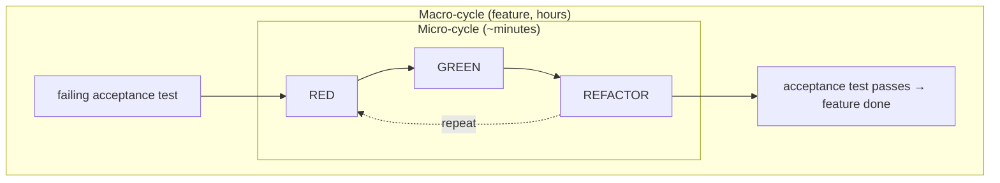
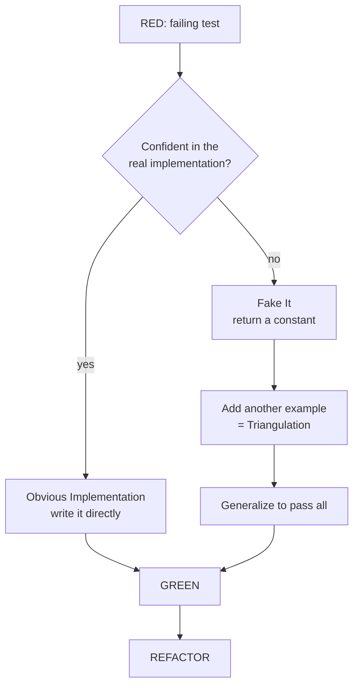
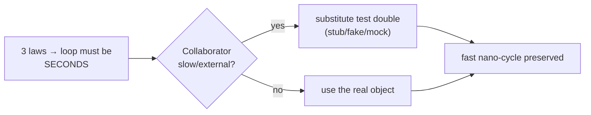

# The Three Laws of TDD — Middle

> **Category:** [Craftsmanship Disciplines](../README.md) — write production code only to make a failing test pass, in the tightest possible loop.

> **Prerequisite:** [Junior](junior.md)
> **Focus:** **Why** and **When**

---

## Introduction

> Focus: **Why** and **When**

At the junior level the three laws are a procedure you follow mechanically: red, green, refactor. At the middle level they become a set of **judgement calls**. The laws tell you to "write the minimum code to pass," but *which* minimum — a hard-coded fake or the obvious real implementation? They tell you to "write a failing test," but *which* test next? They keep the loop tight, but where do you put the seam so a database or HTTP call doesn't make the loop slow?

The recurring middle-level skill is **calibrating step size**. Too small and TDD feels like a tedious ritual (a beginner over-applying "fake it" to trivial code). Too big and you've abandoned the loop's whole benefit — you're debugging twenty lines instead of two. The laws define the *maximum* step; experience defines the *right* step for the code in front of you.

---

## The Rhythm: Nano, Micro, Macro Cycles

TDD operates at three nested time scales. Understanding the layering is what turns "I follow the steps" into "I have a rhythm."

| Cycle | Duration | What happens | Governed by |
|-------|----------|--------------|-------------|
| **Nano-cycle** | seconds | One red → green flip. Write a line of test, see it fail, write a line of code, see it pass. | The three laws |
| **Micro-cycle** | ~1–10 min | A full red → green → **refactor**. One small behavior driven in and cleaned up. | Laws + [refactoring](../03-refactoring-as-a-discipline/junior.md) |
| **Macro-cycle** | hours–days | A complete feature: many micro-cycles, often opened by a failing **acceptance** test. | [ATDD](../06-acceptance-test-driven-development/junior.md) / double-loop |



The three laws live almost entirely in the **nano-cycle**. They guarantee that you never spend more than seconds with untested production code. The refactor step is a **micro-cycle** concern — it doesn't happen on every nano flip, but on most micro ones. The macro/acceptance loop is covered in [ATDD](../06-acceptance-test-driven-development/junior.md); senior-level "double-loop TDD" links the two.

---

## Two Ways Through Green

Law 3 says "minimum code to pass," but Kent Beck identified three distinct *strategies* for getting to green. Knowing which to use, when, is core middle-level fluency.

### 1. Fake It (return a constant)

When you're not yet sure how to implement, hard-code the expected answer, get to green, then refactor toward the real thing.

```python
# RED: assert score("aaa") == 3
def score(word):
    return 3        # fake it — green, but obviously not real
```

Use it when the implementation is unclear or you want the discipline of a second test forcing generality.

### 2. Obvious Implementation (just write it)

When the real implementation is trivial and you're confident, skip the fake and write it directly.

```python
# RED: assert add(2, 3) == 5
def add(a, b):
    return a + b    # obvious — no point faking
```

Use it for code so simple that faking it would be theater. The laws permit this — `a + b` *is* the minimum that passes if you're certain.

### 3. Triangulation (let multiple examples force the general case)

When you fake it, then add a second (and maybe third) example specifically to *force* the generalization. The constant can't survive two different expected values.

```python
# assert score("a") == 1   →  return 1 (fake)
# assert score("aa") == 2  →  forces: return len(word)  (triangulated)
def score(word):
    return len(word)
```

Triangulation is the slowest but safest path — use it when the abstraction is genuinely unclear and you want examples to *discover* it for you.

> **Rule of thumb:** Obvious implementation when you're sure; fake-it + triangulation when you're not. The laws don't pick for you — your confidence does.

---

## The Refactor Step in Practice

The refactor beat is where most lapsed TDD practitioners get sloppy. The laws get you to green; **skipping refactor** is how green code rots.

What "refactor" means at this step:

- **Remove duplication** — including duplication *between the test and the code* (Beck's specific guidance: the cycle ends when test and code share no duplicated knowledge).
- **Improve names** — the throwaway names you used to get to green become permanent if you don't fix them now.
- **Extract** a method/function once a block earns a name.
- **Simplify** conditionals, collapse special cases.

```python
# GREEN but duplicated and unclear:
def fizzbuzz(n):
    if n % 3 == 0 and n % 5 == 0: return "FizzBuzz"
    if n % 3 == 0: return "Fizz"
    if n % 5 == 0: return "Buzz"
    return str(n)

# REFACTOR (still green): name the magic, kill duplication
def fizzbuzz(n):
    out = ""
    if divisible(n, 3): out += "Fizz"
    if divisible(n, 5): out += "Buzz"
    return out or str(n)

def divisible(n, d): return n % d == 0
```

Crucially: **run the tests after every refactoring move.** If green stays green, the refactor was behavior-preserving. If it goes red, undo. This is exactly the safety net [Refactoring as a Discipline](../03-refactoring-as-a-discipline/junior.md) is built on — and it only exists because you have tests, which only exist because you wrote them first.

---

## What to Test First — Choosing the Next Test

The laws say "write a failing test" but not *which*. Picking the next test well keeps the loop flowing; picking badly leads to a giant leap you can't make in one green step. Heuristics:

1. **Start with the degenerate case.** Empty string, zero, empty list, null — these are usually the simplest test and force the skeleton into existence.
2. **Then the simplest non-trivial case.** One element, one item — forces real state.
3. **Pick the test that requires the *smallest* code jump from green to green.** If a candidate test would force you to write 40 lines, find a smaller one to write first.
4. **Save the general/hard case for last** — by then triangulation has built most of the implementation.
5. **Keep a "test list."** Jot down cases you think of mid-cycle (so you don't lose them) but *don't write them yet* — Law 2 allows only one failing test at a time.

```text
Roman numerals test list (write ONE at a time, in order):
  [ ] 1   -> "I"      (degenerate)
  [ ] 2   -> "II"     (forces repetition)
  [ ] 4   -> "IV"     (forces subtractive rule)
  [ ] 9   -> "IX"
  [ ] 58  -> "LVIII"  (forces the value table)
  [ ] 1994-> "MCMXCIV"(general)
```

The order is itself a design activity: a good sequence makes each step a tiny code change; a bad sequence makes step three impossible without writing the whole algorithm.

---

## Mocking the Boundaries

The three laws demand a loop measured in seconds. A test that hits a real database, network, or filesystem takes hundreds of milliseconds to seconds — slow enough to *break the rhythm*. So TDD pushes you to isolate the logic under test from its slow collaborators by **substituting test doubles** at the boundary.

```python
# The unit under test depends on a slow boundary (payment gateway).
# TDD pressure: inject the dependency so we can substitute a fast fake.

class Checkout:
    def __init__(self, gateway):     # dependency injected → swappable
        self.gateway = gateway

    def pay(self, order):
        if order.total <= 0:
            raise ValueError("total must be positive")
        return self.gateway.charge(order.card, order.total)

# RED — drive logic with a fake gateway, no network, milliseconds
def test_rejects_non_positive_total():
    checkout = Checkout(gateway=FakeGateway())
    with pytest.raises(ValueError):
        checkout.pay(Order(total=0))
```

Note what just happened: **the need for a fast test forced a better design** — the gateway is injected rather than constructed inside `Checkout`, which makes the class decoupled and testable. This is the famous "design pressure" of TDD, examined deeply at [Senior](senior.md).

A quick taxonomy (full treatment in [Test Design & Fixtures](../02-test-design-and-fixtures/junior.md)):

| Double | What it does | Use when |
|--------|--------------|----------|
| **Stub** | Returns canned answers | You need the collaborator to *provide* a value |
| **Fake** | Working but lightweight impl (in-memory DB) | You want realistic behavior without the slow real thing |
| **Mock** | Records calls; you assert on interactions | The *interaction* (was `charge` called once?) is the behavior |
| **Spy** | Like a stub that also records calls | You need both a return value and call verification |


---

## When the Laws Bite

The laws are a maximum step size, and sometimes the honest move is to take a step the laws seem to forbid. Middle-level judgement is knowing the legitimate relaxations:

- **Obvious implementation > fake it** for trivial code — writing `return 5` for `add` is dogmatic, not disciplined.
- **A test may need scaffolding** (a helper, a builder) before it can fail meaningfully. Writing that scaffolding isn't a Law-1 violation — it's test infrastructure, not production code.
- **Spikes are exempt.** When you genuinely don't know the design, write a throwaway spike *without* tests to learn, then **delete it** and TDD the real thing. The laws apply to code you keep, not to learning experiments.
- **You can't always reach a perfectly minimal red.** Sometimes the smallest meaningful test still requires several collaborators to exist. That's a design smell, not a law to break — it's telling you the unit is too coupled.

The anti-pattern is using "the laws are too strict here" as a blanket excuse to abandon them. The legitimate relaxations above are specific and bounded.

---

## Applying the Laws to a Bug Fix

The single most valuable everyday use of the three laws is **fixing bugs test-first**. The discipline:

1. **Write a failing test that reproduces the bug** (RED). This proves you understand the bug and gives you a regression guard forever.
2. **Fix the code** until that test passes (GREEN) — minimum change.
3. **Refactor** if the fix revealed something messy.

```go
// Bug report: Discount(-5) returns a negative price.
// LAW 1+2: reproduce as a failing test FIRST.
func TestDiscountNeverNegative(t *testing.T) {
    if got := Discount(100, 200); got < 0 {   // 200% discount
        t.Errorf("price went negative: %v", got)
    }
}

// LAW 3: minimum fix to pass.
func Discount(price, pct float64) float64 {
    d := price * pct / 100
    if d > price {
        d = price                  // clamp — the fix the test demanded
    }
    return price - d
}
```

Never fix a bug without a failing test that captures it first. Otherwise you can't prove your fix works, and nothing stops the bug from regressing later.

---

## Mechanics Across Languages

The laws are language-agnostic, but the *feel* of the loop differs.

### Go — compile error is your red, and the loop is fast

```go
// Referencing Reverse before it exists won't compile.
// That compile failure IS the Law-2 red — switch to writing code.
func TestReverse(t *testing.T) {
    if Reverse("ab") != "ba" { t.Fail() }
}
```

`go test ./...` runs in milliseconds; the loop is buttery. Go's deliberate lack of a heavy mocking framework nudges you toward small interfaces and real fakes.

### Java — `assertThrows`, fast unit runners, heavy mock culture

```java
@Test void rejectsNegative() {
    assertThatThrownBy(() -> new Account(-1))
        .isInstanceOf(IllegalArgumentException.class);
}
```

JUnit + Mockito make mocking ergonomic — sometimes *too* ergonomic, tempting over-mocking. Keep the unit fast; run the full suite continuously with an IDE auto-runner.

### Python — `pytest` + `parametrize`, EAFP-friendly

```python
@pytest.mark.parametrize("n,expected", [(1,"1"),(3,"Fizz"),(5,"Buzz"),(15,"FizzBuzz")])
def test_fizzbuzz(n, expected):
    assert fizzbuzz(n) == expected
```

`parametrize` is *not* a license to write all tests up front — drive them in one at a time, then collapse the passing ones into a parametrized table during refactor.

---

## Trade-offs

| Dimension | Strict three laws (tiny steps) | Looser test-first (bigger steps) |
|---|---|---|
| Debugging time when something breaks | Seconds — cause is the last increment | Minutes — cause is anywhere in the batch |
| Speed when code is obvious | Can feel slow/ritualistic | Faster |
| Confidence the test actually tests something | Maximal (you saw every test fail) | Lower (some tests never seen red) |
| Design pressure (forces decoupling) | Strong | Weaker |
| Risk of over-engineering | Low (you build only what tests demand) | Higher (tempted to "while I'm here") |
| Learning curve | Steep | Gentle |

The strict laws optimize for **never being stuck debugging** and **never writing unjustified code**. The cost is the discipline of small steps, which pays off most exactly when the problem is *hard* — and feels most like overhead when the problem is *easy*. Calibrate.

---

## Edge Cases

### 1. The test that passes on the first run

```python
# You wrote the code first, then this test — and it's green immediately.
def test_it_works():
    assert process(data) == expected   # never saw it fail!
```

You can't trust it. **Temporarily break the production code** (return a wrong value) to confirm the test goes red, then restore. If it stays green when the code is broken, the test is asserting nothing.

### 2. A test that needs lots of setup to fail

If reaching red requires constructing six collaborators, the unit is too coupled. Don't power through with a giant arrange block — that's the test telling you the design needs a seam.

### 3. Refactoring that needs a new test

Mid-refactor you realize an untested branch exists. **Stop refactoring, go back to red**, write the test, get green, *then* resume the refactor. Never grow coverage by refactoring on red.

---

## Tricky Points

- **One failing test at a time (Law 2).** A common middle-level slip is writing a parametrized table of ten cases at once. That's ten failing tests — a Law-2 violation. Keep a *list* on paper; write them in one at a time.
- **"Minimum code" is relative to your confidence.** Obvious-implementation is a legitimate minimum when you're sure; fake-it is the minimum when you're not. Both obey Law 3.
- **Mocking is downstream of the laws, not part of them.** The laws never say "mock." The *speed* requirement of the nano-cycle creates the pressure to isolate slow boundaries, which is *where* mocking enters.
- **Refactor includes the tests.** The test suite is code too; deduplicate and clean it on green, same as production code.

---

## Best Practices

1. **Keep the nano-cycle in seconds.** If you can't get to red/green fast, your steps or your test setup are too big.
2. **Choose the next test for the smallest code jump.** Degenerate case first, hardest case last.
3. **Use obvious-implementation when sure; fake-it + triangulation when unsure.** Don't fake trivial code.
4. **Never skip refactor.** Green-and-dirty compounds into legacy.
5. **Fix every bug test-first** — reproduce as a failing test before fixing.
6. **Isolate slow boundaries with doubles** so the loop stays fast; mock what you own and what's slow, use the real thing for value objects.
7. **Maintain a test list, write one at a time.**

---

## Test Yourself

1. What's the difference between the nano-cycle and the micro-cycle, and which do the three laws primarily govern?
2. Name the three strategies for getting to green and when you'd use each.
3. Why does the speed requirement of the loop lead to mocking, and what should you *not* mock?
4. Why is writing a parametrized table of ten cases at once a Law-2 violation, and what should you do instead?
5. What's the correct test-first procedure for fixing a bug?

---

## Summary

- TDD runs at three scales: **nano** (the laws, seconds), **micro** (add refactor, minutes), **macro** (a feature, opened by an acceptance test).
- Three paths to green: **fake it**, **obvious implementation**, **triangulation** — pick by confidence.
- **Never skip refactor**; it includes deduplicating the tests.
- Choose the next test for the **smallest code jump**; keep a test list; write one failing test at a time.
- The loop's **speed requirement** is what drives mocking the slow boundaries — and that mocking pressure improves the design.
- **Fix every bug test-first.**

---

## Diagrams

### The three strategies for reaching green



### Where mocking enters (downstream of the laws)




---

## Check your understanding

1. Explain The Three Laws of TDD — Middle Level in your own words and name the problem it solves.
2. How would you apply the ideas around Table of Contents, Introduction, The Rhythm: Nano, Micro, Macro Cycles in a realistic engineering change?
3. What failure mode or misuse should you look for, and what evidence would reveal it?
4. Which local design trade-off would make you choose or reject The Three Laws of TDD — Middle Level in an existing codebase?
5. What observable result would convince you that the approach improved the system?
