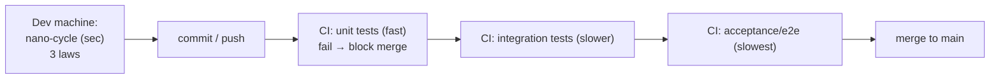
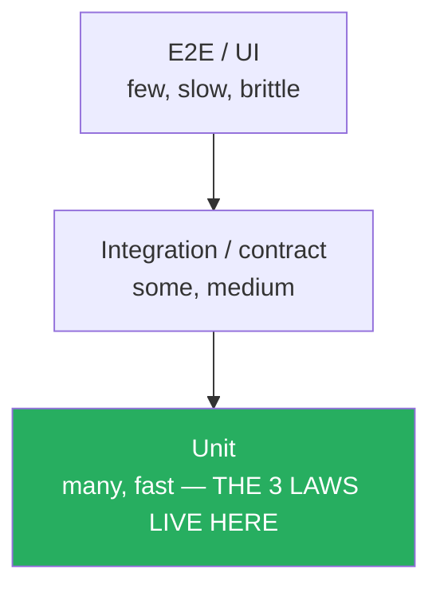
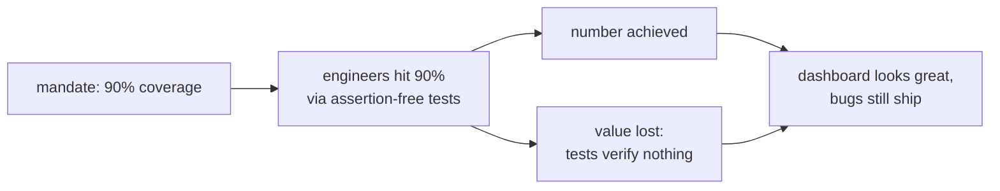
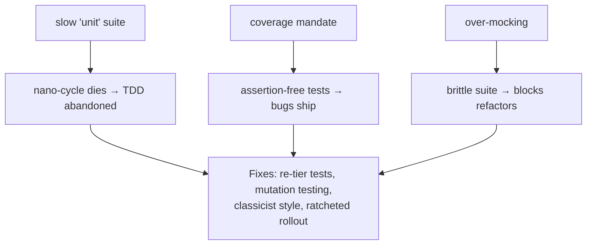

# The Three Laws of TDD — Professional

> **Category:** [Craftsmanship Disciplines](../README.md) — write production code only to make a failing test pass, in the tightest possible loop.

> **Prerequisites:** [Junior](junior.md) · [Middle](middle.md) · [Senior](senior.md)
> **Focus:** **Production** — teams, CI, metrics, legacy, review standards, rollout

---

## Table of Contents

1. [Introduction](#introduction)
2. [TDD in CI/CD](#tdd-in-cicd)
3. [The Test Pyramid and Where the Laws Live](#the-test-pyramid-and-where-the-laws-live)
4. [Coverage Politics](#coverage-politics)
5. [Mutation Testing: Auditing the Suite the Laws Produced](#mutation-testing)
6. [TDD on Legacy Code](#tdd-on-legacy-code)
7. [Code Review Standards for TDD](#code-review-standards-for-tdd)
8. [Metrics That Matter (and That Mislead)](#metrics-that-matter)
9. [Rolling Out TDD to a Team](#rolling-out-tdd-to-a-team)
10. [Real Incidents](#real-incidents)
11. [Team Conventions](#team-conventions)
12. [Cheat Sheet](#cheat-sheet)
13. [Diagrams](#diagrams)
14. [Related Topics](#related-topics)

---

## Introduction

> Focus: **production** — what the three laws cost and protect once a whole team lives by them, under CI, with managers reading dashboards.

A solo developer can follow the three laws on willpower. A 200-engineer org cannot — at that scale the laws become a question of **incentives, gates, and culture**. The professional questions are operational:

- How does the inner loop interact with **CI/CD** and a multi-tier test suite?
- Why does **coverage as a target** corrupt the very value TDD provides, and what to measure instead?
- How do you apply test-first to **legacy code** that has no seams?
- What **review standards** keep tests honest across hundreds of contributors?
- How do you **roll out** TDD without triggering the revolt that kills most quality initiatives?

---

## TDD in CI/CD

The three laws run on the developer's machine in seconds. CI runs the *accumulated* suite on every push in minutes. The two must stay aligned, or the inner loop and the gate diverge.



Operational rules:

- **The fast unit tests gate every merge and must stay green on `main`.** A red `main` halts the whole team; treat it as a stop-the-line event.
- **Keep the unit tier brutally fast** (seconds for the whole module, low minutes for the repo). If unit tests need a database, they're not unit tests — they belong in the integration tier. A slow unit tier silently destroys the nano-cycle: developers stop running tests locally, and TDD dies.
- **Run the full suite pre-merge; run slow e2e suites post-merge or nightly** if they can't fit the PR budget — but never let "it's slow" become "we skip it."
- **Flaky tests are a sev event.** One flaky test in a gating suite trains the whole team to ignore red, which is fatal to the discipline. Quarantine and fix flakes aggressively.

---

## The Test Pyramid and Where the Laws Live

The three laws operate at the **base** of the test pyramid — fast, isolated unit tests. Knowing the whole pyramid prevents the classic failure of "100% unit coverage, system still broken."



| Tier | Speed | Count | Driven by the 3 laws? |
|------|-------|-------|------------------------|
| Unit | ms | thousands | **Yes** — this is the inner loop |
| Integration / contract | 10s–100s ms | hundreds | Partially (test-first, but not nano-cycle) |
| Acceptance / E2E | seconds+ | tens | Outer loop ([ATDD](../06-acceptance-test-driven-development/junior.md)), not the three laws |

The professional mistake is letting the pyramid invert into an "ice cream cone" — mostly slow E2E tests, few unit tests — which makes the inner loop impossible and pushes feedback latency from seconds to tens of minutes. The three laws are only sustainable on a healthy pyramid with a fat, fast unit base.

---

## Coverage Politics

Coverage is the most abused metric in testing, and TDD's relationship to it is widely misunderstood.

**The truth:** TDD produces high coverage as a **side effect** — every line was written to pass a test, so nearly every line is covered. But the value was the *test-first design and trust*, not the number.

**The corruption (Goodhart's Law):** *"When a measure becomes a target, it ceases to be a good measure."* The moment management mandates "90% coverage," engineers hit 90% by the cheapest path — usually **test-after, assertion-light tests** that execute lines without verifying behavior. You get the number and lose the value. Coverage measures what code *ran during tests*, not whether *anything was checked*.

```python
# 100% line coverage, ZERO behavioral value — executes the function, asserts nothing.
def test_calculate():
    calculate(order)   # no assert! Coverage tools count this as "covered."
```

Professional stance:

- **Use coverage as a *floor and a discovery tool*, not a target.** A *drop* in coverage on a PR is worth a question; a high absolute number proves little.
- **Prefer branch coverage to line coverage** — it reveals untested decision paths.
- **Never reward coverage percentage directly.** It optimizes for the wrong behavior.
- **Audit suite quality with mutation testing** (next section), which measures whether tests *catch bugs*, not whether they *ran code*.

The defensible message to leadership: *"We don't target coverage; TDD makes coverage high naturally. What we target is fast feedback and a suite that actually catches regressions — which we verify with mutation testing, not a coverage gauge."*

---

## Mutation Testing

Mutation testing is the antidote to coverage theater and the real way to audit whether your TDD'd suite has teeth. A mutation tool (PIT for Java, `mutmut`/`cosmic-ray` for Python, `go-mutesting` for Go) makes tiny changes to production code — flips a `<` to `<=`, removes a `+`, negates a condition — and runs the tests. If a mutant survives (tests still pass), you have a behavior the suite doesn't actually verify.

```text
Original:   if balance < amount: raise InsufficientFunds
Mutant:     if balance <= amount: raise InsufficientFunds   # boundary changed
→ If no test fails, your suite never checked the exact-balance boundary.
```

| Metric | Measures | Gameable? |
|--------|----------|-----------|
| Line coverage | Did the line *run*? | Trivially (call without asserting) |
| Branch coverage | Did each branch *run*? | Yes (run both, assert nothing) |
| **Mutation score** | Did the test *detect the change*? | Very hard — you must actually assert behavior |

Strict TDD tends to produce high mutation scores naturally, because every line was demanded by a failing assertion. Test-after suites often have high coverage but mediocre mutation scores. Run mutation testing on critical modules (billing, auth, pricing) — it's too slow for every CI run, but it's the truest measure of suite quality the laws are supposed to deliver.

---

## TDD on Legacy Code

The three laws assume you can write a test before the code. Legacy code is, by Michael Feathers's definition, **"code without tests"** — and it's usually *also* code without seams, so you can't easily write a unit test for it at all. The professional sequence:

1. **Characterization test first.** Before changing anything, write a test that *captures current behavior* (even if that behavior is "wrong"). This is test-*after*, not TDD — but it's the prerequisite to safe change.
2. **Find or create a seam.** A seam is a place to substitute behavior without editing in place — extract a method, introduce a parameter, wrap a static call. Feathers's *Working with Legacy Code* catalogs these.
3. **Get the unit under test.** Once there's a seam and a characterization test, you have a safety net.
4. **Now TDD the change.** With the net in place, write a failing test for the *new* behavior and proceed by the three laws.

```python
# Step 1: characterize (pin current behavior, even if ugly)
def test_legacy_price_current_behavior():
    assert legacy_price(qty=10, code="X") == 87.3   # whatever it does today

# Step 4: NOW you can TDD the fix, with the characterization test as a guard
def test_bulk_discount_applies_over_100():
    assert legacy_price(qty=150, code="X") == ...   # new behavior, red first
```

The key professional insight: **you cannot start with the three laws on legacy code.** You start with characterization (test-after) to build a net, refactor to introduce seams, and *then* the laws apply. Trying to "just TDD" untestable legacy is how teams conclude "TDD doesn't work here." See working with legacy code.

---

## Code Review Standards for TDD

A reviewer cannot see the loop the author followed — but they *can* enforce the artifacts the laws should have produced. Check, in order:

1. **Do the tests assert behavior, not nothing?** Reject tests with no meaningful assertion (the #1 coverage-theater tell).
2. **Do tests check behavior, not implementation?** A test that asserts on private methods or exact internal call sequences is brittle and law-compliant but harmful (mockist damage).
3. **Was the production change actually demanded by a test?** New production logic with no corresponding new/changed test is a Law-1 red flag.
4. **Are the tests fast and isolated?** A new "unit" test that hits the DB belongs in the integration tier.
5. **Is mocking limited to true boundaries?** Many mocks → flag for test-induced design damage.
6. **Are test names behavioral?** `test_rejects_overdraft` not `test_withdraw_2`.
7. **Did a bug fix come with a failing-first regression test?**

### Review comment templates

> "This test calls `process()` but has no assertion — it proves only that the code doesn't throw. What behavior should it verify?"

> "These mocks mirror the implementation's call sequence; a refactor would break them without a behavior change. Can we assert on the outcome instead (classicist/state-based)?"

> "This PR adds 40 lines of pricing logic but no test changed. Was this driven by a test? If not, what guards it?"

---

## Metrics That Matter

| Metric | Signal | Trap |
|--------|--------|------|
| **Unit-suite wall-clock time** | Is the nano-cycle still possible? | Ignoring slow creep until the loop dies |
| **Mutation score (critical modules)** | Does the suite actually catch bugs? | Too slow to run everywhere |
| **Escaped-defect rate / change-failure rate** | Are regressions reaching prod? | Lagging; noisy |
| **Flaky-test rate** | Is the suite trustworthy? | Tolerating "just rerun it" |
| **PR-to-merge feedback latency** | Is CI fast enough to keep the loop tight? | Optimizing the number, not the loop |
| Line/branch coverage | Floor + drop detector only | **Using it as a target** (Goodhart) |

The honest reporting principle (mirrors the coverage trap): **report the metric that tracks the value, not the one that's easy to dashboard.** "Mutation score on billing rose from 61% to 88%; change-failure rate on that module halved" is a real story. "Coverage hit 90%" may mean nothing.

---

## Rolling Out TDD to a Team

You almost never get to mandate TDD on a greenfield team that wants it. You're introducing it to people who are skeptical, under deadline, and own a codebase with few seams. The rollout that works is incremental and evidence-driven — the same shape as any successful quality initiative.

1. **Make the loop possible first.** If the unit suite is slow or flaky, *fix that before asking anyone to TDD.* You cannot follow the three laws with a 12-minute test run. This is the highest-leverage first step and the most-skipped.
2. **Start with bug fixes.** "Reproduce every bug with a failing test before fixing it" is the easiest TDD habit to sell — it's obviously valuable and low-controversy. It builds the muscle and the regression suite simultaneously.
3. **Pair and mob on katas.** Teach the *rhythm* on low-stakes exercises (FizzBuzz, Roman numerals, Bowling) via [pairing/mobbing](../05-pair-and-mob-programming/junior.md) before applying it to production work. See [Kata & Deliberate Practice](../07-kata-and-deliberate-practice/junior.md).
4. **Gate new code, grandfather old.** Configure CI to require tests on *changed* lines, not the whole legacy base. New code is test-first; legacy is characterized opportunistically.
5. **Avoid the coverage mandate.** Mandating a coverage number reliably produces assertion-free tests and discredits the whole effort. Sell trust and feedback speed, not percentages.

The failure mode to avoid: a top-down "all code must be TDD'd at 90% coverage from Monday" decree. It fails hundreds of files, blocks delivery, breeds coverage theater, and gets quality tooling disabled by an angry team within a quarter. The ratchet — make the loop fast, win on bug fixes, gate only new code — makes TDD the path of least resistance instead of a wall.

---

## Real Incidents

### Incident 1: The slow suite that killed the loop

A team's unit suite crept from 20 seconds to 9 minutes as "unit" tests quietly acquired database dependencies. Developers stopped running tests locally; TDD's nano-cycle became impossible. Defects spiked. **Fix:** re-tier the DB-touching tests into an integration suite, mock the repositories in true unit tests, restore a sub-30-second unit run. **Lesson:** a slow unit suite doesn't just annoy — it *structurally prevents* the three laws.

### Incident 2: 92% coverage, critical bug shipped

A pricing module hit a mandated 92% line coverage, yet shipped a boundary bug (off-by-one on a tier threshold). The "covering" tests executed the code but asserted almost nothing. Mutation testing later showed a mutation score of 31%. **Fix:** dropped the coverage mandate, ran mutation testing on the module, rewrote tests to assert behavior. **Lesson:** coverage measures execution, not verification; only mutation testing (or honest TDD) measures whether tests catch bugs.

### Incident 3: Mockist tests blocked a safe refactor

A service had 300 mockist tests asserting exact collaborator call sequences. A behavior-preserving refactor (extracting a helper) turned 180 of them red despite zero behavior change. The team reverted the refactor rather than fix the tests — the suite had become an anchor against improvement. **Fix:** rewrote toward state-based (classicist) tests over time. **Lesson:** over-mocking produces a suite that resists the refactoring TDD is supposed to *enable*. (See [Senior](senior.md) on test-induced design damage.)

### Incident 4: The never-failed test

A test for a discount rule had silently stopped exercising the rule after a refactor moved the logic — it now asserted on a value computed elsewhere and *always passed*, even when the rule was deleted. Because it was written test-after, no one had ever seen it fail. **Fix:** a periodic "sabotage drill" — intentionally break production code and confirm the relevant test goes red. **Lesson:** the "see it fail first" law exists precisely to prevent this; test-after suites accumulate tests that can't fail.

---

## Team Conventions

Codify these so TDD is uniform across the team:

1. **Reproduce every bug with a failing test before fixing it** — non-negotiable, enforced in review.
2. **Unit tests run in seconds; anything touching DB/network/filesystem is integration-tier.**
3. **Default to state-based (classicist) tests; mock only true boundaries** (clock, RNG, network, repos).
4. **No assertion-free tests.** A test must verify behavior.
5. **Behavioral test names.** `test_<does_what>_<when>`.
6. **Coverage is a floor and a drop-detector, never a target.** Audit critical modules with mutation testing.
7. **Red `main` stops the line.** Flaky tests are quarantined and fixed, not rerun.
8. **New code is test-first; legacy is characterized then TDD'd** via seams.

---

## Cheat Sheet

```text
PROFESSIONAL TDD CHECKLIST
[ ] unit suite runs in SECONDS (nano-cycle preserved)
[ ] DB/network/fs tests live in the integration tier, not "unit"
[ ] every test asserts behavior (no assertion-free coverage theater)
[ ] tests verify behavior, not implementation / call sequences
[ ] mocks limited to true boundaries; default classicist/state-based
[ ] every bug fix has a failing-first regression test
[ ] coverage = floor + drop detector, NEVER a target
[ ] critical modules audited with mutation testing
[ ] red main stops the line; flakes quarantined + fixed
[ ] rollout: fix the loop → win on bug fixes → gate new code → no coverage mandate
```

---

## Diagrams

### Coverage target → corruption (Goodhart)



### The three professional failure shapes



---

## Related Topics

- **Test quality:** [Test Design & Fixtures](../02-test-design-and-fixtures/junior.md).
- **Legacy on-ramp:** Working with Legacy Code.
- **Rollout via practice:** [Pair & Mob Programming](../05-pair-and-mob-programming/junior.md), [Kata & Deliberate Practice](../07-kata-and-deliberate-practice/junior.md).
- **Outer loop in CI:** [Acceptance Test-Driven Development](../06-acceptance-test-driven-development/junior.md).

---


---

## Check your understanding

1. Explain The Three Laws of TDD — Professional Level in your own words and name the problem it solves.
2. How would you apply the ideas around Table of Contents, Introduction, TDD in CI/CD in a realistic engineering change?
3. What failure mode or misuse should you look for, and what evidence would reveal it?
4. How would you introduce and govern The Three Laws of TDD — Professional Level across teams through reversible, measurable increments?
5. What observable result would convince you that the approach improved the system?
