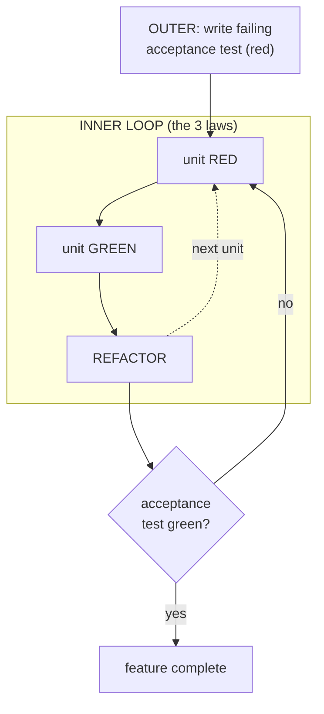
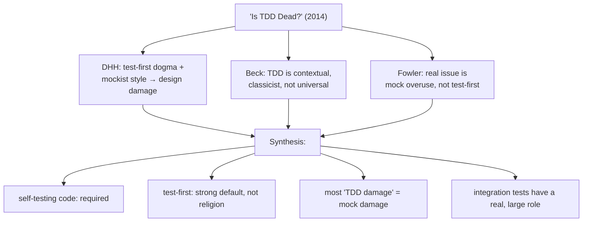
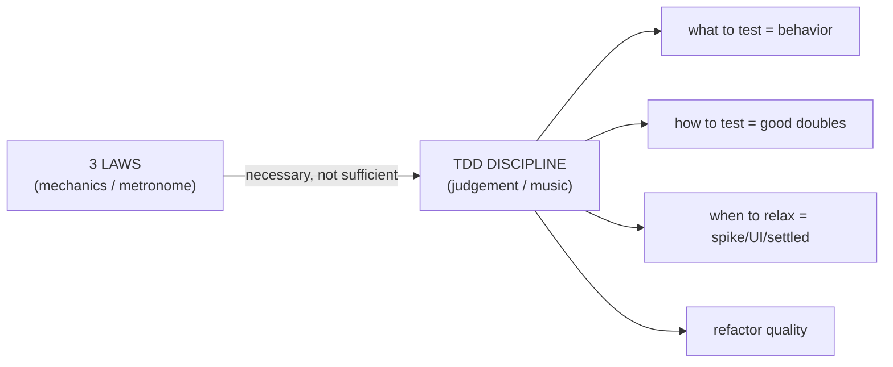

# The Three Laws of TDD — Senior

> **Category:** [Craftsmanship Disciplines](../README.md) — write production code only to make a failing test pass, in the tightest possible loop.

> **Prerequisites:** [Junior](junior.md) · [Middle](middle.md)
> **Focus:** **Design trade-offs** and **system-level reasoning**

---

## Introduction

> Focus: **design trade-offs** and **system-level reasoning**

The three laws are mechanically simple, but they sit at the center of one of the longest-running and most heated arguments in software practice. At the senior level you should be able to articulate not just *how* to follow the laws but *what they buy you*, *where they cost you*, and *what the strongest critics get right*. A senior who can only evangelize TDD is as limited as one who dismisses it — the value is in knowing the boundaries.

This file covers the design pressure the laws exert, the outside-in (double-loop) extension, the classicist/mockist schism, the 2014 "Is TDD Dead?" debate between DHH, Kent Beck, and Martin Fowler, the real phenomenon of *test-induced design damage*, and a clear separation between the **laws** (mechanics) and the **discipline** (judgement) that wraps them.

---

## TDD vs Test-After: What Actually Differs

Both produce tested code. The difference is not coverage — it's three things test-after structurally cannot match:

1. **Every test has been seen to fail.** Test-after writes tests against working code, so a test that asserts the wrong thing (or nothing) still passes — and you never learn it's broken. TDD's "see it fail first" is a *test of the test*. A large fraction of test-after suites contain tests that would pass even if the code were deleted; TDD suites structurally cannot.
2. **Design is shaped by the test, not the reverse.** When code exists first, tests are bent around whatever interface the code happens to have — including untestable ones. When the test exists first, the *interface is designed to be easy to call*, which biases toward decoupling and small surfaces (see next section).
3. **You only write code the tests demand.** Test-after lets you write speculative, unused, or over-general code, then "cover" it. The three laws make every line a response to a concrete failing test, which is a powerful guard against [YAGNI](../04-simple-design/junior.md) violations.

Test-after's legitimate advantages: it's faster for code whose design is already settled, it's the only option for characterizing legacy code, and it's less disruptive to a team that doesn't know TDD. The senior position: **TDD's edge is in the design and the trustworthiness of the suite, not in coverage numbers** — coverage is achievable either way.

---

## Design Pressure: Tests as the First Client

The deepest argument *for* the three laws is not testing at all — it's design. A test is the **first client** of your code. To write the test first, you must answer, before any implementation exists:

- What is this thing called, and what does it return?
- What does it depend on, and how are those dependencies supplied?
- What is the smallest interface that does the job?

Code that is hard to test-first is almost always hard to *use* — it has hidden dependencies, does too much, or couples to concrete collaborators. The act of writing the test first surfaces these problems **before** you've sunk an implementation into them.

```python
# Hard to test-first → the test screams "fix the design"
class ReportJob:
    def run(self):
        db = PostgresConnection(os.environ["DB_URL"])  # constructs its own deps
        rows = db.query("SELECT ...")                   # hidden coupling
        Emailer().send(format(rows))                    # more hidden coupling
# You cannot write a fast unit test for this without a real DB and SMTP.

# Test-first pressure forces the seams open:
class ReportJob:
    def __init__(self, repo, mailer):    # dependencies injected
        self.repo, self.mailer = repo, mailer
    def run(self):
        self.mailer.send(format(self.repo.recent_rows()))
# Now testable in milliseconds with fakes — AND decoupled, AND reusable.
```

This is the famous claim: **TDD doesn't just verify the design, it generates it.** The laws, by demanding a failing test before any code, force you to confront usability and coupling at the earliest possible moment. See Dependency Injection and SOLID — TDD and DI are mutually reinforcing.

The senior caveat, which the critics press hard: *the design TDD pushes you toward is a specific style* — many small, injectable, mockable units. That style is excellent for some systems and **distorting for others**. Hold that thought for [test-induced design damage](#test-induced-design-damage).

---

## Double-Loop TDD (Outside-In)

The three laws describe the **inner loop** (unit test → code). Real features need an **outer loop** that starts from a failing **acceptance test** describing the behavior a user wants, then drives inner unit-test loops until the acceptance test passes.



This **outside-in** style (associated with the "London school" and the book *Growing Object-Oriented Software, Guided by Tests*) starts at the system boundary and works inward, discovering collaborators as the code needs them — each new collaborator is initially a mock, later replaced by a real, TDD'd implementation. The contrast is **inside-out** ("Detroit/classicist"): build the inner domain objects first with state-based tests, then assemble outward.

The connection to the three laws: the laws are *agnostic* about direction. They govern the inner red-green-refactor regardless of whether you arrived there top-down or bottom-up. Outside-in tends to produce more mocks (you mock collaborators that don't exist yet); inside-out tends to produce more real-object, state-based tests. Both honor the laws; they differ in **what shape of test the laws end up producing**. See [ATDD](../06-acceptance-test-driven-development/junior.md) for the outer loop in depth.

---

## Classicist vs Mockist (London vs Detroit)

This schism determines what your TDD'd code *looks like*, and seniors are expected to have a position.

| | **Classicist (Detroit / Chicago)** | **Mockist (London)** |
|---|---|---|
| Tests verify | **State** — call the method, assert the result | **Interactions** — assert which collaborators were called how |
| Doubles | Use real objects where possible; fakes for slow boundaries | Mock almost every collaborator |
| Unit boundary | A cluster of cooperating objects | A single object, isolated |
| Direction | Tends inside-out | Tends outside-in |
| Failure localization | A bug may fail many tests | A bug fails one focused test |
| Refactoring resilience | High — tests don't know internal structure | Lower — tests couple to call sequences |


The mature position: **default to classicist (state-based) tests; reach for mocks only at true boundaries** — things that are slow (DB, network), non-deterministic (clock, RNG), or whose *interaction is the behavior* (did we publish exactly one event?). Fowler's "Mocks Aren't Stubs" is the canonical treatment.

---

## The "Is TDD Dead?" Debate

In 2014 David Heinemeier Hansson (DHH, creator of Rails) published *"TDD is dead. Long live testing."* — and then debated Kent Beck (who coined TDD) and Martin Fowler in a series of recorded conversations. A senior should know the actual claims, because they're frequently misquoted.

**DHH's actual argument** (steel-manned):

- He was not against testing — he was against **test-first as dogma** and against the **mockist, design-by-mocking** style.
- He argued that driving design purely from unit-testability produces **test-induced design damage**: indirection, ports/adapters, and service objects introduced *only* to make code mockable, complicating code that would otherwise be a straightforward Rails controller hitting the database.
- He preferred **fast integration-ish tests against the real database** to a maze of mocked units, and saw "100% unit-tested, heavily mocked" as a false idol.

**Beck's and Fowler's responses:**

- **Beck:** TDD is a tool with a context; it shines for some problems (clear algorithms, evolving design) and is weak for others (UI, exploratory work). He never claimed it was universal. Self-testing code is the goal; test-first is one route. He explicitly does *not* mock everything — he's a classicist.
- **Fowler:** The debate is really about **test isolation and mock usage**, not test-first per se. He distinguished "solitary" (mockist) from "sociable" (classicist) tests and argued most damage attributed to TDD is actually damage from *excessive mocking*, not from writing tests first.

**The senior synthesis** — what the field actually settled on:

1. **Self-testing code is non-negotiable.** Even DHH agrees you need a fast, trustworthy automated suite.
2. **Test-first is a powerful default, not a religion.** Use it where it helps the design; relax it for spikes, UI, and settled designs.
3. **Most "TDD damage" is mock damage.** A classicist, sociable-test style avoids the indirection DHH rightly criticized.
4. **Integration tests against real infrastructure have a legitimate, large role** — the unit/integration ratio is a design decision, not a moral one.

The three laws survive all of this *as mechanics*: when you do choose to drive code from tests, the laws keep the loop tight. The debate is about *when and how much* to use them, not whether the laws themselves are coherent.

---

## Test-Induced Design Damage

The single most important critique to internalize. **Test-induced design damage** is structural complexity added to production code for no reason other than to make it testable. Symptoms:

- **Interfaces with a single implementation**, created only so a mock can stand in.
- **Service/manager objects** extracted from a perfectly cohesive class purely to isolate a unit.
- **Dependency injection threaded through layers** that have no other reason to be configurable.
- **Logic pushed out of the natural place** (e.g., out of a framework's controller) into an awkward seam so it can be unit-tested in isolation.

```java
// Damage: an interface + factory + injection introduced ONLY for mockability,
// when the real collaborator is a fast, deterministic value computation.
interface DiscountCalculator { Money calc(Order o); }
class RealDiscountCalculator implements DiscountCalculator { ... }
class OrderService {
    private final DiscountCalculator calc;       // injected so tests can mock it
    OrderService(DiscountCalculator calc) { this.calc = calc; }
}

// Often better (classicist): just use the real calculation. It's fast and pure —
// there is nothing to mock, no interface to invent, no seam to maintain.
class OrderService {
    Money total(Order o) { return o.subtotal().minus(Discounts.forOrder(o)); }
}
```

The cure is not "stop testing" — it's **classicist testing of sociable units**: test the cluster through its real collaborators, mock only genuine boundaries. The distortion comes from mockist isolation pushed everywhere, not from test-first. A senior must be able to tell the difference between *"this seam improves the design"* (good DI) and *"this seam exists only to satisfy a mock"* (damage).

---

## When the Laws Hurt

Honest enumeration of where strict three-law TDD is the wrong tool:

| Situation | Why the laws hurt | Better approach |
|---|---|---|
| **Exploratory spike** | You don't know the design yet; writing tests first tests a hypothesis you'll discard | Spike without tests, learn, **delete**, then TDD for real |
| **UI / pixel layout / visual** | Behavior is "looks right," not assertable cheaply | Manual/visual review, snapshot tests, or extract logic out of the view and TDD that |
| **Throwaway / prototype code** | The code won't live long enough to repay the test investment | Skip; just don't let it become production |
| **Highly concurrent / timing code** | Deterministic unit tests can't reliably reproduce races | Targeted stress/race tools (`go test -race`), model checking |
| **Settled, stable design** | The design pressure benefit is already captured | Test-after is fine; the value of test-first was the design discovery |
| **Glue code with no logic** | Nothing to assert beyond "it wires A to B" | A thin integration/contract test, not unit TDD |

The meta-skill: TDD's two benefits are **trustworthy verification** and **design discovery**. When a situation offers neither (no logic to verify, no design to discover), the laws are pure overhead. Recognizing those situations is a senior judgement, not a license to skip TDD whenever it's inconvenient.

---

## The Laws vs the Discipline

A crucial distinction seniors must hold: **the three laws are the *mechanics*; TDD-the-discipline is much larger.**

| The Three Laws (mechanics) | TDD as a discipline (judgement) |
|---|---|
| When you may write test vs. code | *What* to test (behavior, not implementation) |
| Keep the loop in seconds | *How* to design tests (fixtures, doubles, naming) |
| One failing test at a time | *Whether* to use mocks here, and how many |
| Minimum code to pass | *When* to relax (spike, UI, settled design) |
| Refactor on green | *How well* to refactor — the actual cleanup quality |

You can obey all three laws perfectly and still produce a **terrible** test suite: tests coupled to private methods, mockist tests that mirror the implementation line-for-line, tests that assert nothing meaningful. The laws guarantee the *loop*; they guarantee nothing about *quality*. That's why the laws are a prerequisite to, not a substitute for, [Test Design & Fixtures](../02-test-design-and-fixtures/junior.md), [Simple Design](../04-simple-design/junior.md), and [Refactoring as a Discipline](../03-refactoring-as-a-discipline/junior.md).

A useful framing: **the laws are the metronome; the discipline is the music.** A metronome keeps you in time but doesn't make you a musician.

---

## What the Laws Cannot Give You

- **They can't tell you the right test.** "Write a failing test" — but a test of the wrong thing (implementation detail, a getter) passes the laws and rots the suite.
- **They can't prevent over-mocking.** Mockist damage is fully law-compliant.
- **They can't design the system.** They exert *pressure* toward decoupling, but a bad architect produces bad-but-decoupled code under the same laws.
- **They can't replace integration, contract, performance, or acceptance testing.** Unit-level red-green says nothing about whether components work together. See [ATDD](../06-acceptance-test-driven-development/junior.md).
- **They can't make slow tests fast** or untestable code testable — those are design problems the laws *reveal* but don't *solve*.

---

## Pros & Cons at the System Level

| Dimension | Strict three-law TDD | Test-after / looser |
|---|---|---|
| Suite trustworthiness | High — every test seen failing | Variable — some tests never red |
| Design pressure toward decoupling | Strong | Weak |
| Risk of test-induced design damage | Real, if mockist | Lower (design precedes tests) |
| Defect feedback latency | Seconds | Minutes to "after the fact" |
| Fit for exploratory/UI work | Poor | Better |
| Fit for legacy/characterization | Poor (no seams yet) | The only option |
| Refactoring safety | High | Depends on suite quality |
| Speed on a settled design | Slower | Faster |

The pattern: the laws win decisively on **trust** and **design discovery**, lose on **exploratory/UI/glue** work, and are **neutral-to-harmful** when over-applied via mocking. Seniority is reading which column the situation is in.

---

## Liabilities

### Liability 1: Cargo-cult law-following

Teams that recite the laws but write mockist tests mirroring the implementation get all the ceremony and none of the benefit. **Following the laws is necessary but not sufficient.**

### Liability 2: Mock-driven design damage

The most damaging real failure mode: extracting interfaces, factories, and services *only* to mock them, complicating production code. Default classicist; mock only true boundaries.

### Liability 3: Treating coverage as the goal

The laws produce high coverage as a *side effect*. Targeting coverage directly (especially after the fact) inverts the value — you get coverage-shaped tests that assert little. See [Professional](professional.md) on coverage politics.

### Liability 4: Refusing to relax for spikes

Dogmatically TDD-ing exploratory code wastes effort on tests for a design you'll throw away. Spike, learn, delete, then TDD the real thing.

### Liability 5: A slow suite that kills the loop


---

## Diagrams

### The debate, mapped



### Laws vs discipline



---

## Related Topics

- **The discipline around the laws:** [Test Design & Fixtures](../02-test-design-and-fixtures/junior.md), [Refactoring as a Discipline](../03-refactoring-as-a-discipline/junior.md), [Simple Design](../04-simple-design/junior.md).
- **The outer loop:** [Acceptance Test-Driven Development](../06-acceptance-test-driven-development/junior.md).
- **Design principles TDD reinforces:** Design Principles / SOLID.

---


---

## Check your understanding

1. Explain The Three Laws of TDD — Senior Level in your own words and name the problem it solves.
2. How would you apply the ideas around Table of Contents, Introduction, TDD vs Test-After: What Actually Differs in a realistic engineering change?
3. What failure mode or misuse should you look for, and what evidence would reveal it?
4. How would you validate a system-level decision about The Three Laws of TDD — Senior Level under uncertainty?
5. What observable result would convince you that the approach improved the system?
