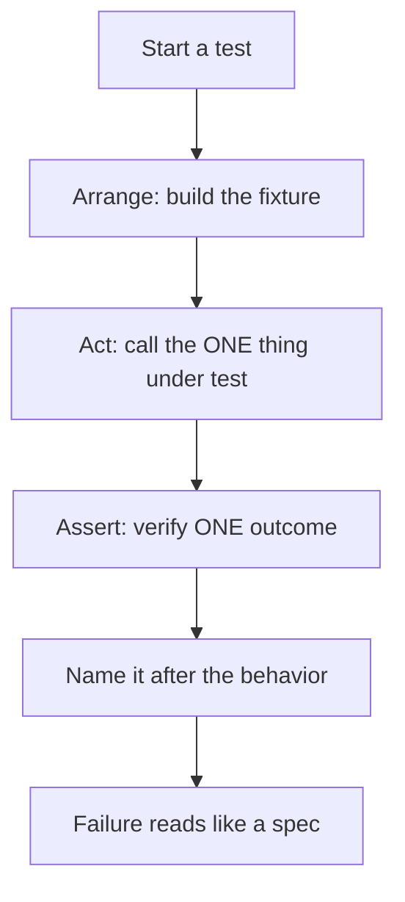
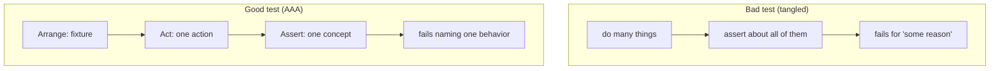

# Test Design & Fixtures — Junior

> **Category:** [Craftsmanship Disciplines](../README.md) — design tests that read clearly, run fast, and manage their own data, so a failing test names a single broken behavior.

---

## Table of Contents

1. [Introduction](#introduction)
2. [Prerequisites](#prerequisites)
3. [Glossary](#glossary)
4. [Core Concepts](#core-concepts)
5. [Real-World Analogies](#real-world-analogies)
6. [Mental Models](#mental-models)
7. [Pros & Cons](#pros-cons)
8. [Use Cases](#use-cases)
9. [Code Examples](#code-examples)
10. [Coding Patterns](#coding-patterns)
11. [Clean Code](#clean-code)
12. [Best Practices](#best-practices)
13. [Edge Cases & Pitfalls](#edge-cases-pitfalls)
14. [Common Mistakes](#common-mistakes)
15. [Tricky Points](#tricky-points)
16. [Test Yourself](#test-yourself)
17. [Cheat Sheet](#cheat-sheet)
18. [Summary](#summary)
19. [Further Reading](#further-reading)
20. [Related Topics](#related-topics)
21. [Diagrams](#diagrams)

---

## Introduction

> Focus: **What is it?** and **How to use it?**

A **test** is a small program that runs your real code with known inputs and checks that the result is what you expected. **Test design** is the craft of writing that small program so it reads in three seconds, fails for exactly one reason, and tells you precisely what broke without you opening a debugger.

Most tests, in every language, have the same skeleton: **set up some data, do one thing to it, check the outcome.** That skeleton has a name — **Arrange-Act-Assert** (AAA), also called **Given-When-Then**. The data you set up is the **fixture**. Get those two ideas right and your tests stop being a chore and start being a safety net.

The opposite — what we are trying to avoid — is a test like this:

```python
def test_stuff():
    o = Order(); o.add("book", 12); o.add("pen", 3); o.customer = make_user()
    db.save(o); o.discount = 0.1; total = o.total(); db.reload(o)
    assert total == 13.5 and o.status == "OPEN" and len(o.items) == 2
```

What does it test? Totals? Discounts? Persistence? Status? All four, tangled together. When it fails you have no idea which behavior broke, and you have to read every line to even guess. A junior who can turn that into a clean AAA test is already more valuable than one who can only write production code.

### Why this matters

A test suite is read far more often than it is written. Every time it fails, someone has to understand it under pressure — a broken build, a blocked deploy. A well-designed test answers three questions at a glance: **what situation** (Arrange), **what action** (Act), **what should be true** (Assert). A badly-designed test answers none of them, and the team slowly learns to ignore failures — which is the moment the safety net stops catching anything.

---

## Prerequisites

- **Required:** How to write and run a function in one language.
- **Required:** A test runner you can execute: **JUnit** (Java), **pytest** (Python), or **`go test`** (Go).
- **Helpful:** The idea of an **assertion** — a statement that must be true or the test fails.
- **Helpful:** [The Three Laws of TDD](../01-the-three-laws-of-tdd/junior.md) — tests written *before* code tend to be better designed by default.

---

## Glossary

| Term | Definition |
|------|-----------|
| **Test** | A program that runs real code with known input and asserts the output. |
| **Arrange-Act-Assert (AAA)** | The three-part structure of a test: set up, perform the action, check the result. |
| **Given-When-Then (GWT)** | The same three parts, in BDD vocabulary. |
| **Fixture** | The known starting state a test needs — objects, data, files, fakes. |
| **Setup** | Code that builds the fixture before the test body runs. |
| **Teardown** | Code that cleans up after the test (close files, reset the DB). |
| **System Under Test (SUT)** | The one thing the test is actually testing. |
| **Assertion** | A check that fails the test if it is not true. |
| **Test double** | A stand-in for a real dependency (stub, mock, fake) — see [Middle](middle.md). |
| **Happy path** | The normal, expected case, as opposed to error/edge cases. |

---

## Core Concepts

### 1. Every test is Arrange → Act → Assert

The three phases, always in this order:

- **Arrange** — create the objects and data the test needs (the fixture).
- **Act** — call the *one* method or function you are testing.
- **Assert** — verify the result is what you expected.

```python
def test_order_total_sums_item_prices():
    # Arrange
    order = Order()
    order.add_item("book", price=12)
    order.add_item("pen", price=3)

    # Act
    total = order.total()

    # Assert
    assert total == 15
```

Three blocks, separated by blank lines, each doing its one job. A reader sees the situation, the action, and the expectation without decoding anything.

### 2. The Act is one action

The middle block should be **one** call — the behavior under test. If your Act block is five lines, you are probably testing five things, and the test will fail for five different reasons. One action per test keeps the diagnosis trivial: if it fails, *that one action* is broken.

### 3. A fixture is the "Given" — the world the test lives in

A fixture is everything the test needs to exist before the action makes sense: a constructed object, some rows in a database, a temp file, a fake clock. Naming and building fixtures clearly is half of good test design, because a confusing fixture makes the whole test confusing.

### 4. The name says what behavior is verified

A test name is documentation that can never go out of date (it would fail). `test_1` tells you nothing. `test_order_total_sums_item_prices` tells you the *behavior*, so a failure report reads like a sentence: "order total sums item prices — FAILED."

---

## Real-World Analogies

| Concept | Analogy |
|---|---|
| **Arrange** | Setting the stage before a scene: props placed, actors positioned. |
| **Act** | The single line of dialogue you are testing the audience's reaction to. |
| **Assert** | The audience's reaction — applause (pass) or silence (fail). |
| **Fixture** | A lab's controlled conditions: same temperature, same samples, every run. |
| **Teardown** | Cleaning the lab bench so the next experiment isn't contaminated by the last. |
| **Test name** | The label on a specimen jar — useless if it just says "sample 3." |

---

## Mental Models

**The intuition:** *"Set the scene, do one thing, check one outcome — and write it so the next person reads it like a sentence."*

```
TEST = a tiny, repeatable experiment

   ┌──────────── Arrange (Given) ───────────┐
   │  build the fixture: objects, data, fakes│
   └─────────────────────────────────────────┘
                     │
   ┌──────────── Act (When) ─────────────────┐
   │  call the ONE thing under test          │
   └─────────────────────────────────────────┘
                     │
   ┌──────────── Assert (Then) ──────────────┐
   │  verify the ONE expected outcome        │
   └─────────────────────────────────────────┘
```

Compare a good test to a bad one:

```
GOOD                              BAD
arrange one fixture               do six things
act once                          assert about all of them
assert one concept                fail for "some reason"
name = the behavior               name = test_2
```

The good test is a *specification you can run*. The bad test is a script that happens to pass today.

---

## Pros & Cons

These are the pros and cons of **investing in test design** (versus dashing off whatever passes).

| Pros | Cons |
|------|------|
| A failure points at one behavior — fast diagnosis | Takes a little more thought up front |
| Tests read as living documentation | Tempting to over-engineer fixtures |
| Fixtures make tests repeatable and isolated | Shared fixtures, done wrong, couple tests (see [Middle](middle.md)) |
| Clear names turn the report into a spec | Good names are longer to type |
| Independent tests can run in any order / in parallel | Requires discipline as the suite grows |

### When to use:
- **Every test you write.** AAA and a clear name cost almost nothing and pay back on the first failure.

### When NOT to use:
- There is no "when not to." Even a throwaway script's test benefits from one clear Act and one clear Assert. The *amount* of fixture machinery scales with the test's importance, but the structure does not.

---

## Use Cases

- **Unit tests** — verify one function/class in isolation, fixture built in memory.
- **Integration tests** — verify two components together (e.g., service + database), fixture is real data.
- **Regression tests** — a test written to reproduce a bug, so it can never come back.
- **Characterization tests** — pin down what legacy code currently does before you change it.
- **Acceptance tests** — verify a whole feature from the user's perspective (see [ATDD](../06-acceptance-test-driven-development/junior.md)).

---

## Code Examples

### Java / JUnit 5 — AAA with comment markers

```java
import org.junit.jupiter.api.Test;
import static org.junit.jupiter.api.Assertions.assertEquals;

class OrderTest {

    @Test
    void total_sums_item_prices() {
        // Arrange
        Order order = new Order();
        order.addItem("book", 12);
        order.addItem("pen", 3);

        // Act
        int total = order.total();

        // Assert
        assertEquals(15, total);
    }
}
```

**Highlights:**
- The method name *is* the behavior under test.
- Three blocks, three jobs, separated by blank lines.
- One Act (`order.total()`), one logical Assert.

---

### Python / pytest — fixtures via a helper

```python
def make_order():
    order = Order()
    order.add_item("book", price=12)
    order.add_item("pen", price=3)
    return order

def test_total_sums_item_prices():
    # Arrange
    order = make_order()

    # Act
    total = order.total()

    # Assert
    assert total == 15

def test_total_is_zero_for_empty_order():
    # Arrange
    order = Order()

    # Act / Assert
    assert order.total() == 0
```

The `make_order()` helper is a tiny fixture builder: it puts the "Arrange" in one place so the test body shows only what is *interesting* about this case. The empty-order test deliberately uses a *different* fixture (an empty `Order`) because it tests a different situation.

---

### Go — table-driven tests, the idiomatic fixture

> **Go note:** Go has no JUnit-style annotations. Tests are plain functions named `TestXxx(t *testing.T)`, and the community standard for "many cases, one behavior" is the **table-driven test** — the table *is* the fixture.

```go
func TestOrderTotal(t *testing.T) {
    tests := []struct {
        name  string
        items []Item
        want  int
    }{
        {"empty order", nil, 0},
        {"single item", []Item{{"book", 12}}, 12},
        {"two items",   []Item{{"book", 12}, {"pen", 3}}, 15},
    }
    for _, tt := range tests {
        t.Run(tt.name, func(t *testing.T) {
            // Arrange
            order := Order{Items: tt.items}
            // Act
            got := order.Total()
            // Assert
            if got != tt.want {
                t.Errorf("Total() = %d, want %d", got, tt.want)
            }
        })
    }
}
```

Each row is a named scenario. The `t.Run(tt.name, ...)` makes failures report by name (`TestOrderTotal/two_items`), so even here the *behavior* is what shows up in the failure.

---

## Coding Patterns

### Pattern 1: Mark the three phases

Until AAA is automatic, literally write the comments. They force you to notice when your Act block has grown into three actions.

```python
def test_withdraw_reduces_balance():
    account = Account(balance=100)   # Arrange
    account.withdraw(30)             # Act
    assert account.balance == 70     # Assert
```

### Pattern 2: One assert *concept* per test

Not necessarily one `assert` statement — one *idea*. These three asserts all describe one concept ("the created user has the right fields"):

```python
def test_register_creates_active_user():
    user = register("ada@x.com")
    assert user.email == "ada@x.com"
    assert user.active is True
    assert user.created_at is not None
```

That is fine. What you avoid is asserting about *unrelated* behaviors in one test (see [Middle](middle.md) on one-assert vs one-concept).

### Pattern 3: Name = behavior, not implementation

```
✅ test_total_sums_item_prices
✅ withdraw_throws_when_amount_exceeds_balance
❌ test1
❌ testWithdraw            (which behavior of withdraw?)
❌ test_uses_for_loop      (tests implementation, not behavior)
```



---

## Clean Code

### Separate the three phases visually

Blank lines between Arrange, Act, and Assert turn structure into something the eye catches instantly:

```java
Account account = new Account(100);   // arrange

account.withdraw(30);                 // act

assertEquals(70, account.balance());  // assert
```

### Keep the Arrange focused on what matters

If a test needs a user but only cares about the user's *age*, the fixture should make age the obvious detail and hide the rest behind a helper:

```python
# Noise: the reader can't tell what's relevant
user = User(id=1, name="x", email="x@y.z", age=17, country="US", verified=True)

# Signal: age is clearly the point
user = make_user(age=17)
```

This is the seed of the **Test Data Builder** pattern you'll meet in [Middle](middle.md).

### Don't put logic in tests

A test with an `if`, a loop computing the expected value, or a `try/except` is a test that can have *its own* bug. Keep the expected value literal:

```python
# ❌ the test re-implements the logic it's testing
assert order.total() == sum(i.price for i in order.items)

# ✅ a known, literal expectation
assert order.total() == 15
```

---

## Best Practices

1. **Always Arrange-Act-Assert**, in that order, with blank lines between.
2. **One action in the Act block.** If it grows, split the test.
3. **One concept per test.** Assert about a single behavior, even across a few asserts.
4. **Name the behavior**, never `test1` or just the method name.
5. **Make the relevant fixture detail obvious**; hide the irrelevant in a helper.
6. **No logic in tests** — no `if`, no loops computing expectations, no `try`.
7. **Each test stands alone** — it must pass when run by itself, in any order.

---

## Edge Cases & Pitfalls

- **A test with no assertion** passes no matter what the code does. It tests nothing but "didn't crash." Always assert something.
- **Asserting on incidental output** (a log line, a timestamp) makes the test brittle. Assert on the behavior, not the noise.
- **Sharing one big fixture across all tests** seems efficient but couples them — see the *general fixture* anti-pattern in [Middle](middle.md).
- **Tests that depend on order** ("test B only passes if test A ran first") are a trap; each test must set up its own world.
- **Time and randomness** in a fixture (`now()`, `random()`) make a test pass today and fail tomorrow — covered in [Senior](senior.md).

---

## Common Mistakes

1. **No clear phases** — Arrange, Act, and Assert all mashed into one blob.
2. **Multiple actions in the Act** — testing four behaviors, failing for one unknown reason.
3. **Vague names** — `test_user`, `test2`; the failure report says nothing.
4. **Missing assertion** — the test can only fail by throwing, not by being wrong.
5. **Logic in the test** — an `if`/loop that can itself be buggy.
6. **Over-specified fixture** — twenty fields set when the test cares about one.

---

## Tricky Points

- **"One assert per test" is a slogan, not a law.** The real rule is **one *concept* per test**; several asserts describing the same concept are fine. See [Middle](middle.md).
- **A fixture is not just objects.** Files, DB rows, environment variables, and fake clocks are all fixture — and all need teardown.
- **The Act and Assert can merge** for simple cases (`assert order.total() == 0`), but only keep them merged when it stays readable.
- **A test name that mentions the implementation** (`test_uses_hashmap`) will lie the moment you refactor. Name the *behavior*, which survives refactoring.

---

## Test Yourself

1. What are the three phases of a test, and what does each do?
2. What is a fixture?
3. Why should the Act block contain only one action?
4. What's wrong with a test that has no assertion?
5. What does a good test name describe — and what should it never describe?

---

## Cheat Sheet

```python
# Python / pytest
def test_<behavior_in_words>():
    obj = make_fixture()        # Arrange

    result = obj.do_thing()     # Act  (ONE action)

    assert result == expected   # Assert (ONE concept)
```

```java
// Java / JUnit 5
@Test
void behavior_in_words() {
    var sut = makeFixture();          // Arrange
    var result = sut.doThing();       // Act
    assertEquals(expected, result);   // Assert
}
```

```go
// Go — table-driven (the table is the fixture)
func TestThing(t *testing.T) {
    for _, tt := range []struct{ name string; in, want int }{
        {"zero", 0, 0},
        {"one",  1, 2},
    } {
        t.Run(tt.name, func(t *testing.T) {
            if got := Thing(tt.in); got != tt.want {
                t.Errorf("Thing(%d) = %d, want %d", tt.in, got, tt.want)
            }
        })
    }
}
```

---

## Summary

- A test is a tiny experiment: **Arrange** a fixture, **Act** once, **Assert** one outcome.
- The **fixture** is the known starting state — objects, data, files, fakes.
- Keep the **Act to one action** and assert **one concept**, so a failure names a single broken behavior.
- **Name the behavior**, never the implementation or `test1`.
- **No logic in tests**, **always assert**, and make each test **stand on its own**.

---

## Further Reading

- Gerard Meszaros, *xUnit Test Patterns* — the canonical catalogue of test design and fixture patterns (AAA, four-phase test, Object Mother, anti-patterns).
- Kent Beck, *Test-Driven Development by Example* — where clean, small tests come from.
- Robert C. Martin, *Clean Code* — Chapter 9, "Unit Tests" (F.I.R.S.T., one concept per test).

---

## Related Topics

- **Sibling disciplines:** [The Three Laws of TDD](../01-the-three-laws-of-tdd/junior.md), [Acceptance Test-Driven Development](../06-acceptance-test-driven-development/junior.md).
- **Deeper testing skills:** test doubles, builders, and FIRST in [Middle](middle.md).

---

## Diagrams




---

## Check your understanding

1. Explain Test Design & Fixtures — Junior Level in your own words and name the problem it solves.
2. How would you apply the ideas around Table of Contents, Introduction, Prerequisites in a realistic engineering change?
3. What failure mode or misuse should you look for, and what evidence would reveal it?
4. What small example would prove that you can apply Test Design & Fixtures — Junior Level correctly?
5. What observable result would convince you that the approach improved the system?
