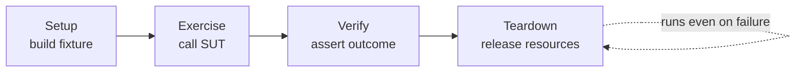
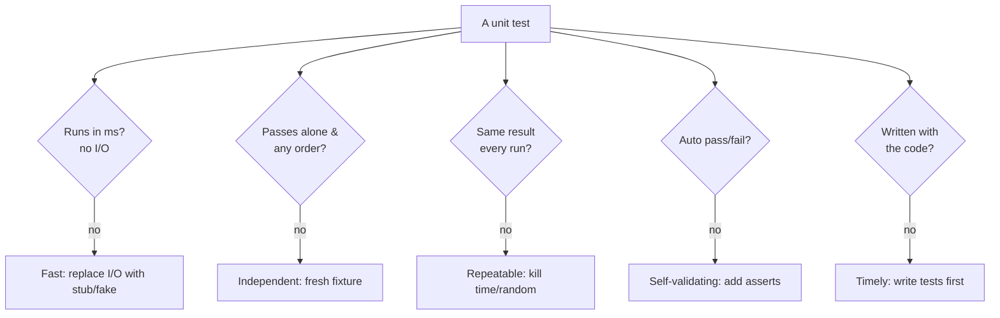
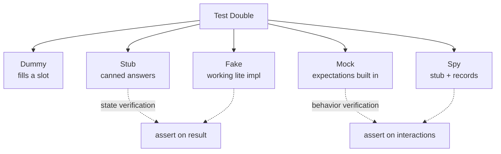

# Test Design & Fixtures — Middle

> **Category:** [Craftsmanship Disciplines](../README.md) — design tests that read clearly, run fast, and manage their own data, so a failing test names a single broken behavior.

> **Prerequisite:** [Junior](junior.md)
> **Focus:** **Why** and **When**

---

## Introduction

> Focus: **Why** and **When**

At the junior level a test is Arrange-Act-Assert with a good name. At the middle level you start making *choices*: how to build test data without drowning in setup, how to isolate the unit from its collaborators, when a shared fixture saves time versus when it secretly couples every test in a class. These are the decisions that determine whether a suite of 2,000 tests stays a help or becomes a tax.

The throughline is **F.I.R.S.T.** — tests should be **F**ast, **I**ndependent, **R**epeatable, **S**elf-validating, and **T**imely. Almost every middle-level technique (builders, test doubles, fresh fixtures, deterministic data) exists to satisfy one of those five letters. When you understand *which* property a technique buys, you stop applying techniques by ritual and start applying them on purpose.

---

## The Four-Phase Test

AAA names three phases, but a complete test has **four** — Meszaros's **four-phase test**:

1. **Setup** — build the fixture (the "Arrange").
2. **Exercise** — call the system under test (the "Act").
3. **Verify** — assert the outcome (the "Assert").
4. **Teardown** — release whatever Setup acquired (close files, drop DB rows, reset the clock).

The fourth phase is the one juniors forget because in-memory tests rarely need it. The moment a fixture touches the *outside world* — a file, a socket, a database, a global — teardown becomes mandatory, or the next test inherits your mess.



The critical property: **teardown must run even when Verify fails.** A failed assertion throws; if teardown sits after the assertion in plain sequence, it never runs. That's why frameworks provide teardown *hooks* that run regardless:

```python
# pytest: the code after `yield` is teardown, runs even if the test fails
import pytest

@pytest.fixture
def temp_db():
    db = create_test_db()       # Setup
    yield db                    # ← the test runs here
    db.drop()                   # Teardown — runs on pass AND on failure
```

```java
// JUnit 5: @AfterEach runs after every test, pass or fail
class FileServiceTest {
    Path tmp;
    @BeforeEach void setUp() throws IOException { tmp = Files.createTempFile("t", ".txt"); }
    @AfterEach  void tearDown() throws IOException { Files.deleteIfExists(tmp); }
}
```

```go
// Go: t.Cleanup registers teardown that runs at test end, even on failure
func TestWithTempDir(t *testing.T) {
    dir := t.TempDir()          // Setup — and Go auto-removes it; no teardown needed
    t.Cleanup(func() { /* extra teardown if any */ })
    // ... exercise + verify ...
}
```

---

## The F.I.R.S.T. Principles

The five properties of a good unit test. Memorize them — they are the rubric you grade your own tests against.

| Letter | Property | What it means | What violates it |
|---|---|---|---|
| **F** | **Fast** | Runs in milliseconds, so the whole suite runs in seconds and you run it constantly. | Hitting a real DB, network, `sleep`, or filesystem in a unit test. |
| **I** | **Independent** | Passes alone and in any order; shares no mutable state with other tests. | Test B relies on data Test A created; a shared fixture mutated across tests. |
| **R** | **Repeatable** | Same result every run, on any machine, any time of day. | Depends on `now()`, `random()`, timezone, network, or test ordering. |
| **S** | **Self-validating** | Asserts pass/fail automatically — no human reads output to judge. | "Test" that prints values for a human to eyeball; no assertion. |
| **T** | **Timely** | Written just before (or with) the code, not bolted on months later. | Tests added after a release "for coverage," when the code is hard to test. |

### Why Fast and Independent dominate

If tests are slow, developers stop running them — and an unrun test catches nothing. If tests are interdependent, one failure cascades into ten confusing failures, and you can't run a single test to debug it. **Fast + Independent are the two properties that decide whether the suite gets used at all.** The rest protect correctness; these two protect *adoption*.

> **The litmus test for a unit test:** *Could it run on a plane with no network, in any order, a thousand times, and give the same green/red every time, in under a second?* If not, identify the failing letter.

---

## Fixture Lifecycle: Fresh vs Shared

A **fixture** has a *lifecycle* — when it's created and destroyed relative to the tests that use it. Two axes:

**Fresh vs Shared** — is each test handed a brand-new fixture, or do tests reuse one?

**Transient vs Persistent** — does the fixture live only in memory for one test, or does it outlive the test (a DB row, a file)?

| Strategy | When built | Pros | Cons |
|---|---|---|---|
| **Fresh / transient** (default) | Per test (`@BeforeEach`, fixture function) | Maximum isolation; satisfies Independent | Rebuilds setup every test (can be slow) |
| **Shared** (`@BeforeAll`, session fixture) | Once per class/suite | Fast — expensive setup done once | Risk: tests mutate it and couple to each other |
| **Persistent** (real DB/file) | Survives the test | Realistic (integration tests) | Must be torn down; risks leaking state |

The default is **fresh and transient** — a new fixture per test — because it guarantees **Independence** for free. You reach for a *shared* fixture only when setup is genuinely expensive (a real DB connection, a Spring context, a Docker container) *and* the fixture is **immutable** or reset between tests.

```python
# FRESH (default, safe): new account per test — tests can't interfere
@pytest.fixture
def account():
    return Account(balance=100)

def test_withdraw(account): account.withdraw(30); assert account.balance == 70
def test_deposit(account):  account.deposit(50); assert account.balance == 150
# each test gets its OWN account; the withdraw doesn't affect the deposit test
```

```python
# SHARED (scope="module"): built ONCE — only safe if read-only
@pytest.fixture(scope="module")
def http_client():
    return ApiClient(base_url="http://test")   # expensive to build, never mutated
```

The danger of shared fixtures is the **general fixture** anti-pattern: one big shared object that every test reads and *some* tests mutate, silently coupling them. We return to this in [Senior](senior.md); for now the rule is: **share only what is immutable or reset.**

---

## Object Mother vs Test Data Builder

Both patterns solve the same problem: **constructing valid, complex test objects without 15 lines of setup in every test.** They solve it differently.

### Object Mother — named, canned instances

A factory class with methods returning *pre-canned* objects for common scenarios:

```java
class Customers {
    static Customer aVipCustomer()      { return new Customer("VIP", Tier.GOLD, true); }
    static Customer anUnverified()      { return new Customer("New", Tier.NONE, false); }
    static Customer aBannedCustomer()   { Customer c = aVipCustomer(); c.ban(); return c; }
}

// Usage — reads like English, zero setup noise
var order = new Order(Customers.aVipCustomer());
```

**Strengths:** dead simple, very readable for a *fixed* set of common cases. **Weakness:** combinatorial explosion. The moment you need "a VIP who is *also* unverified with a *negative* balance," you either add another mother method or there's no method for your case.

### Test Data Builder — fluent, customizable construction

A builder with sensible defaults that you override only for the field the test cares about:

```java
class CustomerBuilder {
    private String tier = "STANDARD";
    private boolean verified = true;
    private int balance = 0;

    CustomerBuilder vip()           { this.tier = "GOLD"; return this; }
    CustomerBuilder unverified()    { this.verified = false; return this; }
    CustomerBuilder balance(int b)  { this.balance = b; return this; }
    Customer build()                { return new Customer(tier, verified, balance); }

    static CustomerBuilder aCustomer() { return new CustomerBuilder(); }
}

// Usage — defaults for everything irrelevant, override ONLY what matters
var c = aCustomer().vip().unverified().balance(-50).build();
```

**Strengths:** infinitely composable; the test states *only the fields it cares about*, making intent obvious (the noise is in the defaults, not the test). **Weakness:** more code to write the builder.

```python
# Python builder — same idea, often via a dataclass + replace()
from dataclasses import dataclass, replace

@dataclass
class Customer:
    tier: str = "STANDARD"
    verified: bool = True
    balance: int = 0

A_CUSTOMER = Customer()  # defaults

def test_unverified_vip_cannot_checkout():
    customer = replace(A_CUSTOMER, tier="GOLD", verified=False)  # override only what matters
    assert not can_checkout(customer)
```

### Which to use

| Situation | Pattern |
|---|---|
| A handful of fixed, well-known scenarios | **Object Mother** — simplest, most readable |
| Many combinations of fields; tests vary one detail | **Test Data Builder** — composable, intent-revealing |
| Both | Mother methods that *return builders* — canned starting points you can still tweak |

The deciding question: **does each test vary a different field?** If yes, builders win, because a mother would need a method per combination. If every test uses one of five fixed shapes, a mother is less code.

---

## Test Doubles: Dummy, Stub, Spy, Mock, Fake

A **test double** is any object that stands in for a real dependency in a test (the term comes from "stunt double"). Meszaros defines five kinds — knowing the distinctions is a classic interview filter, and using the *wrong* one is a classic source of brittle tests.

| Double | Purpose | Has behavior? | Verifies interactions? |
|---|---|---|---|
| **Dummy** | Fills a parameter slot; never actually used | No | No |
| **Stub** | Returns canned answers to feed the SUT | Yes (fixed) | No |
| **Spy** | A stub that *also records* how it was called | Yes | Yes (after the fact) |
| **Mock** | Pre-programmed with *expectations*; fails if they aren't met | Yes | Yes (built-in) |
| **Fake** | A working but lightweight implementation | Yes (real-ish) | No |

```python
# DUMMY — required by the signature, never used
service.register(user, logger=object())   # logger irrelevant to this test

# STUB — feeds canned data INTO the SUT
class StubClock:
    def now(self): return datetime(2020, 1, 1)   # always returns the same time
total = invoice.with_late_fee(clock=StubClock())

# SPY — records what happened, asserted afterward
class SpyMailer:
    def __init__(self): self.sent = []
    def send(self, to, body): self.sent.append((to, body))
mailer = SpyMailer()
notifier.alert(user, mailer)
assert mailer.sent == [("ada@x.com", "alert")]   # verify AFTER

# MOCK — expectation set BEFORE, framework verifies
mailer = Mock()
notifier.alert(user, mailer)
mailer.send.assert_called_once_with("ada@x.com", "alert")   # built-in verification

# FAKE — a real, working implementation, just lighter
class InMemoryUserRepo:          # behaves like a DB repo, but uses a dict
    def __init__(self): self._d = {}
    def save(self, u): self._d[u.id] = u
    def get(self, id): return self._d[id]
```

### State verification vs behavior verification

The deepest distinction underneath these five: **stubs and fakes support *state* verification** (assert on the SUT's result), while **mocks and spies support *behavior* verification** (assert on *how* the SUT used its collaborators).

- **Prefer state verification** — assert on the *outcome*, not the *interactions*. It survives refactoring.
- **Use behavior verification only when the interaction *is* the behavior** — e.g., "an email must be sent," "the payment gateway must be charged exactly once." There, *that the call happened* is the thing you care about.

Over-mocking — verifying every internal call — produces tests that break on every refactor even when behavior is unchanged. This is a large enough trap that it has its own discussion in [Senior](senior.md).

---

## One Assert vs One Concept

The old rule "one assert per test" is a simplification of the real rule: **one *concept* per test.**

```python
# ONE CONCEPT, multiple asserts — totally fine
def test_register_returns_active_user():
    user = register("ada@x.com")
    assert user.email == "ada@x.com"   # all three asserts describe
    assert user.active is True          # ONE concept:
    assert user.id is not None          # "a correctly-registered user"

# MULTIPLE CONCEPTS — split into separate tests
def test_register_does_everything():        # ❌
    user = register("ada@x.com")
    assert user.active                       # concept 1: user state
    assert mailer.sent == [...]              # concept 2: welcome email
    assert audit_log.last == "REGISTER"      # concept 3: auditing
```

The bottom test should be three tests. Why? If welcome-email sending breaks, you want a failure named `test_register_sends_welcome_email`, not a generic `test_register_does_everything` that also happens to check two other things. **One concept per test = one reason to fail = a failure that diagnoses itself.**

The pragmatic guideline: a few asserts that *together verify one outcome* are one concept. Asserts about *separate behaviors or collaborators* are separate concepts — split them.

---

## Parameterized Tests

When the *same behavior* should hold across many inputs, don't copy-paste the test — parameterize it. One test body, a table of cases.

```python
# pytest
import pytest

@pytest.mark.parametrize("amount, expected", [
    (0,   "free"),
    (50,  "standard"),
    (500, "premium"),
    (-1,  "invalid"),
])
def test_tier_for_amount(amount, expected):
    assert tier(amount) == expected
```

```java
// JUnit 5
@ParameterizedTest
@CsvSource({ "0, free", "50, standard", "500, premium", "-1, invalid" })
void tier_for_amount(int amount, String expected) {
    assertEquals(expected, Tier.of(amount));
}
```

```go
// Go — table-driven IS parameterization
func TestTier(t *testing.T) {
    cases := map[string]struct{ amount int; want string }{
        "free":     {0, "free"},
        "standard": {50, "standard"},
        "premium":  {500, "premium"},
        "invalid":  {-1, "invalid"},
    }
    for name, tc := range cases {
        t.Run(name, func(t *testing.T) {
            if got := Tier(tc.amount); got != tc.want {
                t.Errorf("Tier(%d) = %q, want %q", tc.amount, got, tc.want)
            }
        })
    }
}
```

**The rule:** parameterize *one behavior across many inputs*; do **not** cram *different behaviors* into one parameterized test (that's the multi-concept smell again). Each parameter row must report independently — JUnit and `t.Run` do this; a bare `for` loop over asserts does not (it stops at the first failure and hides the rest).

---

## Naming Tests Well

A test name is read in a failure report, often by someone who didn't write it. Good naming conventions make the report a specification.

| Convention | Example | Notes |
|---|---|---|
| `methodUnderTest_condition_expectedResult` | `withdraw_amountExceedsBalance_throws` | Explicit, widely used in Java |
| `should_expected_when_condition` | `should_throw_when_amount_exceeds_balance` | Reads as a sentence |
| `behavior_in_plain_words` | `withdraw_rejects_overdraft` | Concise, behavior-focused |
| Given/When/Then in the name | `givenOverdraft_whenWithdraw_thenThrows` | Verbose; common in BDD |

Pick one convention per codebase and hold it. The non-negotiables, regardless of style:

- **Name the behavior, never the implementation.** `test_uses_hashmap` lies after a refactor.
- **Name the *condition* that distinguishes this test** from its siblings (`...whenEmpty`, `...whenExpired`).
- **Make the failure readable:** `OrderTest > withdraw_rejects_overdraft FAILED` should tell a stranger what broke.

---

## Trade-offs

| Decision | Option A | Option B | Choose by |
|---|---|---|---|
| Fixture freshness | Fresh per test (isolated, slower) | Shared (fast, coupling risk) | Setup cost vs. mutability of the fixture |
| Object construction | Object Mother (simple, fixed cases) | Test Data Builder (composable) | Whether tests vary different fields |
| Dependency isolation | State verification (stub/fake) | Behavior verification (mock/spy) | Is the *interaction* the behavior, or just a means? |
| Many inputs | Copy-pasted tests | Parameterized | Same behavior across inputs → parameterize |
| Asserts per test | One assert | One concept (several asserts) | One *reason to fail*, not one statement |

---

## Edge Cases

### 1. Teardown that doesn't run on failure

```python
# WRONG — teardown after the assertion never runs if the assertion fails
def test_export():
    f = open("out.csv", "w")
    write_report(f)
    assert f.tell() > 0    # if this fails ↓
    f.close()              # this line is skipped → leaked handle

# RIGHT — fixture teardown runs regardless
@pytest.fixture
def out_file():
    f = open("out.csv", "w")
    yield f
    f.close()              # always runs
```

### 2. A "fake" that drifts from reality

An in-memory fake DB that doesn't enforce the same constraints as the real one (unique keys, NOT NULL) lets tests pass that real production would reject. A fake must honor the *contract* of the thing it fakes — see contract tests in [Senior](senior.md).

### 3. Shared mutable fixture leaking between tests

```python
# DANGER — module-scoped list mutated by tests; order now matters
@pytest.fixture(scope="module")
def cart():
    return Cart()           # ONE cart for all tests in the module

def test_add(cart):    cart.add("book"); assert len(cart.items) == 1
def test_empty(cart):  assert len(cart.items) == 0   # FAILS if test_add ran first!
```

The fix: make it `scope="function"` (fresh per test) unless it's genuinely immutable.

---

## Tricky Points

- **A mock and a stub are not the same.** A stub *feeds* data to the SUT; a mock *verifies* the SUT called it as expected. Confusing them in an interview is an instant tell. Spies are stubs-with-recording; mocks have expectations baked in.
- **"Fast" is relative but cheap to violate.** One `sleep(1)` or one real HTTP call turns a 50ms test into a 1-second test; multiply by 2,000 tests and your suite is unusable. Fakes and stubs exist to keep tests fast.
- **A builder's defaults are the most important code in it.** They must produce a *valid* object so that overriding one field doesn't accidentally produce an invalid one. Bad defaults make every test fragile.
- **Parameterized tests can hide a multi-concept smell.** If your parameter list mixes "valid input → result" with "invalid input → exception," those are two behaviors; consider two parameterized tests.

---

## Best Practices

1. **Default to fresh, transient fixtures**; share only immutable or reset state.
2. **Use teardown hooks** (`@AfterEach`, fixture `yield`, `t.Cleanup`) so cleanup runs even on failure.
3. **Prefer Test Data Builders** when tests vary fields; Object Mothers for a few fixed shapes.
4. **Prefer state verification (stub/fake)** over behavior verification (mock/spy); mock only when the interaction *is* the behavior.
5. **One concept per test** — split when asserts describe separate behaviors.
6. **Parameterize one behavior across many inputs**; never mix behaviors.
7. **Name the behavior and the condition**, never the implementation.
8. **Grade every test against F.I.R.S.T.** — name the failing letter and fix it.

---

## Test Yourself

1. What is the fourth phase of the four-phase test, and why must it use a hook?
2. What do the letters in F.I.R.S.T. stand for, and which two decide adoption?
3. When do you choose a Test Data Builder over an Object Mother?
4. What's the difference between a stub and a mock?
5. "One assert per test" — what's the real rule?

---

## Summary

- A complete test has **four phases**: Setup, Exercise, Verify, **Teardown** — and teardown must run via a hook so it fires on failure too.
- **F.I.R.S.T.** is the rubric: Fast, Independent, Repeatable, Self-validating, Timely. Fast + Independent drive adoption.
- Default to **fresh, transient fixtures**; share only immutable state.
- **Object Mother** (fixed cases) vs **Test Data Builder** (composable, varies one field) — choose by whether tests vary different fields.
- **Five test doubles**: dummy, stub, spy, mock, fake. Prefer state verification (stub/fake); mock only when the interaction is the behavior.
- **One concept per test**, **parameterize one behavior across inputs**, and **name the behavior**.

---

## Diagrams

### F.I.R.S.T. as a checklist



### Test double family




---

## Check your understanding

1. Explain Test Design & Fixtures — Middle Level in your own words and name the problem it solves.
2. How would you apply the ideas around Table of Contents, Introduction, The Four-Phase Test in a realistic engineering change?
3. What failure mode or misuse should you look for, and what evidence would reveal it?
4. Which local design trade-off would make you choose or reject Test Design & Fixtures — Middle Level in an existing codebase?
5. What observable result would convince you that the approach improved the system?
