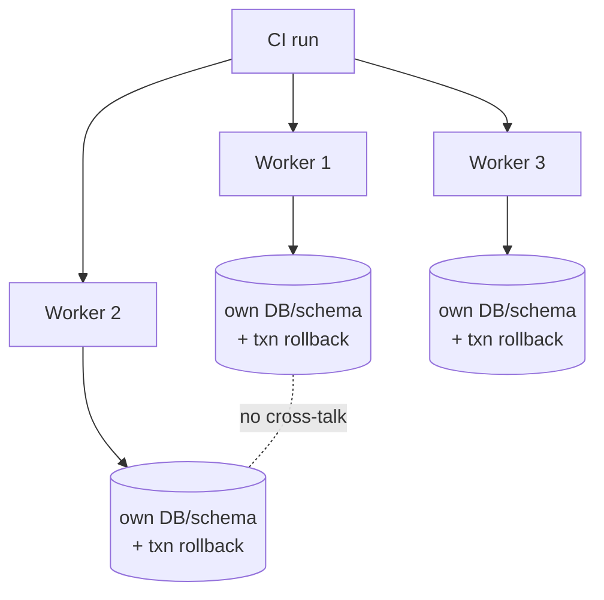
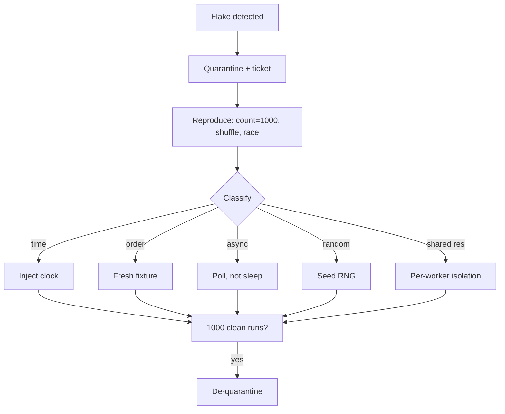

# Test Design & Fixtures — Professional

> **Category:** [Craftsmanship Disciplines](../README.md) — design tests that read clearly, run fast, and manage their own data, so a failing test names a single broken behavior.

> **Prerequisites:** [Junior](junior.md) · [Middle](middle.md) · [Senior](senior.md)
> **Focus:** **Production** — CI, factories, flaky-test triage, team standards

---

## Introduction

> Focus: **production** — what test design costs and protects once a suite runs thousands of times a day in CI, maintained by a whole team.

A single clean test is a craft skill. A *suite* of 20,000 tests that runs on every pull request, stays green, runs in eight minutes, and doesn't page anyone with false failures is an *engineering* artifact with its own operations: data management, flake budgets, parallelism, and the standing maintenance cost of every fixture. At the professional level the questions are:

- How do you get **test data** into CI reliably, fast, and isolated across parallel workers?
- Which **factory libraries** earn their keep, and how do you keep generated data deterministic?
- How do you **triage flaky tests** before they erode trust in the whole suite?
- What **team standards and review rules** keep test design consistent across hundreds of contributors?

The recurring theme: **a test suite is production infrastructure.** It has uptime (the green build), latency (suite runtime), and incidents (flakes). Treat it that way.

---

## Test Data in CI

Local tests are forgiving; CI is not. CI runs in parallel, on ephemeral machines, with no human watching — so test data must be **isolated per worker, built fast, and torn down completely.**

### The hierarchy of approaches (fastest/most-isolated first)

| Approach | Isolation in CI | Speed | Notes |
|---|---|---|---|
| **In-memory builders** | Perfect | Fastest | Default for unit tests; no shared state to collide |
| **Per-test DB transaction (rollback)** | Perfect | Fast | Standard for integration tests against a real DB |
| **Per-worker schema/database** | Perfect | Medium | Each parallel worker gets its own DB/schema; no cross-talk |
| **Truncate-between-tests** | Good | Medium | Simpler than transactions; slower; ordering still matters |
| **Shared seeded DB** | None | Fast to start | The mystery-guest/interdependence trap at scale — avoid |

The two rules that prevent 90% of CI test-data pain:

1. **Each test builds the data it asserts on, visibly** — no reliance on shared seeds (the [mystery guest](senior.md#test-data-for-integration-tests)).
2. **Each parallel worker is isolated** — its own DB/schema, or a transaction it rolls back — so worker 3 can't see worker 7's rows.

---

## Database Fixtures in Practice

The professional standard for integration tests against a real database, combining the techniques from [Senior](senior.md) with CI realities.

### Spin up a real DB, not a fake of it

Use the *same engine* as production (Postgres tests on Postgres, not H2/SQLite), because dialect differences cause false greens. **Testcontainers** is the modern standard — it boots a throwaway Docker DB per test run:

```java
// Java — Testcontainers boots a real Postgres for the suite
@Testcontainers
class OrderRepoIT {
    @Container
    static PostgresSQLContainer<?> db = new PostgreSQLContainer<>("postgres:16");

    @DynamicPropertySource
    static void props(DynamicPropertyRegistry r) {
        r.add("spring.datasource.url", db::getJdbcUrl);
    }

    @Test @Transactional   // each test rolls back → clean DB next test
    void persists_order() {
        var saved = repo.save(anOrder().withTotal(100).build());
        assertThat(repo.findById(saved.id())).isPresent();
    }
}
```

```python
# Python — pytest + testcontainers + transaction-per-test
@pytest.fixture(scope="session")
def db_url():
    with PostgresContainer("postgres:16") as pg:
        run_migrations(pg.get_connection_url())
        yield pg.get_connection_url()

@pytest.fixture
def db(db_url):
    conn = connect(db_url); txn = conn.begin()
    yield conn
    txn.rollback(); conn.close()        # isolation + speed
```

### Migrations, not hand-written DDL

The test schema must come from the **same migrations** as production (Flyway, Liquibase, Alembic, golang-migrate). A test DB built from hand-written `CREATE TABLE` drifts from prod and produces false greens. Run migrations once per session, then transaction-isolate per test.

### The decision: transaction rollback vs truncate

- **Transaction rollback** is faster and cleaner but breaks if the code under test manages its own transactions/commits (you can't roll back a committed transaction).
- **Truncate-between-tests** is slower but works when the SUT commits. Use it for tests that exercise transaction boundaries themselves.

---

## Factory Libraries: FactoryBoy, Faker, and Friends

Hand-written builders are fine until you have hundreds of entities; then a **factory library** removes the boilerplate. The professional skill is using them *without* introducing non-determinism or hidden coupling.

### FactoryBoy (Python) — builders, industrialized

```python
import factory
from factory import Faker, Sequence, SubFactory

class CustomerFactory(factory.Factory):
    class Meta: model = Customer
    id    = Sequence(lambda n: n)                 # deterministic unique id
    name  = Faker("name")                         # realistic-looking value
    email = factory.LazyAttribute(lambda o: f"c{o.id}@test.local")  # deterministic
    tier  = "STANDARD"

class OrderFactory(factory.Factory):
    class Meta: model = Order
    customer = SubFactory(CustomerFactory)        # builds the whole object graph
    total    = 0

# A test states only the relevant field; the rest are valid defaults
def test_premium_discount():
    order = OrderFactory(customer__tier="GOLD", total=100)
    assert discount(order) == 10
```

### Faker — realistic data, but pin the seed

**Faker** generates realistic names/emails/addresses — useful for catching bugs that uniform data hides (Unicode names, long strings). But Faker is *random*, which threatens **Repeatable**. The rule: **seed it.**

```python
# conftest.py — make Faker deterministic across the whole suite
from faker import Faker
@pytest.fixture(autouse=True)
def _seed_faker():
    Faker.seed(0)         # same "random" data every run → repeatable
```

Other ecosystems: **factory_bot** (Ruby), **java-faker / Instancio / EasyRandom** (Java), **gofakeit** (Go). All share the same two risks:

1. **Non-determinism** — seed the generator, or use sequences for anything you assert on.
2. **Over-generation** — a factory that builds a 10-table object graph for a test that needs one field is the [general fixture](senior.md#the-general-fixture-anti-pattern) in library form. Build the minimum; let `SubFactory`/`build_stubbed` create only what's needed.

> **Decision:** use factory libraries for the *defaults and boilerplate*, but assert only on fields you set explicitly. Never assert on a Faker-generated value (`assert user.name == "Allison Hill"`) — that's asserting on randomness.

---

## Flaky-Test Triage

A **flaky test** passes and fails non-deterministically with no code change. Flakes are corrosive: one flaky test in a 10,000-test suite teaches the whole team that "red doesn't mean broken," and then a *real* failure gets a re-run instead of a fix. Flake management is a professional discipline.

### The taxonomy of flakiness

| Cause | Tell | Fix |
|---|---|---|
| **Time dependence** | Fails near midnight, month/year boundaries, DST | Inject a clock; freeze time ([Senior](senior.md)) |
| **Test interdependence / order** | Fails under `-shuffle`, passes in fixed order | Fresh fixture per test; no shared mutable state |
| **Async / timing** | `sleep`-based waits; fails under CI load | Poll for a condition, not a fixed sleep; deterministic schedulers |
| **Randomness** | Fails ~1/N runs | Seed the RNG/faker |
| **Shared external resource** | Fails when parallel workers collide | Per-worker isolation (own DB/port/dir) |
| **Resource leak** | Fails after many tests (fd/conn exhaustion) | Teardown via hooks; close everything |
| **Floating-point / locale** | Fails on a different machine | Tolerance-based asserts; pin locale |

### The triage process

1. **Quarantine, don't ignore.** Move the flake to a quarantined suite so it stops breaking the main build — but **track it**; quarantine is a ward, not a graveyard.
2. **Reproduce deterministically.** Run it 1,000× (`pytest -p no:randomly --count=1000`, `go test -count=1000 -run TestX`), under `-shuffle`, under `-race`. A flake you can't reproduce, you can't fix.
3. **Find the non-determinism** using the taxonomy above — it is *always* one of: time, order, async, randomness, shared resource, leak.
4. **Fix the root cause**, not the symptom. Adding a `sleep` or a retry hides the flake; injecting a clock or isolating the fixture removes it.
5. **De-quarantine** once it survives 1,000 deterministic runs.

> **Never "fix" a flake with an automatic retry as the permanent solution.** Retries mask the flake *and* mask real intermittent bugs (a genuine race that fails 1/50 will pass on retry and ship). A retry budget is a stopgap; the root-cause fix is the deliverable.

---

## The Maintenance Cost of Fixtures

Every fixture is code you maintain forever. The professional accounts for this cost, because a suite can rot from *over-fixturing* as easily as from under-testing.

- **The general fixture taxes every test.** A shared `setUp` that builds six subsystems means a schema change to *one* breaks the setup for *all* tests in the class. Minimal local fixtures localize the blast radius.
- **Builders centralize change.** When a constructor gains a required field, *one* builder default absorbs it — versus editing 200 tests that called the constructor directly. This is the strongest practical argument for builders/factories: they make object construction a single point of change.
- **Seed files are a liability that grows.** "Don't touch row 42" comments accumulate; the seed becomes load-bearing and untouchable. Per-test data has no such gravity.
- **Doubles drift.** A hand-rolled fake needs a [contract test](senior.md#contract-tests-keeping-fakes-honest) or it silently diverges; budget for that.

The rule of thumb: **fixture code should change less often than the tests that use it, and a single production change should touch one fixture, not many tests.** If a routine field addition forces edits across dozens of tests, your construction is decentralized — introduce a builder/factory.

---

## Team Standards for Test Design

Codify these so test quality is uniform across contributors, not dependent on who wrote the test.

1. **AAA/GWT structure, blank-line-separated.** One Act per test.
2. **One naming convention**, enforced in review (e.g., `method_condition_result`).
3. **One concept per test**; split multi-concept tests.
4. **Builders/factories for object construction**; no `new Customer(...)` with 12 positional args in tests.
5. **Each test builds its own data**; no shared seed files for assertions.
6. **No `sleep`** in tests; poll for conditions with a timeout.
7. **Inject time/random/IDs**; no `now()`/`random()`/`uuid4()` in testable logic.
8. **Test-level discipline:** unit (in-memory, fast) by default; integration (real DB, transaction-isolated) sparingly; E2E rarest.
9. **A flake is a P2 bug**, not a "re-run it." Quarantine + ticket.
10. **Branch coverage** on logic-heavy code; coverage is a floor, not a goal.

---

## Parallelism and Isolation in CI

To keep the suite **Fast** at scale, you parallelize — which only works if tests are **Independent**. Parallelism is where latent coupling becomes visible.

```bash
# Go: tests opt into parallelism; the race detector catches shared-state bugs
go test -race -shuffle=on -parallel 8 ./...

# pytest: distribute across workers; randomize order to expose interdependence
pytest -n auto -p randomly

# JUnit 5: parallel execution via configuration
# junit.jupiter.execution.parallel.enabled = true
```

The isolation requirements parallelism forces:

- **No shared mutable global state** — two tests mutating the same singleton/temp file/DB row will collide non-deterministically.
- **Per-worker resources** — unique temp dirs (`t.TempDir()`, `tmp_path`), unique ports, per-worker DB/schema.
- **Order-independence** — run with `-shuffle`/`randomly` in CI so interdependence fails *loudly* in CI rather than silently passing locally.

Parallelism is the ultimate enforcer of F.I.R.S.T.'s **Independent**: a suite that can't run in parallel is telling you its tests are coupled.

---

## Real Incidents

### Incident 1: The midnight flake

A test asserting `created_at == today()` passed all day and failed in the nightly CI run that crossed midnight — the fixture captured "today" at setup, the assertion computed "today" later, on the other side of the date boundary. **Fix:** inject a frozen clock so setup and assertion share one "now." **Lesson:** any test reading the wall clock twice can straddle a boundary.

### Incident 2: Order-dependence hidden for a year

A suite always ran alphabetically; `test_a_seed` populated a shared table that `test_z_query` depended on. Enabling parallel + shuffled execution in CI lit up 40 "new" failures overnight. **Fix:** each test builds its own rows; shared table dropped. **Lesson:** fixed test order hides interdependence until the day you parallelize — run shuffled from day one.

### Incident 3: Faker assertion shipped a broken test

A test did `assert user.full_name == faker.name()` — calling faker *twice* (once in the factory, once in the assert), comparing two different random names. It "passed" only because someone had pinned the seed *and* the two calls happened to align; a Faker upgrade reordered the RNG and the test reddened with no code change. **Fix:** never assert on generated data; assert on fields the test set. **Lesson:** factory output is for *construction*, never for *expectation*.

### Incident 4: The leaked connection that failed test #4,000

An integration fixture opened a DB connection in setup but only closed it on the happy path (not via a hook). After ~4,000 tests the pool exhausted and the rest of the suite failed with "too many connections" — a failure that looked unrelated to any of the failing tests. **Fix:** close via `@AfterEach`/`yield`/`t.Cleanup`. **Lesson:** teardown must run on failure too; a leak surfaces far from its cause.

### Incident 5: Retry masking a real race

A flaky test was "fixed" with an auto-retry. Months later a production race condition (the same one the test intermittently caught) caused an outage. The test *had* been failing 1/50 runs — the retry swallowed it every time. **Fix:** remove the retry, reproduce under `-race`, fix the actual race. **Lesson:** a retry doesn't fix a flake; it deletes the warning that the flake was giving you.

---

## Code Review Standards

A reviewer evaluating a test should check, in order:

1. **Is it AAA/GWT with one Act?** Request splitting if multiple actions.
2. **Does the name state the behavior + condition?** No `test2`, no implementation in the name.
3. **One concept per test?** Multi-concept → split.
4. **Does the test build its own data** (no mystery guest / shared seed)?
5. **Is construction via a builder/factory**, not a 12-arg constructor call?
6. **Any `sleep`, `now()`, `random()`, or unseeded faker?** Reject — inject the seam.
7. **Does teardown run on failure** (hook, not trailing statement)?
8. **Is it the right level** (unit not E2E for unit-testable logic)?
9. **Behavior verification only where the interaction is the requirement?** Flag over-mocking.
10. **Will it pass alone, shuffled, and in parallel?**

### Review comment templates

> "This asserts three concepts (user state, email sent, audit log). Split into three tests so a failure names which broke."

> "`customer 42` comes from a seed file — build the customer in the test so the reader sees why the discount is 10."

> "Replace the `sleep(2)` with a poll-until-condition; this will flake under CI load."

> "Five `verify(mock)...` calls pin the implementation. Assert on the outcome instead so this survives refactoring."

---

## Cheat Sheet

```text
TEST REVIEW CHECKLIST
[ ] AAA / Given-When-Then, blank-line separated, ONE Act
[ ] name = behavior + condition (not impl, not test2)
[ ] one CONCEPT per test
[ ] test builds its own data (no mystery guest / shared seed)
[ ] construction via builder/factory, not 12-arg constructor
[ ] no sleep / now() / random() / unseeded faker (inject the seam)
[ ] teardown via hook (runs on failure too)
[ ] right level: unit > integration > e2e (push fixtures DOWN the pyramid)
[ ] behavior verification only where interaction IS the requirement
[ ] passes alone, shuffled, and in parallel

FLAKE TRIAGE
[ ] quarantine + ticket (don't ignore, don't permanently retry)
[ ] reproduce: -count=1000, -shuffle, -race
[ ] classify: time / order / async / random / shared resource / leak
[ ] fix root cause (inject clock, isolate fixture, poll not sleep)
[ ] de-quarantine after 1000 clean runs
```

---

## Diagrams

### Test data isolation in parallel CI



### Flaky-test triage flow



---

## Related Topics

- **Sibling disciplines:** [The Three Laws of TDD](../01-the-three-laws-of-tdd/junior.md), [Acceptance Test-Driven Development](../06-acceptance-test-driven-development/junior.md), [Refactoring as a Discipline](../03-refactoring-as-a-discipline/junior.md).
- **Tooling:** Testcontainers, FactoryBoy / factory_bot, Faker, pytest-randomly, `go test -race -shuffle`.

---


---

## Check your understanding

1. Explain Test Design & Fixtures — Professional Level in your own words and name the problem it solves.
2. How would you apply the ideas around Table of Contents, Introduction, Test Data in CI in a realistic engineering change?
3. What failure mode or misuse should you look for, and what evidence would reveal it?
4. How would you introduce and govern Test Design & Fixtures — Professional Level across teams through reversible, measurable increments?
5. What observable result would convince you that the approach improved the system?
