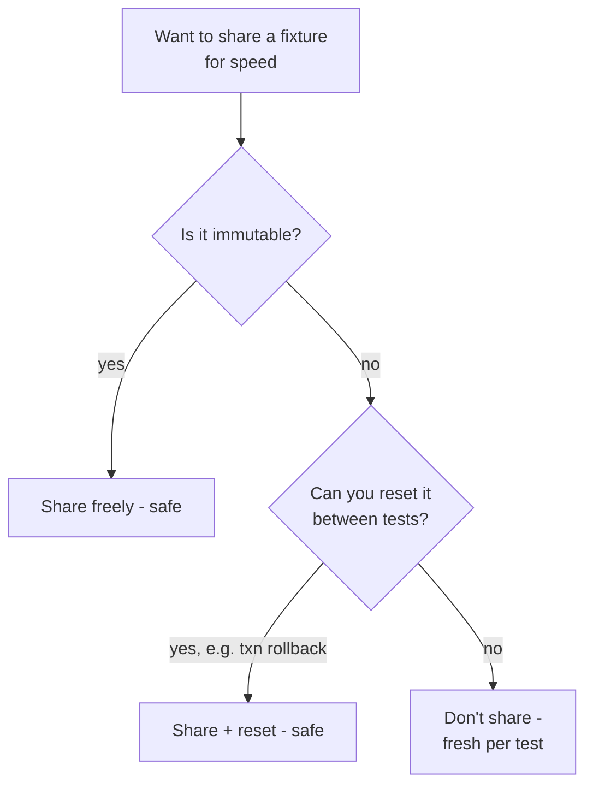
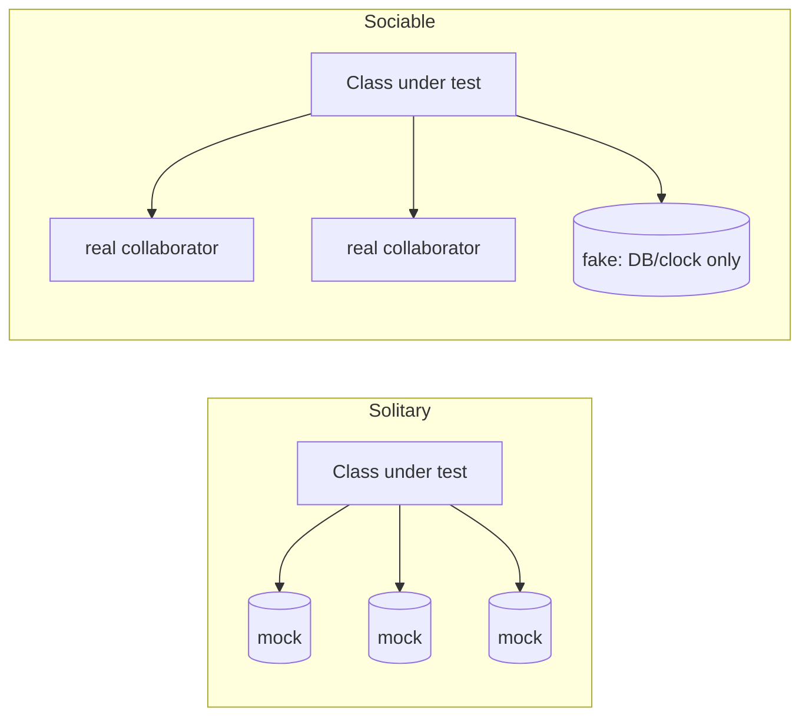

# Test Design & Fixtures — Senior

> **Category:** [Craftsmanship Disciplines](../README.md) — design tests that read clearly, run fast, and manage their own data, so a failing test names a single broken behavior.

> **Prerequisites:** [Junior](junior.md) · [Middle](middle.md)
> **Focus:** **Design trade-offs** and **system-level reasoning**

---

## Table of Contents

1. [Introduction](#introduction)
2. [Fixture Strategy at Scale](#fixture-strategy-at-scale)
3. [Shared vs Fresh Fixtures: The Real Trade-off](#shared-vs-fresh-fixtures-the-real-trade-off)
4. [Test Data for Integration Tests](#test-data-for-integration-tests)
5. [Solitary vs Sociable Tests](#solitary-vs-sociable-tests)
6. [Contract Tests: Keeping Fakes Honest](#contract-tests-keeping-fakes-honest)
7. [Deterministic Time, Randomness, and IDs](#deterministic-time-randomness-and-ids)
8. [Over-Mocking and the Cost of Behavior Verification](#over-mocking-and-the-cost-of-behavior-verification)
9. [The General Fixture Anti-Pattern](#the-general-fixture-anti-pattern)
10. [Test Pyramid and Fixture Weight](#test-pyramid-and-fixture-weight)
11. [Code Examples — Advanced](#code-examples-advanced)
12. [Liabilities](#liabilities)
13. [Diagrams](#diagrams)
14. [Related Topics](#related-topics)

---

## Introduction

> Focus: **design trade-offs** and **system-level reasoning**

At the senior level, test design stops being about a single test and becomes about a **suite as a system** — one that runs thousands of times a day across hundreds of contributors. The questions change:

1. **Fixture economics** — every shared fixture trades isolation for speed. When is that trade worth it, and how do you keep it from quietly coupling the suite?
2. **Test scope** — should a test stub out its collaborators (solitary) or use the real ones (sociable)? The answer shapes what breaks when, and how much your tests pin implementation versus behavior.
3. **Determinism** — time, randomness, and IDs are the three sources of flakiness, and a senior designs them out at the *seam*, not patches them per test.
4. **Honest doubles** — a fake is only useful while it behaves like the real thing; keeping it honest is a contract-testing problem.

The unifying idea: **the suite has its own non-functional requirements** — speed, isolation, determinism, maintainability — and they trade off against each other exactly like a production system's do.

---

## Fixture Strategy at Scale

A 2,000-test suite has a *fixture strategy* whether you designed one or not. The default — fresh fixture per test — is correct until setup cost makes the suite too slow to run, at which point teams reach for shared fixtures and accidentally re-couple everything. The senior job is to make this trade explicit.

Four strategies, from most isolated to most shared:

| Strategy | Isolation | Speed | Use when |
|---|---|---|---|
| **Fresh transient** (per-test, in-memory) | Total | Fast | Default for unit tests |
| **Lazy / on-demand** (built when first needed) | High | Faster | Expensive setup not every test needs |
| **Shared immutable** (`@BeforeAll`, read-only) | High (if truly immutable) | Fast | Costly to build, never mutated |
| **Shared with reset** (built once, reset between tests) | Medium | Fast | Real DB/container; reset via transaction rollback |

The pivot point is almost always **I/O cost**: an in-memory fixture is cheap enough to rebuild per test, so you never share it. A Docker container, a Spring context, or a real DB connection costs seconds to build, so you share it — and pay back the lost isolation with a *reset mechanism* (next sections).

---

## Shared vs Fresh Fixtures: The Real Trade-off

The naive framing is "fresh is safe, shared is fast." The senior framing is sharper:

> **A shared fixture is safe if and only if it is immutable, or reset to a known state between tests. The danger is not sharing — it's sharing *mutable* state with no reset.**

The failure mode of shared mutable fixtures is **test interdependence**: test B passes only because test A left the fixture in a certain state. Symptoms:

- Tests pass together but fail when run alone (`pytest path::test_b`).
- Tests pass in one order, fail when the runner shuffles them (`go test -shuffle=on`, `pytest-randomly`).
- A "flaky" test that's really order-dependent.

The defenses, in order of preference:

1. **Make the shared fixture immutable.** A read-only `ApiClient`, a constant config — share freely; nothing can corrupt it.
2. **Reset between tests.** For a real DB, the canonical reset is a **transaction rolled back** after each test, or truncating tables in teardown.
3. **Don't share** — if neither is cheap, eat the rebuild cost and stay fresh.

```python
# Shared DB connection (expensive), but each test runs in a rolled-back transaction
@pytest.fixture(scope="session")
def engine():
    return create_engine(TEST_DB_URL)        # built ONCE — expensive

@pytest.fixture
def db(engine):
    conn = engine.connect()
    txn = conn.begin()
    yield conn                               # test runs inside the transaction
    txn.rollback()                           # reset: every change is undone
    conn.close()
```

This pattern — **share the expensive connection, isolate via per-test transaction** — is the standard way to get both speed *and* independence from a real database. Each test sees a clean DB; nothing persists; setup cost is paid once.

---

## Test Data for Integration Tests

In-memory unit tests build fixtures with builders. Integration tests must put data into a *real* store, which raises problems unit tests never face.

### The three approaches

| Approach | How | Trade-off |
|---|---|---|
| **Build per test** (preferred) | Insert exactly the rows this test needs, via builders/factories | Slowest but maximally clear and isolated |
| **Seed scripts / SQL dumps** | Load a fixed dataset before the suite | Fast but creates the **mystery guest** (below) |
| **Production snapshot** | Anonymized copy of prod data | Realistic but huge, slow, privacy-fraught, non-deterministic |

### The mystery guest

The **mystery guest** anti-pattern: a test depends on data it didn't create and that isn't visible in the test. A test reads "customer 42" from a shared seed file — but the test body never shows what customer 42 *is*, so a reader can't tell why the assertion expects what it does, and a change to the seed file silently breaks unrelated tests.

```python
# MYSTERY GUEST — where did customer 42 come from? what's their balance?
def test_premium_discount():
    order = place_order(customer_id=42, total=100)   # 42 defined in some seed.sql
    assert order.discount == 10                       # why 10? invisible to the reader

# NO MYSTERY — the test creates and shows exactly what it relies on
def test_premium_discount(db):
    customer = a_customer().premium().build()
    db.save(customer)
    order = place_order(customer_id=customer.id, total=100)
    assert order.discount == 10   # premium → 10% is now obvious from the fixture
```

The cure is **each test builds its own data, visibly.** Shared seed data is the source of half of all integration-test pain: mystery guests, interdependence, and the brittleness of "don't touch row 42, three tests depend on it."

---

## Solitary vs Sociable Tests

A unit test must isolate the **unit** — but what *is* the unit? Two schools (Fowler's terms):

- **Solitary (London / mockist):** the unit is *one class*. Every collaborator is replaced with a double. The test verifies the class in total isolation, often via behavior verification (mocks).
- **Sociable (classical / Detroit):** the unit is *one behavior*, which may span several real collaborating objects. Only the *awkward* dependencies (DB, network, clock) are doubled; in-process collaborators are used for real.

```python
# SOLITARY — every collaborator mocked; tests THIS class's orchestration
def test_checkout_solitary():
    inventory = Mock(); pricing = Mock(); pricing.price.return_value = 100
    inventory.reserve.return_value = True
    checkout = Checkout(inventory, pricing)
    checkout.run(cart)
    inventory.reserve.assert_called_once()   # behavior verification

# SOCIABLE — real pricing & inventory (pure, in-memory); only the DB is faked
def test_checkout_sociable():
    checkout = Checkout(InMemoryInventory(stocked=["book"]), RealPricing())
    receipt = checkout.run(cart_with("book"))
    assert receipt.total == 12               # state verification on the outcome
```

| | Solitary (mockist) | Sociable (classical) |
|---|---|---|
| Unit = | one class | one behavior across collaborators |
| Doubles | everything | only awkward deps (I/O, time) |
| Verification | mostly behavior (mocks) | mostly state (real objects) |
| Breaks when | any collaborator's *interface* changes | a collaborator's *behavior* changes |
| Refactor resistance | low — pins call structure | high — pins outcomes |
| Failure localization | precise (one class) | broader (which collaborator?) |

The senior position is usually **sociable by default, solitary at the seams.** Mock the things that are slow, non-deterministic, or have side effects (DB, HTTP, clock); use real objects for fast, pure, in-process logic. This keeps tests refactor-resistant (they assert outcomes, not call sequences) while staying fast and deterministic. Pure-mockist suites tend to pin implementation so tightly that every refactor reds the suite even when behavior is unchanged — the over-mocking trap below.

---

## Contract Tests: Keeping Fakes Honest

A fake is fast and convenient, but it's a *lie* the moment it diverges from the real thing. An `InMemoryUserRepo` that doesn't enforce unique emails lets a test pass that production rejects — a false green, the worst kind of test failure (one that *doesn't* happen).

The fix is a **contract test**: a single test suite, run against *both* the real implementation and the fake, asserting they behave identically.

```python
# One abstract suite of behaviors a UserRepo MUST satisfy
class UserRepoContract:
    def make_repo(self): raise NotImplementedError

    def test_get_returns_saved_user(self):
        repo = self.make_repo()
        repo.save(User(id=1, email="a@x.com"))
        assert repo.get(1).email == "a@x.com"

    def test_duplicate_email_rejected(self):
        repo = self.make_repo()
        repo.save(User(id=1, email="a@x.com"))
        with pytest.raises(DuplicateEmail):
            repo.save(User(id=2, email="a@x.com"))   # contract: emails are unique

# Run the SAME contract against both implementations
class TestPostgresUserRepo(UserRepoContract):
    def make_repo(self): return PostgresUserRepo(test_db())

class TestInMemoryUserRepo(UserRepoContract):
    def make_repo(self): return InMemoryUserRepo()     # the fake MUST pass too
```

If the in-memory fake forgets to enforce unique emails, `TestInMemoryUserRepo` fails — catching the divergence before it produces false greens in the fast unit suite. Contract tests are how you earn the right to use fakes in your fast tests: they prove the fake honors the same contract as the real dependency. (This is the same idea as **consumer-driven contract tests** between services, scaled down to a single interface.)

---

## Deterministic Time, Randomness, and IDs

Three sources of non-determinism break the **R** in F.I.R.S.T. — and all three have the same cure: **inject the source through a seam, then control it in tests.**

### Time

```python
# UNTESTABLE — reads the wall clock directly; behavior changes by time of day
class Invoice:
    def is_overdue(self):
        return self.due_date < datetime.now()   # hidden dependency on "now"

# TESTABLE — time is a dependency, injected and controllable
class Invoice:
    def is_overdue(self, clock):
        return self.due_date < clock.now()

def test_overdue():
    fixed = FixedClock(datetime(2025, 1, 2))
    invoice = Invoice(due_date=datetime(2025, 1, 1))
    assert invoice.is_overdue(fixed)             # deterministic, always
```

```go
// Go — inject a clock function; default to time.Now, override in tests
type Invoice struct {
    Due time.Time
    Now func() time.Time   // seam
}
func (i Invoice) Overdue() bool { return i.Due.Before(i.Now()) }

func TestOverdue(t *testing.T) {
    fixed := func() time.Time { return time.Date(2025,1,2,0,0,0,0,time.UTC) }
    inv := Invoice{Due: time.Date(2025,1,1,0,0,0,0,time.UTC), Now: fixed}
    if !inv.Overdue() { t.Fatal("want overdue") }
}
```

### Randomness and IDs

The same seam applies: don't call `random()` or `uuid4()` deep in business logic. Inject a `Random` or an `IdGenerator` so tests can supply a deterministic sequence.

```java
// Inject an IdGenerator; production uses UUID, tests use a counter
record Order(String id, ...) {}
class OrderFactory {
    private final Supplier<String> ids;
    OrderFactory(Supplier<String> ids) { this.ids = ids; }
    Order create(...) { return new Order(ids.get(), ...); }
}
// test: new OrderFactory(() -> "fixed-id-1")  → assertions can name the id
```

The principle: **non-determinism is a dependency.** Time, randomness, and IDs are inputs to your logic; hiding them inside calls to `now()`/`random()`/`uuid4()` makes them un-injectable and your tests flaky. Push them to a seam at the boundary and the whole core becomes deterministic and testable.

---

## Over-Mocking and the Cost of Behavior Verification

Behavior verification (mocks/spies) is powerful and dangerous. Every `verify(mock).method()` you write pins a *specific interaction* — so the test breaks if you refactor the SUT to achieve the same outcome a different way.

```python
# OVER-MOCKED — pins the exact call sequence; refactor-hostile
def test_process():
    repo = Mock(); cache = Mock(); logger = Mock()
    service = Service(repo, cache, logger)
    service.process(42)
    repo.find.assert_called_once_with(42)            # pins HOW
    cache.put.assert_called_once()                   # pins HOW
    logger.info.assert_called_once()                 # pins an implementation detail!
    # If you add a second log line or reorder, this test reds — though behavior is identical.

# OUTCOME-FOCUSED — asserts WHAT happened; survives refactoring
def test_process():
    repo = InMemoryRepo(seed=[Item(42, "ok")])
    service = Service(repo, NullCache(), NullLogger())
    result = service.process(42)
    assert result.status == "processed"              # the behavior that matters
```

Rules for keeping behavior verification healthy:

1. **Mock at architectural boundaries, not internal helpers.** Mock the DB, the payment gateway, the email service — things with real side effects. Don't mock the pure functions you'd happily run for real.
2. **Verify interactions only when the interaction *is* the requirement.** "Charge the card exactly once" → verify. "Log a debug line" → don't.
3. **Count your `verify`/`assert_called` calls per test.** Many of them is the over-mocking smell; the test now describes implementation, not behavior, and will cry wolf on every refactor.

A suite that turns red on every behavior-preserving refactor is *anti-testing* — it punishes exactly the improvements [refactoring](../03-refactoring-as-a-discipline/junior.md) depends on. Over-mocking is the most common cause.

---

## The General Fixture Anti-Pattern

The **general fixture** (a.k.a. "obscure test" via an oversized setup): one big `setUp` that builds *everything* any test in the class might need, so every test pays for data it doesn't use and the test body no longer shows what's relevant.

```python
# GENERAL FIXTURE — what does THIS test actually depend on?
@pytest.fixture
def world():
    return {
        "user": make_user(), "admin": make_admin(), "orders": make_orders(50),
        "products": make_catalog(), "cart": make_cart(), "promo": make_promo(),
    }   # 6 subsystems built for every test, most unused per test

def test_user_can_login(world):
    assert login(world["user"])   # needed 1 of 6 things; the rest is dead weight + slow
```

Two costs:
- **Speed:** every test builds all six, violating **Fast**.
- **Obscurity:** the reader can't tell that `test_user_can_login` only needs `user` — the relevant fixture is buried in a pile of irrelevant ones.

The cure: **minimal, local fixtures.** Each test (or small group) builds *only* what it uses, via builders, so the fixture *is* the documentation of what the test depends on. A general fixture is a shared-fixture decision made by accident; make it on purpose and keep it small.

---

## Test Pyramid and Fixture Weight

Fixture weight correlates with test level, and the **test pyramid** tells you how many of each to write:

```
        /\        Few:  E2E / UI tests  — heaviest fixture (whole system, real DB, browser)
       /  \       Some: Integration     — medium fixture (real DB, faked externals)
      /----\
     /      \     Many: Unit tests       — lightest fixture (in-memory builders, fast)
    /--------\
```

The senior insight: **push fixture weight down the pyramid.** A behavior testable at the unit level with an in-memory builder should *not* be tested through a real DB and HTTP stack — that's slower, flakier, and harder to diagnose. Reserve heavy fixtures (real DB, containers, browsers) for the few tests that genuinely exercise integration. An inverted pyramid — mostly slow, heavy-fixture tests — is the single most common reason a suite becomes too slow to run, which kills **Fast**, which kills adoption.

---

## Code Examples — Advanced

### Builder + faker for realistic-but-deterministic data (Python)

```python
import factory   # factory_boy

class UserFactory(factory.Factory):
    class Meta: model = User
    id    = factory.Sequence(lambda n: n)          # deterministic, unique per build
    email = factory.LazyAttribute(lambda o: f"user{o.id}@test.local")
    tier  = "STANDARD"

# Each test varies only what it cares about; everything else is a valid default
def test_gold_tier_gets_discount():
    user = UserFactory(tier="GOLD")
    assert discount_for(user) == 0.1
```

`Sequence` gives unique, *deterministic* values — the realism of varied data without the non-determinism of `random()`. (More on factory libraries in [Professional](professional.md).)

### Transaction-per-test isolation with a real DB (Java/Spring)

```java
@DataJpaTest                  // configures an in-memory or test DB
@Transactional                // each test runs in a transaction...
class OrderRepositoryTest {
    @Autowired OrderRepository repo;

    @Test
    void saves_and_finds_order() {
        Order saved = repo.save(anOrder().withTotal(100).build());
        assertThat(repo.findById(saved.id())).contains(saved);
    }   // ...rolled back automatically → next test sees a clean DB
}
```

### A fake honored by a contract (Go)

```go
// Contract: any Store must satisfy these behaviors
func StoreContract(t *testing.T, newStore func() Store) {
    t.Run("get after put", func(t *testing.T) {
        s := newStore()
        s.Put("k", "v")
        if got, _ := s.Get("k"); got != "v" { t.Errorf("got %q", got) }
    })
    t.Run("missing key errors", func(t *testing.T) {
        if _, err := newStore().Get("nope"); err == nil { t.Error("want error") }
    })
}

func TestRedisStore(t *testing.T)    { StoreContract(t, func() Store { return NewRedisStore(testRedis()) }) }
func TestInMemoryStore(t *testing.T) { StoreContract(t, func() Store { return NewInMemoryStore() }) }  // fake must comply
```

---

## Liabilities

### Liability 1: Speed bought with hidden coupling

A team shares a mutable fixture to speed up a slow suite. It works — until a `-shuffle` run exposes order-dependence and a week is lost debugging "flaky" tests that are actually interdependent. **Speed via sharing is only safe with immutability or reset.**

### Liability 2: Fakes that drift into false greens

An in-memory fake gradually diverges from the real dependency (missing a constraint, different null handling). Unit tests stay green while production breaks. **A fake without a contract test is a time bomb.**

### Liability 3: Mock-pinned implementation

A heavily-mocked suite reds on every refactor. The team learns that refactoring "breaks tests," so they stop refactoring — and the code rots. **Over-mocking taxes exactly the improvements you most want to make.**

### Liability 4: The inverted pyramid

Most behaviors tested through slow, heavy-fixture E2E paths. The suite takes 40 minutes, so it runs only in CI, so feedback is slow, so bugs land. **Fixture weight pushed up the pyramid kills Fast and, with it, adoption.**

---

## Diagrams

### Shared-fixture safety decision



### Solitary vs sociable scope



---

## Related Topics

- **Sibling disciplines:** [The Three Laws of TDD](../01-the-three-laws-of-tdd/junior.md), [Acceptance Test-Driven Development](../06-acceptance-test-driven-development/junior.md), [Refactoring as a Discipline](../03-refactoring-as-a-discipline/junior.md).
- **Seams make doubles possible:** dependency injection of clock/random/repo.

---


---

## Check your understanding

1. Explain Test Design & Fixtures — Senior Level in your own words and name the problem it solves.
2. How would you apply the ideas around Table of Contents, Introduction, Fixture Strategy at Scale in a realistic engineering change?
3. What failure mode or misuse should you look for, and what evidence would reveal it?
4. How would you validate a system-level decision about Test Design & Fixtures — Senior Level under uncertainty?
5. What observable result would convince you that the approach improved the system?
