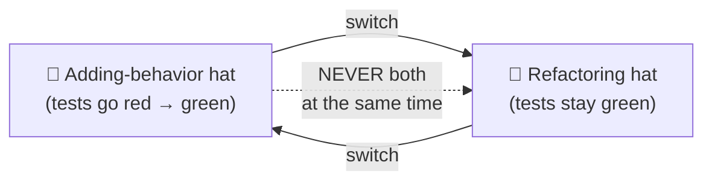
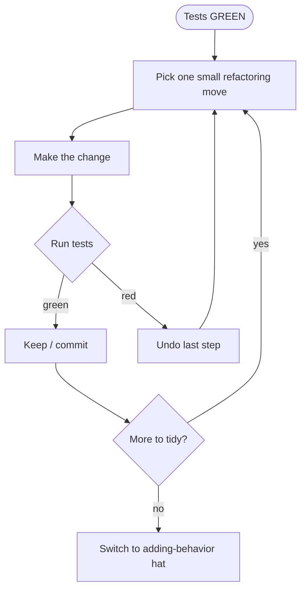

# Refactoring as a Discipline — Junior

> **Category:** [Craftsmanship Disciplines](../README.md) — refactoring as a continuous, behavior-preserving habit done under passing tests, not a big-bang rewrite.

---

## Introduction

> Focus: **What is it?** and **How to use it?**

**Refactoring** is changing the *internal structure* of code **without changing its external behavior**. That second half is the whole definition. If the behavior changed — even by accident — it was not a refactoring. It was an edit, and possibly a bug.

Martin Fowler, who wrote the book on it, defines it precisely:

> *"Refactoring is a disciplined technique for restructuring an existing body of code, altering its internal structure without changing its external behavior."*

Two words there are easy to skip and carry all the weight:

- **Disciplined.** Refactoring is not "cleaning up code whenever you feel like it." It is a *named set of small, mechanical moves* (extract this function, rename this variable, inline that), each one small enough to be obviously safe, performed in a specific rhythm, **under tests that prove behavior didn't change.**
- **Without changing external behavior.** The tests that passed before must still pass after. The user sees no difference. The API returns the same answers. Only the *shape of the code* improved.

This topic is about refactoring as a **discipline** — the *why, when, and rhythm* of doing it continuously — not a catalog of every move. (There's a separate, broader area for the move catalog; we reference it conceptually.) The discipline is what separates engineers who keep a codebase healthy for years from those who let it rot until someone demands a doomed "rewrite."

### Why this matters

Code is read far more often than it is written, and it is *changed* over and over after it first works. Every change is easier in clean code and harder in tangled code. Refactoring is how you keep code changeable. The alternative — never refactoring — has a predictable arc:

```
clean code → "just ship it" → a little mess → more mess → "we can't touch that file"
            → "we need to rewrite the whole thing" → rewrite fails → mess again
```

Continuous refactoring breaks that arc. You pay down a little mess constantly, in small safe steps, so it never compounds into the kind of debt that gets a system rewritten.

---

## Prerequisites

- **Required:** You can write and run an automated test (any framework) and read a green/red result.
- **Required:** Basic functions, variables, and conditionals in one language.
- **Helpful:** Exposure to [The Three Laws of TDD](../01-the-three-laws-of-tdd/junior.md) — refactoring is the third step of the red-green-refactor cycle.
- **Helpful:** A feel for "this code is hard to read," even if you can't yet name *why*. That instinct is the seed of [code smells](#core-concepts).

---

## Glossary

| Term | Definition |
|------|-----------|
| **Refactoring** | Changing code's internal structure without changing its external behavior. |
| **Behavior-preserving** | The defining property: same inputs produce same outputs and side effects, before and after. |
| **Big-bang rewrite** | Throwing code away and rebuilding from scratch. The opposite of refactoring — and usually a disaster. |
| **The two hats** | At any moment you are either *adding behavior* OR *refactoring* — never both at once. |
| **Green bar** | A passing test suite. Refactoring is done *only* on a green bar. |
| **Red-green-refactor** | The TDD cycle: write a failing test (red), make it pass (green), then refactor. |
| **Code smell** | A surface symptom that hints at a deeper structural problem; a *trigger* to consider refactoring. |
| **Boy Scout Rule** | "Leave the code a little cleaner than you found it" — refactor opportunistically as you pass through. |
| **Small safe step** | A change small enough that you're confident it preserves behavior, run tests after each one. |
| **Characterization test** | A test that *pins down* the current behavior of legacy code so you can refactor it safely. |

---

## Core Concepts

### 1. Behavior preservation is the contract

The single rule of refactoring: **the observable behavior must not change.** "Observable" means anything a caller, user, or downstream system can detect — return values, thrown exceptions, written files, sent messages, database rows. If any of those change, you didn't refactor; you altered the program.

This is why **tests come first**. A passing test suite is your *evidence* that behavior is unchanged. Without it, you're not refactoring — you're *hoping*.

```
refactoring  =  improve structure  +  PROVE behavior unchanged (tests stay green)
```

### 2. Refactoring is *not* a rewrite

| Refactoring | Rewrite |
|---|---|
| Small steps, minutes apart | Big bang, weeks/months |
| Tests green the whole way | Tests broken until "done" |
| Reversible at any point | All-or-nothing |
| Behavior preserved by construction | Behavior re-derived, bugs reintroduced |
| Ships continuously | Ships once, late, risky |

The seductive lie is "this code is so bad we should just rewrite it." Rewrites discard the thousands of bug fixes and edge cases baked into the old code (Chesterton's Fence at scale). Refactoring keeps that knowledge and reshapes around it.

### 3. Code smells are triggers, not rules

A **code smell** is a symptom — *"this might be a problem"* — not a verdict. Long function, duplicated code, a name that lies, a giant `if/else`, a comment explaining what the code does (instead of why). Smells don't say "you *must* refactor." They say "look here; there may be a better structure." See [Code Smell Detection](#further-reading).

### 4. The refactor step happens on green

You refactor **only when the tests pass.** A green bar means "behavior is correct right now." You change structure, re-run, and if it's still green, behavior is still correct. If it goes red, you broke something — undo the last small step and try again. This is the **safety harness** that makes refactoring fast and fearless.

### 5. Small, safe steps

The discipline is *not* "rip the function apart and fix it up." It's: make one tiny change (extract two lines into a function), run the tests, commit if you like, repeat. Each step is small enough that you'd be *surprised* if it broke anything. When a step *does* break something, the cause is obvious because you only changed one tiny thing.

---

## Real-World Analogies

| Concept | Analogy |
|---|---|
| **Refactoring** | Tidying a kitchen *while* cooking — wiping the counter, putting away a knife — so the next dish is easier. You don't stop cooking to gut-renovate the kitchen. |
| **Behavior preservation** | Renovating a room without moving the load-bearing walls. It looks better; the house still stands the same way. |
| **The two hats** | A surgeon either *operates* or *cleans the table* — never holds a scalpel in one hand and a mop in the other mid-incision. |
| **Green bar** | A climber's rope and anchors. You only make the next move once you're clipped in. The rope doesn't move you up; it makes falling survivable. |
| **Big-bang rewrite** | Demolishing your house to fix a leaky faucet — and discovering the new house has all the old leaks plus new ones. |
| **Boy Scout Rule** | Picking up one piece of litter every time you walk through the park. The park stays clean with no special cleanup day. |

---

## Mental Models

**The intuition:** *"Two hats, one rope. Wear one hat at a time, and never let go of the rope (the green bar)."*

```
        ┌──────────────────────────────────────┐
        │   HAT 1: ADD BEHAVIOR                 │
        │   - write a failing test (RED)        │
        │   - make it pass (GREEN)              │
        │   - tests now PROVE new behavior      │
        └──────────────────────────────────────┘
                         │  (switch hats — never both)
                         ▼
        ┌──────────────────────────────────────┐
        │   HAT 2: REFACTOR                     │
        │   - tests are GREEN before you start  │
        │   - change structure, keep behavior   │
        │   - run tests after each small step   │
        │   - tests STAY green = proof it's safe │
        └──────────────────────────────────────┘
```

The rope (the test suite) is what makes hat-switching cheap. Without tests, you can't tell whether your "refactor" changed behavior, so every structural change becomes a gamble. With tests, the gamble disappears: green stays green, or it doesn't and you undo.

---

## The Two Hats

This is the most important single idea at the junior level, from Kent Beck:

> *"When you use refactoring to develop software, you divide your time between two distinct activities: adding function and refactoring. When you add function, you shouldn't be changing existing code; you're just adding new capabilities... When you refactor, you make a point of not adding function; you only restructure the code. You'll find yourself swapping hats frequently, but it's important that you only wear one at a time."*



### Why one hat at a time?

Because the two activities have **opposite relationships to your tests**:

- **Adding behavior** *changes* what the tests assert. A new feature means a new test goes from red to green. The test suite is *supposed* to change.
- **Refactoring** *must not* change what the tests assert. The same tests pass before and after. The test suite is *supposed* to stay identical and stay green.

If you do both at once, you lose the signal. A failing test could mean "my new feature has a bug" *or* "my refactor broke something" — and you can't tell which. Wearing one hat at a time keeps every test failure unambiguous: under the refactor hat, *any* red is your refactor's fault, and you undo.

### How to know which hat you're wearing

Ask: *"Am I trying to make the program do something new, or make the code easier to work with?"* You can only honestly answer one at a time. If you catch yourself "just adding this one feature while I'm in here cleaning up," **stop** — that's wearing both hats, and it's how refactors smuggle in bugs.

---

## A First Worked Refactor

Let's do the discipline end to end on a tiny example. We have a function that prices an order with a discount. It works, but it's tangled.

### Step 0 — there is a passing test (the green bar)

```python
# test_pricing.py
def test_price_with_member_discount():
    order = Order(subtotal=100, customer=Customer(is_member=True))
    assert price(order) == 90.0   # 10% member discount

def test_price_without_discount():
    order = Order(subtotal=100, customer=Customer(is_member=False))
    assert price(order) == 100.0
```

Both tests pass. **We are on green.** We may now refactor.

### The code we want to improve

```python
def price(order):
    if order.customer is not None:
        if order.customer.is_member:
            return order.subtotal - (order.subtotal * 0.10)
        else:
            return order.subtotal
    else:
        return order.subtotal
```

Smells: nested conditionals, a magic number `0.10`, and the discount logic is buried.

### Step 1 — extract the discount rate (small step, run tests)

```python
MEMBER_DISCOUNT_RATE = 0.10

def price(order):
    if order.customer is not None:
        if order.customer.is_member:
            return order.subtotal - (order.subtotal * MEMBER_DISCOUNT_RATE)
        else:
            return order.subtotal
    else:
        return order.subtotal
```

Run the tests. **Green.** The magic number now has a name. Behavior unchanged.

### Step 2 — extract the discount calculation into a function (run tests)

```python
MEMBER_DISCOUNT_RATE = 0.10

def member_discount(subtotal):
    return subtotal * MEMBER_DISCOUNT_RATE

def price(order):
    if order.customer is not None:
        if order.customer.is_member:
            return order.subtotal - member_discount(order.subtotal)
        else:
            return order.subtotal
    else:
        return order.subtotal
```

Run the tests. **Green.** This is **Extract Function**, the most common refactoring move.

### Step 3 — flatten the conditionals (run tests)

```python
def price(order):
    if order.customer is None:
        return order.subtotal
    if not order.customer.is_member:
        return order.subtotal
    return order.subtotal - member_discount(order.subtotal)
```

Run the tests. **Green.** This is **Replace Nested Conditional with Guard Clauses** (see Guard Clauses).

### The result

From a four-level pyramid with a magic number to three flat guards and a named calculation — **and every test passed at every step.** That's the discipline: structure improved, behavior provably unchanged, and at no point was the code broken.

> Notice what we did *not* do: we never added a new discount type, never changed a return value, never touched the tests. That would have been the *other* hat.

---

## Pros & Cons

| Pros | Cons |
|------|------|
| Keeps code changeable; future features stay cheap | Takes time *now* (pays off later, not immediately) |
| Bugs get easier to find in clean code | Requires tests first; untested code is dangerous to refactor |
| Avoids the doomed big-bang rewrite | Tempting to over-do ("gold-plating") |
| Small steps mean small, obvious failures | Without discipline, "refactoring" can silently change behavior |
| Improves understanding as you go | Hard to "sell" as a separate line item (it isn't one — see [Professional](professional.md)) |

### When to refactor:
- As the **third step of every TDD cycle** (red → green → refactor).
- When you touch code to add a feature and find it hard to work with (Boy Scout Rule).
- When a [code smell](#core-concepts) makes the next change harder than it should be.

### When NOT to refactor (preview, deepened in [Senior](senior.md)):
- When there are **no tests** and you can't write [characterization tests](#glossary) first.
- When the code is about to be **deleted** anyway.
- When you're under the **adding-behavior hat** — finish the feature, *then* switch hats.
- When the "refactor" is really a rewrite in disguise.

---

## Use Cases

- **The refactor step in TDD** — every green bar is an invitation to tidy.
- **Preparing for a feature** — "make the change easy, then make the easy change" (Kent Beck). Refactor first so the feature drops in cleanly.
- **Understanding code** — rename and extract as you read, so your understanding is captured in the code, not lost.
- **Killing duplication** — extract the repeated logic into one place.
- **Taming a long method** — extract cohesive chunks into well-named functions.
- **Opportunistic cleanup** — the Boy Scout Rule, applied every time you pass through a file.

---

## Code Examples

### Java — Extract Function, under a test

```java
// Test that must stay green throughout:
// assertEquals(285, invoice.amountFor(order));

// Before: a long method doing several things
double amountFor(Order o) {
    double base = o.quantity() * o.itemPrice();
    double discount = Math.max(0, o.quantity() - 500) * o.itemPrice() * 0.05;
    double shipping = Math.min(base * 0.10, 100.0);
    return base - discount + shipping;
}

// After: each concept named, behavior identical
double amountFor(Order o) {
    return basePrice(o) - quantityDiscount(o) + shipping(o);
}
private double basePrice(Order o)        { return o.quantity() * o.itemPrice(); }
private double quantityDiscount(Order o)  { return Math.max(0, o.quantity() - 500) * o.itemPrice() * 0.05; }
private double shipping(Order o)          { return Math.min(basePrice(o) * 0.10, 100.0); }
```

Each extraction is one small step; run the test after each. The arithmetic is unchanged, so the test stays green.

### Python — Rename for honesty

```python
# Before: the name lies — it doesn't "check", it charges
def check(o, c):
    c.balance -= o.total
    return c.balance

# After: name tells the truth (Rename refactoring)
def charge_customer(order, customer):
    customer.balance -= order.total
    return customer.balance
```

Renaming is a refactoring. A truthful name removes the need for a comment and prevents the next reader's confusion. Modern IDEs do this safely across the whole codebase (see [Middle](middle.md)).

### Go — Inline a needless variable

```go
// Before: a variable that adds no clarity
func discountedTotal(o Order) float64 {
    base := o.Subtotal
    discounted := base * 0.9
    return discounted
}

// After: inline the trivially-named temporaries
func discountedTotal(o Order) float64 {
    return o.Subtotal * 0.9
}
```

**Inline Variable** is a refactoring too — refactoring isn't only "extract." Sometimes the cleaner structure has *fewer* parts. Run tests; behavior is identical.

---

## Best Practices

1. **One hat at a time.** Add behavior *or* refactor — never both. Switch deliberately.
2. **Refactor only on green.** A passing suite is your license and your safety net.
3. **Smallest possible steps.** Extract one function, run tests, repeat. Small steps = small, obvious failures.
4. **Run the tests after every step**, not at the end. The faster the suite, the faster you can refactor.
5. **Commit frequently** so any green state is a safe restore point (see [Middle](middle.md)).
6. **Use automated refactorings** (IDE rename/extract) — they're behavior-preserving by construction.
7. **Treat smells as triggers, not commands.** Investigate; refactor only if it makes the next change easier.
8. **Leave it cleaner than you found it** (Boy Scout Rule) — but don't gold-plate.

---

## Edge Cases & Pitfalls

- **No tests = no refactoring.** Without tests you can't prove behavior is preserved. Write [characterization tests](../02-test-design-and-fixtures/junior.md) first (see [Senior](senior.md)). "Refactoring" untested code is just editing and praying.
- **A "refactor" that changes behavior** is a bug, even a "harmless" one (rounding, ordering, a fixed typo in output). If output changes, it's not a refactoring — and a downstream system may depend on the old behavior.
- **Refactoring while adding a feature** muddies which change caused a failure. Separate them.
- **Big "cleanup" commits** that touch 40 files are un-reviewable and risky. Keep refactors small and separately committed.
- **Refactoring on a red bar** — you can't tell your change from the pre-existing failure. Get to green first.

---

## Common Mistakes

1. **Wearing both hats.** "I'll just clean this up while I add the feature." This is how refactors ship bugs.
2. **Calling a rewrite a "refactor."** Throwing the code away is not refactoring; it's the opposite.
3. **Refactoring without tests** and trusting that you "didn't change anything."
4. **Steps too big** — refactoring a whole class in one move, so when it breaks you have no idea where.
5. **Mixing a refactor commit with a feature commit**, making both impossible to review or revert cleanly.
6. **Gold-plating** — refactoring code that's about to be deleted, or polishing far past "clean enough."
7. **Treating refactoring as a separate ticket** to be scheduled "later." Later never comes; refactoring is part of the work (see [Professional](professional.md)).

---

## Tricky Points

- **"Refactoring" has been diluted in common speech.** People say "we're refactoring the auth system" to mean "we're rewriting it for three months." In the disciplined sense, refactoring is *small, behavior-preserving, continuous, under tests.* Hold the precise meaning.
- **Reformatting is not refactoring.** Re-indenting or running a formatter changes whitespace, not structure. Useful, but not the discipline meant here.
- **Refactoring and TDD are joined at the hip.** The "refactor" in red-green-refactor *is* this discipline. Tests make refactoring safe; refactoring keeps the code TDD-able. See [The Three Laws of TDD](../01-the-three-laws-of-tdd/junior.md).
- **You can refactor to *understand*, then throw the changes away.** Sometimes you refactor a confusing function just to grasp it, learn, and `git checkout .` — the cleanup taught you something even if you don't keep it. (Fowler calls a deliberate version of this an "exploratory refactoring.")

---

## Test Yourself

1. What is the one defining property of a refactoring?
2. What are "the two hats," and why must you wear only one at a time?
3. Why do you refactor only when the tests are green?
4. What's the difference between refactoring and a rewrite?
5. What is a code smell — a rule or a trigger?

---

## Cheat Sheet

```text
THE DISCIPLINE
1. Be on GREEN (passing tests) before you start.
2. Pick ONE small, named move (extract / rename / inline / guard).
3. Make the change.
4. Run the tests.
   - Green  → keep it, maybe commit, repeat.
   - Red    → undo the last step, try smaller.
5. Switch to the ADDING-BEHAVIOR hat only when done refactoring.

TWO HATS  (never both at once)
  Adding behavior  : tests change (red → green)
  Refactoring      : tests DON'T change (green → green)

NOT REFACTORING
  - changing output / behavior        → that's an edit / a bug
  - rewriting from scratch            → that's a rewrite
  - touching code with no tests       → write characterization tests first
```

---

## Summary

- **Refactoring = improving internal structure without changing external behavior.** Behavior preservation is the whole definition.
- It is a **disciplined**, continuous habit of small, named, mechanical moves — **not** a big-bang rewrite.
- **The two hats:** add behavior OR refactor, never both, so every test failure is unambiguous.
- Refactor **only on a green bar**; the test suite is your proof that behavior didn't change.
- **Code smells are triggers**, not commands. Refactor to make the next change easier.
- The **Boy Scout Rule**: leave code a little cleaner than you found it, every time you pass through.
- No tests? Write **characterization tests** before refactoring legacy code.

---

## Further Reading

- Martin Fowler, *Refactoring: Improving the Design of Existing Code* (2nd ed.) — the foundational text; the "two hats" and the catalog of moves.
- Kent Beck, *Test-Driven Development by Example* — red-green-refactor and "make the change easy, then make the easy change."
- Robert C. Martin, *Clean Code* — Chapter 17 (Smells and Heuristics) and the Boy Scout Rule.
- Michael Feathers, *Working Effectively with Legacy Code* — characterization tests for refactoring without a safety net.
- Skill: [Refactoring Techniques](#) and [Code Smell Detection](#) — the move catalog and the trigger catalog.

---

## Related Topics

- **Sibling disciplines:** [The Three Laws of TDD](../01-the-three-laws-of-tdd/junior.md), [Test Design & Fixtures](../02-test-design-and-fixtures/junior.md), [Simple Design](../04-simple-design/junior.md).
- **Enables the refactor:** Guard Clauses.

---

## Diagrams




---

## Check your understanding

1. Explain Refactoring as a Discipline — Junior Level in your own words and name the problem it solves.
2. How would you apply the ideas around Table of Contents, Introduction, Prerequisites in a realistic engineering change?
3. What failure mode or misuse should you look for, and what evidence would reveal it?
4. What small example would prove that you can apply Refactoring as a Discipline — Junior Level correctly?
5. What observable result would convince you that the approach improved the system?
