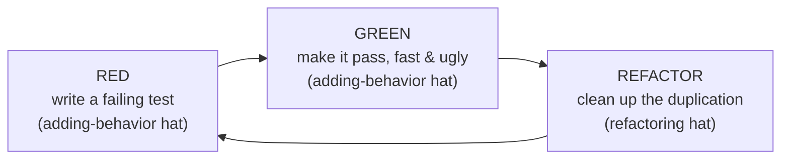
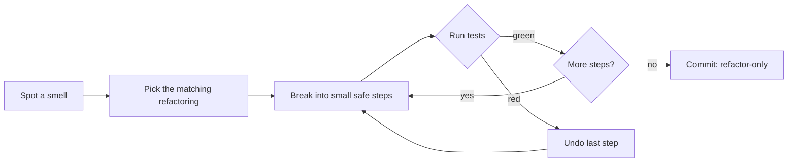
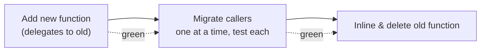

# Refactoring as a Discipline — Middle

> **Category:** [Craftsmanship Disciplines](../README.md) — refactoring as a continuous, behavior-preserving habit done under passing tests, not a big-bang rewrite.

> **Prerequisite:** [Junior](junior.md)
> **Focus:** **Why** and **When**

---

## Table of Contents

1. [Introduction](#introduction)
2. [Smells → Refactorings: The Mapping](#smells-refactorings-the-mapping)
3. [Small Safe Steps in Practice](#small-safe-steps-in-practice)
4. [The Refactor Step in TDD](#the-refactor-step-in-tdd)
5. [Automated IDE Refactorings](#automated-ide-refactorings)
6. [Commit Discipline](#commit-discipline)
7. [Preparatory vs Comprehension vs Litter-Pickup Refactoring](#preparatory-vs-comprehension-vs-litter-pickup-refactoring)
8. [When to Refactor and When to Stop](#when-to-refactor-and-when-to-stop)
9. [Real-World Cases](#real-world-cases)
10. [Trade-offs](#trade-offs)
11. [Edge Cases](#edge-cases)
12. [Tricky Points](#tricky-points)
13. [Best Practices](#best-practices)
14. [Test Yourself](#test-yourself)
15. [Summary](#summary)
16. [Diagrams](#diagrams)

---

## Introduction

> Focus: **Why** and **When**

At the junior level, refactoring is a definition and a rhythm: behavior-preserving, two hats, refactor on green. At the middle level it becomes a **working method**. You need three things to do it fluently:

1. A **vocabulary of smells** so you can name *what* is wrong, and a vocabulary of **refactorings** so you can name the *fix*. The two map onto each other.
2. The **muscle memory of small steps** — knowing how to break a scary change into a sequence of obviously-safe ones, running tests between each.
3. The **tooling and commit habits** that make the loop fast: automated refactorings, a quick test suite, and tidy commits.

The recurring middle-level decision is: *given this smell, what's the smallest first step that makes the code better without risking behavior?* The answer is almost never "rewrite the function." It's "extract these two lines and name them."

---

## Smells → Refactorings: The Mapping

A **code smell** names the problem; a **refactoring** names the cure. Learning the mapping turns vague discomfort ("this is ugly") into a concrete move ("Extract Function"). This is the heart of the discipline at the middle level.

| Smell | What you see | Refactoring(s) that cure it |
|---|---|---|
| **Long Function** | A function that scrolls off the screen | Extract Function; Replace Temp with Query |
| **Duplicated Code** | The same lines in two+ places | Extract Function; Pull Up Method |
| **Long Parameter List** | 5+ parameters | Introduce Parameter Object; Preserve Whole Object |
| **Magic Number / String** | Bare `0.10`, `"ADMIN"` | Extract Constant; Replace Magic Literal with Symbolic Constant |
| **Mysterious Name** | `tmp`, `data2`, `doIt()` | Rename Variable / Function |
| **Nested Conditionals** | `if` pyramids | Replace Nested Conditional with Guard Clauses; Decompose Conditional |
| **Switch on Type Code** | `switch(type)` repeated in many places | Replace Conditional with Polymorphism |
| **Comments Explaining *What*** | A comment narrating the code below it | Extract Function (named after the comment) |
| **Feature Envy** | A method using another object's data more than its own | Move Function; Move Field |
| **Data Clumps** | The same group of fields/params travel together | Introduce Parameter Object; Extract Class |
| **Primitive Obsession** | `String email`, `int cents` everywhere | Replace Primitive with Object ("parse, don't validate") |
| **Temporary Field** | A field set only in some flows | Extract Class; Introduce Null Object |

> The full smell catalog lives in [Code Smell Detection](#further-reading); the full move catalog in [Refactoring Techniques](#further-reading). Here the point is the *reflex*: see a smell → reach for the matching move → apply it in small steps under tests.

### Worked mapping: comment-as-smell → Extract Function

```python
# SMELL: a comment explaining what the next block does
def post_comment(user, text):
    # validate the comment text
    if not text:
        raise ValueError("empty")
    if len(text) > 5000:
        raise ValueError("too long")
    if contains_profanity(text):
        raise ValueError("profanity")

    db.insert(user.id, text)
```

The comment is a smell: it labels a block that wants to be a function. **Extract Function**, naming it after the comment:

```python
def post_comment(user, text):
    validate_comment_text(text)     # the comment became a name
    db.insert(user.id, text)

def validate_comment_text(text):
    if not text:               raise ValueError("empty")
    if len(text) > 5000:       raise ValueError("too long")
    if contains_profanity(text): raise ValueError("profanity")
```

The comment is gone because the *name* now says what the comment said — and it can't drift out of date the way a comment can.

---

## Small Safe Steps in Practice

The skill that separates a disciplined refactorer from a reckless one is **decomposition into safe steps**. A change that *feels* risky can almost always be broken into a sequence where each step is individually obvious.

### Example: changing a function's signature (a "scary" change made safe)

Goal: `sendEmail(to, subject, body)` should take a `Message` object instead of three strings. Done naïvely, you'd edit every call site at once and hope. Done as small safe steps:

**Step 1 — add the new function alongside the old (no caller changes yet).**

```java
void sendEmail(String to, String subject, String body) { /* original */ }

void send(Message m) {                       // new function, delegates to old
    sendEmail(m.to(), m.subject(), m.body());
}
```
Run tests. Green — nothing called `send` yet, behavior unchanged.

**Step 2 — migrate call sites one at a time**, running tests after each:

```java
// before: sendEmail(user.email(), "Welcome", welcomeBody);
send(new Message(user.email(), "Welcome", welcomeBody));
```
Green after each migration.

**Step 3 — once no caller uses the old function, inline its body into the new one and delete it.**

Each step is reversible and individually green. The "scary" signature change became four boring, safe steps. This is the **Parallel Change** (a.k.a. expand-and-contract) pattern — and it's exactly how you refactor a *published* API without breaking callers.

> **The test cadence:** run the suite after *every* step, not at the end. If step 3 of seven goes red, you changed exactly one thing and the cause is obvious. If you only test at the end, a red bar means hunting through seven changes.

---

## The Refactor Step in TDD

Refactoring is the third beat of the **red-green-refactor** cycle, and it's the beat most beginners skip — which is why their TDD code is correct but ugly.



The cycle deliberately separates *making it work* from *making it clean*:

1. **Red** — write the smallest failing test for the next bit of behavior.
2. **Green** — make it pass by *any* means, even copy-paste and hard-coding. Don't be clean yet; be *correct and fast*.
3. **Refactor** — now that the test pins the behavior, *remove the duplication and mess* you just created. This is where the design emerges.

The discipline insight: **green gives you license to refactor, and the test you just wrote is part of your safety net.** The mess you make getting to green is *expected* — the refactor step is where you pay it off immediately, while it's tiny, instead of letting it accumulate.

> A common rhythm violation: writing the next failing test *while still on red* or *before refactoring the last cycle's mess*. Finish the cycle — green, then refactor to clean — *then* write the next red test. See [The Three Laws of TDD](../01-the-three-laws-of-tdd/junior.md).

### "Make the change easy, then make the easy change"

Kent Beck's maxim describes a two-cycle dance for a hard feature:

1. **Refactoring hat:** reshape the existing code so the feature *would* drop in cleanly. Tests stay green throughout.
2. **Adding-behavior hat:** now add the feature, which is easy because you prepared the ground.

This is **preparatory refactoring**, and it's often the highest-leverage refactoring you'll do — see below.

---

## Automated IDE Refactorings

Modern IDEs (IntelliJ, VS Code, GoLand, PyCharm, Rider) ship **automated refactorings** that are behavior-preserving *by construction* — the tool parses your code's syntax tree and rewrites it correctly across the whole project. Prefer these over hand-editing; they're faster and safer.

| Move | Shortcut concept | Why automated beats manual |
|---|---|---|
| **Rename** | `Rename Symbol` (F2 / Shift+F6) | Updates every reference, import, and usage atomically — no missed call site, no string-matching a comment by accident |
| **Extract Function/Method** | `Extract Method` | Computes parameters and return values for you; warns on captured mutable state |
| **Inline** | `Inline Variable/Method` | Substitutes correctly even with side effects in scope |
| **Change Signature** | `Change Signature` | Updates all callers; can add a parameter with a default |
| **Move** | `Move Class/Member` | Fixes imports and visibility across modules |
| **Introduce Variable/Parameter/Constant** | `Extract Variable` | Picks the right scope automatically |

```python
# A Rename across 200 files used to be a risky sed; now it's one keystroke.
# old: def calc(x): ...   →   F2 → "monthly_interest" → done, every caller updated
def monthly_interest(principal): ...
```

> **Caveat:** automated refactorings are safe *within* what the tool can see. In dynamic languages (Python, Ruby, JS) or across reflection / serialization / string-based wiring (DI frameworks, ORMs, JSON keys, SQL column names), the tool can miss references. There, **your tests are still the safety net** — automation reduces but doesn't eliminate the need for green. Renaming a field that's also a JSON key or DB column *does* change external behavior and is not a pure refactoring.

---

## Commit Discipline

Refactoring and version control are partners. The right commit habits make refactoring fearless and reviewable.

### 1. Separate refactor commits from feature commits

This is the two hats, applied to your git history. A commit should be *either* "add feature X" *or* "refactor Y" — never both. Mixed commits are unreviewable: the reviewer can't tell which diff lines are the risky behavior change and which are the safe restructuring.

```bash
# Good history — each commit is one hat
git commit -m "refactor: extract validate_comment_text from post_comment"
git commit -m "feat: reject comments with banned URLs"

# Bad history — reviewer can't separate the risky bit
git commit -m "add URL banning and clean up post_comment"
```

### 2. Commit on green, frequently

Every green bar is a safe restore point. Commit (or at least stage) often, so when a refactor goes wrong you can `git reset --hard` back to the last known-good state and lose only a minute of work — not an hour.

### 3. Keep refactor diffs small and mechanical

A reviewer should be able to look at a refactor commit and verify "yes, this is behavior-preserving" almost by inspection. A 600-line "cleanup" commit can't be reviewed that way and *will* hide a behavior change. If a refactor must be large, split it into a stack of small, individually-green commits.

> Tools like `git commit --amend` and small interactive staging let you curate a clean refactor history. The payoff is a reviewer (and future you, running `git bisect`) who can trust that refactor commits don't change behavior.

---

## Preparatory vs Comprehension vs Litter-Pickup Refactoring

Fowler classifies *when* refactoring happens. Knowing the type tells you how much to do and when to stop.

| Type | Trigger | Goal | How much |
|---|---|---|---|
| **Preparatory** | You're about to add a feature and the code resists | Reshape so the feature drops in cleanly | Exactly enough to make the feature easy |
| **Comprehension** | You're reading code to understand it | Capture your understanding *in the code* (rename, extract) | As you read; keep what clarifies |
| **Litter-pickup (Boy Scout)** | You happened to pass through a messy spot | Leave it a little cleaner | One small improvement; don't rabbit-hole |
| **Planned / "campaign"** | A module is a chronic bottleneck | Larger structural improvement | Budgeted, behind tests — see [Senior](senior.md) |

The first three are **continuous and free** — they happen inside normal work, under the two-hats discipline, and need no separate ticket. Only the fourth (large, planned) deserves explicit scheduling, and even then it's done in small steps. This distinction is what lets you say, truthfully, "refactoring is part of how I work, not a separate task" (see [Professional](professional.md)).

---

## When to Refactor and When to Stop

| Refactor when… | Stop / don't refactor when… |
|---|---|
| You're on green and just finished a TDD cycle | The tests are red — get to green first |
| A smell makes the *next* change harder | The code is about to be deleted |
| You must touch this code anyway (prep) | You'd be gold-plating clean-enough code |
| Reading it to understand it | You have no tests *and* can't write [characterization tests](../02-test-design-and-fixtures/junior.md) yet |
| Duplication just appeared (the green→refactor step) | You're under the adding-behavior hat (finish first) |
| The Boy Scout moment (small, local) | The "refactor" is really a rewrite |

The **"rule of three"** (Fowler) is a useful stopping/starting heuristic for duplication: the first time you write something, just write it. The second time you duplicate, wince but tolerate it. The *third* time, refactor — now you have enough examples to extract the right abstraction. Extracting too early (after one or two uses) often produces the *wrong* abstraction, which is worse than duplication.

---

## Real-World Cases

### 1. Preparatory refactoring before a feature

A pricing function hard-codes one discount type. Product wants three. **Don't** add three `if` branches to the tangle. First (refactoring hat) extract the discount into a strategy object; tests stay green. *Then* (adding-behavior hat) add the two new strategies. The feature became trivial because you prepared the ground.

### 2. Comprehension refactoring while debugging

You're chasing a bug in a 200-line method you didn't write. As you decipher each block, you **Extract Function** and **Rename** to capture what you've learned. By the time you understand it, the method is readable *and* the bug is obvious — your understanding lives in the code, not in your head.

### 3. The refactor step removing TDD duplication

Two test-driven cases produced nearly identical code with one differing constant. The green→refactor step extracts the common logic and parameterizes the constant — the duplication that TDD *deliberately* created is paid off immediately.

---

## Trade-offs

| Dimension | Continuous refactoring | "Refactor later" / never |
|---|---|---|
| Cost timing | Small, constant, paid now | Huge, deferred, paid as a rewrite |
| Risk per change | Tiny (small steps, green) | Large (big-bang, behavior re-derived) |
| Reviewability | High (small, separated commits) | Low (giant cleanup PRs) |
| Feature velocity | Stays high | Decays toward zero |
| Bug surface | Shrinks (clean code) | Grows (tangled code) |
| Requires | Tests + discipline + tooling | Nothing — until the reckoning |

The trade is **a little time now vs. a lot of time (and risk) later.** Continuous refactoring is cheaper in total because small steps under tests are nearly risk-free, while deferred cleanup compounds into the high-risk rewrite.

---

## Edge Cases

### 1. Refactoring code wired by strings (DI, ORM, serialization)

```java
// Renaming this field IS a behavior change — it's a JSON key
class User { String emailAddress; }   // serialized as {"emailAddress": ...}
```

An IDE rename updates the Java code but the JSON contract silently changes. This is **not** a pure refactoring — external behavior (the wire format) changed. Treat such renames as behavior changes: add a migration/compat shim or version the contract. The lesson: "refactoring" stops being behavior-preserving the moment a name crosses a serialization, reflection, or persistence boundary.

### 2. Refactoring with a slow test suite

If the suite takes 20 minutes, you can't run it after every small step, and the discipline collapses. The fix is *test-suite* work first: fast unit tests for the code under refactor (see [Test Design & Fixtures](../02-test-design-and-fixtures/junior.md)). A fast green bar is a *precondition* for fluent refactoring.

### 3. Extracting the wrong abstraction (premature)

Extracting after one duplicate often creates a parameter-laden abstraction that fits neither caller. Apply the **rule of three**; let duplication live until you've seen enough examples to extract the *right* shape. A bad abstraction is harder to remove than duplication.

---

## Tricky Points

- **An automated rename can still change behavior** when the name is also a serialized key, DB column, reflection target, or DI bean name. The tool sees the code, not the wire. Verify with tests, and treat cross-boundary renames as real behavior changes.
- **The refactor step is not optional in TDD.** Skipping it ("it passes, move on") is why TDD codebases can still be ugly — the discipline includes paying off the duplication you just created.
- **"Refactor later" is a myth.** Without the continuous habit, "later" arrives as a rewrite. The middle-level move is to make refactoring so cheap (fast tests, automated moves, small commits) that it happens *now*, every cycle.
- **Mixed commits defeat `git bisect`.** If refactors and features share commits, bisect can't isolate a behavior regression to a single hat. Separate commits keep history debuggable.

---

## Best Practices

1. **Map smell → refactoring.** Name the problem, name the cure, apply in small steps.
2. **Decompose scary changes** into individually-green steps (Parallel Change for signatures/APIs).
3. **Run tests after every step**, not at the end — keep the suite fast enough to allow it.
4. **Don't skip the refactor beat** of red-green-refactor; pay off duplication immediately.
5. **Prefer automated refactorings** (rename/extract/inline) — safe by construction.
6. **Separate refactor commits from feature commits** — one hat per commit.
7. **Commit on green, frequently** — every green state is a restore point.
8. **Apply the rule of three** before extracting an abstraction; avoid premature extraction.
9. **Refactor preparatorily** — make the change easy, then make the easy change.

---

## Test Yourself

1. Give three smells and the refactoring that cures each.
2. How do you change a function's signature safely across many callers, in small steps?
3. Why must you run the test suite after *every* small step, not just at the end?
4. What is "preparatory refactoring" and which hat does it use?
5. Why separate refactor commits from feature commits?

---

## Summary

- **Smells name the problem; refactorings name the cure.** Fluency is the reflex from one to the other.
- **Small safe steps**, with tests run after each, turn scary changes (even signature changes, via Parallel Change) into boring, reversible ones.
- The **refactor beat of red-green-refactor** is mandatory: pay off the duplication you create getting to green.
- **Automated IDE refactorings** are behavior-preserving by construction — prefer them, but mind serialization/DI/reflection boundaries.
- **Commit discipline mirrors the two hats:** separate refactor and feature commits, commit on green, keep diffs small and reviewable.
- Most refactoring is **continuous and free** (preparatory, comprehension, litter-pickup) and needs no ticket.

---

## Diagrams

### Smell → refactoring → small steps → green



### Parallel Change (safe signature change)




---

## Check your understanding

1. Explain Refactoring as a Discipline — Middle Level in your own words and name the problem it solves.
2. How would you apply the ideas around Table of Contents, Introduction, Smells → Refactorings: The Mapping in a realistic engineering change?
3. What failure mode or misuse should you look for, and what evidence would reveal it?
4. Which local design trade-off would make you choose or reject Refactoring as a Discipline — Middle Level in an existing codebase?
5. What observable result would convince you that the approach improved the system?
