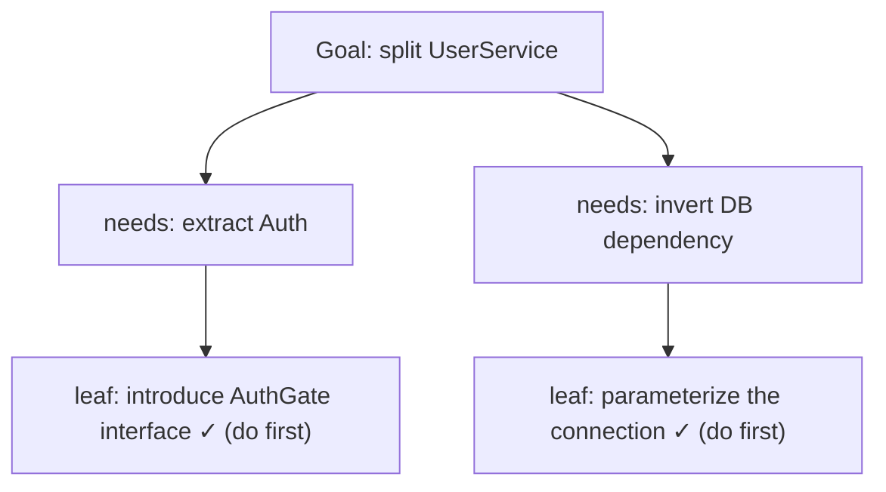
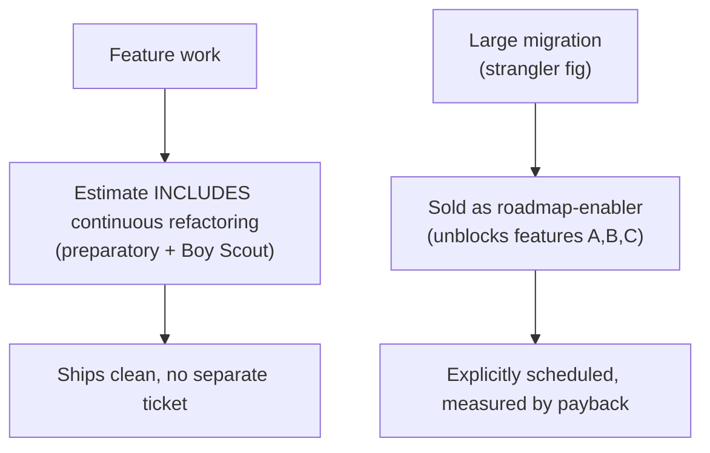
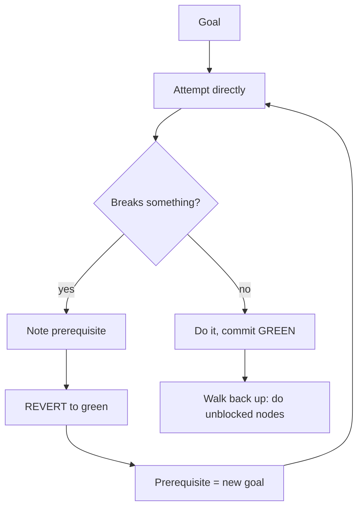

# Refactoring as a Discipline — Professional

> **Category:** [Craftsmanship Disciplines](../README.md) — refactoring as a continuous, behavior-preserving habit done under passing tests, not a big-bang rewrite.

> **Prerequisites:** [Junior](junior.md) · [Middle](middle.md) · [Senior](senior.md)
> **Focus:** **Production** — selling it, reviewing it, measuring it, rolling it out across a team

---

## Introduction

> Focus: **production** — what refactoring costs and protects once a team, a backlog, and a manager are involved.

The technical discipline is settled by the senior level. The professional questions are organizational:

- How do you **fund** refactoring when there's no line item for it — without asking permission you shouldn't need?
- How do you handle refactoring **in code review**, both as author and reviewer?
- Which **metrics** honestly show the discipline is (or isn't) working, and which are vanity?
- How do you scale the habit **across a team** so it survives turnover and pressure?
- How do you stop a well-meaning "refactor" from metastasizing into a **rewrite disaster**?

The central professional truth, from which everything else follows:

> **Refactoring is not a separate task. It is part of how you write software, like compiling or testing. You don't ask permission to compile.**

---

## Refactoring Is Not a Ticket

The most common organizational mistake is treating refactoring as a discrete, schedulable deliverable — a "tech-debt ticket," a "refactoring sprint," a line on the roadmap. This is wrong, and it's the root cause of most teams' inability to refactor.

Here's why it fails:

- **A refactoring ticket competes with features** in prioritization — and it loses, every time, because it has no visible customer value on its own. So it's perpetually deprioritized, and the debt grows until a rewrite is demanded.
- **It bundles many small continuous improvements into one big deferred lump**, converting a stream of cheap, low-risk changes into one expensive, high-risk change — the exact failure mode the discipline exists to prevent.
- **It splits the two hats across time**, so the refactoring happens far from the feature that motivated it, when the context is cold and the cleanup is harder.

The correct model:

> **Continuous refactoring (preparatory, comprehension, litter-pickup) is part of the estimate for the work, not a separate item.** When you estimate a feature, the estimate *includes* the cleanup needed to land it well. You don't itemize "and also refactor" any more than you itemize "and also run the tests."

The *only* refactoring that legitimately gets its own scheduled work is the rare large, planned campaign (a strangler-fig migration, a module rework) — and even that is sold as enabling specific upcoming features, not as cleanup for its own sake (see [next section](#selling-refactoring-time-to-management)).

This reframing is liberating: it means you **never have to ask permission for the 95% of refactoring that's continuous.** It's already in the estimate, the same way testing is.

---

## Selling Refactoring Time to Management

You shouldn't have to "sell" continuous refactoring — it's in the estimate. But for the rare *large* refactoring (a migration, a module rework), and for defending your engineering practices when challenged, you need to speak the language of the business.

### Translate to business outcomes, never "clean code"

Managers don't buy "the code will be cleaner." They buy **faster delivery, fewer incidents, lower risk, lower cost.** Translate:

| Don't say | Say |
|---|---|
| "The code is messy / ugly" | "Changes in this module take 3x longer and cause most of our bugs" |
| "We should refactor the payment service" | "Three upcoming features all touch this code; reshaping it first will make all three cheaper and lower regression risk" |
| "We need a refactoring sprint" | "Our change-failure rate in this area is 30%; here's a two-week investment that pays back in the next quarter's roadmap" |
| "This has tech debt" | "We're paying ~20% interest on every change here; here's the principal and the payback" |

### Tie the large refactoring to the roadmap

The strongest case for a planned refactoring is *"the features you already want are blocked or expensive without it."* You're not asking for cleanup; you're de-risking and accelerating work that's already prioritized. Show the dependency: *Feature A, B, C all need this; do the enabling refactor once instead of fighting the tangle three times.*

### Make the debt visible and quantified

- Track **lead time for changes** and **change-failure rate** per module (see [Metrics](#metrics-that-track-the-discipline)). "This module has 4x the change-failure rate of the rest of the codebase" is a *number*, not an aesthetic complaint.
- Show the **interest**: "every feature here costs ~40% more than equivalent work elsewhere." Debt that's costing measurable money gets funded.

### The honest framing

The most credible thing you can tell a manager: *"For everyday work, refactoring is already baked into our estimates — that's why our velocity is sustainable. I'm asking for explicit time only for this one larger investment, because it's bigger than a single feature and it unblocks several."* This protects continuous refactoring from ever being a negotiation while keeping the rare big-ticket item honestly accountable.

---

## Refactoring in Code Review

### As a reviewer

1. **Enforce the two hats in the diff.** If a PR mixes a behavior change with restructuring, ask the author to split them. Mixed PRs hide regressions and are unreviewable. *"Can you separate the extract-method refactor into its own commit/PR? Then the behavior change is a 5-line diff I can actually verify."*
2. **Verify refactor commits are behavior-preserving by inspection.** A pure refactor diff should be checkable: extractions, renames, moves — no new branches, no changed return values, no altered conditionals. If you can't tell whether behavior changed, that's a smell in the *PR*, not just the code.
3. **Don't block a PR to demand unrelated refactoring.** "While you're here, also clean up this other thing" expands scope and punishes the author for touching the file. Suggest it as a *follow-up* (a separate Boy-Scout opportunity), not a blocker. The exception: if their change makes adjacent code *worse* or they're building on a smell that will compound, raise it.
4. **Praise preparatory refactoring.** A PR that says "refactor first, then the easy feature change" is exemplary. Reinforce it so it spreads.

### As an author

1. **Split your hats into separate commits, ideally separate PRs.** The reviewer sees a clean refactor commit (verifiably behavior-preserving) and a small feature commit (the actual risk).
2. **Label the intent.** Commit/PR titles `refactor:`, `feat:`, `fix:` (Conventional Commits) tell the reviewer which hat each change wears.
3. **Keep refactor PRs small and mechanical.** A 50-line extract is reviewable; a 600-line "cleanup" is not and will hide a bug.
4. **Don't gold-plate in review response.** If a reviewer's refactor suggestion expands scope beyond the change's purpose, push back politely or file a follow-up.

> **The reviewer's superpower:** a clean separation of hats turns review from "trust the author" into "verify by inspection." That's the organizational payoff of commit discipline (see [Middle](middle.md)).

---

## Metrics That Track the Discipline

You manage what you measure — and the wrong metric makes refactoring look worthless. Measure outcomes, not activity.

### Lead metrics (about the code)

| Metric | What it shows | Caveat |
|---|---|---|
| **Cognitive complexity** (SonarQube) | Nesting/structure improving | Per-function; aggregate trend, not absolutes |
| **Code churn / hotspots** | Files changed often *and* complex = prime refactor targets | Combine churn × complexity (CodeScene-style) |
| **Test coverage on changed code** | The safety net exists where you're refactoring | Coverage ≠ good tests; watch quality |
| **Duplication %** | Extract-function opportunities | Some duplication is fine (rule of three) |

### Lag metrics (about delivery — the ones managers care about)

| Metric (DORA) | What refactoring should do to it |
|---|---|
| **Lead time for changes** | Goes down — clean code is faster to change |
| **Change-failure rate** | Goes down — clean code has fewer regressions |
| **Deployment frequency** | Goes up — small, safe changes ship more often |
| **Time to restore** | Goes down — clean code is faster to fix |

### The honesty rules

- **Don't report "lines refactored" or "tickets closed."** Activity metrics incentivize churn, not improvement.
- **Don't use a single function's complexity as a KPI** — people game it. Track *trends* on *hotspots*.
- **Tie the metric to the claim.** If you sold a refactoring as "this will speed up changes here," report the *lead time* on that module before/after — not a complexity score nobody outside engineering understands.
- **Beware the metric that didn't move because the work was wrong, vs. didn't move because you measured the wrong thing.** Cognitive complexity should drop after a structural refactor; if it didn't, question the refactor *or* the metric, not just one.

---

## The Mikado Method

When a refactoring is large and you discover that change A requires change B, which requires change C — a dependency tangle where naïvely starting breaks everything — the **Mikado Method** keeps you safe and always-green.

It's named after the Mikado pick-up-sticks game: you want the goal stick, but you must remove the sticks resting on it first, without disturbing the pile.

```
1. Set a GOAL (the refactoring you want).
2. Try to do it NAÏVELY, directly.
3. It breaks something → note the PREREQUISITE that must happen first.
4. REVERT (undo your attempt — back to green, the pile undisturbed).
5. Recurse: make the prerequisite the new goal; repeat until you find a
   change that works WITHOUT breaking anything (a leaf).
6. Do the leaf. Commit (green). Walk back UP the graph, doing each
   now-unblocked node, committing green at each step.
```



The power of Mikado:

- **You're always on green.** Every attempt that breaks something is *reverted*, not pushed forward. You never accumulate a half-broken pile.
- **The reverts are the method, not failures.** Each revert *discovers a prerequisite*; the dependency graph emerges from the breakages.
- **It prevents the long-broken-branch disaster.** Because you only ever *commit* changes that don't break anything, the work lands incrementally and `main` stays shippable — directly addressing the [refactoring-as-rewrite](#avoiding-the-refactoring-as-rewrite-disaster) failure mode.

Mikado is the disciplined alternative to "dive in, break a hundred things, spend three days getting back to green." Naïve big refactoring drowns in a wide-open broken state; Mikado keeps the broken state at *zero* by reverting to discover the safe order.

---

## Rolling Out the Discipline Across a Team

You can't mandate a craft habit; you cultivate it. The sequence that works:

1. **Make the safety net exist first.** A team without fast tests *cannot* refactor continuously — the loop is too slow. Invest in test speed and coverage on active code (see [Test Design & Fixtures](../02-test-design-and-fixtures/junior.md)) *before* preaching refactoring. The discipline is downstream of a fast green bar.

2. **Bake it into the definition of done and the estimate.** Make "leaves code at least as clean as found" part of what "done" means, and make estimates *include* the cleanup. This is how refactoring stops being a separate ticket (see [above](#refactoring-is-not-a-ticket)).

3. **Establish the two-hats commit convention** (Conventional Commits, separate refactor/feature commits) and enforce it in review. This single habit makes the whole discipline visible and reviewable.

4. **Tooling lowers the activation energy.** IDE refactorings configured and shared, a one-keystroke test run, fast CI, complexity/hotspot dashboards. The cheaper each refactoring is, the more they happen.

5. **Model it in review and pairing.** Seniors doing visible preparatory refactoring, praising it in others' PRs, and pairing on legacy seams spreads the habit faster than any document. See [Pair and Mob Programming](../05-pair-and-mob-programming/junior.md).

6. **Ratchet, don't cliff.** Quality gates (complexity thresholds, coverage) should fail only on *new/changed* code, grandfathering the legacy. A day-one cliff that fails hundreds of files gets the gate disabled by an annoyed team.

7. **Protect it under pressure from the top.** If leadership rewards only feature output and punishes "slow" PRs that include cleanup, the discipline dies regardless of what engineers want. Sustained refactoring is an organizational decision as much as an individual one.

---

## Avoiding the Refactoring-as-Rewrite Disaster

The single most expensive failure in this whole topic: a "refactoring" that grows into a months-long rewrite on a divergent branch, ships nothing, and eventually gets cancelled or merged in a heroic, bug-ridden flag day. How professionals prevent it:

1. **Forbid long-lived refactoring branches.** Refactoring lands on `main` in small green steps, or via short-lived branches measured in hours/days. Use **branch by abstraction** and feature flags so big changes land incrementally on `main` without a divergent branch (see [Senior](senior.md)).

2. **Demand always-shippable.** At every commit, the system works and could ship. If your refactoring plan has a phase where "nothing works until it's all done," it's a rewrite wearing a refactoring costume — restructure the plan (strangler fig) or call it what it is.

3. **Use the Mikado method for the tangled ones.** It structurally guarantees you're never in a wide broken state.

4. **Time-box and check in.** A "refactor" with no end in sight is a red flag. Set checkpoints: *what shipped, is `main` still green, can we stop here and have value?* If the answer to the last is ever "no, it's all-or-nothing," intervene.

5. **Watch for the euphemism.** When someone says "we need to refactor the whole X," translate: do they mean small behavior-preserving steps, or rebuild-from-scratch? The words are the same; the risk is wildly different. Force the distinction explicitly and apply the [refactor-vs-rewrite decision](senior.md#refactor-vs-rewrite-the-decision).

---

## Real Incidents

### Incident 1: The "refactor" that changed a rounding rule

A cleanup of an invoicing module "simplified" a chain of `BigDecimal` operations into a single expression — and changed the intermediate rounding. Totals shifted by cents; reconciliation broke; finance noticed at month-end close. **Root cause:** no characterization test pinned the exact arithmetic, and the change wasn't isolated as a pure refactor. **Fix:** characterization tests on monetary calculations; a lint/review rule that monetary code changes are never bundled with features. **Lesson:** a "harmless simplification" that alters output is not a refactoring — it's a behavior change, and money is unforgiving.

### Incident 2: The six-month rewrite that never shipped

A team "refactored" the order pipeline on a branch. Six months in, `main` had diverged so far the branch couldn't merge; the rewrite was cancelled; nothing shipped; the original code was *still* the production system. Half a year of work, zero delivered value. **Fix going forward:** branch by abstraction, flags, always-shippable `main`, monthly "can we stop here with value?" checkpoints. **Lesson:** a refactoring that isn't continuously landing is a rewrite, and rewrites on branches die.

### Incident 3: The renamed JSON field

An IDE "rename refactoring" changed a field that was also a serialized API key. The Java code compiled and tests passed (the tests used the same renamed model), but external clients sending the old key got nulls. **Fix:** treat any rename crossing a serialization/persistence/wire boundary as a behavior change, with a compatibility shim and contract tests. **Lesson:** automated refactorings are behavior-preserving only *within* what the tool can see; the wire is outside it.

### Incident 4: The refactoring sprint that became a feature freeze

Management funded a "tech-debt sprint." Features froze for two weeks, the team did scattered cleanups with no clear payoff, velocity didn't visibly improve afterward, and management concluded "refactoring doesn't work" and never funded it again. **Root cause:** refactoring was scheduled as a separate lump instead of being continuous and tied to roadmap features. **Fix:** fold continuous refactoring into estimates; reserve explicit time only for roadmap-enabling migrations with a measurable payback. **Lesson:** the refactoring *ticket* is the anti-pattern; the refactoring *habit* is the discipline.

---

## Team Conventions

Codify these so the discipline is uniform and survives turnover:

1. **Refactoring is in the estimate, not a separate ticket.** Only large, roadmap-enabling campaigns get scheduled work.
2. **One hat per commit.** Conventional Commits (`refactor:`, `feat:`, `fix:`); never mix behavior change with restructuring.
3. **Refactor only on green; commit on green.** Every committed state is shippable.
4. **No long-lived refactoring branches.** Land incrementally via branch by abstraction + flags.
5. **Characterize before you touch untested legacy.** Pin behavior (bugs included), then refactor, then fix bugs separately.
6. **Definition of done includes the Boy Scout Rule** — leave touched code at least as clean as found.
7. **Quality gates ratchet on changed code**, grandfather legacy.
8. **Measure outcomes (DORA), not activity (lines/tickets).**
9. **Reviewers split mixed PRs; reviewers don't block on unrelated cleanup.**

---

## Cheat Sheet

```text
SELLING IT
  - continuous refactoring = IN THE ESTIMATE, never a ticket
  - large refactoring = tie to roadmap features it unblocks
  - speak DORA (lead time, change-failure rate), not "clean code"
  - quantify the debt's interest; show the payback

IN REVIEW
  [author]   one hat per commit; refactor PRs small + mechanical; label intent
  [reviewer] split mixed PRs; verify refactor diff is behavior-preserving by eye
  [reviewer] suggest unrelated cleanup as FOLLOW-UP, don't block

BIG REFACTORINGS — STAY SAFE
  - branch by abstraction + flags → land on main incrementally
  - Mikado: revert-to-discover prerequisites, always green, never a wide broken state
  - always-shippable: every commit works
  - if a phase is "nothing works till done" → it's a rewrite, replan as strangler fig

METRICS
  ✅ lead time, change-failure rate, complexity/hotspot trend on touched code
  ❌ lines refactored, tickets closed, single-function complexity as a KPI
```

---

## Diagrams

### The funding model



### Mikado: revert to stay green



---

## Related Topics

- **The prerequisite safety net:** [Test Design & Fixtures](../02-test-design-and-fixtures/junior.md), [The Three Laws of TDD](../01-the-three-laws-of-tdd/junior.md)
- **What you refactor toward:** [Simple Design](../04-simple-design/junior.md)
- **Spreading the habit:** [Pair and Mob Programming](../05-pair-and-mob-programming/junior.md)

---


---

## Check your understanding

1. Explain Refactoring as a Discipline — Professional Level in your own words and name the problem it solves.
2. How would you apply the ideas around Table of Contents, Introduction, Refactoring Is Not a Ticket in a realistic engineering change?
3. What failure mode or misuse should you look for, and what evidence would reveal it?
4. How would you introduce and govern Refactoring as a Discipline — Professional Level across teams through reversible, measurable increments?
5. What observable result would convince you that the approach improved the system?
