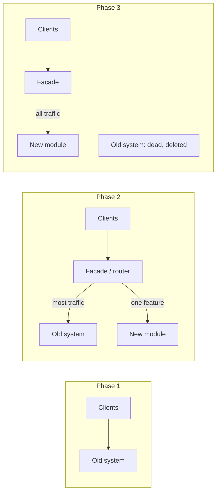
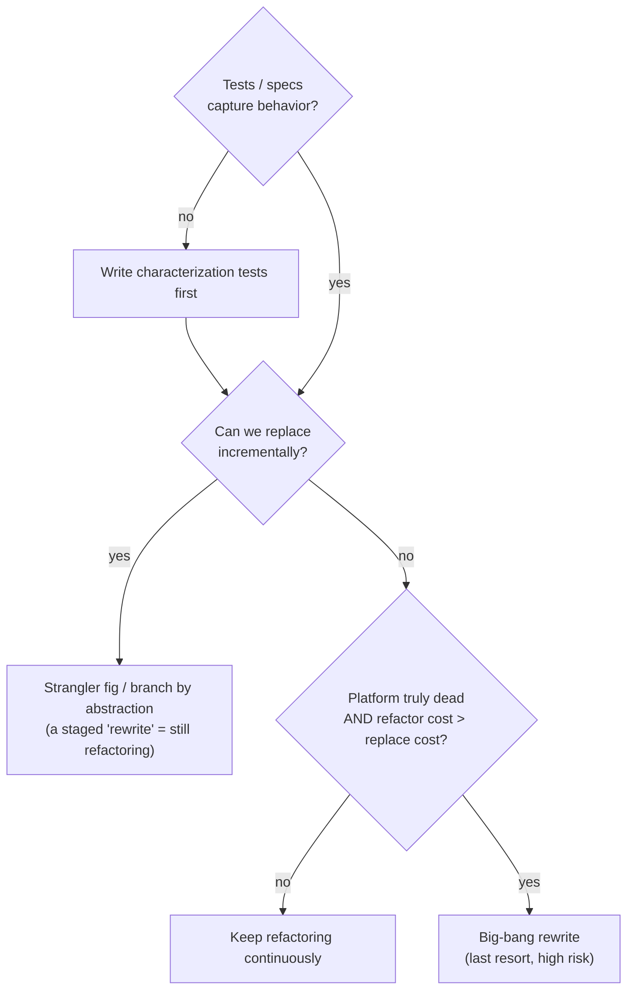
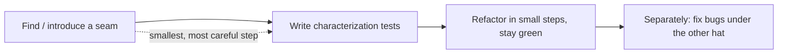
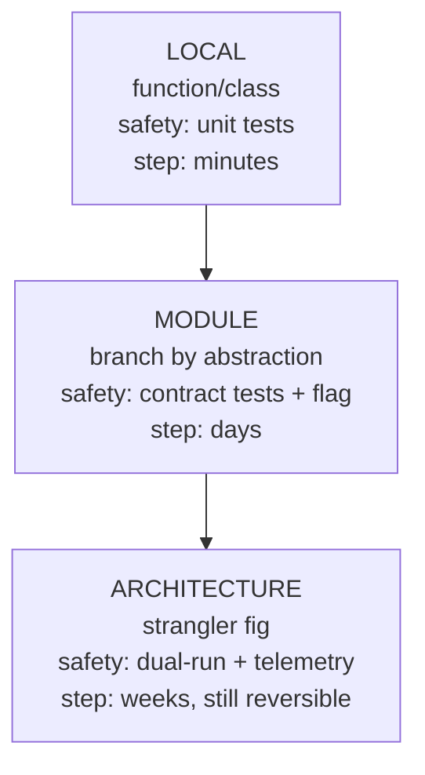

# Refactoring as a Discipline — Senior

> **Category:** [Craftsmanship Disciplines](../README.md) — refactoring as a continuous, behavior-preserving habit done under passing tests, not a big-bang rewrite.

> **Prerequisites:** [Junior](junior.md) · [Middle](middle.md)
> **Focus:** **Design trade-offs** and **system-level reasoning**

---

## Table of Contents

1. [Introduction](#introduction)
2. [Refactoring Without a Safety Net: Characterization Tests](#refactoring-without-a-safety-net-characterization-tests)
3. [Seams: Where to Cut Legacy Code](#seams-where-to-cut-legacy-code)
4. [Local vs Architectural Refactoring](#local-vs-architectural-refactoring)
5. [The Strangler Fig: Refactoring at the System Scale](#the-strangler-fig-refactoring-at-the-system-scale)
6. [Branch by Abstraction](#branch-by-abstraction)
7. [When Refactoring Is the Wrong Call](#when-refactoring-is-the-wrong-call)
8. [Refactoring Under Deadline Pressure](#refactoring-under-deadline-pressure)
9. [Refactor vs Rewrite: The Decision](#refactor-vs-rewrite-the-decision)
10. [Code Examples — Advanced](#code-examples-advanced)
11. [Liabilities](#liabilities)
12. [Diagrams](#diagrams)
13. [Related Topics](#related-topics)

---

## Introduction

> Focus: **design trade-offs** and **system-level reasoning**

At the junior and middle levels, refactoring assumes a comfortable starting point: tests are green, the code is yours, the change is local. The senior reality is the opposite. The code that *most* needs refactoring is exactly the code with *no tests*, written by people who left, doing things you don't fully understand, on the critical path of revenue. The senior questions are:

1. **How do you refactor when there's no safety net?** (Characterization tests, seams.)
2. **How do you refactor at a scale bigger than a function** — a module, a service, an architecture — without a big-bang rewrite? (Strangler fig, branch by abstraction.)
3. **When is refactoring the *wrong* call** — when do you ship the mess, isolate it, or (rarely) actually rewrite?
4. **How do you keep the discipline under deadline pressure** without either martyring the schedule or abandoning the craft?

The through-line: refactoring scales by **adding safety, then taking small steps** — the same discipline, applied to ever-larger units, with the safety net engineered first.

---

## Refactoring Without a Safety Net: Characterization Tests

The junior rule "no tests, no refactoring" is correct but incomplete. The senior version is: **if there are no tests, your first refactoring task is to create them — and the right kind is a characterization test.**

A **characterization test** (Michael Feathers) does not assert what the code *should* do. It asserts what the code *currently does* — including its bugs, quirks, and weird edge cases. Its job is to **pin the existing behavior** so that when you refactor, any change shows up as a failing test.

```python
# You don't know what this function "should" return.
# You characterize what it DOES return, to lock it in before refactoring.
def test_characterize_legacy_pricing():
    # Probe the real function with representative inputs...
    assert legacy_price(qty=10, member=True)  == 89.99   # whatever it actually returns
    assert legacy_price(qty=0,  member=True)  == 0.0
    assert legacy_price(qty=-1, member=False) == 0.0      # yes, even this weird case
    # Now these are LOCKED. Refactor freely; a red bar = behavior changed.
```

### How to write characterization tests for opaque code

1. **Write a test that asserts something obviously wrong** and run it. The failure message *tells you the actual output*. Paste that actual value in. Now it's a characterization.
2. **Feed in a spread of inputs** — boundaries, nulls, negatives, the empty case — to capture as much current behavior as you can.
3. **Use coverage to find untested branches** and add probes until the behavior you're about to touch is pinned.
4. **Resist "fixing" the bugs you discover.** A characterization test deliberately encodes current behavior, *bugs included*. Fixing a bug is a *behavior change* — a separate task, under the adding-behavior hat, with its own test. Conflating the two is how "refactors" cause incidents.

The crucial discipline: **characterization first, refactor second, bug-fix third — and never two at once.** This is the two-hats rule extended to legacy code. See [Test Design & Fixtures](../02-test-design-and-fixtures/junior.md) for fixture strategies that make pinning legacy behavior tractable.

---

## Seams: Where to Cut Legacy Code

Legacy code resists testing because dependencies are hard-wired — a function reaches straight into a database, the clock, a network call. You can't pin its behavior if you can't run it in isolation. A **seam** (Feathers) is a place where you can change behavior *without editing the code at that place* — a point where you can substitute a test double to get the code under test.

```java
// NO SEAM — hard-wired dependencies, can't characterize
class Report {
    String generate() {
        var data = new Database().query("...");   // real DB, can't test
        var now  = LocalDate.now();               // real clock, non-deterministic
        return format(data, now);
    }
}

// SEAM introduced — dependencies injected, now characterizable
class Report {
    Report(Database db, Clock clock) { this.db = db; this.clock = clock; }
    String generate() {
        var data = db.query("...");               // can inject a fake
        var now  = LocalDate.now(clock);          // can inject a fixed clock
        return format(data, now);
    }
}
```

Introducing a seam is itself a small, careful refactoring (often **Parameterize Constructor** or **Extract & Override**), done *before* you have full tests — so it must be done with maximum caution and minimal mechanical steps, ideally with the IDE's automated moves. Once the seam exists, you can write characterization tests, *then* refactor freely behind them. The sequence is:

```
find/introduce a seam → write characterization tests → refactor safely → (separately) fix bugs
```

This is the senior answer to "how do I refactor untestable code": you don't refactor it directly — you make it testable in the smallest possible step, pin it, *then* refactor.

---

## Local vs Architectural Refactoring

Refactoring spans orders of magnitude, and the technique changes with the scale.

| | **Local refactoring** | **Architectural refactoring** |
|---|---|---|
| Unit | A function, a class | A module, a service, a layer boundary |
| Examples | Extract Function, Rename, Guard Clauses | Extract Service, invert a dependency, split a monolith |
| Safety net | Unit tests, green in seconds | Integration/contract tests, feature flags, dual-running |
| Step size | Minutes | Days/weeks, but *still* in small green steps |
| Reversibility | `git reset` | Feature flag flip, traffic re-route |
| Technique | The move catalog | Strangler fig, branch by abstraction, expand-contract |

The senior insight: **architectural refactoring is the same discipline at a larger granularity, not a different activity.** It is *still* behavior-preserving, *still* done in small reversible steps, *still* under tests (now contract/integration tests and production telemetry). What changes is the *mechanism of safety* — you can't hold a giant change green with unit tests, so you use abstraction layers, flags, and parallel running to keep each step reversible and observable. The cardinal sin is letting "architectural refactoring" become a euphemism for "big-bang rewrite."

---

## The Strangler Fig: Refactoring at the System Scale

Named by Fowler after the strangler fig vine that grows around a host tree and eventually replaces it, the **Strangler Fig** pattern is how you refactor a large system *without* a big-bang rewrite. You grow the new structure *around* the old, route traffic to the new piece by piece, and remove the old once nothing uses it.



The mechanics:

1. **Put a facade/seam in front of the old system** (a router, an interface, an API gateway). This is itself a behavior-preserving refactoring — all traffic still flows to the old code.
2. **Build the new implementation of one slice** behind the facade.
3. **Route that slice's traffic to the new code** behind a flag; run both in parallel and compare outputs if you can (dual-running / "shadow" mode).
4. **Migrate slices one at a time**, each reversible by flipping the route back.
5. **Delete the old code** once no traffic reaches it.

Why this beats a rewrite: at every moment the system *works* and *ships*, each step is small and reversible, and the bug-fixes-baked-into-old-code (Chesterton's Fence) are migrated deliberately rather than rediscovered as production incidents. The rewrite's fatal flaw — "the new system isn't usable until it's *all* done" — is structurally eliminated.

---

## Branch by Abstraction

For refactoring a deeply-embedded component that *can't* be hidden behind an external facade (it's called from a hundred places inside the codebase), use **Branch by Abstraction** — the in-process cousin of the strangler fig.

```
1. Introduce an abstraction (interface) over the thing you want to replace.
2. Migrate all callers to the abstraction. (Old impl behind it; behavior unchanged.)
3. Build the new implementation behind the same abstraction.
4. Switch the abstraction's binding from old impl to new (flag-controlled).
5. Delete the old implementation and, if desired, the abstraction.
```

```java
// Step 1-2: abstraction over the legacy persistence layer
interface OrderStore { Order load(Id id); void save(Order o); }
class LegacyOrderStore implements OrderStore { /* old code */ }

// Step 3: new implementation behind the same interface
class NewOrderStore implements OrderStore { /* new code */ }

// Step 4: flip the binding (per environment / flag), reversible
OrderStore store = flags.useNewStore() ? new NewOrderStore() : new LegacyOrderStore();
```

This keeps `main` always-shippable (no long-lived refactor branch that diverges and becomes a merge nightmare), lets the change land incrementally, and makes rollback a flag flip. It's the senior tool for replacing internal infrastructure without stopping feature work — and without a multi-week branch that *itself* becomes the big-bang risk you were trying to avoid.

---

## When Refactoring Is the Wrong Call

A senior is as valuable for knowing when *not* to refactor as for refactoring well. Refactoring is the wrong call when:

1. **The code is about to be deleted.** Don't polish a feature being sunset next sprint. Effort spent here is pure waste.
2. **There's no business reason to touch it and no plan to.** Code that works, never changes, and nobody reads is *done*. "Ugly but stable and untouched" beats "pretty but freshly destabilized." Refactoring carries non-zero risk; spend it where change is happening.
3. **You can't write tests and can't safely introduce a seam.** If pinning the behavior is genuinely infeasible (e.g., tangled with un-mockable global state and a release is imminent), refactoring is a gamble, not a discipline. Isolate it instead (wrap it, don't reshape it) and schedule the seam work deliberately.
4. **The "refactor" is actually a rewrite.** If the plan is "throw it away and rebuild," that's not refactoring — apply the [refactor-vs-rewrite decision](#refactor-vs-rewrite-the-decision), not the refactoring discipline.
5. **It would block a critical deadline with no payoff before the deadline.** Refactoring is an *investment*; if the investment doesn't pay off before the thing it's supposed to help, it's mistimed. Do the minimum (a guard, a name) and note the debt.

The unifying principle: **refactoring is justified by future change.** No future change, no justification. The corollary is that the *best* refactoring targets are the code you're *about* to change — which is why preparatory refactoring (see [Middle](middle.md)) is the highest-leverage kind.

---

## Refactoring Under Deadline Pressure

The two failure modes under pressure are equally bad: the **martyr** who refactors everything and misses the deadline, and the **cowboy** who abandons the discipline and leaves a smoking crater. The senior path between them:

1. **Keep the cheap, continuous refactorings.** Renames, extractions, guard clauses *as you work* cost seconds and reduce the chance of a deadline-blowing bug. These are not optional luxuries; they make you *faster* in the moment. The discipline that's free stays on.

2. **Defer the expensive, planned refactorings** — but *record the debt explicitly*, not as a vague intention. A `// TODO(JIRA-1234): this should be a strategy; adding the 4th case will be painful` is a real artifact; "I'll clean it up later" is not.

3. **Do preparatory refactoring even under pressure when it pays off *within* the deadline.** If reshaping for ten minutes makes the feature take an hour instead of three, that's not a luxury — it's the fast path. "Make the change easy, then make the easy change" is a *speed* technique, not a quality indulgence.

4. **Never disable the tests to "go faster."** The tests are what let you move fast without breaking things. Deleting the safety net under pressure is exactly when it's most likely to bite.

5. **Make the trade-off visible and let the right person own it.** "I can ship Friday with this kept clean, or Thursday with debt I'll need a day to repay" is a decision for whoever owns the schedule — but state it; don't silently choose either extreme. See [Professional](professional.md) on getting refactoring time.

> The senior mindset: refactoring under pressure is *triage*, not abdication. You keep the refactorings that make you faster *now*, defer the ones that pay off later, and make the deferred debt visible and owned.

---

## Refactor vs Rewrite: The Decision

The most expensive senior decision in this topic. The default is *refactor*; rewrite is the rare exception, because rewrites famously fail (Netscape's rewrite, recounted by Joel Spolsky, is the canonical cautionary tale). A rewrite is plausibly justified *only* when **all** of these hold:

- The technology platform is genuinely dead (unsupported runtime, unhirable skillset) — not just unfashionable.
- The current code's *external behavior* is well-understood and **captured in tests / specs**, so a rewrite can be verified against it.
- You can rewrite **incrementally** (strangler fig) rather than big-bang — i.e., it's really a *staged replacement*, not a flag-day cutover.
- The cost of continued refactoring genuinely exceeds the cost+risk of replacement (rare; people systematically underestimate the embedded knowledge in old code).

Notice that the *plausible* "rewrite" is itself a strangler-fig migration — incremental, behavior-verified, reversible. The big-bang rewrite (stop the world, rebuild, cut over on a flag day) is almost never the right answer, because it discards working behavior, ships nothing for months, and re-introduces every bug the old code already fixed.



---

## Code Examples — Advanced

### Go — introduce a seam to characterize, then refactor

```go
// BEFORE: untestable — reaches the real clock and real store
func ExpireSessions() int {
    now := time.Now()
    sessions := globalStore.All()        // hidden global
    n := 0
    for _, s := range sessions {
        if now.Sub(s.LastSeen) > timeout {
            globalStore.Delete(s.ID)
            n++
        }
    }
    return n
}

// AFTER: seams (clock + store injected) → characterizable → refactorable
type Store interface { All() []Session; Delete(id string) }

func ExpireSessions(now time.Time, store Store) int {
    expired := selectExpired(now, store.All())   // extracted, pure, unit-testable
    for _, s := range expired {
        store.Delete(s.ID)
    }
    return len(expired)
}

func selectExpired(now time.Time, sessions []Session) []Session {
    var out []Session
    for _, s := range sessions {
        if now.Sub(s.LastSeen) > timeout {
            out = append(out, s)
        }
    }
    return out
}
```

The injected `now` and `Store` are the seams; `selectExpired` is the extracted pure core you can now pin with fast, deterministic characterization tests *before* changing its logic.

### Java — branch by abstraction for an infra swap

```java
// Migrating from a homegrown cache to Redis, mid-feature-work, no long branch.
interface Cache { Optional<byte[]> get(String k); void put(String k, byte[] v); }

class InMemoryCache implements Cache { /* legacy */ }
class RedisCache    implements Cache { /* new */ }

// Callers depend on the abstraction. Flip the binding behind a flag; roll back instantly.
@Bean Cache cache(FeatureFlags flags, RedisCache redis, InMemoryCache mem) {
    return flags.isEnabled("redis-cache") ? redis : mem;
}
```

`main` stays shippable throughout; the swap is a flag flip, reversible in seconds — no multi-week refactor branch that drifts and becomes its own big-bang risk.

---

## Liabilities

### Liability 1: The "refactor" that's a rewrite in a long-lived branch

A team starts "refactoring" a module on a branch. Three months later the branch has diverged so far it can't merge, `main` has moved on, and the "refactor" is a doomed parallel universe. **The discipline forbids this:** refactoring lands in small steps on `main` (or short-lived branches), behind abstractions/flags, never as a long-running divergence. Branch by abstraction exists precisely to prevent this.

### Liability 2: Fixing bugs during a "characterization" pass

You characterize legacy code, spot an obvious bug, and "just fix it while I'm here." Now your refactor changed behavior, and a downstream system that *relied on the bug* breaks in production. **Characterize the bug as-is; fix it separately, under the other hat, with its own test and its own deploy.**

### Liability 3: Architectural refactoring without telemetry

Reshaping a service boundary "behind tests" but with no production observability means you find out it changed behavior from customers, not dashboards. At the architectural scale, **production telemetry and dual-running are part of the safety net** — unit tests alone don't cover emergent behavior across a boundary.

### Liability 4: Refactoring code nobody asked you to touch, on the critical path

A heroic cleanup of stable, never-changing code introduces a regression in something that worked for years. Risk with no payoff (no future change was coming). **Spend refactoring effort where change is happening**, not where the code merely offends your taste.

---

## Diagrams

### The legacy refactoring sequence



### Same discipline, three scales



---

## Related Topics

- **The safety net:** [Test Design & Fixtures](../02-test-design-and-fixtures/junior.md), [The Three Laws of TDD](../01-the-three-laws-of-tdd/junior.md)
- **What you refactor toward:** [Simple Design](../04-simple-design/junior.md)
- **A common local move:** Guard Clauses

---


---

## Check your understanding

1. Explain Refactoring as a Discipline — Senior Level in your own words and name the problem it solves.
2. How would you apply the ideas around Table of Contents, Introduction, Refactoring Without a Safety Net: Characterization Tests in a realistic engineering change?
3. What failure mode or misuse should you look for, and what evidence would reveal it?
4. How would you validate a system-level decision about Refactoring as a Discipline — Senior Level under uncertainty?
5. What observable result would convince you that the approach improved the system?
