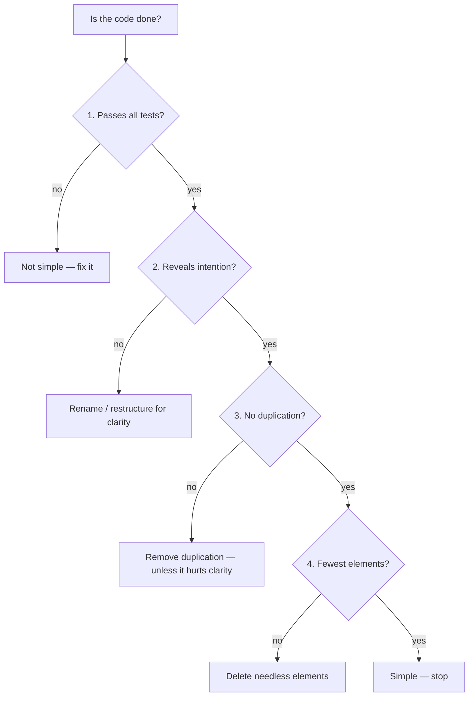
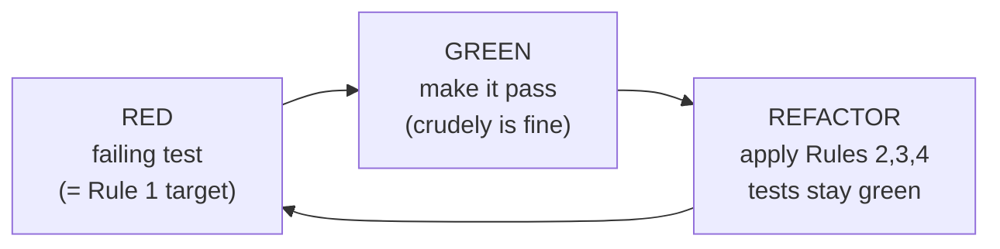
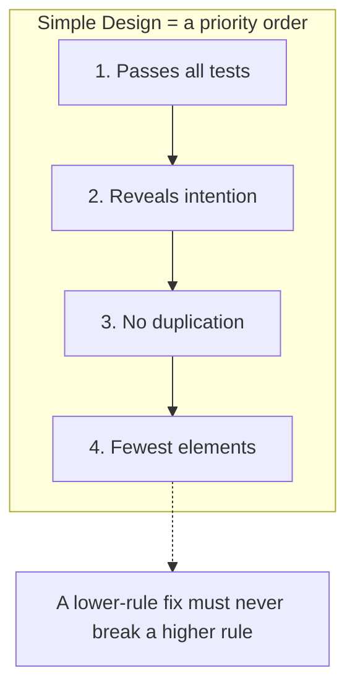

# Simple Design — Junior

> **Category:** [Craftsmanship Disciplines](../README.md) — Kent Beck's four rules for writing code that is no more complicated than it needs to be, in strict priority order.

---

## Introduction

> Focus: **What is it?** and **How to use it?**

**Simple design** is a set of four rules, written by Kent Beck, that tell you when a design is "done" — not when it has every feature it could ever need, but when it is **as simple as it can be while still doing its job correctly.** The rules are deliberately small and concrete:

> A design is simple when, in this order, it:
> 1. **Passes all the tests.**
> 2. **Reveals intention** (is clear / expresses the programmer's intent).
> 3. **Has no duplication** (DRY).
> 4. **Has the fewest elements** (no needless classes, methods, or abstractions).

That is the whole rulebook. There is nothing about clever patterns, no checklist of architecture diagrams, no quota of interfaces. Simple design is a **definition of "good enough" you can apply to any piece of code** — a class, a method, a module — to decide whether it needs more work or whether you should stop.

### Why this matters

Most code is not too simple. It is **too complicated** — full of abstractions added "just in case," interfaces with a single implementation, configuration nobody uses, and layers that exist only because a tutorial used them. Every one of those things is a cost: more to read, more to test, more to change, more places for a bug to hide. Simple design is the discipline of **not paying those costs until you actually need to.**

The rules also give you a shared, objective vocabulary. Instead of arguing "I think this is over-engineered" versus "I think it's flexible," two engineers can ask precise questions: *Does it pass the tests? Is the intent clear? Is there duplication? Is there an element we could remove without losing any of the first three?* Disagreements collapse into answerable questions.

---

## Prerequisites

- **Required:** You can write and run **automated tests** (the first rule is "passes all the tests").
- **Required:** Comfort with functions/methods, classes, and basic refactoring (rename, extract method).
- **Helpful:** A feel for **DRY** — "Don't Repeat Yourself" — since rule 3 is DRY.
- **Helpful:** Exposure to **[refactoring](../03-refactoring-as-a-discipline/junior.md)** as behavior-preserving change, because simple design is something you *refactor toward*.

---

## Glossary

| Term | Definition |
|------|-----------|
| **Simple design** | Code that passes its tests, reveals intent, has no duplication, and has the fewest elements — in that priority order. |
| **Reveals intention** | A reader can tell *what* the code does and *why* from its names and structure, without tracing every line. |
| **Duplication (DRY)** | The same knowledge expressed in more than one place; a change to that knowledge requires editing several spots. |
| **Fewest elements** | The minimum number of classes, methods, fields, and abstractions needed — no speculative extras. |
| **YAGNI** | "You Aren't Gonna Need It" — don't build a capability until a real, present requirement demands it. |
| **Emergent design** | Letting the design grow out of repeated small refactorings as requirements appear, rather than fixing it all up front. |
| **Speculative generality** | Flexibility added for a future that hasn't arrived (extra parameters, hooks, abstract base classes with one subclass). |
| **Rule of three** | Tolerate duplication twice; on the *third* occurrence, extract the abstraction — by then you know its real shape. |

---

## The Four Rules

### Rule 1 — Passes all the tests

A design that does not work is not simple; it is broken. Correctness is the floor. This rule is first for a blunt reason: **the cleanest, most elegant code in the world is worthless if it produces the wrong answer.** It also ties simple design to testing — you cannot apply rules 2–4 (which involve *changing* code) safely unless tests tell you that you haven't broken anything.

### Rule 2 — Reveals intention

The code should make its purpose obvious. Names say what things are and do; structure mirrors the problem; a new reader can follow the *why*, not just the *how*. This is the rule about **communication** — Beck's framing is that we write code primarily for other humans (including future-you), and only incidentally for the machine.

```python
# Hides intent
def p(d):
    return d * 0.9

# Reveals intent
def apply_loyalty_discount(price):
    return price * (1 - LOYALTY_DISCOUNT_RATE)
```

### Rule 3 — No duplication (DRY)

Every piece of *knowledge* should live in exactly one place. Duplication is dangerous not because it wastes keystrokes but because it splits a single truth across multiple locations — change one and forget the others, and you have a bug. (See the DRY principle.)

### Rule 4 — Fewest elements

After the first three are satisfied, remove anything that remains. A class that does nothing, a method called from one place that just forwards a call, an interface with one implementation, a parameter always passed the same value — delete them. **Fewer moving parts means less to understand and less to break.**

---

## Why the Order Matters

The four rules are a **priority order, not a checklist of equals.** When two rules conflict, the earlier one wins. This is the part beginners miss most often.

- **Tests beat clarity.** If making code "prettier" breaks a test, the test wins — you don't ship clever code that's wrong.
- **Clarity beats DRY.** This is the famous and contested case: sometimes removing duplication makes code *less* clear (a tortured shared helper that serves three callers awkwardly). When DRY fights clarity, **clarity wins** — Beck ordered "reveals intention" above "no duplication" deliberately. (More on this debate, and the "rules 2 and 3 are sometimes swapped" view, at the [Middle](middle.md) level.)
- **Everything beats element-count.** You never delete a needed class to hit "fewest elements" if doing so duplicates code or obscures intent. Minimalism is the *last* tiebreaker, not a license to crush working code into a dense ball.



The funnel reads top to bottom: a fix at a lower rule must **never** break a higher one.

---

## Real-World Analogies

| Concept | Analogy |
|---|---|
| **The four rules in priority order** | Maslow's hierarchy: you secure survival (it works) before comfort (it's clear) before luxury (it's tidy). You don't redecorate a house that's on fire. |
| **Reveals intention** | A well-labeled fuse box. Anyone can find the right switch without testing each one. |
| **No duplication** | A single source of truth — one master key, not five copies you must all re-cut when the lock changes. |
| **Fewest elements** | Packing for a trip: take what you'll use, not what you *might* use. Every extra item is weight you carry the whole way. |
| **YAGNI / speculative generality** | Building a six-lane highway to a village of ten people because it "might grow." You pay for six lanes now; the village may never come. |

---

## Mental Models

**The intuition:** *"Make it work, make it clear, remove the repetition, then delete whatever's left over — and never sacrifice an earlier goal for a later one."*

```
            ┌─────────────────────────────┐
  PRIORITY  │  1. Passes all the tests     │  ← correctness floor
    HIGH    │  2. Reveals intention        │  ← communication
            │  3. No duplication           │  ← single source of truth
    LOW     │  4. Fewest elements          │  ← minimalism (last tiebreaker)
            └─────────────────────────────┘
   When two conflict, the HIGHER rule wins.
```

A second model: simple design is a **subtractive** discipline. Most design advice tells you what to *add* (a pattern, a layer, an interface). Simple design mostly tells you what to *remove* once the code works — duplication, then needless elements. You add only what the four rules force you to.

---

## A Worked Example: Evolving a Design

Watch a design pass through all four rules. We're computing shipping cost.

### Start: it doesn't even work yet (Rule 1 not met)

```python
def shipping(weight, country):
    if country == "US":
        cost = weight * 2
    # bug: no branch for other countries; returns None
    return cost
```

There's a `NameError`/`None` for any non-US country. **Rule 1 fails** — a test would catch it. We have no business polishing anything until it's correct.

### Make it pass the tests (Rule 1 ✓)

```python
def shipping(weight, country):
    if country == "US":
        return weight * 2
    if country == "CA":
        return weight * 3
    return weight * 5   # default: international
```

A test suite (`US → 2/kg`, `CA → 3/kg`, `other → 5/kg`) now passes. **Rule 1 satisfied.** We could stop here if we were under fire — working beats pretty. But we're not, so we move down the list.

### Make it reveal intention (Rule 2 ✓)

The magic numbers `2`, `3`, `5` hide *what* they are. A reader can't tell a rate from a weight multiplier. Name the knowledge:

```python
RATE_PER_KG = {"US": 2, "CA": 3}
DEFAULT_INTERNATIONAL_RATE = 5

def shipping_cost(weight_kg, country_code):
    rate = RATE_PER_KG.get(country_code, DEFAULT_INTERNATIONAL_RATE)
    return weight_kg * rate
```

Now the names say what's happening: rates per kilogram, a default for everywhere else. **Rule 2 satisfied** — *and we kept the tests green*, so we never violated Rule 1 to get here.

### Check for duplication (Rule 3 ✓)

Is any knowledge stated twice? The rate table holds each rate once; the formula `weight * rate` appears once. There's no duplication to remove. **Rule 3 is already satisfied** — note that you don't *invent* duplication to remove; you only remove what exists.

> ⚠️ A junior trap here is to "DRY up" too early — e.g., extracting a `Country` class and a `ShippingStrategy` interface "for flexibility." That would *add* elements (violating Rule 4) to solve a duplication problem that doesn't exist. Don't.

### Remove needless elements (Rule 4 ✓)

Is there anything we could delete without losing rules 1–3? Two functions ago we had a sprawling `if` ladder; it's already gone. There's no unused parameter, no dead branch, no class that isn't pulling its weight. The design is two constants and one three-line function. **Rule 4 satisfied — the design is simple. Stop.**

### What we did *not* do

We did **not** add: a `ShippingCalculator` class, a `CountryRateProvider` interface, a strategy-per-country, a config file, or a plugin system. None of those is needed *today*. If a real requirement arrives — say, time-of-year surcharges or per-carrier rates — the design will **grow** to meet it then, guided by the same four rules. That growth-on-demand is **[emergent design](middle.md)**, and the restraint that enables it is **YAGNI**.

---

## Code Examples

### Java — applying "reveals intention" + "no duplication"

```java
// Before: works (Rule 1) but obscure and duplicated
double total(List<Item> items) {
    double t = 0;
    for (Item i : items) t += i.getP() * i.getQ();   // what are p, q?
    double tax = 0;
    for (Item i : items) tax += i.getP() * i.getQ() * 0.2;  // line price duplicated
    return t + tax;
}

// After: intent revealed, the "line price" knowledge stated once
double total(List<Item> items) {
    double subtotal = items.stream().mapToDouble(Item::lineTotal).sum();
    double tax = subtotal * TAX_RATE;
    return subtotal + tax;
}
// Item.lineTotal() = price * quantity  — defined in ONE place
```

`lineTotal()` removes the duplicated `price * quantity` (Rule 3) *and* names the concept (Rule 2). Tests stay green throughout (Rule 1).

### Go — "fewest elements": delete the needless abstraction

```go
// Before: an interface with exactly one implementation, used in one place
type Greeter interface{ Greet(name string) string }

type EnglishGreeter struct{}
func (EnglishGreeter) Greet(name string) string { return "Hello, " + name }

func welcome(g Greeter, name string) string { return g.Greet(name) }

// After: no second implementation exists or is planned → delete the interface
func welcome(name string) string { return "Hello, " + name }
```

The `Greeter` interface, the struct, and the parameter were *speculative* — added "in case we localize later." There's one caller and one behavior. Rule 4 says delete them; if localization ever becomes a real requirement, reintroduce the seam *then*.

### Python — keep it correct first, polish second

```python
# Rule 1 comes first: the test must pass before anything else matters.
def median(numbers):
    if not numbers:
        raise ValueError("median of empty sequence is undefined")
    ordered = sorted(numbers)
    mid = len(ordered) // 2
    if len(ordered) % 2 == 1:
        return ordered[mid]
    return (ordered[mid - 1] + ordered[mid]) / 2
```

This is already simple: it passes its tests, the names reveal intent, there's no duplication, and there's no element you could remove. A junior tempted to add a `Statistics` class wrapping one function is reaching for Rule-4 *violations* dressed up as structure.

---

## Simple Is Not Easy; Simple Is Not Simplistic

Two distinctions that trip people up:

- **Simple ≠ easy.** *Simple* is a property of the design (few, well-separated, clear parts). *Easy* is about effort or familiarity. Writing simple code is often *hard* — it takes more thought to find the small, clean solution than to bolt on another `if`. (This is Rich Hickey's point in his talk *Simple Made Easy*: we reach for the easy thing — the familiar tool, the quick patch — and end up *complecting*, i.e., braiding concerns together, which is the opposite of simple.)
- **Simple ≠ simplistic.** *Simplistic* means oversimplified to the point of being wrong — ignoring a real case to make the code shorter. Simple design's Rule 1 forbids this: a simplistic solution that drops a required behavior **fails the tests** and is therefore not simple. Simplicity removes the *needless*, never the *necessary*.

> Simple design is "the smallest thing that is still correct and clear" — not "the shortest thing," and not "the easiest thing to type."

---

## Where the Rules Come From: TDD's Refactor Step

Simple design isn't usually achieved by *planning* it perfectly up front. It **emerges** from the [Red-Green-Refactor cycle](../01-the-three-laws-of-tdd/junior.md):

1. **Red** — write a failing test (this is Rule 1, made executable).
2. **Green** — make it pass as quickly as possible, even crudely.
3. **Refactor** — *now* apply rules 2, 3, 4: clarify names, remove duplication, delete needless elements — with the tests guarding against regressions.

The refactor step is *literally* where you apply simple design. Each cycle you make the code work, then make it simple. Over many cycles, a clean design **emerges** without ever being drawn on a whiteboard in full. This is why simple design and TDD are inseparable disciplines — tests give you the safety to keep simplifying, and the refactor step gives you the moment to do it.



---

## Best Practices

1. **Apply the rules in order.** Tests first, then clarity, then DRY, then minimalism. Never break a higher rule to satisfy a lower one.
2. **Reach Green, then refactor toward simple.** Don't try to write perfect code on the first pass; make it work, then make it simple.
3. **Name the knowledge** (Rule 2). Replace magic numbers and cryptic abbreviations with intention-revealing names.
4. **Remove duplication of *knowledge*, not just text** (Rule 3) — but stop if doing so hurts clarity.
5. **Delete on sight** (Rule 4): unused parameters, single-implementation interfaces, pass-through methods, dead branches, "for later" hooks.
6. **Practice YAGNI.** Don't build for a future requirement that doesn't exist yet; let the design grow when the requirement actually arrives.

---

## Common Mistakes

1. **Treating the four rules as equal.** They're a priority order. When clarity and DRY conflict, clarity wins; when anything conflicts with "fewest elements," the other rule wins.
2. **Skipping Rule 1.** Polishing code that doesn't pass its tests. Correct first; pretty second.
3. **Confusing "simple" with "short."** Cramming logic into a dense one-liner can *reduce* clarity (Rule 2) — that's not simpler, it's worse.
4. **Speculative generality.** Adding interfaces, config, and abstractions for imagined futures — the direct opposite of Rule 4.
5. **Premature DRY.** Extracting a shared helper after the *second* occurrence, before you know the real shape — see the [rule of three](middle.md).
6. **Adding structure to feel "professional."** A wrapper class around one function, a layer that only forwards calls — needless elements that violate Rule 4.

---

## Tricky Points

- **Rules 2 and 3 are "sometimes swapped."** Beck himself has said the exact ordering of "reveals intention" vs. "no duplication" is debatable, and various teachers list them in either order. The widely cited resolution (Corey Haines, *Understanding the Four Rules of Simple Design*) is that **removing duplication and revealing intent reinforce each other** and you iterate between them — but when they truly conflict, prefer clarity. Covered in depth at [Middle](middle.md) and [Senior](senior.md).
- **"No duplication" means no duplicate *knowledge*, not no duplicate *characters*.** Two lines that look alike but encode different decisions are *not* duplication — and merging them (coincidental DRY) is a bug waiting to happen. See [Senior](senior.md).
- **"Fewest elements" is the last rule on purpose.** It's a tiebreaker, not a mandate to minify. You never delete a needed abstraction to win on element count.
- **Simple design is emergent, but not *accidental*.** Letting the design emerge doesn't mean not thinking — it means thinking *continuously* (every refactor step) instead of *only* up front. The tension with up-front design is real and explored at [Senior](senior.md).

---

## Test Yourself

1. List the four rules of simple design **in priority order.**
2. When "reveals intention" and "no duplication" conflict, which wins, and why is that the conventional ordering?
3. What does "fewest elements" mean, and why is it the *last* rule?
4. What is YAGNI, and how does it relate to Rule 4?
5. In which step of TDD do you apply simple design's rules 2–4?
6. Explain "simple is not the same as easy" in one sentence.

---

## Cheat Sheet

```text
THE FOUR RULES (in priority order — higher beats lower)
  1. Passes all the tests       ← correctness floor
  2. Reveals intention          ← clear names, structure mirrors problem
  3. No duplication (DRY)        ← each piece of knowledge in ONE place
  4. Fewest elements            ← delete needless classes/methods/abstractions

HOW TO APPLY (during TDD's Refactor step)
  make it work  → make it clear → remove duplication → delete leftovers → stop

GUARDING PRINCIPLES
  YAGNI                 don't build for an imagined future
  rule of three         tolerate duplication twice; extract on the third
  simple ≠ easy         simple is a design property; easy is effort/familiarity
  simple ≠ simplistic   never drop a REQUIRED behavior to shorten code
```

---

## Summary

- **Simple design** = four rules, in priority order: **passes the tests → reveals intention → no duplication → fewest elements.**
- The **order is strict**: when two rules conflict, the higher one wins. Clarity beats DRY; everything beats element-count.
- You **refactor toward** simple design in TDD's **Refactor** step; the design **emerges** over many cycles rather than being fully planned up front.
- **YAGNI** keeps Rule 4 satisfied by stopping speculative generality before it's added.
- **Simple ≠ easy** (it's often hard work) and **simple ≠ simplistic** (Rule 1 forbids dropping required behavior).

---

## Further Reading

- Kent Beck, *Extreme Programming Explained* — the original four rules of simple design.
- Corey Haines, *Understanding the Four Rules of Simple Design* — book-length treatment, including the rules-2-and-3 ordering debate.
- Martin Fowler, [BeckDesignRules](https://martinfowler.com/bliki/BeckDesignRules.html) — concise canonical restatement.
- Rich Hickey, *Simple Made Easy* (talk) — "simple ≠ easy," and *complecting*.
- The DRY principle — Rule 3 in full.

---

## Related Topics

- **Sibling disciplines:** [Refactoring as a Discipline](../03-refactoring-as-a-discipline/junior.md), [The Three Laws of TDD](../01-the-three-laws-of-tdd/junior.md).
- **Underlies Rule 3:** DRY.
- **Tension with:** up-front design / SOLID over-application (see [Senior](senior.md)).

---

## Diagrams




---

## Check your understanding

1. Explain Simple Design — Junior Level in your own words and name the problem it solves.
2. How would you apply the ideas around Table of Contents, Introduction, Prerequisites in a realistic engineering change?
3. What failure mode or misuse should you look for, and what evidence would reveal it?
4. What small example would prove that you can apply Simple Design — Junior Level correctly?
5. What observable result would convince you that the approach improved the system?
