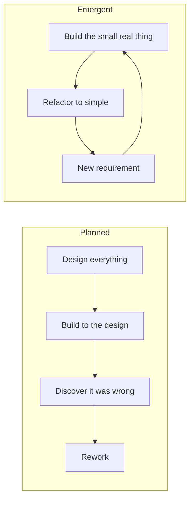
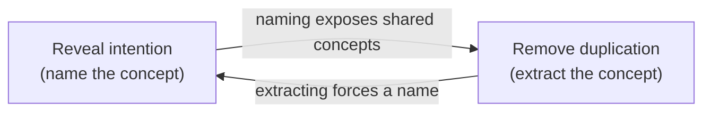
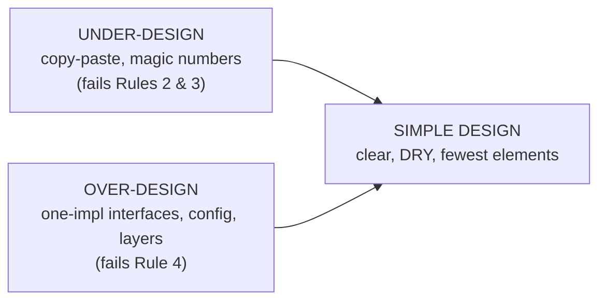
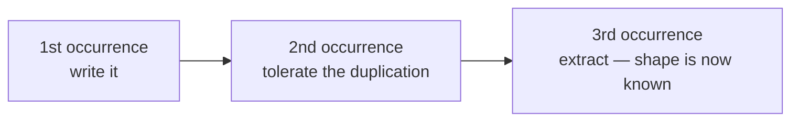

# Simple Design — Middle

> **Category:** [Craftsmanship Disciplines](../README.md) — Kent Beck's four rules for writing code that is no more complicated than it needs to be, in strict priority order.

> **Prerequisite:** [Junior](junior.md)
> **Focus:** **Why** and **When**

---

## Introduction

> Focus: **Why** and **When**

At the junior level, the four rules are a definition you recite. At the middle level they become a **set of judgement calls you make many times a day**: *Is this duplication, or two things that merely look alike? Should I extract this now or wait? Is this abstraction earning its keep, or did I add it for a future that may never come?*

The recurring tension is between **two failure modes**:

- **Under-design** — copy-paste everywhere, magic numbers, no names. Fails rules 2 and 3.
- **Over-design** — interfaces with one implementation, configurable everything, layers that only forward calls. Fails rule 4.

Most engineers are taught to fear under-design and so they over-correct into over-design, which the industry rewards because it *looks* sophisticated. Simple design's contribution is to make over-design **visibly wrong**: every speculative element fails Rule 4. The middle-level skill is calibrating between the two, and the single best calibration tool is **YAGNI plus the rule of three.**

---

## Applying the Rules to Real Code

Consider a feature request: *"Email users a receipt after purchase."* A first, working version:

```python
def send_receipt(order):
    body = f"Thanks! You paid ${order.total}."
    smtp.send(to=order.email, subject="Receipt", body=body)
```

It passes a test (Rule 1) and is reasonably clear (Rule 2). No duplication, no needless elements. **It's simple. Ship it.**

Now compare a "senior-looking" first version a lot of teams would actually write:

```python
class NotificationStrategy(ABC):
    @abstractmethod
    def notify(self, recipient, payload): ...

class EmailNotificationStrategy(NotificationStrategy):
    def __init__(self, transport: Transport, template_engine: TemplateEngine): ...
    def notify(self, recipient, payload): ...

class NotificationService:
    def __init__(self, strategies: dict[Channel, NotificationStrategy]): ...
    def send_receipt(self, order): ...
```

This is *one email*. There is one channel, one template, one caller. The strategy interface has one implementation; the registry holds one entry; the service forwards one call. **Every extra element fails Rule 4**, and none of them is forced by any of the first three rules. The five-line function is the simpler — and therefore better — design *for the requirement that exists.*

The discipline isn't "never build the strategy pattern." It's: **build it the day a second channel becomes a real requirement, not the day you imagine one might.** When SMS receipts actually arrive, you'll extract the seam — and you'll know its true shape because you'll have two concrete cases, not one and a guess.

---

## YAGNI in Practice

**YAGNI — "You Aren't Gonna Need It"** — is the operational rule that keeps Rule 4 satisfied *as you write*, before needless elements ever appear. It applies to:

| Speculative addition | YAGNI says |
|---|---|
| A config option no requirement asks for | Hard-code the value; make it configurable when someone needs to configure it. |
| A parameter "in case we need to vary it" | Drop it; add it when a caller varies it. |
| An interface with one implementation | Use the concrete type; extract the interface at the second implementation. |
| A generic `process(type, data)` switchboard | Write the specific functions; generalize when you have ≥3 concrete cases. |
| A plugin/extension system | Build the one behavior; add the seam when a second plugin is real. |

### The cost YAGNI is protecting you from

Speculative code is not free even if it's "never used":

- It must be **read** every time someone navigates the module.
- It must be **maintained** — it breaks during refactors and needs updating.
- It must be **tested** (or it rots untested, which is worse).
- It **constrains** the eventual real design: when the requirement finally arrives, it rarely matches your guess, so you now refactor *away* from the speculation before building the real thing — slower than if you'd built nothing.

> YAGNI is not "never think about the future." It's "don't *encode* a future guess in today's structure." You can absolutely note "we'll probably need SMS later" — just don't ship the abstraction for it now.

### The exception: one-way doors

YAGNI bends for decisions that are **expensive or impossible to reverse later** — a public API contract, a data-storage format, a wire protocol, an encryption choice. There, a little up-front design is cheaper than a migration. The test is reversibility: *cheap to change later → defer (YAGNI); costly to change later → decide now.* (More at [Senior](senior.md).)

---

## Emergent vs. Planned Design

These are the two philosophies of *where the design comes from.*

| | **Planned (Big Design Up Front)** | **Emergent (evolutionary)** |
|---|---|---|
| When the design is decided | Before coding, often in full | Continuously, as requirements appear |
| Driven by | Anticipated requirements | Actual requirements + refactoring |
| Risk | Guesses wrong; builds unneeded flexibility | Can paint itself into a corner if refactoring is neglected |
| Relies on | Foresight | Tests + relentless refactoring (the Refactor step) |
| Simple design's stance | Use sparingly, for irreversible choices | **The default** |

Simple design is the engine of **emergent design**: you keep the code at "simplest that works" after every change, so it's always ready to absorb the *next* change cheaply. The key insight middle engineers must internalize:

> **Emergent design is not "no design." It's design distributed across every refactor step instead of concentrated up front.** It only works if you actually refactor — emergent design without disciplined refactoring degrades into a mess.



The honest trade-off: planned design wins when the domain is well understood and change is costly (avionics, payment ledgers' core invariants); emergent design wins for the vast majority of business software where requirements are discovered, not known. Most teams err toward planning *too much*, building flexibility for requirements that never materialize.

---

## The Rules-2-vs-3 Debate

The most-discussed wrinkle in simple design: **should "reveals intention" or "no duplication" come second?**

- Beck's canonical ordering puts **reveals intention (2) above no duplication (3)**.
- Some teachers (and Beck himself, in interviews) have said the two are **so intertwined that the exact order barely matters** — and have occasionally listed them swapped.
- **Corey Haines'** influential reading (*Understanding the Four Rules of Simple Design*) is the one to know: the two rules **drive each other in a loop.** Removing duplication often *forces* you to name the extracted concept (improving intent); naming a concept clearly often *reveals* that two pieces of code share it (exposing duplication). You don't apply them once each — you ping-pong between them until both are satisfied.



### Why intention is conventionally ranked higher

When the two genuinely **conflict** — i.e., the only way to remove a duplication makes the code less clear — **clarity wins.** Example:

```python
# Two methods share ~80% of their code, but the shared part reads differently
# in each context. A forced "DRY" extraction:
def _shared(self, mode, x, y, flag, extra=None):   # 5 params to serve 2 callers
    ...  # a tangle of `if mode ==` branches

# vs. accepting a little duplication for two clear, independent methods:
def render_summary(self): ...     # clear, self-contained
def render_detail(self): ...      # clear, self-contained
```

The "DRY" version is technically less duplicated but harder to read, harder to change (every edit risks both callers), and more coupled. Two clear methods with minor overlap satisfy the **higher** rule (intention) at the cost of the **lower** rule (duplication) — and that's the correct trade because of the priority order. This is the practical payoff of ranking intention above DRY.

> The synthesis: **chase both, but if you must choose, choose clarity.** Duplication you can see and remove later; obscurity rots silently.

---

## Removing Speculative Generality

**Speculative generality** (Fowler's term) is the named code smell that Rule 4 targets. It has recognizable shapes:

| Smell shape | Tell | Cure |
|---|---|---|
| Interface with one implementation | `FooImpl` is the only `Foo` | Inline the interface; reintroduce at impl #2 |
| Abstract class with one subclass | A hierarchy of two | Collapse into one class |
| Unused parameter | Always passed the same value (or `null`) | Remove the parameter |
| "Just in case" hook / callback | An extension point nobody extends | Delete it |
| Over-generalized name | `Manager`, `Processor`, `Handler`, `Base`, `Generic` | The vagueness signals "I didn't know what this is for" |
| Configurability nobody configures | A setting with one production value | Hard-code it |
| Pass-through method | `getX() { return delegate.getX(); }` | Inline the delegation |

### Worked removal (Java)

```java
// BEFORE — speculative generality
interface DiscountPolicy { double apply(double price); }

class StandardDiscountPolicy implements DiscountPolicy {
    public double apply(double price) { return price * 0.95; }
}

class PriceCalculator {
    private final DiscountPolicy policy;            // injected, but only ever Standard
    PriceCalculator(DiscountPolicy policy) { this.policy = policy; }
    double finalPrice(double base) { return policy.apply(base); }
}
```

There is one policy, wired in one place. The interface, the impl class, the field, and the constructor parameter are all flexibility for a second discount policy **that does not exist**.

```java
// AFTER — fewest elements; the seam returns when a 2nd policy is real
class PriceCalculator {
    private static final double STANDARD_DISCOUNT = 0.95;
    double finalPrice(double base) { return base * STANDARD_DISCOUNT; }
}
```

When a *second* discount policy genuinely appears, you reintroduce `DiscountPolicy` — and now you design it around two concrete cases instead of one and a fantasy, so it fits.

---

## Knowledge Duplication vs. Coincidental Similarity

Rule 3 says "no duplication," but middle engineers must distinguish **two things that look identical:**

- **Real duplication** — the *same knowledge* (a business rule, a formula, a constant) expressed in two places. Change the knowledge once and you must change every copy. **This is what Rule 3 targets.**
- **Coincidental duplication** — two pieces of code that *happen* to look alike today but encode *different decisions* that may diverge tomorrow.

Merging coincidental duplication is a real bug source — you couple two things that should evolve independently, and the first time one needs to change, you either break the other or add a parameter/flag (re-introducing complexity and ironically *more* coupling).

```python
# These LOOK identical — but are they the same knowledge?
def tax_for_invoice(amount):  return amount * 0.20
def tax_for_payroll(amount):  return amount * 0.20   # coincidence! different rule

# DON'T merge into one `tax(amount)` — invoice VAT and payroll tax are
# different decisions that share a value today and will diverge tomorrow.
INVOICE_VAT_RATE = 0.20
PAYROLL_TAX_RATE = 0.20      # named separately; free to change independently
```

The test: *would a change to one necessarily mean the same change to the other?* If yes → same knowledge → DRY them. If no → coincidence → keep them apart. **DRY is about knowledge, not about characters on screen.** (Deepened with *connascence* at [Senior](senior.md).)

---

## When Each Rule Should Stop You

A practical way to use the rules: as **stop signs** during refactoring.

- **Rule 1 stops you from shipping** code whose tests are red — no matter how clean it looks.
- **Rule 2 stops you from extracting** a "clever" helper that makes call sites harder to read.
- **Rule 3 stops you from copy-pasting** a third time (rule of three) — but *also* stops over-eager DRY when extraction hurts Rule 2.
- **Rule 4 stops you from adding** the interface/config/layer "for later."

If a proposed change can't satisfy the rule it's meant to serve *without violating a higher rule*, **don't make the change** — the priority order has already answered the question.

---

## Trade-offs

| Decision | Lean simple (YAGNI / fewest elements) | Lean flexible (up-front structure) |
|---|---|---|
| Cost today | Low — less code | High — build + test the abstraction |
| Cost when requirement arrives | Refactor to add the seam (cheap with tests) | Possibly zero — *if* you guessed right |
| Risk | Could need rework later | Wrong guess → rework *plus* dead code to remove |
| Readability now | High | Lower (indirection for absent reasons) |
| Best when | Requirements are uncertain (most software) | Change is irreversible/expensive (one-way doors) |

The asymmetry that favors simple: when you defer and turn out to need the abstraction, you pay *once* to add it. When you speculate and turn out wrong, you pay *twice* — to remove the wrong abstraction *and* to build the right one. Deferring is the lower-variance bet.

---

## Edge Cases

### 1. The "we'll definitely need it" abstraction

Sometimes you're nearly certain a second case is coming. YAGNI still usually wins, because "nearly certain" guesses about *shape* are wrong far more often than guesses about *existence*. You may need *something*, but rarely the thing you'd build today. Defer until the second concrete case pins the shape.

### 2. Duplication that's cheaper to keep

Two three-line functions with two identical lines aren't worth a shared helper — the extraction (a new function, a new name, an import, a new test) adds *more* elements than the duplication costs. Rule 4 can outweigh Rule 3 for trivially small duplication. DRY is a means to maintainability, not an end in itself.

### 3. Tests are part of "fewest elements" too

Over-mocked, over-abstracted test suites violate simple design *of the tests*. A test helper hierarchy nobody understands is speculative generality in the test code. The four rules apply to tests as much as to production code.

---

## Tricky Points

- **YAGNI ≠ "don't think ahead."** You think ahead constantly; you just don't *encode* the guess in structure. Keeping the design simple *is* how you stay ready for the future.
- **Emergent design requires refactoring discipline.** "Let it emerge" without the Refactor step is just "let it rot." The two are a package.
- **Removing duplication can increase coupling.** A shared helper ties its callers together. If they should evolve independently, that coupling is a defect — keep the duplication. (See DRY.)
- **The rules-2-vs-3 order only matters when they conflict.** 95% of the time, removing duplication and clarifying intent are the *same* move. Spend your energy on the conflict cases, where clarity wins.
- **"Fewest elements" counts concepts, not lines.** A clear ten-line function can be simpler than a cryptic three-line one. You're minimizing things-to-understand, not characters.

---

## Best Practices

1. **Default to the small concrete solution.** Build the abstraction when the second real case arrives, not before.
2. **Apply the rule of three** for duplication: tolerate it twice, extract on the third — by then you know its shape.
3. **Distinguish knowledge duplication from coincidence** before DRYing: *would a change to one force the same change to the other?*
4. **Hunt speculative generality** in review: one-impl interfaces, unused params, "Manager/Base" names, config nobody sets.
5. **When clarity and DRY conflict, choose clarity** — it's the higher rule.
6. **Refactor every Green to simple.** Emergent design only works if you keep paying down the design each cycle.
7. **Reserve up-front design for one-way doors** (public APIs, data formats, protocols).

---

## Test Yourself

1. What's the difference between knowledge duplication and coincidental similarity, and why does it matter for Rule 3?
2. State the rule of three and why it beats "DRY immediately."
3. Why does emergent design *require* refactoring discipline to work?
4. Give three concrete shapes of speculative generality and their cures.
5. When DRY and clarity conflict, which wins, and why (per the priority order)?
6. What's the one category of decision where YAGNI bends toward up-front design?

---

## Summary

- The middle-level skill is **calibrating between under-design and over-design**, with YAGNI and the rule of three as the calibration tools.
- **YAGNI** keeps Rule 4 satisfied by stopping speculative elements before they're added; it bends only for **one-way doors**.
- **Emergent design** is simple design's engine — design distributed across every refactor step — and it *requires* refactoring discipline.
- The **rules-2-vs-3 debate** resolves as: chase both (they reinforce each other), but when they conflict, **clarity beats DRY.**
- DRY targets **duplicated knowledge**, not coincidental similarity; merging coincidence creates harmful coupling.
- **Speculative generality** is the named smell Rule 4 removes: one-impl interfaces, unused params, "for later" hooks.

---

## Diagrams

### Under-design vs. over-design — simple design is the middle



### Rule of three




---

## Check your understanding

1. Explain Simple Design — Middle Level in your own words and name the problem it solves.
2. How would you apply the ideas around Table of Contents, Introduction, Applying the Rules to Real Code in a realistic engineering change?
3. What failure mode or misuse should you look for, and what evidence would reveal it?
4. Which local design trade-off would make you choose or reject Simple Design — Middle Level in an existing codebase?
5. What observable result would convince you that the approach improved the system?
