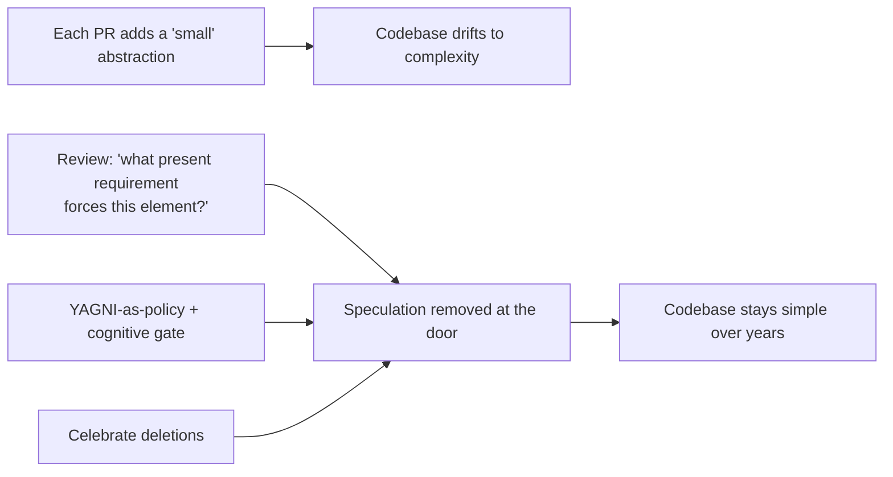
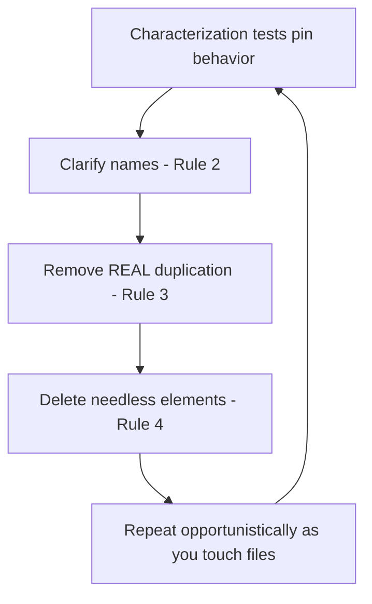

# Simple Design — Professional

> **Category:** [Craftsmanship Disciplines](../README.md) — Kent Beck's four rules for writing code that is no more complicated than it needs to be, in strict priority order.

> **Prerequisites:** [Junior](junior.md) · [Middle](middle.md) · [Senior](senior.md)
> **Focus:** **Production** — reviews, metrics, team conventions, legacy systems

---

## Table of Contents

1. [Introduction](#introduction)
2. [Enforcing Simplicity in Code Review](#enforcing-simplicity-in-code-review)
3. [Fighting Gold-Plating](#fighting-gold-plating)
4. [Measuring Complexity](#measuring-complexity)
5. [Team Conventions for Simple Design](#team-conventions-for-simple-design)
6. [Refactoring Toward Simple Design in Legacy Systems](#refactoring-toward-simple-design-in-legacy-systems)
7. [Real Incidents](#real-incidents)
8. [The Politics of Simplicity](#the-politics-of-simplicity)
9. [Review Checklist](#review-checklist)
10. [Cheat Sheet](#cheat-sheet)
11. [Diagrams](#diagrams)
12. [Related Topics](#related-topics)

---

## Introduction

> Focus: **production** — keeping a large, multi-contributor codebase simple over years.

Simple design is easy to *agree* with and hard to *sustain*. Individually, every engineer wants clean code. Collectively, codebases drift toward complexity: each person adds a "small" abstraction, a "just in case" flag, a layer that matches the framework's tutorial. No single change is unreasonable; the aggregate is a system nobody can change confidently.

At the professional level the question is operational: **how do you keep a codebase simple when hundreds of changes land per week from dozens of people with different instincts?** The answer is a system: review standards that name the smells, metrics that make complexity visible (and don't lie about it), team conventions that make the simple path the default, and a disciplined approach to clawing back simplicity in legacy code without breaking it.

---

## Enforcing Simplicity in Code Review

Code review is where simplicity is won or lost, because most over-engineering enters one PR at a time. A reviewer applying simple design checks the four rules **in order**, and — crucially — pushes back on *additions* as hard as on bugs.

### Review by rule

1. **Rule 1 (tests):** Are there tests, and do they pass? Do they cover the change, not just exist? No tests → not simple, regardless of how clean it looks.
2. **Rule 2 (intent):** Can you understand each new name and structure without asking the author? Names like `Manager`, `Helper`, `Processor`, `data2`, `flag` are intent-failures. A method you have to read three times is a Rule-2 failure even if it's correct.
3. **Rule 3 (duplication):** Is genuine *knowledge* duplicated? (And — the senior check — is the author DRYing *coincidental* similarity, manufacturing coupling?)
4. **Rule 4 (fewest elements):** **This is the one reviewers skip and shouldn't.** For every new interface, class, parameter, config option, and abstraction, ask: *what present requirement forces this?* "It's more flexible / future-proof / extensible" is a **red flag**, not a justification.

### The highest-value review question

> **"What real, current requirement makes this element necessary?"**

Asked of every speculative interface, flag, and layer, this single question prevents most over-engineering. If the honest answer is "we might need it later," the change is a YAGNI violation and the element should come out (you can add it the day the need is real). Make this question a normal, non-confrontational part of review — not an accusation, just the standard bar.

### Review comment templates

> "This interface has one implementation and one caller. What's the second implementation we're anticipating? If it's hypothetical, let's use the concrete type and extract the interface when the second one is real."

> "These two methods look duplicated, but `tax_invoice` and `tax_payroll` encode different rules that share a rate today. Merging them couples two things that should evolve independently — I'd keep them separate."

> "`process(type, mode, data)` is doing four jobs behind a switchboard. Three named functions would each be clearer (Rule 2) — the generality isn't earning its keep."

> "Great cleanup, but it broke `OrderTest.refundsPartial`. Rule 1 beats Rule 3 — let's keep the behavior and find another way to DRY this."

---

## Fighting Gold-Plating

**Gold-plating** is adding capability beyond requirements — the production-scale form of speculative generality. It's the chronic disease simple design exists to treat, and it has organizational, not just technical, roots:

| Root cause | What it looks like | Counter |
|---|---|---|
| **"Future-proofing" culture** | Every feature ships with extension points | Make YAGNI a stated team value; require a present requirement per abstraction |
| **Résumé-driven development** | Patterns/frameworks added to be impressive | Review bar: simplest thing that works; complexity must be *justified*, not simplicity |
| **Misread requirements** | Building the general case for a specific ask | Confirm scope; build exactly what's asked |
| **Boredom / over-capacity** | A simple task "made interesting" with architecture | Channel energy into tests, docs, or the next real feature |
| **Fear of looking junior** | Equating more structure with more skill | Reframe: removing an unneeded element is the senior move |

The cultural reframe a professional must drive: **simplicity is the achievement, not complexity.** In many teams, the person who adds a clever abstraction gets praised and the person who *deletes* one is invisible. Flip that. Celebrate deletions. "I removed the strategy pattern and three classes; the feature still works and the module is 200 lines shorter" should earn more respect than adding them did.

> A useful proverb for the team wall: *"It's harder to delete code than to add it, which is exactly why deleting it is worth more."*

---

## Measuring Complexity

You cannot manage what you can't see, and simple design's win is mostly **cognitive**, which naive metrics miss. The professional must choose metrics that actually track simplicity — and refuse to be fooled by ones that don't.

| Metric | Tracks simplicity? | Notes |
|---|---|---|
| **Cyclomatic complexity** (McCabe) | Partially | Counts branches; flags god functions, but blind to nesting/naming/over-abstraction |
| **Cognitive complexity** (SonarQube) | **Yes** | Penalizes nesting & hard-to-follow flow — closest single proxy for "reveals intention" |
| **Lines of code per file/method** | Weakly | Useful as a *trend*; low LOC can still be cryptic |
| **Number of classes/indirections per feature** | **Yes (for Rule 4)** | Rising element-count-per-feature is the over-engineering signal |
| **Duplication %** (PMD/CPD, SonarQube) | Partially | Catches textual duplication; **can't** tell knowledge from coincidence |
| **Coupling/connascence** (afferent/efferent, change-coupling) | **Yes** | Change-coupling (files that change together) surfaces *real* duplication metrics can't |
| **Code churn / change-failure rate** | **Yes (outcome)** | The ground truth: simple code is changed safely and often |

### The honest-measurement rules

- **Use cognitive complexity, not cyclomatic alone**, as your readability gate — the senior/professional consistent message across this whole curriculum.
- **Treat duplication % with suspicion.** A high score may be coincidental similarity that *should not* be merged; a low score can hide strong connascence-of-meaning that the tool can't see. Pair it with **change-coupling analysis** (which files actually change together in git history) to find *real* duplication.
- **Watch element-count-per-feature as a trend.** If shipping a comparable feature now takes twice the classes it did a year ago, the codebase is gold-plating.
- **The real metric is outcome:** can the team change this code quickly and safely? Lead time for changes and change-failure rate (DORA) are downstream of simplicity. If those degrade, the design got complex regardless of what the static metrics say.

> Never report "we reduced complexity" using only cyclomatic complexity after a clarity/over-engineering cleanup — it often won't move, and quoting it makes the report suspect. Report cognitive complexity, element count, and change-coupling.

---

## Team Conventions for Simple Design

Codify these so simplicity is the default path, not a per-PR fight:

1. **YAGNI is a stated value.** Written in the engineering handbook: *no abstraction without a present requirement.* This gives reviewers explicit license to push back on speculation.
2. **"Rule of three" for extraction.** No shared abstraction before the third concrete occurrence (unless the knowledge is provably identical). Prevents premature-abstraction churn.
3. **Concrete first, interface on the second implementation.** No one-implementation interfaces in new code. (Test seams are the explicit exception — document them.)
4. **Name things after the domain, not the mechanism.** Ban `Manager`/`Helper`/`Util`/`Base`/`Impl` as default names; they signal "I didn't find the concept."
5. **Cognitive-complexity gate in CI** (e.g., SonarQube threshold), not cyclomatic-only.
6. **Deletions are celebrated.** Track and call out net-negative-LOC PRs that remove complexity safely.
7. **One-way doors get a design note.** Irreversible decisions (schema, public API, protocol) require deliberate review; everything else is allowed to emerge.

These conventions encode the senior reasoning so juniors get it right by default and reviewers cite a policy, not a personal preference.

---

## Refactoring Toward Simple Design in Legacy Systems

Greenfield simple design is easy. The professional reality is **introducing simplicity into a system that is already complex, under-tested, and in production.** The approach is incremental, test-guarded, and opportunistic — never a rewrite.

### The sequence

1. **Pin behavior with characterization tests first.** You cannot satisfy Rule 1 ("passes all the tests") if there are no tests. Before changing legacy code, write tests that capture *current* behavior (even bugs) so refactoring can't silently change it. (See [Refactoring as a Discipline](../03-refactoring-as-a-discipline/junior.md) and *Working Effectively with Legacy Code*.)
2. **Then apply rules 2–4, smallest first.** With tests green, clarify names, then remove genuine duplication, then delete needless elements — in priority order, in small commits.
3. **Refactor opportunistically (the Boy Scout Rule).** Don't schedule a "simplify the codebase" mega-project (it never finishes and it's all risk). Improve each file *as you touch it for feature work.* Simplicity compounds through normal changes.
4. **Strangle, don't rewrite.** For a genuinely over-engineered subsystem, build the simpler replacement behind the existing interface and migrate callers incrementally (Strangler Fig), rather than a big-bang rewrite that risks everything at once.

### Removing the *wrong* abstraction safely

Legacy systems are full of premature abstractions (the senior-level death spiral, now load-bearing). The safe removal:

```text
1. Characterize: tests around every caller of the over-general abstraction.
2. Inline: push the abstraction's body back into each caller (now duplicated, but clear).
3. Simplify each caller independently — delete the flags/branches that caller never used.
4. Re-extract ONLY the parts that are genuinely shared knowledge across callers.
5. Delete the old abstraction.
```

This is "re-introduce duplication to escape the wrong abstraction" (Sandi Metz), executed safely with characterization tests as the net. The intermediate state has *more* duplication on purpose — that's correct; the wrong abstraction was worse than the duplication.

### What *not* to do in legacy code

- **Don't simplify without tests.** A "harmless cleanup" that flips a subtle behavior is the classic legacy-refactor incident. Rule 1 is non-negotiable.
- **Don't gold-plate the cleanup.** Replacing one over-engineered structure with a *different* over-engineered structure ("now with hexagonal architecture!") is not progress. Aim for the four rules, not for a new favorite pattern.
- **Don't boil the ocean.** A standalone "simplification initiative" with no feature value rarely survives the first deadline. Tie simplification to the work flowing through the code anyway.

---

## Real Incidents

### Incident 1: The flexible framework nobody used

A team built an internal "rules engine" — a generic, configurable, plugin-based system — to handle what was, at launch, *three* hard-coded business rules. Two years later it still held about five rules, all written by the same team, none by the "third-party plugin authors" the architecture anticipated. The engine was ~8,000 lines; the rules it ran were ~150. Every new rule required learning the engine's DSL. **Postmortem:** classic gold-plating — built for imagined extensibility that never arrived. **Fix:** the rules were re-expressed as plain functions (~150 lines total); the engine was deleted. Onboarding time for "add a rule" dropped from days to minutes. **Lesson:** flexibility you don't use is pure cost. The present requirement was three rules; the design should have been three functions.

### Incident 2: The "harmless" DRY refactor that flipped behavior

An engineer merged two near-identical `calculateFee` methods into one, parameterized by a flag. The two had *looked* identical but one rounded half-up and the other half-even (a regulatory difference nobody had documented). The merged version used one rounding mode for both. **Result:** thousands of transactions mis-rounded before reconciliation caught it. **Fix:** split them back apart, named for their *different* rules, with the rounding difference made explicit and tested. **Lesson:** coincidental similarity is not duplication. Without characterization tests pinning *both* rounding behaviors, the "DRY improvement" was a defect. (See [Senior](senior.md) on connascence.)

### Incident 3: Cyclomatic gate hid the real problem

A team's only quality gate was cyclomatic complexity. A developer "passed" it by extracting deeply nested logic into a chain of tiny private methods that each had low cyclomatic complexity but were impossible to follow as a whole (you had to chase fifteen methods to understand one operation). The metric was green; the code was inscrutable — a Rule 2 failure the gate couldn't see. **Fix:** added a cognitive-complexity gate and a review norm against pointless method-shredding. **Lesson:** the wrong metric rewards the wrong behavior. Measure cognitive complexity; correctness and clarity are the goals, not gaming a number.

### Incident 4: Under-engineering at a one-way door

To "keep it simple," a team inlined their persistence calls directly throughout the domain code instead of behind a repository seam — a defensible YAGNI call *if* storage were reversible. It wasn't: a compliance requirement forced a database migration, and the storage details were entangled in 200 domain files. **Lesson:** YAGNI applies to reversible decisions. The persistence boundary was a one-way door; "fewest elements" was the wrong rule to optimize there. (See [Senior](senior.md) on reversibility.)

---

## The Politics of Simplicity

Sustaining simple design is partly a social problem:

- **Complexity signals effort; simplicity can look like under-delivery.** A 3,000-line "platform" *looks* like more work than a 200-line solution, even when the 200-line version is better. Professionals must educate stakeholders that the small solution is the *harder, better* result.
- **Deleting code feels risky and unrewarded.** Make removals safe (tests) and visible (celebrate them) so engineers aren't punished for the most valuable cleanups.
- **"We might need it" is socially hard to refuse.** Arm the team with YAGNI-as-policy and the reversibility test so refusing speculation is citing a standard, not blocking a colleague.
- **Senior engineers set the example.** If the staff engineer reaches for the framework and the pattern by reflex, everyone does. Model "simplest thing that works," and explain *why* you didn't add the abstraction.

---

## Review Checklist

```text
SIMPLE-DESIGN REVIEW CHECKLIST (apply in order)
[ ] RULE 1 — tests exist, pass, and cover THIS change (not just present)
[ ] RULE 2 — every new name reveals intent (no Manager/Helper/data2/flag)
[ ] RULE 2 — can I understand each method without asking the author?
[ ] RULE 3 — duplicated KNOWLEDGE removed (not coincidental similarity)
[ ] RULE 3 — no DRYing that manufactures coupling between independent things
[ ] RULE 4 — every new interface/class/param/config has a PRESENT requirement
[ ] RULE 4 — no one-implementation interface, no unused hook, no pass-through
[ ] PRIORITY — no lower-rule change broke a higher rule
[ ] YAGNI — "we might need it later" → remove it, add it when the need is real
[ ] ONE-WAY DOOR — irreversible decisions reviewed deliberately, not "emerged"
```

---

## Cheat Sheet

```text
ENFORCE          the highest-value question: "what PRESENT requirement
                 forces this element?"  (kills most over-engineering)

GOLD-PLATING     adding capability beyond requirements. Counter with
                 YAGNI-as-policy; CELEBRATE deletions, not additions.

MEASURE          cognitive complexity + element-count-per-feature +
                 change-coupling.  NOT cyclomatic-only, NOT duplication-%-alone.

LEGACY           characterization tests FIRST → clarify → DRY real
                 duplication → delete needless elements → opportunistic,
                 small, test-guarded. Strangle; never big-bang rewrite.

WRONG ABSTRACTION  inline back to callers → simplify each → re-extract only
                   the genuinely shared knowledge.

ONE-WAY DOORS    schema / public API / protocol / crypto → up-front.
                 Everything reversible → emergent (the 4 rules).
```

---

## Diagrams

### Where complexity enters, and where it's stopped



### Safe legacy simplification



---

## Related Topics

- **Sibling disciplines:** [Refactoring as a Discipline](../03-refactoring-as-a-discipline/junior.md), [The Three Laws of TDD](../01-the-three-laws-of-tdd/junior.md)
- **Rule 3 in depth:** DRY
- **Tooling:** SonarQube cognitive complexity, PMD/CPD duplication, git change-coupling analysis.

---


---

## Check your understanding

1. Explain Simple Design — Professional Level in your own words and name the problem it solves.
2. How would you apply the ideas around Table of Contents, Introduction, Enforcing Simplicity in Code Review in a realistic engineering change?
3. What failure mode or misuse should you look for, and what evidence would reveal it?
4. How would you introduce and govern Simple Design — Professional Level across teams through reversible, measurable increments?
5. What observable result would convince you that the approach improved the system?
