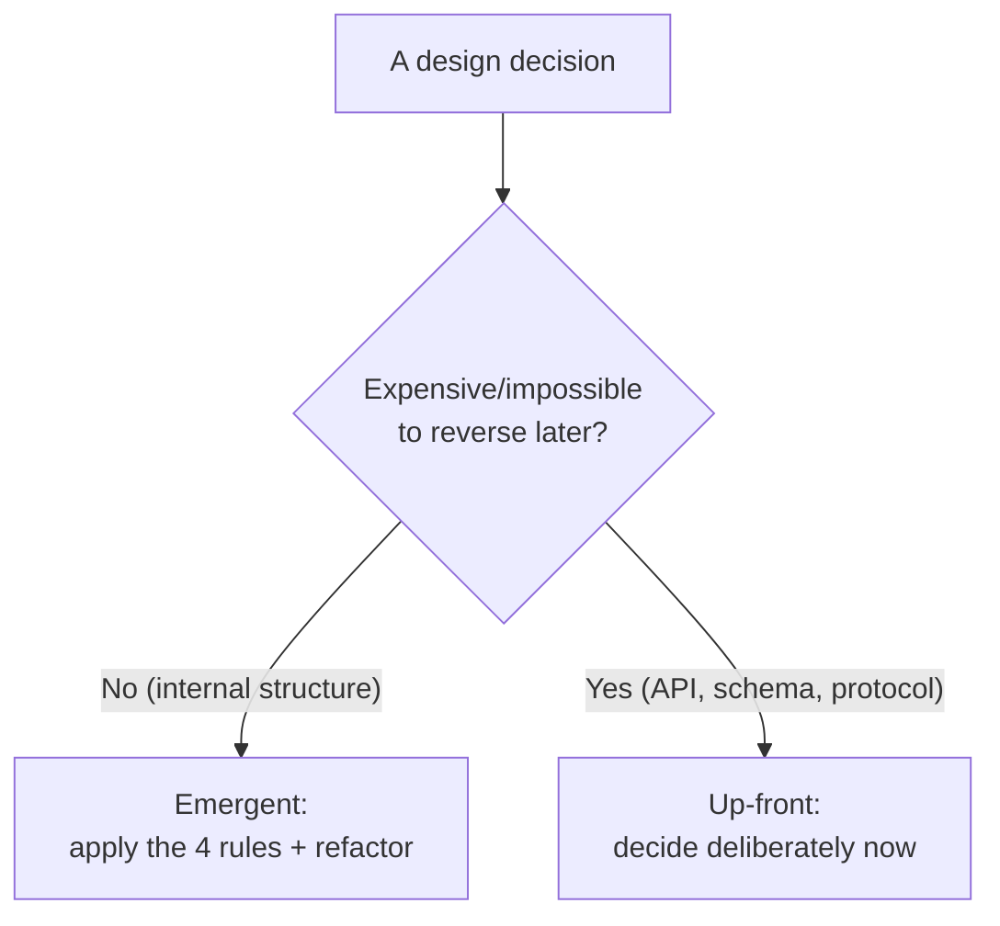
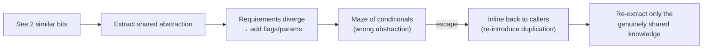

# Simple Design — Senior

> **Category:** [Craftsmanship Disciplines](../README.md) — Kent Beck's four rules for writing code that is no more complicated than it needs to be, in strict priority order.

> **Prerequisites:** [Junior](junior.md) · [Middle](middle.md)
> **Focus:** **Design trade-offs** and **system-level reasoning**

---

## Table of Contents

1. [Introduction](#introduction)
2. [Simple Design vs. Architecture and Up-Front Design](#simple-design-vs-architecture-and-up-front-design)
3. [When Minimalism Becomes Under-Engineering](#when-minimalism-becomes-under-engineering)
4. [The Cost of Premature Abstraction](#the-cost-of-premature-abstraction)
5. [Connascence: A Precise Theory of Duplication and Coupling](#connascence-a-precise-theory-of-duplication-and-coupling)
6. [Corey Haines' Heuristics](#corey-haines-heuristics)
7. [The Rule of Three, Formalized](#the-rule-of-three-formalized)
8. [Simple Design and SOLID](#simple-design-and-solid)
9. [Reversibility and the One-Way-Door Test](#reversibility-and-the-one-way-door-test)
10. [Code Examples — Advanced](#code-examples-advanced)
11. [Liabilities](#liabilities)
12. [Pros & Cons at the System Level](#pros-cons-at-the-system-level)
13. [Diagrams](#diagrams)
14. [Related Topics](#related-topics)

---

## Introduction

> Focus: **design trade-offs** and **system-level reasoning**

At the senior level, simple design stops being a per-method tidiness habit and becomes a **stance on a fundamental architectural argument**: how much design should be decided up front versus allowed to emerge. Beck's four rules are a vote for *emergent* design — but a senior must know exactly where that vote stops applying, because applied without judgement, "keep it simple" becomes an excuse for under-engineering, missing seams, and architectures that can't absorb the change they were supposed to anticipate.

This file covers the three hard questions:

1. **Where does simple/emergent design end and up-front architecture begin?** (Reversibility is the dividing line.)
2. **When is "fewest elements" *wrong* — i.e., when is the missing abstraction a real defect?**
3. **What's the precise theory underneath "no duplication"?** (Connascence — a far sharper tool than "DRY.")

---

## Simple Design vs. Architecture and Up-Front Design

Simple design (emergent) and architecture (up-front) are not enemies; they operate at **different reversibility scales.**

| | Emergent (simple design) | Up-front (architecture) |
|---|---|---|
| Granularity | Classes, methods, modules | System boundaries, data formats, protocols, service decomposition |
| Cost to change later | Low (a refactor, behind tests) | High (a migration, a coordinated multi-team change) |
| Decided | Continuously | Early, deliberately |
| Guided by | The four rules + refactoring | Quality attributes, constraints, irreversibility |

The senior synthesis, due largely to Martin Fowler ("Is Design Dead?") and the XP tradition:

> **Emergent design handles the reversible; up-front design handles the irreversible. The art is drawing the line correctly.**

You let *internal* structure emerge (it's cheap to refactor) while making *boundary* decisions deliberately (they're expensive to migrate). A team that applies "YAGNI / fewest elements" to a database schema choice or a public API contract is misapplying the rules — those are one-way doors. A team that draws UML for every internal class is misapplying up-front design to reversible decisions.

The dangerous failure is not having *too much* or *too little* design, but applying the **wrong kind at the wrong scale**: emergent design on irreversible decisions (paint yourself into a corner) or up-front design on reversible ones (speculative generality, the Rule-4 violation).

---

## When Minimalism Becomes Under-Engineering

"Fewest elements" is the last and weakest rule for a reason: pushed too hard, it produces designs that are *too coupled* and *missing necessary seams*. Senior judgement is knowing when the absent abstraction is a **defect**, not a virtue.

A missing element is under-engineering — not simplicity — when:

- **It forces a Rule 2 or Rule 3 violation.** If collapsing two classes into one creates a tangle of mode flags (`if type == ...`), you've traded a needless element for obscurity and duplication-by-conditional. The higher rules veto the deletion.
- **It crosses a reversibility boundary.** Inlining the seam between your domain core and a third-party SDK is "fewer elements" today and a multi-week rewrite when you change vendors. The seam is load-bearing.
- **It denies a *known, present* need for variation.** Not a speculative one — an actual current requirement for two behaviors. Then the abstraction isn't speculative; it's required, and "fewest elements" is satisfied *by including it* (it's the fewest that still passes rules 1–3).

> Minimalism is bounded by the higher rules and by reversibility. "Fewest elements" never means "fewest elements *and* who cares about clarity, coupling, or one-way doors." It means the fewest elements that still satisfy correctness, clarity, and DRY — and that still let you change the irreversible things you can foresee.

The tell of under-engineering: a single class/function that grows mode parameters, type-switches, and `if (caller == X)` special cases. That's not simple — it's *complected* (Hickey): independent concerns braided into one element. The fix is to *add* the seam the concerns are asking for. Under-engineering and over-engineering are symmetrical failures; simple design sits between them.

---

## The Cost of Premature Abstraction

The industry's instinct is that abstraction is always good and "DRY" is an unqualified virtue. Seniors know the opposite is often true. **The wrong abstraction is more expensive than duplication** — a thesis crystallized by Sandi Metz ("duplication is far cheaper than the wrong abstraction").

The failure mode plays out predictably:

1. You see two similar bits of code and extract a shared abstraction.
2. A new requirement makes one caller need slightly different behavior.
3. You add a parameter/flag to the abstraction to handle the difference.
4. More requirements arrive; more flags accrue. The abstraction becomes a maze of conditionals serving callers that no longer have much in common.
5. Now the abstraction is *harder* to understand and change than the original duplication would have been — but it's load-bearing for many callers, so it's also *risky* to undo.

```python
# The premature-abstraction death spiral
def render(item, mode=None, compact=False, legacy=False, locale="en", inline=None):
    if mode == "summary" and not compact: ...
    elif legacy: ...
    elif inline and locale != "en": ...
    # six callers, none of which shares more than 40% of this logic
```

Each flag was a locally reasonable response to "don't duplicate." The aggregate is a function nobody can change confidently. **The recovery is counterintuitive: re-introduce duplication.** Inline the abstraction back into its callers, let each become clear and independent, *then* extract only the parts that are genuinely shared knowledge.

The senior rule: **prefer duplication to the wrong abstraction.** Duplication is visible, local, and cheap to fix later; the wrong abstraction is invisible coupling that gets more expensive every day you keep it. This is *why* "reveals intention" outranks "no duplication" — clarity is the higher value, and an abstraction that obscures fails the higher rule even while satisfying the lower one.

---

## Connascence: A Precise Theory of Duplication and Coupling

"No duplication" and "coupling is bad" are vague. **Connascence** (Meilir Page-Jones) is the precise vocabulary, and it's the senior-level upgrade to Rule 3. Two pieces of code are *connascent* if changing one requires changing the other to keep the system correct. Connascence comes in *kinds*, ordered by how bad they are:

| Kind | Definition | Example |
|---|---|---|
| **Name** (weakest) | Agree on a name | Caller uses method name `total()` |
| **Type** | Agree on a type | Parameter must be an `int` |
| **Meaning** | Agree on the meaning of a value | `0` means "active", `1` means "banned" (magic numbers) |
| **Position** | Agree on order | Positional args `move(x, y)` — swap them silently |
| **Algorithm** | Agree on an algorithm | Two sides must hash/serialize the *same way* |
| **Execution** (dynamic) | Order of execution matters | `init()` must run before `use()` |
| **Timing** | Timing matters | A race condition |
| **Identity** (strongest) | Must reference the same instance | Two components share one object |

Three properties guide refactoring: connascence is better when it's **weaker** (Name > Algorithm), more **local** (within a function > across modules), and lower in **degree** (fewer elements entangled).

### Why this is the real theory behind DRY

"Duplication" is just one symptom of strong connascence. *Connascence of meaning* (the same magic number `0.20` in two places that must change together) is exactly the "knowledge duplication" Rule 3 targets — and naming the constant *weakens* it to connascence of name (the better kind). Meanwhile, two functions that merely *look* alike but share **no** connascence are not duplication at all, and merging them would *manufacture* connascence — strengthening coupling, the opposite of the goal.

```python
# Strong connascence of meaning (must change together — REAL duplication)
discount = price * 0.20        # in module A
tax      = price * 0.20        # in module B  ← if these encode the SAME rule, DRY it
                               #                 if they coincidentally share 0.20, DON'T

# Naming weakens it to connascence of NAME (the good kind)
LOYALTY_DISCOUNT_RATE = 0.20   # one place; callers connascent only on the name
```

The senior reframing of Rule 3: **don't "remove duplication" — reduce connascence: weaken it, localize it, lower its degree.** That instantly explains both halves of the rule (DRY real duplication; *don't* DRY coincidental similarity) and tells you *which* refactoring to reach for.

---

## Corey Haines' Heuristics

Corey Haines' *Understanding the Four Rules of Simple Design* distilled years of practicing the rules (largely via Conway's Game of Life katas) into operational heuristics seniors lean on:

1. **Rules 2 and 3 form a feedback loop.** Removing duplication forces you to name the extracted concept (improving intent); naming a concept exposes more duplication. Iterate, don't apply once. (See [Middle](middle.md).)
2. **Watch for "logic that looks the same" vs. "concepts that are the same."** Identical code is a *hint* of duplication, not proof; chase the underlying concept, not the textual match. (This is connascence by another name.)
3. **Naming is design.** A good name for a method/class often *is* the missing abstraction; struggling to name something means the concept isn't clear yet.
4. **Small methods, well-named, beat comments.** Extracting and naming a block reveals intent better than annotating it.
5. **The four rules tell you when to *stop*.** Simple design is as much about not over-working a design as about cleaning it up — when all four hold, you're done; resist the urge to add more.
6. **Tests pin behavior so you can pursue 2–4 fearlessly.** Without the green bar, you can't refactor toward simplicity safely — Rule 1 is the enabler of the others.

---

## The Rule of Three, Formalized

"Tolerate twice, extract on the third" is folk wisdom; the senior justification is information-theoretic and connascence-based:

- **One occurrence:** you know nothing about variation.
- **Two occurrences:** you can see *one* axis along which they're similar — but a two-point line fits infinitely many curves. Extracting now bakes in a guess about the *shape* of the abstraction.
- **Three occurrences:** you can see which parts are *truly* invariant (shared by all three) versus incidental (varying across them). The abstraction's boundary is now *observed*, not guessed — so it's far less likely to be the wrong abstraction.

The rule of three is therefore a **defense against premature abstraction**: it delays the extraction until you have enough data points to define the abstraction's real interface, minimizing the chance you create the connascence-strengthening "wrong abstraction" described above.

Caveat: the rule of three is a *default*, not a law. If the second occurrence is *certainly* the same knowledge (e.g., a regulated tax rule duplicated verbatim), DRY it immediately — the rule of three protects against *guessing*, and there's nothing to guess when the knowledge is provably identical.

---

## Simple Design and SOLID

A senior must reconcile simple design with SOLID, because they can appear to conflict and are often misapplied together.

- **They agree more than they conflict.** Single Responsibility and Interface Segregation are both, at heart, "reduce coupling / clarify intent" — the same goal as rules 2 and 3. The Open-Closed Principle's extension points, *when added in response to real variation*, are exactly the seams simple design endorses.
- **The conflict is in *timing*.** SOLID is frequently taught as *up-front* rules — "always program to an interface," "always make it open for extension." Applied speculatively, that's a Rule-4 violation factory: interfaces with one implementation, extension points nobody extends. Simple design's correction: **earn the SOLID structure through emergence.** Add the interface (DIP/OCP) the day a second implementation is real, not the day a principle says you "should."
- **The synthesis:** SOLID describes the *shape* of a good decoupled design; simple design + YAGNI tell you *when* to introduce that shape. Reach SOLID by refactoring toward it under real pressure, not by front-loading every abstraction it could justify.

> "Program to an interface" is excellent advice *applied to a seam that has two real sides.* Applied to a one-implementation type, it's speculative generality wearing a principle's clothes.

---

## Reversibility and the One-Way-Door Test

The single most useful senior heuristic for deciding *emergent vs. up-front*:

> **How expensive is it to change this decision later? Cheap → defer (YAGNI/emergent). Expensive → decide deliberately now (up-front).**

| Decision | Reversibility | Approach |
|---|---|---|
| Internal class structure | Cheap (refactor) | Emergent |
| Method signatures within a module | Cheap | Emergent |
| Public/published API contract | Expensive (clients break) | Up-front |
| Database schema / storage format | Expensive (migration) | Up-front |
| Wire protocol / message format | Expensive (version skew) | Up-front |
| Encryption / hashing choice | Very expensive (data re-encrypt) | Up-front |
| Choice of framework | Medium–expensive | Mostly up-front, isolate behind a seam |

The deeper point: simple design's restraint is *risk-adjusted*. YAGNI is cheap insurance when reversal is cheap (you'll just refactor) and dangerous when reversal is expensive (you'll be stuck). Seniors apply the four rules aggressively to reversible internals and reserve genuine up-front thinking for the one-way doors. This is how "embrace change" (emergent) and "get the foundations right" (architecture) coexist without contradiction.

---

## Code Examples — Advanced

### Re-introducing duplication to escape the wrong abstraction (Python)

```python
# BEFORE — a "DRY" abstraction now serving 3 divergent callers via flags
def export(records, fmt="csv", header=True, gzip=False, dialect=None, redact=()):
    rows = [_redact(r, redact) for r in records] if redact else records
    if fmt == "csv":   out = _to_csv(rows, header, dialect)
    elif fmt == "json": out = _to_json(rows)          # header/dialect ignored
    else:               raise ValueError(fmt)
    return _gz(out) if gzip else out

# AFTER — inline, then re-extract only the genuinely shared knowledge
def export_audit_csv(records):                 # one clear caller
    return _to_csv([_redact(r, PII_FIELDS) for r in records], header=True)

def export_api_json(records):                  # another clear caller
    return _to_json(records)

def export_archive_csv(records):               # another
    return _gz(_to_csv(records, header=False))
# _to_csv / _to_json / _gz remain shared — they ARE shared knowledge.
# The flag-driven megafunction was the WRONG abstraction; the small
# formatters are the right ones.
```

The three exporters now read independently; the *real* shared pieces (`_to_csv`, `_gz`) stay DRY. We removed the wrong abstraction, not all abstraction.

### Earning an interface instead of speculating one (Go)

```go
// DON'T (speculative): one-method interface, one implementation, day one
type PaymentGateway interface{ Charge(amt Money) (Receipt, error) }
type StripeGateway struct{ /* ... */ }
// ...wired everywhere, but Stripe is the only gateway that exists.

// DO (emergent): use the concrete type until a second gateway is REAL.
type StripeGateway struct{ /* ... */ }
func (s StripeGateway) Charge(amt Money) (Receipt, error) { /* ... */ }

// When Adyen becomes a real requirement, NOW extract the interface —
// shaped by TWO concrete gateways, so it actually fits both:
type PaymentGateway interface{ Charge(amt Money) (Receipt, error) }
```

Go's structural typing makes this especially clean: you can introduce the interface *later* without touching `StripeGateway`, because it already satisfies the interface implicitly. The language rewards deferring the abstraction.

---

## Liabilities

### Liability 1: "Simple" as a euphemism for "I didn't think about it"

Emergent design demands *more* ongoing thought than up-front design, not less. Teams that say "we're agile, design emerges" but never refactor produce a big ball of mud and blame the philosophy. Emergent design without the Refactor step is negligence, not simplicity.

### Liability 2: Missing the one-way door

Applying YAGNI to an irreversible decision (schema, public API, protocol) is the costliest mistake in this whole topic. "We'll change it later" is true for internals and false for published contracts. Audit every decision for reversibility *before* invoking YAGNI.

### Liability 3: DRY zealotry creating coupling

Removing every textual duplication strengthens connascence across modules that should be independent. The result is a system where one change ripples everywhere — the exact problem DRY was supposed to prevent, caused by misapplying it. Measure with connascence, not character matching.

### Liability 4: Treating "fewest elements" as a license to under-engineer

Crushing necessary seams to win on element count produces complected, mode-flag-ridden god functions. Rule 4 is bounded above by rules 1–3 and bounded outward by reversibility — it is the *weakest* rule.

---

## Pros & Cons at the System Level

| Dimension | Simple / Emergent Design | Heavy Up-Front Design |
|---|---|---|
| Cost of unneeded flexibility | Low — you didn't build it | High — built, tested, maintained, often unused |
| Cost when a need *does* arise | A refactor (cheap behind tests) | Zero *if* guessed right; rework if wrong |
| Adaptability to changing requirements | High | Low — structure assumes a fixed future |
| Risk on irreversible decisions | **High if misapplied** (one-way doors) | Low — deliberate up-front choice |
| Readability of internals | High (no speculative indirection) | Lower (indirection for absent reasons) |
| Dependence on refactoring discipline | Total — degrades to mud without it | Lower |
| Best domain | Discovered requirements (most software) | Stable, well-understood, change-costly domains |

The table makes the senior stance precise: simple/emergent design wins on every row *for reversible, internal decisions in domains where requirements are discovered* — which is most software. It **loses** exactly on the irreversible-decision row, which is why seniors carve out up-front design for one-way doors and apply the four rules everywhere else.

---

## Diagrams

### Reversibility decides emergent vs. up-front



### The premature-abstraction spiral and its escape



---

## Related Topics

- **Sibling disciplines:** [Refactoring as a Discipline](../03-refactoring-as-a-discipline/junior.md), [The Three Laws of TDD](../01-the-three-laws-of-tdd/junior.md)
- **Rule 3 in depth:** DRY
- **Reconciled with:** SOLID

---


---

## Check your understanding

1. Explain Simple Design — Senior Level in your own words and name the problem it solves.
2. How would you apply the ideas around Table of Contents, Introduction, Simple Design vs. Architecture and Up-Front Design in a realistic engineering change?
3. What failure mode or misuse should you look for, and what evidence would reveal it?
4. How would you validate a system-level decision about Simple Design — Senior Level under uncertainty?
5. What observable result would convince you that the approach improved the system?
