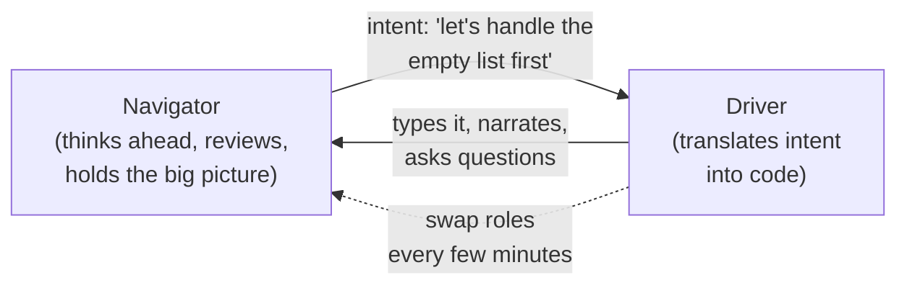
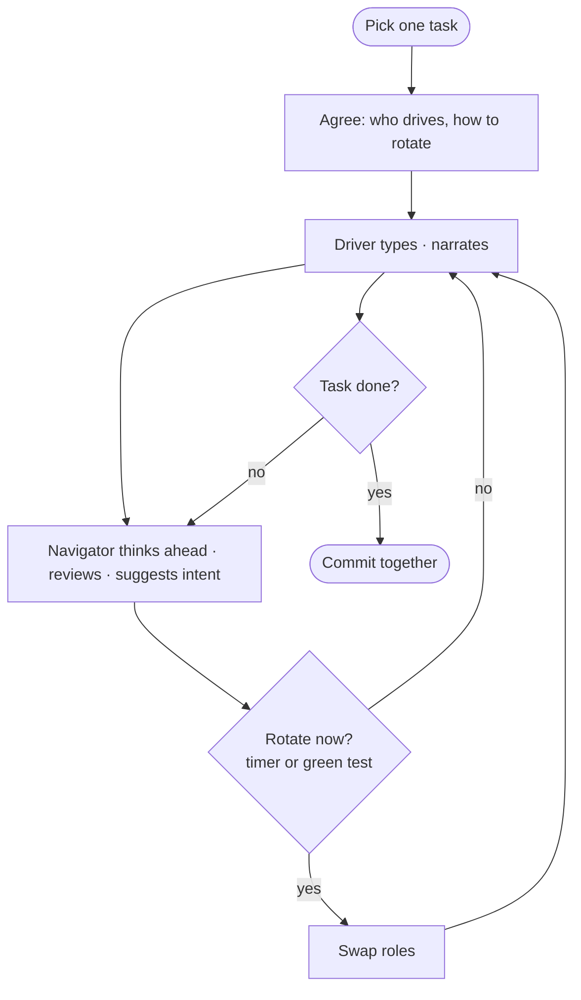
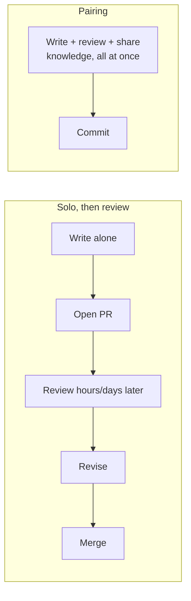

# Pair & Mob Programming — Junior

> **Category:** [Craftsmanship Disciplines](../README.md) — two or more people building one piece of software together, in real time, sharing one stream of work.

---

## Table of Contents

1. [Introduction](#introduction)
2. [Prerequisites](#prerequisites)
3. [Glossary](#glossary)
4. [Core Concepts](#core-concepts)
5. [The Two Roles: Driver and Navigator](#the-two-roles-driver-and-navigator)
6. [Real-World Analogies](#real-world-analogies)
7. [Mental Models](#mental-models)
8. [Your First Pairing Session](#your-first-pairing-session)
9. [Pairing Etiquette](#pairing-etiquette)
10. [Pros & Cons](#pros-cons)
11. [Best Practices](#best-practices)
12. [Common Mistakes](#common-mistakes)
13. [Test Yourself](#test-yourself)
14. [Summary](#summary)
15. [Further Reading](#further-reading)
16. [Related Topics](#related-topics)
17. [Diagrams](#diagrams)

---

## Introduction

> Focus: **What is it?** and **How to use it?**

**Pair programming** is two engineers working on one task, at one screen (physical or shared), at the same time. One person types — the **driver**. The other watches, thinks ahead, and guides — the **navigator**. They swap roles regularly. The work is continuous and conversational: a steady back-and-forth instead of two people coding alone and merging later.

**Mob programming** (also called **ensemble programming**) is the same idea scaled to the whole team: three, four, five or more people, one computer, one driver at a time, everyone else navigating, and the keyboard rotating on a short timer. The whole team works on one thing, together, all day.

Both practices share a single, slightly radical premise:

> **Software is written once but read, changed, and understood hundreds of times. The expensive part isn't typing — it's thinking, designing, reviewing, and spreading knowledge. Pairing and mobbing put all of that into the moment the code is written, instead of bolting it on afterward.**

A solo developer writes code, then *later* someone reviews it, *later* someone else has to understand it, and *later* a bug surfaces that a second pair of eyes would have caught. Pairing collapses that timeline. The review happens as you type. The knowledge spreads as you talk. The bug is caught before it's committed.

### Why this matters

The instinct of most new engineers is that programming is a solo, heads-down activity — headphones on, flow state, do not disturb. That instinct is half right: deep focus is real and valuable. But it misses that most defects, most "why on earth was this written this way" moments, and most of the time a new hire spends lost, all come from work done in isolation. Pairing trades a little raw typing throughput for a large reduction in defects, rework, and the time it takes knowledge to travel through a team.

You don't have to pair on everything. But you do have to know how to pair *well*, because it is one of the fastest ways to learn a codebase, absorb a senior's habits, and stop shipping bugs you couldn't see alone.

---

## Prerequisites

- **Required:** You can write and run code in at least one language, and use the team's editor/IDE at a basic level.
- **Required:** Basic version control (you know what a commit is).
- **Helpful:** A little humility — pairing means thinking out loud, being wrong in front of someone, and watching someone else be wrong too. That is the normal, healthy state of a pairing session, not a failure.

---

## Glossary

| Term | Definition |
|------|-----------|
| **Pair programming** | Two people working together on one task at one screen, swapping roles. |
| **Mob / ensemble programming** | The whole team (3+) on one task at one screen, one driver at a time, keyboard rotating on a timer. |
| **Driver** | The person at the keyboard, typing. Translates the current intention into code. |
| **Navigator** | The person (or people) not typing — thinking ahead, reviewing, spotting issues, holding the bigger picture. |
| **Rotation / swap** | Changing who is driving. In pairs, every few minutes to ~30 min; in mobs, on a short fixed timer (often 4–10 min). |
| **Ping-pong pairing** | A pairing style built around TDD: one writes a failing test, the other makes it pass, then they swap. |
| **Strong-style pairing** | A style where "for an idea to go into the computer, it must go through someone else's hands" — the navigator decides, the driver types. |
| **Backseat driving** | Anti-pattern: the navigator dictating keystroke-by-keystroke ("now type a semicolon") instead of intentions. |
| **Watch-the-master** | Anti-pattern: one expert drives the whole time while the other passively watches, learning little. |

---

## Core Concepts

### 1. One stream of work, two (or more) minds

The defining feature is that there is exactly **one** piece of work in flight, and everyone present is engaged with *that one thing*. Nobody is off writing a different feature. The output is a single shared train of thought made visible on one screen.

### 2. Typing is the cheap part

A junior often assumes the driver is "doing the work" and the navigator is "watching." That framing is wrong. The driver handles **tactics** — syntax, the next line, making the editor do the thing. The navigator handles **strategy** — is this the right approach, what's the next test, did we forget the empty-list case, is there a simpler design? Both jobs are real work. The keyboard is just where one of them happens to surface.

### 3. Continuous review replaces after-the-fact review

In solo work, code review is a separate, later step: you open a pull request, someone reads it hours or days later, comments, you revise. In pairing, the review happens *as the code is born*. Mistakes are caught in seconds, not after they've been built upon. For a mob, the entire team has effectively reviewed every line by the time it's written.

### 4. Knowledge spreads as a side effect

When you pair, the codebase's tribal knowledge — *why* this module is weird, *which* service to call, *where* the gotchas hide — transfers automatically through conversation. Nobody has to write a document; the knowledge moves person-to-person. This is the single biggest reason teams pair: it dissolves the "only Sara understands the billing code" risk.

### 5. Rotation keeps everyone engaged

If the same person drives for an hour, the other disengages and the value collapses. Regular rotation — short in a mob, looser in a pair — keeps every brain active and ensures the knowledge and the skill spread to *everyone*, not just whoever happened to be typing.

---

## The Two Roles: Driver and Navigator

These two roles are the heart of pairing. Get them right and everything else follows.

| | **Driver** | **Navigator** |
|---|---|---|
| **Owns** | The keyboard, the next few lines, the syntax | The direction, the design, the "is this right?" |
| **Thinks at** | Tactical level (this line, this method) | Strategic level (this approach, the next test, edge cases) |
| **Says** | "Okay, I'll extract this into a method…" | "Before that — should we handle the empty case first?" |
| **Should NOT** | Silently power ahead without narrating | Dictate keystrokes ("type a bracket now") |
| **Trap** | Going quiet and just typing | Going quiet and just watching |

The golden rule binding them: **both people talk, constantly.** The driver narrates what they're doing. The navigator narrates what they're thinking. Silence is the enemy — a silent pair is just two people watching one person code.



The arrow that matters most goes from navigator to driver and carries an **intention** ("let's handle the empty list first"), not a **keystroke** ("type i-f space"). The driver fills in the how. When the navigator starts dictating keystrokes, that's [backseat driving](#common-mistakes) and the driver has stopped thinking.

---

## Real-World Analogies

| Concept | Analogy |
|---|---|
| **Driver / navigator** | A **rally car**: the driver handles the wheel and pedals (tactics) while the co-driver reads the route notes ahead — "tight left in 200 meters" (strategy). The co-driver isn't grabbing the wheel; they're seeing further down the road. |
| **Strong-style pairing** | A **surgeon and a resident**: the surgeon describes each step out loud and the resident performs it. The knowledge flows out of the expert's head and into the trainee's hands. |
| **Mob programming** | A **writers' room** for a TV show: the whole team in one room shaping one script, one person at the keyboard, everyone contributing, the "pen" passing around. |
| **Continuous review** | A **chef tasting as they cook** versus a food critic eating the finished dish hours later. Pairing tastes the dish while it's still on the stove. |
| **Rotation** | A **relay race** where the baton passes frequently — no single runner carries the whole leg, and everyone stays warmed up and in the race. |

---

## Mental Models

**The core intuition:** *"Two people, one keyboard, one train of thought — and the keyboard is the least important part."*

```
        ┌──────────────── ONE TASK ────────────────┐
        │                                           │
   NAVIGATOR  ──── intent ───►  DRIVER  ──► CODE     │
   (strategy)                  (tactics)             │
        ▲                          │                 │
        └──── swap every N min ────┘                 │
        │                                           │
        └─── continuous review + knowledge flow ────┘
```

**The "going through someone else's hands" model (strong-style):** picture the rule literally — no idea reaches the computer except by passing through a *second* person. If you (the navigator) have an idea, you can't grab the keyboard; you must explain it well enough that the driver can type it. This forces every idea to be *spoken*, which is exactly how the knowledge transfers and how vague ideas get sharpened.

**The bus-factor model:** ask "if person X were hit by a bus tomorrow, would the team be stuck?" Solo work pushes the bus factor toward 1 (only one person knows each part). Pairing and mobbing push it up: knowledge lives in many heads, so no single absence stops the team.

---

## Your First Pairing Session

Here is a concrete walkthrough so your first session isn't a mystery.

**Before you start (2 minutes):**
- Agree on **what** you're building — the one task, the definition of done.
- Agree on **who drives first** and **how you'll rotate** (e.g., "swap every 15 minutes" or "swap each time a test goes green").
- Sort out the **practicalities**: whose machine, whose keymap, font size big enough for both, screen visible to both.

**During the session:**

A small slice of how it actually sounds:

```text
Navigator: Okay, the task is "reject orders with no items." Let's start
           with a failing test for the empty-items case.
Driver:    Right. I'll add a test... `placeOrder` with an empty list...
           expecting it to throw. (types) Want it to throw what?
Navigator: An IllegalArgumentException feels right — it's a bad argument.
Driver:    (types the assertion) Running it... red, good, it fails because
           we don't throw yet.
Navigator: Now the simplest thing that makes it pass — a guard at the top.
Driver:    (adds `if (items.isEmpty()) throw ...`) Green.
Navigator: Nice. Let's swap — you navigate, I'll drive the next test.
```

Notice: they talk the whole time, they take tiny steps, they swap when a test goes green, and neither person is silent for long.

**When you get stuck:**
- Say so out loud. "I don't know this API" is a *contribution*, not a confession.
- Look it up together. Reading docs as a pair is normal and fast.
- If you're both stuck for more than a few minutes, take a short break or pull in a third person.

**At the end:**
- Commit the work together (your team may credit both authors — see "Co-authored-by" trailers).
- A 30-second debrief: "what went well, what felt awkward?" The awkwardness fades with practice.

---

## Pairing Etiquette

Pairing is a social activity, and small courtesies make or break it.

| Do | Don't |
|---|---|
| Talk constantly — narrate and think out loud. | Go silent and grind alone while the other watches. |
| Express ideas as **intentions**, let the driver fill in the keystrokes. | Dictate character-by-character ("now a comma"). |
| Take regular breaks — pairing is intense. | Push through fatigue; tired pairs make worse decisions than tired solos. |
| Ask "can I drive?" and hand over cleanly. | Grab the keyboard or the mouse from someone mid-thought. |
| Be patient when your pair is slower at something. | Sigh, take over, or make them feel watched-over. |
| Mind hygiene and personal space (especially co-located). | Lean in uncomfortably close, or ignore the other's keymap/setup. |
| Treat every question as legitimate. | Make anyone feel stupid for not knowing something. |

The deepest etiquette rule is **psychological safety**: pairing only works if both people feel safe being wrong, asking "dumb" questions, and admitting they don't know something. The moment someone feels judged, they go quiet — and a quiet pair has lost its entire advantage.

---

## Pros & Cons

| Pros | Cons |
|------|------|
| Fewer defects — continuous review catches bugs as they're written | Two people on one task feels like "half the output" to an outsider |
| Knowledge spreads automatically; no single point of failure | Mentally tiring — sustained focus and conversation drain energy |
| Fast onboarding — new hires learn the codebase by doing, not reading | Personality friction if pairs aren't matched or rotated |
| Better design — a second mind challenges the first | Not every task needs two people (trivial or exploratory work) |
| Shared ownership — "our code," not "my code" | Hard to do badly; bad pairing is worse than solo |
| Fewer interruptions — a pair is harder to derail than a solo dev | Scheduling and physical/remote logistics overhead |

### When to use:
- Hard or important problems where a defect would be costly.
- Onboarding a new team member onto unfamiliar code.
- Spreading knowledge of a risky or poorly-understood area.
- Anything you'd want a careful review of anyway.

### When NOT to use (yet — covered in depth at [Middle](middle.md)):
- Trivial, mechanical tasks (renaming, boilerplate).
- Pure solo exploration / spikes where you're just learning by flailing.
- When one person is exhausted — a tired pair is worse than a rested solo.

---

## Best Practices

1. **Talk constantly.** Narrate as the driver; think aloud as the navigator. Silence kills the value.
2. **Swap roles regularly.** Don't let one person drive for an hour — engagement collapses.
3. **Pass intentions, not keystrokes.** The navigator says *what*, the driver decides *how*.
4. **Take small steps.** Tiny commits, tiny test cycles — easy to follow, easy to undo.
5. **Set up for two.** Big enough font, visible screen, agreed keymap before you start.
6. **Take breaks.** Pairing is intense; protect energy with short, regular pauses.
7. **Keep it safe.** No question is dumb, no mistake is shameful. Safety is the prerequisite for everything else.

---

## Common Mistakes

1. **Watch-the-master.** One expert drives all day; the other passively watches and learns little. Fix: rotate, and let the *less* experienced person drive *more*.
2. **Backseat driving.** The navigator dictates keystrokes instead of intentions, reducing the driver to a typist. Fix: speak at the level of *intent*.
3. **The silent pair.** Both stop talking; it becomes one person coding while another stares. Fix: if it goes quiet, narrate.
4. **Never swapping.** The keyboard stays with one person the whole session. Fix: a timer or a "swap on green" rule.
5. **Pairing while exhausted.** Pushing through fatigue produces worse code than working solo. Fix: stop, break, or end the session.
6. **Unequal participation.** One person dominates every decision. Fix: deliberately defer to the quieter person; ask "what do you think?"
7. **Skipping the setup chat.** Diving in without agreeing on the task or rotation leads to drift and friction.

---

## Test Yourself

1. What are the two roles in pair programming, and what does each own?
2. Why is "typing is the cheap part" a useful way to think about the driver's job?
3. What is "strong-style" pairing's defining rule, in one sentence?
4. What is the difference between a navigator passing an *intention* versus *backseat driving*?
5. Name two things pairing gives you that solo work plus later code review does not.
6. Why is psychological safety a prerequisite for pairing, not a nice-to-have?

---

## Summary

- **Pair programming** = two people, one task, one screen, swapping between **driver** (types, tactics) and **navigator** (guides, strategy).
- **Mob/ensemble programming** = the whole team doing the same thing, one driver at a time, keyboard rotating on a short timer.
- The premise: typing is cheap; thinking, reviewing, designing, and spreading knowledge are expensive — pairing puts them all into the moment of writing.
- Benefits: fewer defects, automatic knowledge sharing, fast onboarding, better design, shared ownership.
- Costs: it's tiring, it feels like "two people, one task," and done badly it's worse than solo.
- The non-negotiables: **talk constantly, swap regularly, pass intentions not keystrokes, and keep it psychologically safe.**

---

## Further Reading

- Laurie Williams & Robert Kessler, *Pair Programming Illuminated* — the foundational book and research summary.
- Woody Zuill, *Mob Programming: A Whole Team Approach* — the origin of mobbing.
- Llewellyn Falco, "Strong-Style Pairing" — the "through someone else's hands" rule.
- Martin Fowler, "On Pair Programming" (martinfowler.com) — a clear, balanced overview.

---

## Related Topics

- **Pairs naturally with:** [The Three Laws of TDD](../01-the-three-laws-of-tdd/junior.md) — ping-pong pairing is TDD done as a pair.
- **Skill-building partner:** [Kata & Deliberate Practice](../07-kata-and-deliberate-practice/junior.md) — katas are often practiced as pairs and mobs.

---

## Diagrams

### The driver/navigator loop



### Solo + later review vs. pairing




---

## Check your understanding

1. Explain Pair & Mob Programming — Junior Level in your own words and name the problem it solves.
2. How would you apply the ideas around Table of Contents, Introduction, Prerequisites in a realistic engineering change?
3. What failure mode or misuse should you look for, and what evidence would reveal it?
4. What small example would prove that you can apply Pair & Mob Programming — Junior Level correctly?
5. What observable result would convince you that the approach improved the system?
