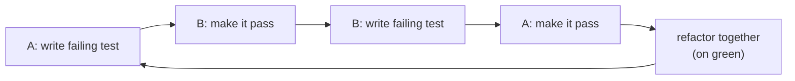
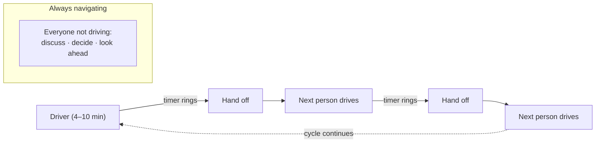
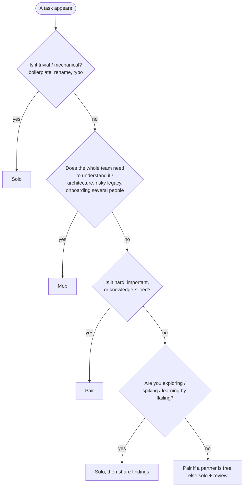
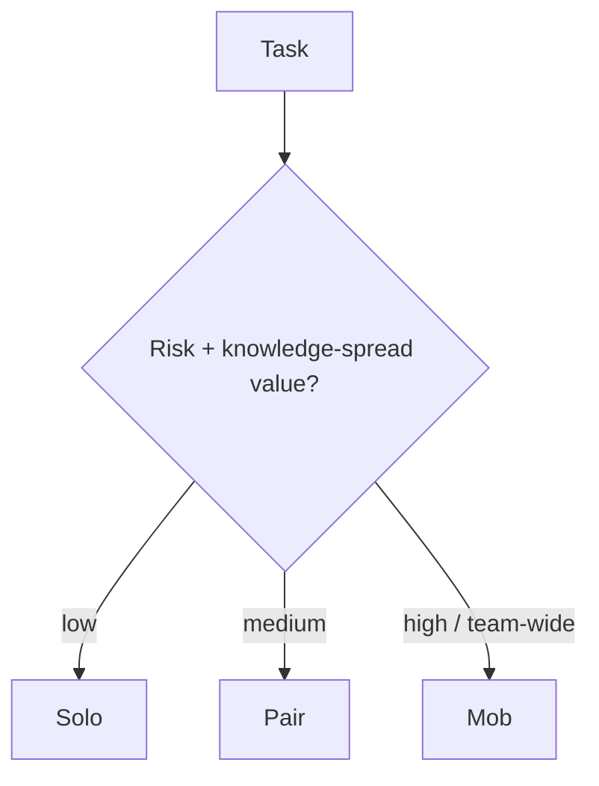
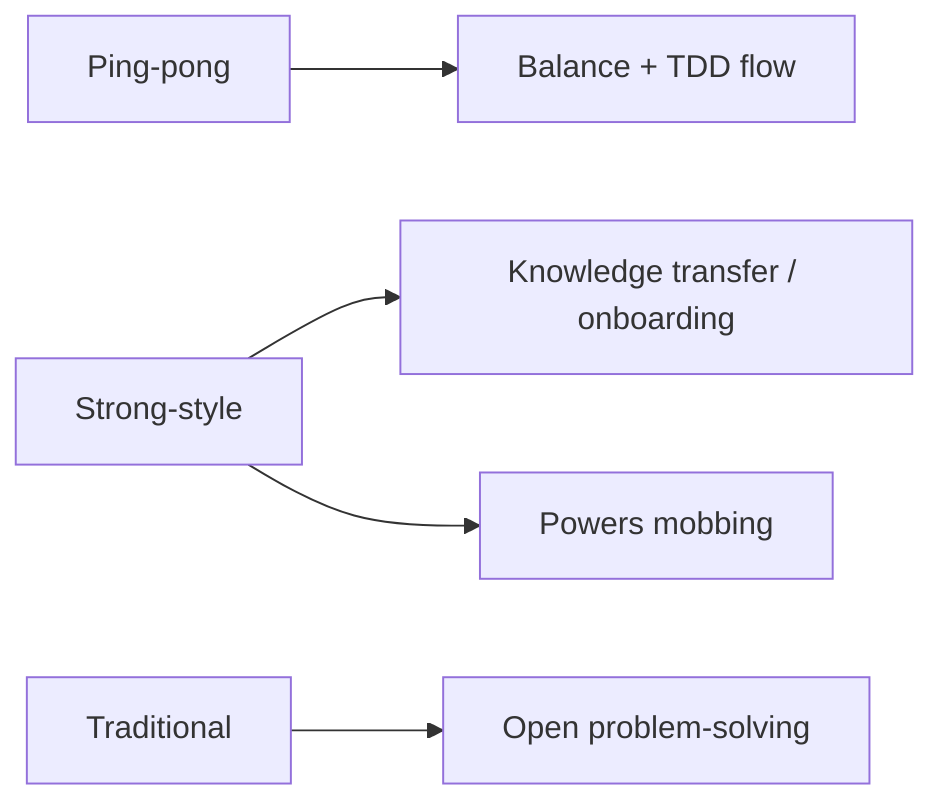

# Pair & Mob Programming — Middle

> **Category:** [Craftsmanship Disciplines](../README.md) — two or more people building one piece of software together, in real time, sharing one stream of work.

> **Prerequisite:** [Junior](junior.md)
> **Focus:** **Why** and **When**

---

## Introduction

> Focus: **Why** and **When**

At the junior level, pairing is a single thing: two people, driver and navigator, swapping. At the middle level it splinters into **styles**, each tuned for a different goal — ping-pong for test-driven flow, strong-style for knowledge transfer, traditional for collaborative problem-solving — and it scales up into **mobbing**, which has its own mechanics and its own break-even math.

The recurring middle-level decision is **modality selection**: given *this* task, *this* pair of people, and *this* goal (ship fast? teach? de-risk?), should you pair, mob, or work solo — and if you pair, in which style? Choosing well is a real skill; the difference between a great pairing culture and a resented one is mostly whether people pair on the *right* things in the *right* way.

---

## Pairing Styles in Depth

The "styles" are not rigid rituals; they're named defaults you reach for depending on what you're optimizing.

| Style | How it works | Best for | Watch out for |
|---|---|---|---|
| **Traditional / unstructured** | Loose driver/navigator, swap when it feels right | Experienced pairs solving an open problem | Drifting into watch-the-master; forgetting to swap |
| **Ping-pong** | A writes a failing test → B makes it pass + writes the next failing test → A makes it pass… | TDD work; balancing participation | Only works if both buy into TDD |
| **Strong-style** | "The idea must go through someone else's hands" — navigator decides, driver types | Knowledge transfer, onboarding, mobbing | Feels constraining to experts; needs trust |
| **Driver/navigator with a timer** | Same as traditional but rotation is enforced by a clock | Pairs who forget to swap; mixed-experience pairs | Timer can interrupt deep flow if too short |

The two styles worth mastering deliberately are **ping-pong** (because it fuses with TDD) and **strong-style** (because it is the most effective knowledge-transfer technique we have, and it's the engine that makes mobbing work).

---

## Ping-Pong Pairing (TDD as a Pair)

Ping-pong pairing is [test-driven development](../01-the-three-laws-of-tdd/junior.md) structured as a two-player game. It uses TDD's red-green-refactor cycle as the natural rotation trigger.

**The rhythm:**

1. **Person A** writes a *failing* test (red) that expresses the next small requirement.
2. **Person B** writes the *simplest* production code that makes it pass (green).
3. **Person B** then writes the *next* failing test.
4. **Person A** makes *that* pass.
5. …and so on, with refactoring done together whenever the bar is green.

```text
A: (writes failing test)   "It should reject a withdrawal larger than the balance."
B: (makes it pass)         guard clause: `if amount > balance throw`. Green.
B: (writes failing test)   "And it should reject a negative amount."
A: (makes it pass)         second guard. Green.
A&B: (refactor on green)   "Both guards read the same way — leave them, they're clear."
A: (writes failing test)   ...
```



**Why it's powerful:**
- **Forced, automatic rotation.** The role swap is baked into the cycle — nobody has to remember to swap.
- **Balanced participation.** Each person both specifies (writes tests) and implements (makes them pass), so neither gets stuck as the perpetual "thinker" or perpetual "typist."
- **A built-in challenge loop.** Writing the *test* for your partner gently pins down the contract; making *their* test pass forces you to satisfy a spec you didn't write — surfacing assumptions immediately.
- **It enforces small steps.** You can't write a giant test, so the code grows in tiny, reviewable increments.

**When it shines:** any work where you'd do TDD anyway, and especially when you want to keep two people equally engaged. It's the most reliable cure for the silent, lopsided pair.

---

## Strong-Style Pairing

Coined by Llewellyn Falco, the rule is a single sentence:

> **"For an idea to go from your head into the computer, it must go through someone else's hands."**

Concretely: **the navigator has the ideas; the driver has the keyboard.** If you (navigating) know what to do, you may not grab the keyboard — you must *talk* the driver through it. The driver, even if less experienced, owns the machine for the whole turn.

This sounds backwards. The point is precisely that it inverts the natural tendency of the expert to take over. By forcing the expert to *navigate* and the novice to *drive*, it:

- **Transfers knowledge at maximum bandwidth.** The expert's thinking must be spoken aloud (the novice's hands won't move otherwise), so the reasoning — not just the result — enters the novice's head.
- **Keeps the novice's hands and brain engaged.** Driving forces them to translate intent into syntax, which is where real learning happens.
- **Stops watch-the-master dead.** The expert literally cannot just do it themselves.

**Levels of instruction (the navigator should aim for the highest the driver can follow):**

| Level | Example | Use when |
|---|---|---|
| **Intent** (best) | "Let's validate the email before saving." | Driver is fluent |
| **Location** | "At the top of the method, add a guard." | Driver knows the codebase |
| **Detail** | "Call `Email.parse` and catch the exception." | Driver is new to this area |
| **Keystroke** (avoid) | "Type `i`, `f`, space…" | Almost never — this is backseat driving |

The skill of strong-style is **operating at the highest level of abstraction the driver can act on**, and dropping lower only when they're stuck. Staying at keystroke level is the failure mode; staying at intent level when the driver is lost is the other.

**Strong-style is the engine of mobbing**: a mob is essentially strong-style pairing with one driver and many navigators, because no single navigator should be reaching for the keyboard.

---

## Mob Programming Mechanics

Mob (ensemble) programming runs the whole team through one task. The mechanics that make it work:

- **One driver, many navigators.** Exactly one person types. Everyone else navigates — discussing, deciding, looking ahead.
- **Strong-style by necessity.** Since the driver is often *not* the person with the current idea, ideas must flow verbally through the driver's hands. This is strong-style scaled up.
- **A hard rotation timer.** The keyboard moves on a fixed schedule (commonly **4–10 minutes**). When the timer rings, the driver hands off — no exceptions, even mid-line. Tools like `mobster` or `mob.sh` automate the timer and the git handoff.
- **A consistent rotation order.** Everyone knows who's next, so handoffs are frictionless.
- **The "navigator with the idea speaks; the mob refines."** Discussion is allowed and encouraged, but the team converges and the driver implements the agreed direction.



**A typical mob day** has a facilitator (often rotating), explicit breaks (mobbing is intense), and a single visible screen everyone can read. The output is one carefully-considered stream of work that the *entire team* understands and has effectively reviewed.

**Why a team would mob the whole day:** for genuinely hard problems, architectural decisions, gnarly legacy code, or rapid onboarding of several people at once, having every relevant brain on the *same* problem eliminates handoffs, merge conflicts, blocking questions, and "I'll explain it in the PR" delays. The cost is obvious (N people on one task); the payoff is decisions made once, correctly, with no knowledge silos.

---

## Rotation: Timing and Discipline

Rotation is the mechanism that keeps everyone engaged and spreads the knowledge. Get the cadence wrong and the practice degrades.

| Setting | Typical rotation | Trigger |
|---|---|---|
| **Pair, traditional** | ~15–30 min | A timer, or "when it feels natural" |
| **Pair, ping-pong** | Every red→green cycle | The test going green |
| **Mob** | 4–10 min (short!) | A hard timer, every time |

**Principles:**

- **Shorter than feels comfortable.** New mobbers always think 4 minutes is too short; in practice short rotations keep everyone alert and prevent any one person from "owning" a chunk. The discomfort fades.
- **Rotate even mid-thought.** Especially in mobbing — handing off mid-line forces the *whole mob* to keep the context in shared awareness rather than in one driver's head. If a handoff loses context, that's a signal the mob wasn't really navigating together.
- **A clock, not a vibe.** "We'll swap when it feels right" reliably becomes "one person drove for 50 minutes." Use a timer for anything but the most experienced pairs.
- **Track the order.** In a mob, a fixed rotation order removes the "who's next?" friction every cycle.

---

## When to Pair vs. Mob vs. Solo

This is the central middle-level judgement. None of the three is universally best.



| Work | Best mode | Why |
|---|---|---|
| Architectural decision, hard design | **Mob** | Everyone affected should shape it; decide once, together |
| Gnarly legacy code nobody understands | **Mob or pair** | Knowledge is siloed/lost; spread it while you work |
| Onboarding a new hire | **Pair (strong-style)** | Highest-bandwidth knowledge transfer |
| Important feature, costly if buggy | **Pair** | Continuous review, better design |
| A risky bug fix in critical code | **Pair** | A second pair of eyes on a high-stakes change |
| Routine, well-understood feature | **Solo or pair** | Either works; pair if knowledge-sharing matters |
| Boilerplate, renames, config tweaks | **Solo** | No design or knowledge value to share |
| Exploratory spike / learning an API | **Solo first** | Flailing is faster alone; share the findings after |

The honest middle-level stance: **pair and mob deliberately, not dogmatically.** "We pair on everything" burns people out; "we never pair" rebuilds the silos pairing exists to dissolve. Pick the mode that matches the task's *risk* and *knowledge-spread* value.

---

## Remote Pairing & Tooling

Remote and hybrid teams pair and mob constantly — it just needs the right tooling, because the co-located default (lean over and point at the screen) is gone.

| Tool category | Examples | What it gives you |
|---|---|---|
| **IDE collaborative editing** | VS Code Live Share, JetBrains Code With Me | Both/all edit in their own editor on shared code; independent cursors; shared terminals & debug sessions |
| **Cloud dev environments** | GitHub Codespaces, Gitpod | A shared, identical environment — no "works on my machine" |
| **Low-latency screen share** | Tuple, Pop, Drovio | Built *for* pairing: dual control, high frame rate, low lag (generic video-call screen share is too laggy) |
| **Mob automation** | mob.sh, Mobster | Manages the rotation timer *and* the git handoff (`mob start` / `mob next` / `mob done`) |
| **Always-on audio/video** | Any conferencing tool | The constant conversation that pairing requires |

**Remote-specific discipline:**

- **Latency is the enemy.** A laggy screen share makes the navigator's input arrive too late to be useful. Invest in purpose-built tools, not generic video calls.
- **Give the remote driver real control.** Watching someone else type over a screen share is *watch-the-master* by another name. Both people must be able to drive (Live Share, Code With Me, or dual-control tools).
- **Over-communicate intent.** You lose body language and finger-pointing; compensate by narrating more and naming things explicitly ("the method below `save`, line 40-ish").
- **Use the tools' rotation features.** `mob.sh` handing the branch between machines makes remote mob rotation as clean as passing a physical keyboard.

Remote pairing, done with the right tools, is often *better* than co-located: both people are looking at the same screen at their own comfortable font size, with their own keymap, and nobody is craning their neck.

---

## Matching Pairs

Who you pair *with* matters as much as how you pair.

| Pairing | Dynamic | Use it to |
|---|---|---|
| **Senior + junior** | Mentorship; best in strong-style (junior drives) | Onboard, teach, spread skill |
| **Senior + senior** | Fast, high-level; risk of going too fast/silent | Crack a genuinely hard problem |
| **Junior + junior** | Slower, but both learn by struggling together | Build confidence; not for high-stakes code |
| **Domain expert + newcomer** | Knowledge transfer of *the system*, not just code | De-silo a risky area |

**Rotate partners** over days/weeks. A team where the same two people always pair rebuilds a two-person silo. Rotating pairs (a "pair stair" or daily switch) spreads knowledge across the *whole* team — which is the entire point.

---

## Trade-offs

| Dimension | Solo | Pair | Mob |
|---|---|---|---|
| Raw typing throughput | Highest per person | Lower per person | Lowest per person |
| Defect rate | Highest | Lower | Lowest |
| Knowledge spread | Slowest (none) | Good (2 people) | Best (whole team) |
| Onboarding speed | Slow | Fast | Fastest |
| Decision quality | One mind | Two minds | Whole team |
| Energy cost | Low–medium | High | High |
| Merge conflicts / handoffs | Many (parallel work) | Few | None (one stream) |
| Best for | Trivial / exploratory | Important / siloed | Hard / team-wide |

The pattern across the table: **as you add people to one stream, per-person typing throughput falls but defect rate, knowledge spread, and decision quality all rise, and coordination cost (merges, handoffs, blocking questions) falls to near zero.** Whether that trade is worth it depends entirely on the task — which is why modality selection is the skill.

---

## Common Failure Modes

| Failure mode | Symptom | Fix |
|---|---|---|
| **No rotation** | One person drives for an hour | Timer; ping-pong; mob's hard clock |
| **Watch-the-master** | Expert drives all day, others passive | Strong-style: novice drives, expert navigates |
| **Backseat driving** | Navigator dictating keystrokes | Speak at intent level, not keystroke level |
| **Lopsided pair** | One person makes every decision | Ping-pong to force balance; ask the quiet one |
| **Pairing on everything** | Team exhausted, resentful | Reserve pairing for high-value tasks |
| **Laggy remote setup** | Navigator can't keep up; both frustrated | Purpose-built low-latency tools |
| **Same pairs forever** | New two-person silo forms | Rotate partners across the team |
| **No breaks** | Quality drops after ~90 min | Scheduled breaks; mobbing especially |

---

## Best Practices

1. **Match the modality to the task** — solo for trivial/exploratory, pair for important/siloed, mob for hard/team-wide.
2. **Use ping-pong to balance a pair** and fuse pairing with TDD.
3. **Use strong-style to teach** — put the novice on the keyboard, the expert on the ideas.
4. **Rotate on a real timer** — short for mobs (4–10 min), per-green for ping-pong, ~15–30 min for traditional pairs.
5. **Rotate partners across the team** so knowledge spreads everywhere, not into a new silo.
6. **Invest in low-latency remote tooling** and give every participant real control.
7. **Schedule breaks** — collaboration is more tiring than solo work.

---

## Test Yourself

1. Describe the ping-pong cycle and one reason it balances participation.
2. State the strong-style rule and explain why it's effective for teaching.
3. Why are mob rotation timers so short (4–10 min), and why rotate even mid-line?
4. Give two tasks where you'd choose solo over pairing, and two where you'd mob.
5. Why is a generic video-call screen share a poor remote-pairing tool?
6. Why should you rotate *partners*, not just *roles*?

---

## Summary

- Pairing has **styles**: traditional, **ping-pong** (TDD as a two-player game, auto-rotating, balancing), and **strong-style** (ideas go through someone else's hands — the best teaching technique).
- **Mob programming** = whole team, one driver, many navigators, strong-style by necessity, on a hard short timer.
- **Rotation** is the engine: short and clock-driven for mobs, per-green for ping-pong, looser for experienced pairs.
- **Modality selection** is the core skill: solo for trivial/exploratory, pair for important/siloed, mob for hard/team-wide.
- **Remote pairing** works well with low-latency, dual-control tooling (Live Share, Tuple, mob.sh) — and badly with generic screen share.
- Rotate **partners**, not just roles, or you build a new silo.

---

## Diagrams

### Modality decision (compact)



### Style → goal mapping




---

## Check your understanding

1. Explain Pair & Mob Programming — Middle Level in your own words and name the problem it solves.
2. How would you apply the ideas around Table of Contents, Introduction, Pairing Styles in Depth in a realistic engineering change?
3. What failure mode or misuse should you look for, and what evidence would reveal it?
4. Which local design trade-off would make you choose or reject Pair & Mob Programming — Middle Level in an existing codebase?
5. What observable result would convince you that the approach improved the system?
